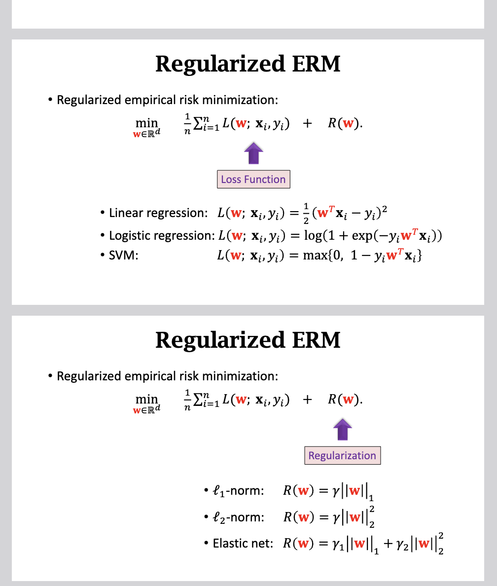

# 凸优化

这份 Slide 是王树森教授“深度学习”课程关于**凸优化基础（Basics of Convex Optimization）** 的章节。

虽然深度学习大多涉及**非凸优化（Non-convex Optimization）**，但凸优化是所有优化理论的基石。理解它对于掌握线性模型（如 LR, SVM）以及理解神经网络优化算法（如 SGD）的行为至关重要。

以下是对这份 Slide 的深度解构：

### 1. 核心概念：凸集 (Convex Set)

- **定义 (Slide 3)**:
  如果有两个点 $\mathbf{x}, \mathbf{y}$ 在一个集合 $\mathcal{C}$ 中，那么连接这两个点的**线段**上的所有点也必须在 $\mathcal{C}$ 中。
  - 直观理解：集合内部没有“坑”或“缺口”。
- **例子 (Slide 6-7)**: $L_2$-Norm Ball（实心球体）是典型的凸集。

### 2. 核心概念：凸函数 (Convex Function)

- **几何定义 (Slide 9)**:
  函数图像上任意两点的连线（割线），永远位于函数图像的**上方**。
  $$ f(\eta \mathbf{w}\_1 + (1-\eta)\mathbf{w}\_2) \le \eta f(\mathbf{w}\_1) + (1-\eta) f(\mathbf{w}\_2) $$
- **重要性质**:
  1.  **一阶条件 (Slide 10)**: 所有的切线都在函数图像的**下方**。
  2.  **二阶条件 (Slide 11)**: **Hessian 矩阵（二阶导数矩阵）是半正定的 (Positive Semi-Definite, PSD)**。这是判断多元函数是否为凸函数的“金标准”。
  3.  **保凸运算 (Slide 13)**: 凸函数的非负线性组合依然是凸函数。
      - 这解释了为什么 **Loss + Regularization** (例如 $L_2$ Loss + $L_2$ Penalty) 依然是凸问题，依然好解。

### 3. 凸优化问题 (Convex Optimization)

- **定义 (Slide 15)**:
  必须同时满足两个条件：
  1.  目标函数 $f(\mathbf{w})$ 是**凸函数**。
  2.  可行域 $\mathcal{C}$ 是**凸集**。
- **机器学习中的例子 (Slide 16)**:
  这份 PPT 列举了几个经典的 ML 模型，说明它们本质上都是凸优化问题，因此它们都有唯一的最优解（或所有局部最优解都是全局最优解）：
  - **Least Squares Regression** (最小二乘)
  - **Logistic Regression** (逻辑回归)
  - **SVM** (支持向量机)
  - **LASSO** (L1 正则化回归)

### 4. 局部与全局最优 (Local vs Global Optima)

这是凸优化最强大的性质，也是为什么我们在浅层学习时代偏爱 SVM 和 LR 的原因。

- **黄金法则 (Slide 18)**: 对于凸优化问题，**任何局部最小值 (Local Minimum) 都是全局最小值 (Global Minimum)**。
- **一阶最优性条件 (Slide 20)**:
  - 必要条件：如果是局部最小值，梯度为 0。
  - 充分条件（仅限凸优化）：如果梯度为 0，它就是全局最小值。
  - _这意味着我们只需要简单地用梯度下降法找梯度为 0 的点，就一定能找到最好的模型，不用担心卡在局部坑里。_

### 5. 进阶：次梯度与次微分 (Subgradient & Subdifferential)

Slide 22-30 专门讨论了当函数**不可微**时（例如 LASSO 中的 $L_1$ 范数 $|w|$ 在 0 点尖锐），如何进行优化。

- **背景**: $f(w) = |w|$ 在 $w=0$ 处导数不存在。
- **次梯度 (Subgradient, $\mathbf{v}$)**:
  推广了梯度的概念。对于凸函数，过某一点可以画出一条直线在函数图像下方，这条直线的斜率就是次梯度。在尖点处，这样的直线可能有无数条。
- **次微分 (Subdifferential, $\partial f(w)$)**:
  某一点处**所有**次梯度的集合。
  - 例如 $f(w) = |w|$ 在 $w=0$ 处的次微分是区间 $[-1, 1]$ (Slide 27)。
- **广义最优性条件 (Slide 30)**:
  对于不可微凸函数，全局最小值的条件不再是 $\nabla f(w) = 0$，而是：
  $$ \mathbf{0} \in \partial f(\mathbf{w}^\*) $$
  即：0 向量包含在次微分集合中。

### 总结

这份 Slide 的逻辑是为了让学生理解：

1.  为什么线性模型（LR, SVM）训练很稳定、结果可复现？（因为是凸优化，有全局最优）。
2.  如何处理像 LASSO 这样带有 $|w|$ 的模型？（利用次梯度理论）。
3.  这为后续讲解深度学习（非凸优化）提供了一个理想的参照系。深度学习的困难就在于它打破了“局部最优=全局最优”的假设。

---

# 正则化

这份 PPT 是王树森教授“深度学习”课程中关于**正则化（Regularization）** 的章节。虽然标题是深度学习，但为了打好基础，这份 Slide 实际上是基于**线性回归（Linear Regression）** 来深入剖析正则化的数学原理和物理意义。

以下是对这份 Slide 的深度解构：

### 1. 核心问题：为什么需要正则化？ (Page 3, 12-15)

Slide 从线性回归任务出发：给定特征矩阵 $\mathbf{X}$ 和标签 $\mathbf{y}$，求权重 $\mathbf{w}$。

- **挑战**: 当特征维度 $d$ 远大于样本数 $n$ 时（例如基因数据，$d=20000$ 基因，$n=100$ 病人），模型非常容易**过拟合（Overfitting）**。
- **目标**:
  1.  防止过拟合，提高泛化能力。
  2.  进行特征选择（Feature Selection），找出真正相关的变量。
  3.  改善优化问题的性质（如数值稳定性）。

### 2. $L_2$-范数正则化 (Ridge Regression / 岭回归)

这是深度学习中最常见的正则化，也称为 **Weight Decay**。

#### A. 数学形式 (Page 4)

$$ \min\_{\mathbf{w}} \frac{1}{n} \|\mathbf{X}\mathbf{w} - \mathbf{y}\|\_2^2 + \gamma \|\mathbf{w}\|\_2^2 $$
其中 $\gamma$ 是正则化系数。

#### B. 求解与复杂度 (Page 5-6)

- **解析解**: $\mathbf{w}^* = (\mathbf{X}^T\mathbf{X} + n\gamma\mathbf{I})^{-1}\mathbf{X}^T\mathbf{y}$。
  - 注意括号里的 $+ n\gamma\mathbf{I}$，这意味着我们在协方差矩阵对角线上加了一个正数，使其必定可逆（非奇异）。
- **复杂度**: $O(nd^2 + d^3)$。当 $d$ 很大时，求逆矩阵极其昂贵，解析解并不可行。

#### C. 为什么使用 $L_2$ 正则？ (Page 7-10)

PPT 给了两个非常深刻的理由，不仅仅是“防止过拟合”：

1.  **更容易优化 (Easier to optimize)**:
    - 从数值代数角度看，Hessian 矩阵的**条件数（Condition Number, $\kappa$）** 决定了优化速度（如共轭梯度法 CG 的收敛速度）。
    - 普通的最小二乘法，$\kappa$ 可能非常大（矩阵近似奇异）。
    - 加上 $L_2$ 正则后，$\kappa = \frac{\lambda_{max}(\mathbf{X}^T\mathbf{X}) + n\gamma}{\lambda_{min}(\mathbf{X}^T\mathbf{X}) + n\gamma}$。随着 $\gamma$ 增大，$\kappa$ 变小，优化变快。
2.  **更好的泛化 (Better generalization)**:
    - 从偏差-方差分解（Bias-Variance Decomposition）角度，正则化虽然引入了少量的偏差（Bias），但大幅降低了方差（Variance），从而降低了测试集误差（Test MSE）。

### 3. $L_1$-范数正则化 (LASSO)

#### A. 数学形式 (Page 16, 20)

- **约束形式**: $\min \|\mathbf{X}\mathbf{w} - \mathbf{y}\|_2^2 \quad \text{s.t.} \quad \|\mathbf{w}\|_1 \le t$
- **损失函数形式**: $\min \frac{1}{n} \|\mathbf{X}\mathbf{w} - \mathbf{y}\|_2^2 + \gamma \|\mathbf{w}\|_1$

#### B. 核心特性：稀疏性 (Sparsity) (Page 17-19)

- **凸优化**: 这是一个凸优化问题。
- **稀疏解**: 相比于 $L_2$ 会让权重普遍变小但不会为 0，$L_1$ 正则化倾向于让许多权重**直接变为 0**。
- **几何解释**: PPT 第 17 页展示了经典的几何直观图。$L_1$ 球（菱形）与等高线相切的点往往在坐标轴上（即某些维度为 0），而 $L_2$ 球（圆形）与等高线相切的点通常在象限内。
- **应用**: 自动进行**特征选择**。如果模型判定某些基因（特征）与疾病无关，它会将对应的权重 $w_i$ 压为 0。

### 4. 总结：正则化经验风险最小化 (Regularized ERM) (Page 22-24)

PPT 最后提出了一个统一的机器学习框架：
$$ \min*{\mathbf{w}} \sum*{i=1}^n L(\mathbf{w}; \mathbf{x}\_i, y_i) + R(\mathbf{w}) $$

这个框架可以组合出各种经典模型：

- **Loss $L$**:
  - 平方损失 $\rightarrow$ 线性回归
  - Log 损失 $\rightarrow$ 逻辑回归
  - Hinge 损失 $\rightarrow$ SVM
- **Regularization $R$**:
  - $L_2$ 正则 $\rightarrow$ Ridge / Weight Decay
  - $L_1$ 正则 $\rightarrow$ LASSO
  - $L_1 + L_2$ $\rightarrow$ Elastic Net（弹性网络）

### 深度解构总结

这份 PPT 的高明之处在于它没有只停留在“如何使用 API”上，而是深入到了**数值优化**（条件数）和**几何直观**（L1 的稀疏性来源）层面。

- **$L_2$** 是为了“稳”：让数值计算更稳定，让模型预测更平滑。
- **$L_1$** 是为了“精”：在海量噪声特征中筛选出关键特征，实现稀疏解。
