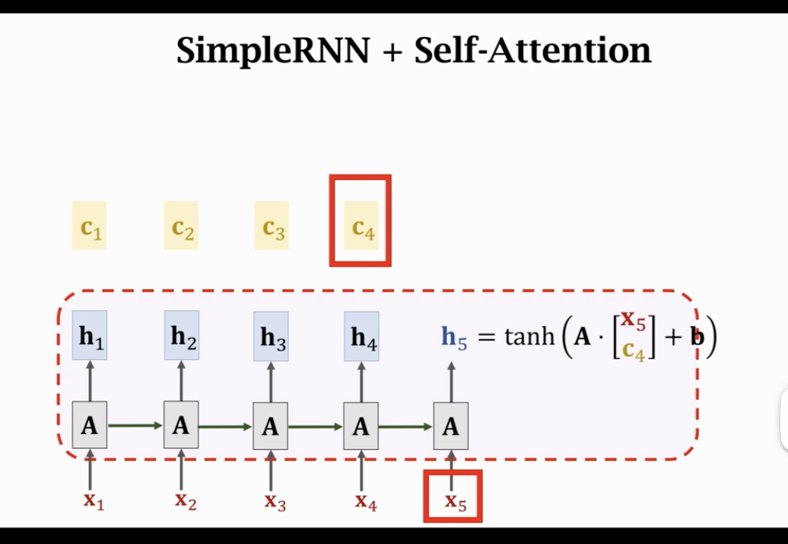

这节课由王树森老师讲解，主题是 **Self-Attention (自注意力机制)**。

上节课讲的 RNN Attention 是针对 Encoder-Decoder 架构（Sequence-to-Sequence 模型）的，解决了“翻译长句会遗忘”的问题。而这节课的 Self-Attention 是一个更通用的技术，可以应用在任何单一的 RNN 模型（甚至非 Seq2Seq 任务）中，让模型自己关注自己的上下文。

---

### 第一部分：Self-Attention 的演进背景

#### 1. 与 Seq2Seq Attention 的区别

- **Seq2Seq Attention**：
  - **Cross-Attention**：Decoder 和 Encoder 之间的互动。Decoder 关注 Encoder 的状态。
  - 应用场景：主要用于机器翻译（Seq2Seq 任务）。
- **Self-Attention**：
  - **Intra-Attention**：同一个序列内部的互动。RNN 自己关注自己之前的历史状态。
  - 应用场景：通用任务（如情感分析、文本分类、语言模型等）。

#### 2. RNN 的原生痛点

- 普通 RNN 在处理长序列时，即使是单向任务（如读一篇长文做分类），也会遗忘开头的信息。
- **Self-Attention 目的**：让 RNN 在处理当前词（例如第 100 个词）时，能够直接“回头看”并聚焦于第 1 个词，而不是仅仅依赖那个已经衰退的 hidden state。

---

### 第二部分：Self-Attention 的工作机制

王老师以 **Simple RNN + Self-Attention** 为例（简化版，便于理解）演示了每一步的计算过程。

#### 1. 核心变量

- $x_t$：当前时刻输入。
- $h_t$：当前时刻状态（Hidden State）。
- $c_{t-1}$：**Context Vector（上下文向量）**。这就是 Self-Attention 的产物，它是对历史上所有状态 $h$ 的加权平均。

#### 2. 更新流程 (Step-by-Step)

- **初始化**：$h_0 = 0, c_0 = 0$。

- **$t=1$ 时刻**：

  1.  **更新状态 $h_1$**：
      - 公式：$h_1 = \tanh(A \cdot [x_1, c_0])$。
      - 这里用 $c_0$ 替代了传统 RNN 中的 $h_0$。（注：这是王老师简化后的讲法，实际中可能有变体，比如同时用 $h$ 和 $c$）。
  2.  **计算 Context Vector $c_1$**：
      - 只有一个历史状态 $h_1$。
      - 加权平均 $c_1 = h_1$。

- **$t=2$ 时刻**：

  1.  **更新状态 $h_2$**：
      - 公式：$h_2 = \tanh(A \cdot [x_2, c_1])$。
      - $h_2$ 利用了上一步的上下文 $c_1$。
  2.  **计算 Context Vector $c_2$ (关键)**：
      - **Query**：当前状态 $h_2$。
      - **Keys/Values**：所有历史状态（包括当前）$[h_1, h_2]$。
      - **计算权重 $\alpha$**：计算 $h_2$ 与每个历史状态的相关性。
        - score $\rightarrow$ softmax $\rightarrow$ $\alpha_1, \alpha_2$。
      - **加权求和**：$c_2 = \alpha_1 h_1 + \alpha_2 h_2$。
      - **物理意义**：$c_2$ 综合了 $h_1$ 和 $h_2$ 的信息，且根据相关性有所侧重。

- **$t=3$ 时刻**：

  1.  **更新状态 $h_3$**：
      - $h_3 = \tanh(A \cdot [x_3, c_2])$。
  2.  **计算 Context Vector $c_3$**：
      - 对比 $h_3$ 与 $[h_1, h_2, h_3]$。
      - 算出 3 个权重 $\alpha_1, \alpha_2, \alpha_3$。
      - $c_3 = \sum_{i=1}^{3} \alpha_i h_i$。

- **以此类推...**

---

### 第三部分：为什么 Self-Attention 有效？

#### 1. 解决长距离依赖 (Long-term Dependencies)

- 如果没有 Self-Attention，信息必须通过 $h_1 \rightarrow h_2 \rightarrow ... \rightarrow h_t$ 这样一步步传递，容易出现梯度消失或信息损耗。
- 有了 Self-Attention，计算 $c_t$ 时，当前时刻可以直接访问 $h_1$（通过 $\alpha_1$ 加权）。这就建立了一条**直通的高速公路**（Shortcut），无论序列多长，距离都是 1 步。

#### 2. 大幅提升可解释性

- 通过观察权重 $\alpha$，我们可以知道模型在处理某个词时，实际上在关注前文的哪些词。
- **例子**：在处理指代词 "it" 时，如果有 Self-Attention，你会发现针对 "the animal" 或 "the robot" 的权重非常大，说明模型正确地识别了指代关系。

---

### 第四部分：总结与展望

这节课是 RNN 系列的终章，也是 Transformer 系列的序曲。

1.  **核心结论**：Self-Attention 是一种通用的增强模块。它让 RNN 从线性的“走马观花”变成了可以随时“回首往事”的强大模型。
2.  **缺点**：计算复杂度是 $O(T^2)$。处理第 $T$ 个词时，需要和前 $T$ 个词算权重，这在序列非常长时会很慢。
3.  **承上启下**：虽然 Self-Attention 拯救了 RNN，但研究人员很快想到了一个更激进的问题：

    > _既然 Attention 这么强，能直接捕捉长距离依赖，那我们还需不需要 RNN 这个慢吞吞的循环结构？_ > _能不能把 RNN 扔掉，**只用 Attention**？_

    答案是肯定的。这正是由 Self-Attention 堆叠而成的纯粹体 —— **Transformer 模型** 的由来。下一节课将正式进入 Transformer 的世界。
