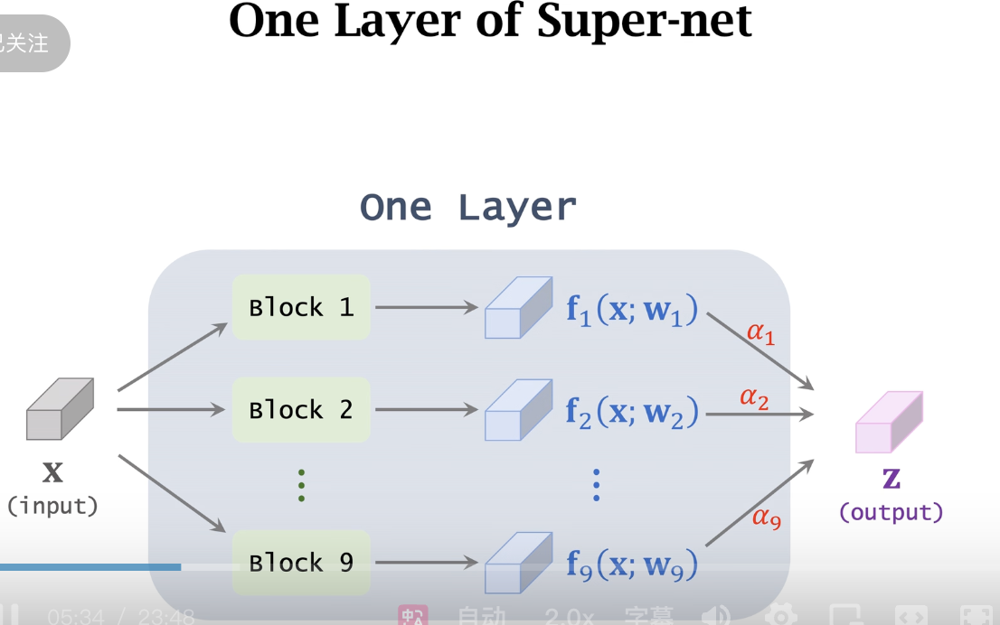
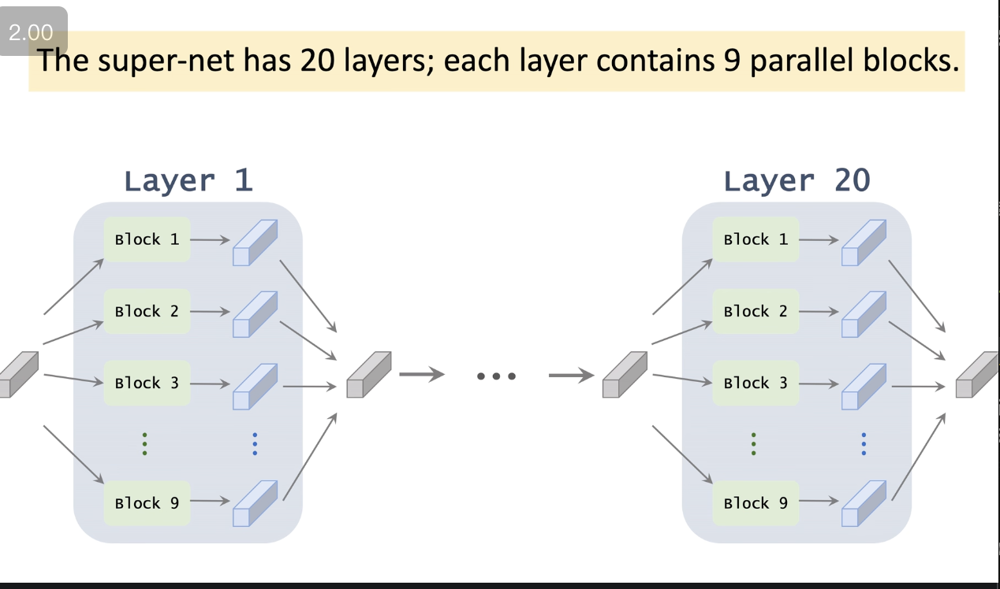

# 可微架构搜索

这是王树森老师讲解 **神经网络结构搜索 (NAS)** 的第三节课，聚焦于目前最主流、最高效的方法：**可微神经架构搜索 (Differentiable Neural Architecture Search)**。

这节课的核心目标是解决前两节课（随机搜索、RL-based NAS）计算量过大的问题。以 **DARTS** (ICLR 2019) 和 **FBNet** (CVPR 2019) 为代表，这类方法将离散的结构搜索问题转化为连续的优化问题，大大降低了搜索成本。

以下是深度、有逻辑的课程复盘：

---

### 第一部分：核心理念 —— 从离散到连续 (From Discrete to Continuous)

- **前情回顾**：之前的 RL 方法（如 NASNet）需要在巨大的**离散空间**里采样结构，训练结构，然后给奖励。每尝试一个结构都要从头训练一遍，代价高昂。
- **新思路**：如果我们能让网络结构的参数变得**可微 (Differentiable)**，不就可以像训练普通神经网络一样，用**梯度下降 (Gradient Descent)** 直接算出最优结构了吗？
- **代表作**：
  - **DARTS** (Differentiable Architecture Search, ICLR 2019)：开山之作。
  - **FBNet** (CVPR 2019)：本课主要讲解的对象，它是 DARTS 的一种特例或变体，思想一致但更直观，且强调了端侧硬件感知。

---

### 第二部分：SuperNet (超网络) 的构建

为了实现“可微”，这类方法引入了一个极其重要的概念：**SuperNet**。

#### 1. 结构设计

- 假设你要设计一个 20 层的网络，每一层该选什么操作（3x3 卷积？5x5 卷积？MaxPooling？），我们不知道。
- **SuperNet 做法**：
  - 构建一个包含所有可能性的“巨无霸”网络。
  - 在每一层，**并行地 (Parallel)** 放置所有候选模块（Candidate Operations）。
  - 例如：第 1 层有 9 个候选模块（3x3 Conv, 5x5 Conv, ...），全部连上，同时存在。

#### 2. 加权求和 (Weighted Sum)

- **前向传播**：每一层的输入 $X$ 会同时送进这 9 个模块，得到 9 个输出 $F_1(X), F_2(X), ..., F_9(X)$。
- **聚合输出**：最终输出 $Z$ 是这 9 个输出的**加权平均**。
  - $Z = \sum_{j=1}^{9} \alpha_j \cdot F_j(X)$
  - 其中 $\alpha_j$ 是第 $j$ 个模块的权重，且 $\sum \alpha_j = 1$。
- **权重生成**：$\alpha$ 是通过一组可学习的参数 $\theta$ 经过 **Softmax** 变换得到的。

#### 3. 参数区分

- **$W$ (Weights)**：卷积层里的卷积核参数。（决定提取什么特征）
- **$\theta$ (Architecture Parameters)**：决定 $\alpha$ 的参数。（决定哪个模块更重要）
- **关键点**：$W$ 和 $\theta$ 都是连续变量，都可以通过反向传播同时学习。

---

### 第三部分：训练与搜索过程

#### 1. 联合优化 (Joint Optimization)

- 在训练集上，我们不再分别训练成千上万个子网络，而是**只训练这就这一个 SuperNet**。
- **损失函数**：Cross-Entropy Loss (衡量预测准确率)。
- **梯度更新**：
  - Loss 对 $W$ 求导 -> 更新卷积核，让每个模块变强。
  - Loss 对 $\theta$ 求导 -> 更新架构参数 $\alpha$，让好用的模块权重变大，不好用的权重变小。
- **结果**：随着训练进行，优秀的模块对应的 $\alpha$ 会趋向于 1，垃圾模块对应的 $\alpha$ 会趋向于 0。

#### 2. 离散化 (Discretization / Pruning)

- 训练结束后，我们得到了一组训练好的 $\alpha$。
- **剪枝**：对于每一层，查看哪一个模块的 $\alpha$ 最大，就**只保留这一个模块**，扔掉其他 8 个。
- 这就从“加权平均的混合态”变回了“单一路径的离散态”，也就是最终搜索到的网络结构。

---

### 第四部分：硬件感知 (Hardware-Awareness / Latency Constraints)

这篇 CVPR 2019 论文（FBNet）相比 DARTS 的一大亮点是：**它不仅看准不准，还看快不快**。

#### 1. 动机

- 有些大卷积核（如 7x7）虽然准确率高，但在手机上跑得慢（Latency 高）。我们希望搜索出的网络既准又快。

#### 2. 延时建模 (Latency Modeling)

- **查表法 (Lookup Table)**：
  - 预先在目标硬件（如 iPhone 12）上，测量每一种候选模块的运行时间（Latency）。
  - 例如：模块 A 耗时 8ms，模块 B 耗时 5ms。
- **期望延时**：
  - 因为 SuperNet 的一层是加权平均，所以这层的预期延时也是加权平均：
  - $LAT_{layer} = \sum_{j=1}^{9} \alpha_j \cdot T_j$ （$T_j$ 是测出来的常数）。
  - 总延时 = 所有 20 层的延时之和。

#### 3. 目标函数改进

- $$ Loss*{total} = Loss*{accuracy} + \lambda \cdot Loss\_{latency} $$
  - $Loss_{accuracy}$：鼓励准确。
  - $Loss_{latency}$：鼓励 $\alpha$ 把权重分给那些运行快的模块（$T_j$ 小的模块）。
- **效果**：如果 $\lambda$ 设得大，模型会倾向于选择小卷积核（牺牲精度换速度）；反之则选择大卷积核。

---

### 第五部分：课程总结

1.  **方法演进**：

    - **随机搜索/RL**：试错法，每次从头训练，离散空间采样，超级慢。
    - **可微搜索 (DARTS/FBNet)**：构建 SuperNet，将结构选择参数化为 $\alpha$，利用梯度下降，一次训练即可收敛，超级快。

2.  **核心流程**：

    - **构建**：每一层并联所有候选操作。
    - **训练**：同时优化网络权重 $W$ 和架构权重 $\alpha$。
    - **约束**：可加入 Latency 项，实现对特定硬件的定制优化（Hardware-Awareness）。
    - **剪枝**：选 $\alpha$ 最大的路径作为最终网络。

3.  **优势**：
    - **快**：从几百 GPU days 缩短到 单 GPU days。
    - **好**：能自动权衡精度与速度。

这是一类兼具优雅理论与工程实用性的方法，也是目前工业界（如 AutoML 产品）最常用的技术路线。

---

优化问题的目标函数，关于参数可微，所以能直接做反向传播，用梯度来更新参数，
