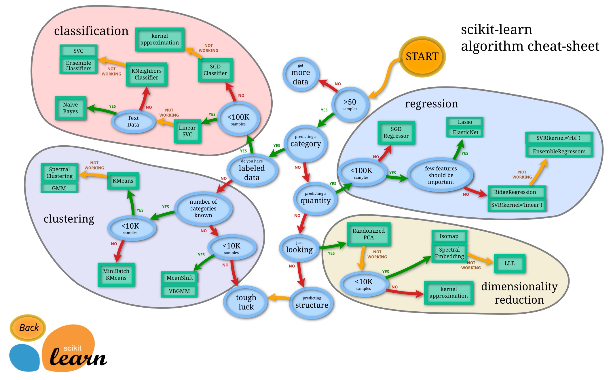

https://www.bilibili.com/video/BV1GgkSYBEpD

这是一份关于视频《挑战只用 17 分钟讲完所有的机器学习模型》的深度分析与讲解笔记。该视频内容非常紧凑，涵盖了机器学习领域的各类核心算法。

以下是根据视频内容整理的详细逻辑框架、算法原理解析以及选型策略。

---

### 第一部分：机器学习的地图 (The Landscape of ML)

视频开篇首先建立了一个宏观框架，将机器学习根据**数据是否包含标签（Labels）**划分为两大核心阵营。

#### 1. 有监督学习 (Supervised Learning)

- **核心逻辑**：主要通过“老师教学”的模式。我们拥有输入变量（特征 $X$）和已知的输出变量（目标/标签 $Y$）。
- **目标**：寻找一个映射函数，能够通过 $X$ 准确预测 $Y$。
- **两大任务分支**：
  - **回归 (Regression)**：预测**连续数值**。
    - _例子_：根据面积、位置预测房价。
  - **分类 (Classification)**：预测**离散类别**。
    - _例子_：根据特征判断邮件是“垃圾邮件”还是“正常邮件”（二分类）；或判断图片是猫、狗还是鸟（多分类）。

#### 2. 无监督学习 (Unsupervised Learning)

- **核心逻辑**：像是“婴儿探索世界”。数据只有输入变量（特征 $X$），没有已知的输出标签。
- **目标**：在数据中寻找隐藏的结构、模式或规律。
- **两大任务分支**：
  - **聚类 (Clustering)**：根据相似性将数据分组。
  - **降维 (Dimensionality Reduction)**：简化数据，保留核心信息。

---

### 第二部分：核心算法深度解析 (Algorithm Deep Dive)

讲者 Tim 按照从简单到复杂的顺序，详细讲解了以下核心算法：

#### 1. 线性回归 (Linear Regression) —— 回归任务的基石

- **直觉**：寻找两个或多个变量之间的线性关系（$y = wx + b$）。
- **拟合方法**：最小二乘法（Minimizing the Sum of Squared Errors）。即使数据点与拟合线之间的垂直距离平方和最小。
- **应用**：身高与鞋码的关系、房价预测。
- **分析**：这是最基础的模型，具备极高的解释性，但无法处理非线性关系。

#### 2. 逻辑回归 (Logistic Regression) —— 分类任务的基石

- **误区提示**：名字叫“回归”，但实际用于**分类**。
- **核心变换**：不直接拟合直线，而是将线性方程的结果输入到 **Sigmoid 函数**中。
- **输出**：输出值在 0 到 1 之间，代表属于某一类的**概率**。
  - _例子_：如果输出 0.8，表示该样本有 80% 的概率是男性。
- **决策**：设定阈值（如 0.5），大于则为类 A，小于则为类 B。

#### 3. K 最近邻 (K-Nearest Neighbors, KNN) —— 最直观的“近朱者赤”

- **类型**：非参数算法（不需要训练参数，只需记住数据）。
- **核心逻辑**：如果有新数据进来，看它在空间中离哪 $k$ 个老数据最近。
  - **分类**：这 $k$ 个邻居里谁多，我就属于谁（投票）。
  - **回归**：取这 $k$ 个邻居数值的平均值。
- **关键点 - K 的选择**：$K$ 是超参数。
  - **K 太小 (如 1)**：模型极其敏感，容易过拟合（Overfitting），受噪点影响大。
  - **K 太大 (如 1000)**：模型过于平滑，容易欠拟合（Underfitting），丢失局部特征。

#### 4. 支持向量机 (SVM) —— 寻找“最宽”的边界

- **核心逻辑**：不仅仅是为了把两类分开，而是要找到分割线（超平面），使得离它最近的点（支持向量）之间的**间隔（Margin）最大化**。
- **优势**：对噪声和异常值有较好的鲁棒性，泛化能力强。
- **高级特性 - 核函数 (Kernel Trick)**：
  - 当数据线性不可分时（例如一堆红点包围着一堆蓝点），SVM 通过核函数将数据映射到**更高维空间**，在那个空间里数据变得线性可分。
  - _常见核_：线性核、多项式核、径向基函数(RBF)、Sigmoid 核。

#### 5. 朴素贝叶斯 (Naive Bayes) —— 基于概率的“天真”派

- **基础**：贝叶斯定理（$P(A|B) = \frac{P(B|A)P(A)}{P(B)}$）。
- **“朴素”在哪里**：假设所有特征之间是**相互独立**的（实际上这种假设在现实中很难完全成立，但在文本分类中效果出奇好）。
- **应用**：垃圾邮件过滤（单词出现的概率乘积）。
- **优势**：计算速度极快，适合高维稀疏数据（如文本）。

#### 6. 决策树 (Decision Tree) —— 像人类一样的流程图

- **结构**：一系列的“是/否”问题，将数据不断切割。
- **目标**：让叶子节点（底部的分类结果）尽可能“纯净”（Purity）。
- **缺陷**：单棵树很容易过拟合，长得太深就会把训练数据的噪声也学进去了。

#### 7. 集成学习 (Ensemble Methods) —— 团结就是力量

这是机器学习竞赛中的大杀器，主要思路是将多个弱模型（通常是决策树）组合成强模型。

- **随机森林 (Random Forest) —— Bagging 策略**

  - **机制**：**并行**训练多棵树。每棵树使用训练集的一个随机子集（Bootstrap），且随机选择特征。
  - **结果**：分类问题取众数（投票），回归问题取平均。
  - **优点**：通过引入随机性并取平均，极大降低了过拟合风险（方差）。

- **提升树 (Boosting - XGBoost/Gradient Boosting) —— Boosting 策略**
  - **机制**：**串行**训练。后面的树专门用来纠正前面树犯下的错误。
  - **优点**：往往能达到比随机森林更高的准确率（降低偏差）。
  - **缺点**：训练慢，且比随机森林更容易过拟合。

#### 8. 神经网络 (Neural Networks) & 深度学习 —— 自动特征工程

- **演进**：线性回归/逻辑回归 -> 感知机（Perceptron） -> 多层感知机（MLP） -> 深度网络。
- **核心颠覆**：
  - 传统 ML（如 SVM）通常需要人工提取特征或使用核技巧。
  - 神经网络通过**隐藏层 (Hidden Layers)** 自动进行特征组合和提取。
- **层级理解**：第一层学像素，第二层学线条，第三层学形状，第四层学人脸。每一层都在构建更抽象的特征。

---

### 第三部分：无监督学习算法 (Unsupervised Deep Dive)

当没有标签时，我们如何挖掘价值？

#### 1. K 均值聚类 (K-Means Clustering)

- **逻辑**：
  1.  随机选 $K$ 个中心点。
  2.  把每个数据点分配给最近的中心。
  3.  计算同一组内数据的新平均值，作为新中心。
  4.  重复步骤 2-3，直到中心点不再移动。
- **难点**：同样需要预先指定 $K$ 值（有多少个簇）。

#### 2. 主成分分析 (PCA) —— 降维

- **场景**：数据特征太多（如高分辨率图片的像素），计算量大且包含冗余信息（例如“身高”和“腿长”高度相关）。
- **核心逻辑**：
  - 找到数据变化（方差）最大的方向，称为第一主成分（PC1）。
  - 找到与 PC1 垂直且变化次之的方向，称为 PC2。
  - 舍弃那些变化很小（信息量少）的维度。
- **作用**：作为预处理步骤，压缩数据，去除噪声，防止维度灾难，提高后续有监督模型的效率。

---

### 第四部分：总结与行动指南

视频最后给出了一些极具实操性的建议：

1.  **如何选择模型（基于 Scikit-learn 地图）**：

    - 数据量小 vs 数据量大？
    - 有标签 vs 无标签？
    - 预测数值 vs 预测类别？
    - _注：Tim 推荐新手使用 sklearn 的 algorithm cheat sheet 进行辅助判断。_

2.  **核心结论**：
    - 没有一种算法是完美的（No Free Lunch Theorem）。
    - **简单优先**：先用简单的模型（如逻辑回归、随机森林）建立基准。
    - **根据问题定算法**：
      - 要解释性？选 线性/逻辑回归、决策树。
      - 要高准确率？选 XGBoost、神经网络。
      - 数据稀疏/文本？选 朴素贝叶斯。
      - 数据量极小？选 SVM 或 KNN。

---

这是一张来自 Python 机器学习库 **Scikit-learn** 的官方算法选择指南（Algorithm Cheat-sheet）。这张著名的流程图旨在帮助数据科学家和开发者根据手头数据的特点（数量、是否有标签、数据类型等）快速锁定最适合的机器学习估算器（Estimator）。

以下是对这张图的**深度分析与逻辑拆解**，我将其按照决策路径分为四个主要象限进行讲解：

### 核心出发点 (START)

一切从黄色的 **START** 开始。流程图的第一步永远是看数据量。

- **数据量不足 50 个样本？** -> **获取更多数据 (get more data)**。
  - _深度解读_：这是一个硬性门槛。在机器学习中，少于 50 个样本几乎无法训练出具有统计意义的模型（容易过拟合或纯粹是噪声）。这是数据科学的第一课：数据为王。

一旦样本超过 50 个，决策路径开始分叉：

---

### 1. 分类问题 (Classification) - 左上角红色区域

**场景**：试图预测一个类别（Predicting a category），且拥有由于标签的数据（Labeled data）。

- **路径 A：样本量 < 100K (小规模数据)**

  - **首选**：**Linear SVC** (线性支持向量机)。
    - _特点_：速度快，适合线性可分的数据。
  - **如果无效 (NOT WORKING)**：尝试 **KNeighbors Classifier** (KNN)。
    - _特点_：非参数模型，逻辑简单，但预测时计算量大。
  - **如果还无效**：尝试 **SVC (Ensemble Classifiers)**。
    - _特点_：使用非线性核函数（如 RBF），适合复杂边界，但计算开销大。

- **路径 B：样本量 > 100K (大规模数据)**

  - **首选**：**SGD Classifier** (随机梯度下降分类器)。
    - _深度解读_：当数据量达到十万级以上，传统的 SVC 会因为计算复杂度（通常是 $O(n^2)$ 或 $O(n^3)$）而变得极慢。SGD 是一种优化算法，它通过每次只看一个样本来更新权重，极大地提高了大规模学习的效率，支持在线学习（Online Learning）。

- **路径 C：如果是文本数据 (Text Data)**
  - **首选**：**Naive Bayes** (朴素贝叶斯)。
    - _深度解读_：文本数据通常具有高维稀疏的特点（High-dimensional sparse data）。朴素贝叶斯假设特征独立，在处理文本分类（如垃圾邮件识别）时表现出奇的好且速度极快。

---

### 2. 回归问题 (Regression) - 右侧蓝色区域

**场景**：试图预测一个连续数值（Predicting a quantity），同样需要有标签的数据。

- **路径 A：样本量 > 100K**

  - **首选**：**SGD Regressor**。
    - _逻辑_：同分类问题，大规模数据优先考虑计算与内存效率，使用梯度下降。

- **路径 B：样本量 < 100K**

  - **判断特征 (Features) 是否重要？**

    - **很少的特征很重要 (Few features should be important)**：首选 **Lasso** 或 **ElasticNet**。
      - _深度解读_：Lasso 回归引入 L1 正则化，可以将不重要特征的系数压缩为 0，从而实现特征选择。这在特征维度很高但真正起作用的特征很少时非常有用（稀疏性假设）。
    - **否则 (即大部分特征都有用)**：首选 **RidgeRegression** (岭回归) 或 **SVR (kernel='linear')**。
      - _深度解读_：岭回归引入 L2 正则化，防止过拟合，但不会把系数压为 0。

  - **如果以上都无效**：
    - 尝试 **SVR (kernel='rbf')** 或 **EnsembleRegressors** (集成方法，如随机森林、梯度提升树)。非线性能力更强，能捕捉复杂关系。

---

### 3. 聚类问题 (Clustering) - 左下角紫色区域

**场景**：拥有数据，但**没有标签** (Unlabeled data)，且想将数据分组 (Predicting a category -> No -> Clustering)。

- **已知类别数量 (Number of categories known)**：

  - **样本量 < 10K**：首选 **KMeans**。
    - _特点_：最经典的聚类算法，速度快，但假设簇是凸的（Convex）且大小相似。
  - **样本量 > 10K**：首选 **MiniBatch KMeans**。
    - _逻辑_：KMeans 的分批次版本，为了适应大规模数据，牺牲微小的精度换取巨大的速度提升。

- **未知类别数量**：

  - **首选**：**MeanShift** 或 **VBGMM** (变分贝叶斯高斯混合模型)。
    - _特点_：不需要预先指定 $K$ 值，算法会自动推断簇的数量。

- **即使 KMeans 无效**：
  - 尝试 **Spectral Clustering** (谱聚类) 或 **GMM** (高斯混合模型)。适合发现非凸形状的簇（如环形数据）。

---

### 4. 降维问题 (Dimensionality Reduction) - 右下角黄色区域

**场景**：只是想探索数据结构 (Just looking)，不需要预测具体结果。

- **首选**：**Randomized PCA**。
  - _深度解读_：PCA (主成分分析) 是线性的降维之王。Randomized PCA 是一种近似算法，在处理大型矩阵时比传统 PCA 快得多。
- **如果无效**：
  - **样本量 < 10K**：尝试 **Isomap** 或 **Spectral Embedding**。
  - **更通用的流形学习**：**LLE** (Locally Linear Embedding)。
  - _深度解读_：当数据位于弯曲的流形上（如卷曲的瑞士卷形状），线性的 PCA 会失效，这时需要使用这些非线性降维（流形学习）算法来展开数据。

---

### 总结性洞察

1.  **数据量的分界线**：

    - **50**：入门门槛。
    - **10K (1 万)**：中等规模分界线（主要影响复杂聚类和流形学习）。
    - **100K (10 万)**：大规模分界线（必须考虑 SGD 这种在线/增量学习算法，传统的矩阵运算模型开始跑不动了）。

2.  **奥卡姆剃刀原则**：

    - 图中的逻辑总是**先推荐简单的线性模型** (Linear SVC, Lasso, Ridge, PCA)，只有当它们 "NOT WORKING" 时，才推荐复杂的非线性模型 (SVR-rbf, Ensemble, Isomap)。这符合机器学习的最佳实践：**从简单的基准模型（Baseline）开始，直到证明需要更复杂的模型为止。**

3.  **Scikit-learn 的定位**：
    - 这张图也侧面反映了 Scikit-learn 的设计哲学：它是一个通用、全面且接口统一的“工具箱”，覆盖了除了深度学习（虽然包含简单的 MLP）之外几乎所有主流的统计机器学习算法。对于深度学习（特别是非结构化数据如图像、音频），通常会转向 PyTorch 或 TensorFlow。
