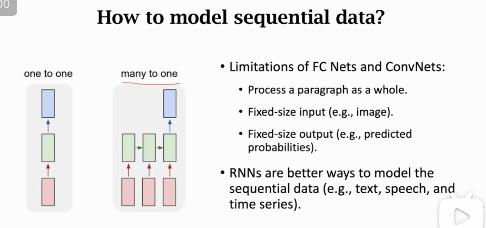
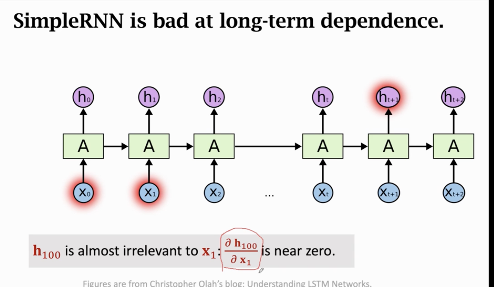

这两节课由王树森老师讲解，围绕 **循环神经网络（Recurrent Neural Network, RNN）** 展开，特别是基础的 **Simple RNN** 模型，并辅以 Keras 实战演示。

以下是逻辑清晰、深入且不遗漏的分析与讲解：

### 第一部分：为什么需要 RNN？

在引入 RNN 之前，课件首先回顾了“One-to-One”模型（如 Logistic Regression, CNN）在处理时序数据时的局限性。

#### 1. 数据的本质差异

- **One-to-One 模型**（全连接、CNN）：假设输入和输出是固定大小的。
  - 例如：输入一张 $224 \times 224$ 的图片，输出 10 个类别的概率。
  - 缺点：无法处理变长的输入（如句子的单词数不固定）和变长的输出（如机器翻译）。
- **时序数据（Sequential Data）**：具有时间依赖性和变长特性。
  - 例子：文本、语音、股市数据。
  - 人类阅读模式：并不是一眼看穿整段文字，而是从左到右逐词阅读，**在大脑中不断积累信息**。

#### 2. RNN 的核心思想：Many-to-Many / Many-to-One

RNN 模拟了人类的阅读过程：

- **逐步输入**：每次只看一个词（词向量 $x_t$）。
- **状态积累**：维护一个内部状态向量 $h$（Hidden State），用于存储“读过的所有信息”。
  - $h_0$：包含第 1 个词的信息。
  - $h_1$：包含前 2 个词的信息。
  - ...
  - $h_t$：包含整句话的信息。

---

### 第二部分：Simple RNN 的数学原理与结构

这是本节课的理论核心，解释了 RNN 如何通过数学公式实现“记忆”。

#### 1. 状态更新公式

Simple RNN 的核心是一个递归公式：
$$h_t = \tanh(A \cdot [h_{t-1}, x_t])$$

- **输入**：上一时刻的状态 $h_{t-1}$ 和当前时刻的输入 $x_t$。
- **操作**：
  1.  **拼接（Concatenation）**：将 $h_{t-1}$ 和 $x_t$ 拼成一个更长的向量。
  2.  **线性变换**：乘以参数矩阵 $A$。
  3.  **激活函数**：通过双曲正切函数 $\tanh$。
- **输出**：当前时刻的新状态 $h_t$。

#### 2. 为什么必须用 $\tanh$ 激活函数？

课件通过一个简化的推导（假设 $x=0$）深刻揭示了数值稳定性的问题：

- 如果没有激活函数，状态更新就变成了矩阵的连乘：$h_t = A^t h_0$。
- **特征值分析**：
  - 若 $A$ 的最大特征值 $>1$：$A^t$ 会趋向无穷大 $\rightarrow$ **梯度爆炸（Exploding Gradients）**。
  - 若 $A$ 的最大特征值 $<1$：$A^t$ 会趋向于 0 $\rightarrow$ **梯度消失（Vanishing Gradients）**。
- **$\tanh$ 的作用**：将输出强行压缩到 $[-1, 1]$ 之间，起到归一化（Normalization）的作用，防止数值爆炸。

#### 3. 参数共享（Parameter Sharing）

这是 RNN 最重要的特性之一：

- 无论序列有多长（10 个词还是 100 个词），**参数矩阵 $A$ 是唯一的、共享的**。
- 这意味着 RNN 在处理句子的每个位置时，使用的是同一套规则。

#### 4. 参数量计算

假设状态维度为 $d_h$，输入维度为 $d_x$：

- 输入向量维度（拼接后）：$d_h + d_x$。
- 输出向量维度（$h_t$）：$d_h$。
- 参数矩阵 $A$ 的形状：$d_h \times (d_h + d_x)$。
- 参数总数（不含 Bias）：$d_h^2 + d_h \cdot d_x$。

---

### 第三部分：Keras 实战——RNN 情感分类

课件展示了如何用 Keras 代码实现上述理论，并通过对比实验展示了 RNN 相比 Logistic Regression 的优势。

#### 1. 模型架构设计

- **Embedding 层**：词典 10,000 $\rightarrow$ 32 维词向量。
- **SimpleRNN 层**：
  - 状态维度（State Dimension）：32。
  - **关键参数 `return_sequences`**：
    - `False`（默认）：只输出最后一个状态 $h_T$（Many-to-One 模式）。
    - `True`：输出所有时间步的状态序列 $[h_1, h_2, ..., h_T]$。
- **Dense 层**：二分类输出（Sigmoid）。

#### 2. 实验结果对比

- **Logistic Regression（上一节课）**：Accuracy $\approx$ 75%。
- **Simple RNN（本节课）**：
  - 训练：Accuracy $\approx$ 84.4%。
  - **结论**：RNN 捕捉到了词序信息（Sequential Information），效果显著提升。
- **实验变体**：使用所有状态 $[h_1...h_T]$ vs 只使用最后状态 $h_T$。
  - 结果：两者差别不大（84.7% vs 84.4%）。
  - 原因：对于情感分类这种宏观任务，最后的 $h_T$ 已经积累了足够的全局信息。

#### 3. 训练技巧：Early Stopping

- 在训练 RNN 时，训练集准确率可能持续上升（过拟合），但验证集准确率会先升后降。
- 策略：在验证集准确率开始下降前停止训练（本例中仅训练 3 个 Epoch）。

---

### 第四部分：Simple RNN 的致命缺陷——长期依赖问题

虽然 RNN 比 Logistic Regression 强，但它有一个著名的缺陷：**短视（Short-term Memory）**。

#### 1. 短期依赖（Short-term Dependence）——RNN 擅长

- 例子：`"Clouds are in the [sky]"`。
- 只需看最近的 `clouds`, `are` 就能预测出 `sky`。Simple RNN 能处理得很好。

#### 2. 长期依赖（Long-term Dependence）——RNN 不擅长

- 例子：
  - 开头：`"I grew up in China..."` （关键信息在很久以前）。
  - 结尾：`"I speak fluent [Chinese]"`。
- 问题：Simple RNN 可能会预测 `English` 或 `French`，因为它**忘记了**很久之前的 `China`。
- **数学原因**：
  - **梯度消失**：反向传播时，梯度经过多次矩阵连乘，会指数级衰减。
  - 导致 $\frac{\partial h_t}{\partial x_1} \approx 0$。即：改变很久以前的输入 $x_1$，对现在的状态 $h_t$ 几乎没有影响。这意味着 $h_t$ 已经丢弃了 $x_1$ 的信息。

### 总结

这节课搭建了理解现代 NLP 模型的基石：

1.  **从离散到时序**：RNN 通过维护“内部状态”解决了变长序列的处理问题。
2.  **参数共享**：用一个矩阵 $A$ 循环处理所有时间步。
3.  **工程与理论的差距**：
    - 理论上，RNN 的 $h_t$ 包含所有历史信息。
    - 实际上，由于**梯度消失**，Simple RNN 只有“金鱼般的记忆”（约 7 步），无法处理长文本。
4.  这也引出了下一节课的主角——**LSTM（长短期记忆网络）**，它是为了解决 Simple RNN 的“健忘”病而设计的。
