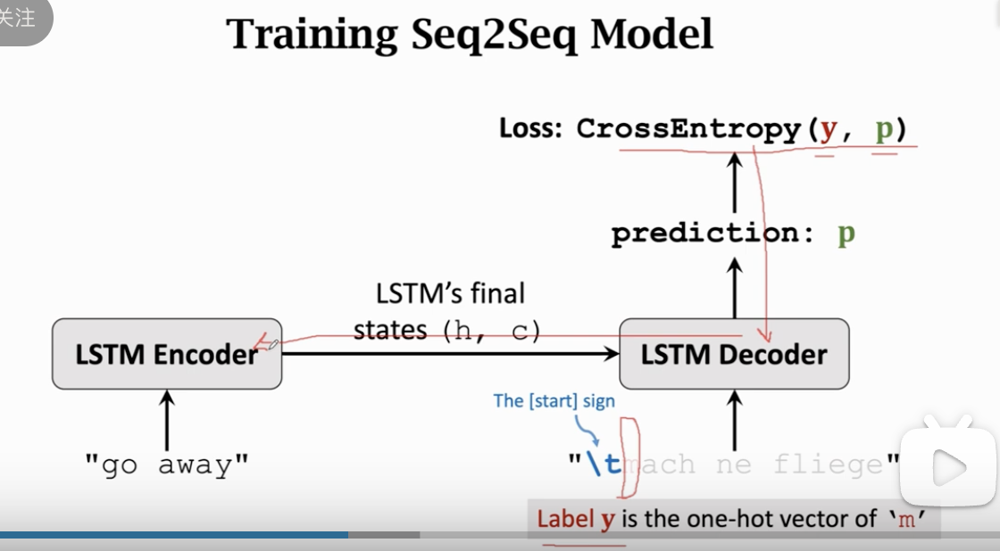
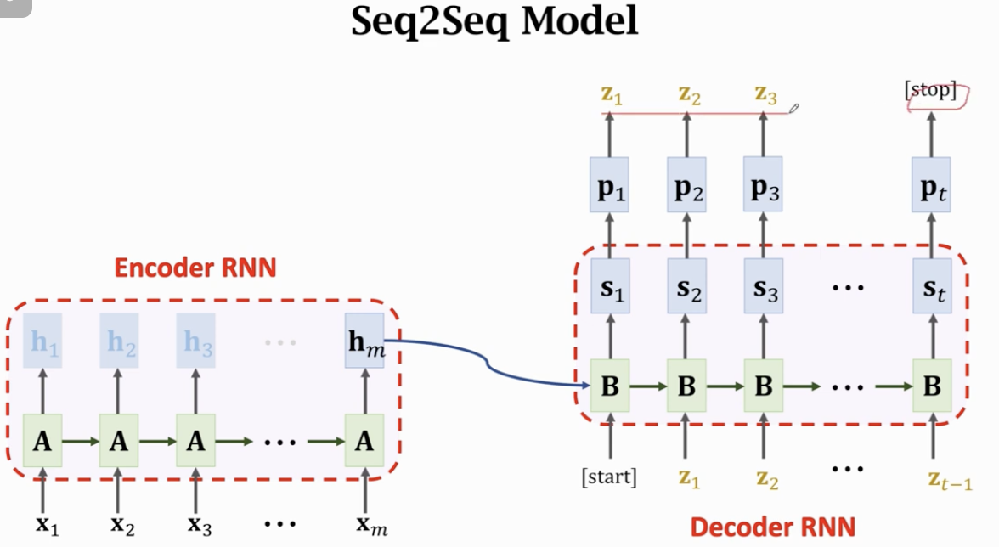
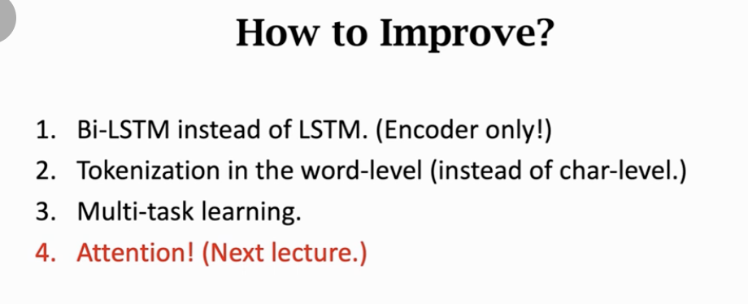
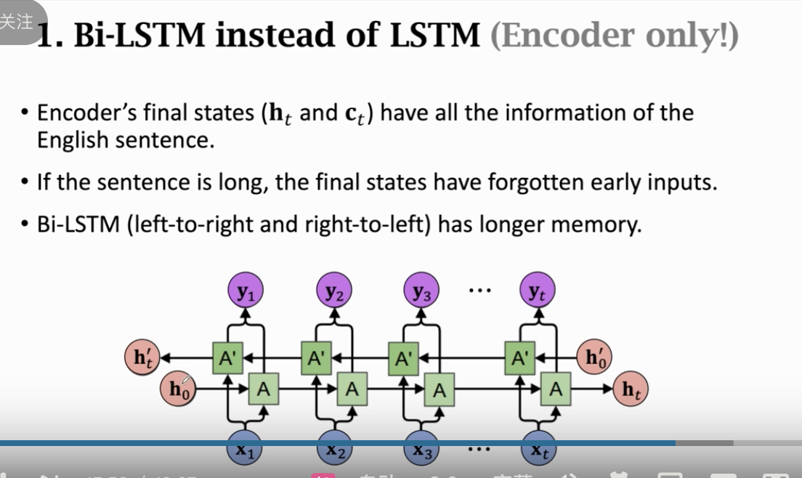

这节课由王树森老师讲解，主题是 **RNN 在机器翻译中的应用：Sequence-to-Sequence (Seq2Seq) 模型**。

Seq2Seq 是深度学习处理自然语言任务的里程碑架构，它首次解决了“变长输入到变长输出”的难题。

以下是逻辑清晰、深入且不遗漏的分析：

---

### 第一部分：核心概念架构 (Encoder-Decoder)

#### 1. 为什么不能用普通的 RNN？

- **One-to-One / Many-to-One**：只能输出一个结果（分类任务）。
- **Many-to-Many (同步)**：输入一个词输出一个词（词性标注），这要求输入输出长度相等。
- **机器翻译的问题**：
  - **非同步**：输入 "I go"（2 词），输出 "Ich gehe"（2 词），但如果 "I do not know"（4 词）可能翻译成德语是一个很长的复合词或短语。长度不固定，且语序（grammar）可能完全颠倒。
  - **Seq2Seq**：专门设计用于 **Many-to-Many（异步）** 任务。

#### 2. Encoder-Decoder 结构

- **Encoder (编码器)**：
  - **角色**：阅读理解者。
  - **操作**：逐字（或逐字符）读取源语言句子。
  - **输出**：它不直接输出任何翻译结果，而是将整句话的信息压缩进 **最后一个隐藏状态 (Context Vector)**。这个向量 $h_{final}$ 被认为是源句子的“语义摘要”。
- **Decoder (解码器)**：
  - **角色**：生成者。
  - **操作**：这就是上节课讲的“文本生成器”。
  - **初始状态**：不像普通文本生成器用全 0 初始化，Decoder 继承了 Encoder 的遗产——**直接使用 Encoder 的最终状态作为自己的初始状态**。
  - **过程**：基于这个“语义摘要”，一个字一个字地吐出目标语言。

---

### 第二部分：数据预处理 (Tokenization & Vocabulary)

机器翻译涉及两种语言，预处理比单语言更复杂。

#### 1. 双 Tokenizer，双字典

- **原则**：必须分别为源语言（英语）和目标语言（德语）建立独立的字典。
- **原因**：
  - **字符级**：德语有特殊字母（如 umlauts），希腊语、中文的字符集更是完全不同。
  - **单词级**：词汇完全不通。
- **特殊 Token**：
  - 在目标语言（德语）字典中，必须添加 **起始符 (Start Token, e.g., `<BoS>`)** 和 **终止符 (End Token, e.g., `<EoS>`)**。
  - **起始符**：告诉 Decoder "开始工作了"。
  - **终止符**：告诉 Decoder "这句翻译完了"。

#### 2. Character-level vs Word-level

- **Character-level (本课演示)**：
  - 优点：不需要 Embedding 层，Vocabulary 小（几十个），不会遇到 OOV（未登录词）问题。
  - 缺点：序列极长（一句话上百个字符），导致 RNN 容易遗忘，计算慢。
- **Word-level (工业界标准)**：
  - 优点：序列短（平均缩短 4-5 倍），语义表达更直接。
  - 缺点：Vocabulary 大（几万），需要 Embedding，有 OOV 问题。

---

### 第三部分：训练流程 (Training Phase)

训练 Seq2Seq 实际上是在训练一个“有条件”的文本生成器。

#### 1. Teacher Forcing (教师强制)

虽然课件没显式提这个术语，但描述的过程就是 Teacher Forcing。

- **Decoder 的输入**：
  - $t=1$: 输入 `<Start>` $\rightarrow$ 预测第一个词 $y_1$.
  - $t=2$: 输入实际上是 **真实的正确答案（Ground Truth）** $y_1$（而不是上一轮预测出来的 $\hat{y}_1$） $\rightarrow$ 预测 $y_2$.
- **目的**：即使上一轮预测错了，也不能让错误累积，必须强制纠正，让模型学到正确的下一个词是什么。

#### 2. 梯度流向

- Loss 计算：CrossEntropy(预测字符, 真实字符)。
- 反向传播：Loss $\rightarrow$ Decoder $\rightarrow$ **中间的状态桥梁** $\rightarrow$ Encoder。
- **Encoder 和 Decoder 是联合训练的（End-to-End）。**

---

### 第四部分：推断流程 (Inference Phase)

模型训练好上线使用时，流程与训练不同（没有 Teacher Forcing）。

1.  **Encoder 工作**：
    - 输入：`"go away"`。
    - 输出：状态 $h_{enc}, c_{enc}$。
2.  **Decoder 初始化**：
    - $h_{dec\_0} = h_{enc}$, $c_{dec\_0} = c_{enc}$。
3.  **自回归生成**：
    - $t=1$: 输入 `<Start>` $\rightarrow$ 输出概率分布 $\rightarrow$ 采样得到字符 'm'。
    - $t=2$: **把上一步生成的 'm' 作为输入** $\rightarrow$ 输出概率分布 $\rightarrow$ 采样得到 'a'.
    - ...
    - 直到：采样得到 `<End>` 终止符，停止生成。

---

### 第五部分：模型改进技巧

王老师最后提出了三种提升 Seq2Seq 性能的关键策略：

#### 1. 双向 LSTM (Bi-LSTM Encoder)

- **应用位置**：只用于 **Encoder**。
- **原因**：Encoder 需要理解整句语义，双向读取能防止遗忘句首信息。
- **注意**：Decoder **必须是单向的**，因为生成过程是按时间顺序发生的，不能偷看未来。

#### 2. Word-level Tokenization

- **改进**：将序列长度缩短 4-5 倍。
- **收益**：极大地缓解了 LSTM 的长距离依赖（遗忘）问题。
- **代价**：需要更大的数据集来训练 Embedding 层。

#### 3. 多任务学习 (Multitask Learning)

- **痛点**：平行语料（英德对照）太少，Encoder 训练不充分。
- **方案**：共享同一个 Encoder，接多个不同的 Decoder。
  - Task A: 英 $\rightarrow$ 德
  - Task B: 英 $\rightarrow$ 法
  - Task C: 英 $\rightarrow$ 英 (Autoencoder, 自编码)
- **收益**：Encoder 见多识广（利用了更多数据），提取的特征更通用、更鲁棒，从而反哺英德翻译任务。

### 总结与伏笔

这节课完整构建了 **Encoder-Decoder** 范式。

- Encoder 负责“读懂”，Decoder 负责“写出”。
- **瓶颈**：Encoder 必须把几十个词的复杂语义压缩进**唯一的一个向量** $h$ 中。如果句子太长，这个向量就会因“信息过载”而丢失细节，导致长句翻译质量崩塌。
- **伏笔**：为了解决这个“信息瓶颈”，下一节课将引入深度学习 NLP 的皇冠——**Attention 机制**。
