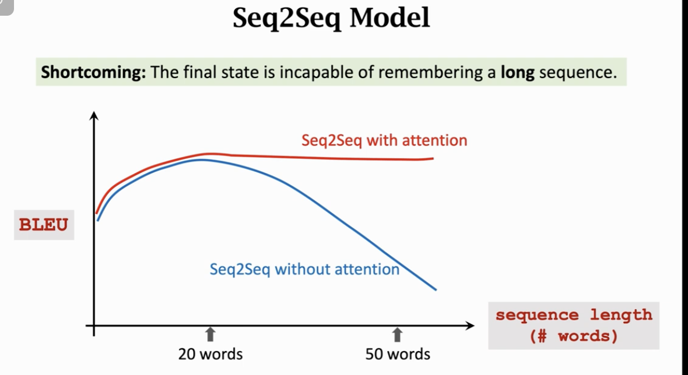
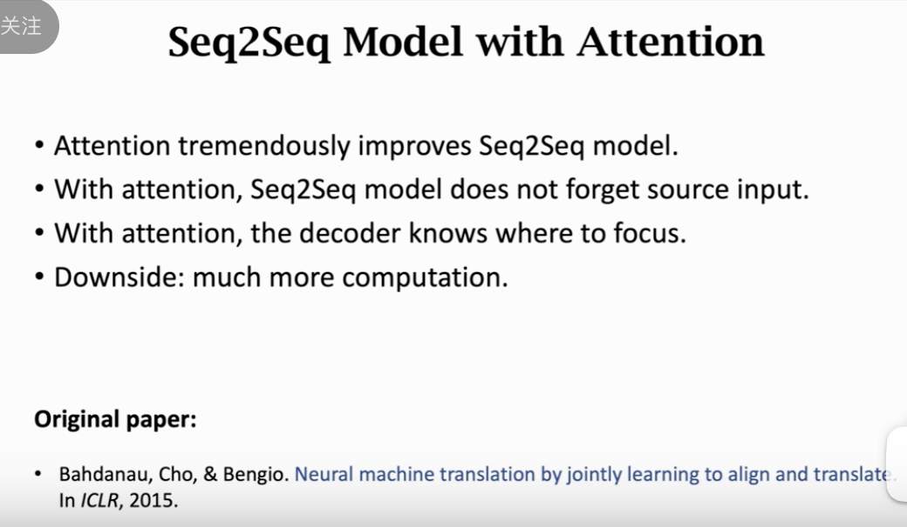

# 注意力机制

这节课由王树森老师讲解，重点介绍 NLP 领域最重要的机制之一 —— **Attention (注意力机制)**。

`Attention 的出现是为了解决标准 Seq2Seq 模型在长句子翻译上的“记忆力衰退”问题`。它是 Transformer 模型（如 BERT、GPT）的核心思想源头。

以下是逻辑清晰、深入且不遗漏的分析：

---

### 第一部分：标准 Seq2Seq 的痛点

#### 1. 信息瓶颈 (Information Bottleneck)

- **回顾**：上节课的 Encoder-Decoder 模型中，Encoder 必须把几十上百个词的英语句子，压缩成**唯一的一个语义向量 (Context Vector, $h_m$)**，并把这个向量作为 Decoder 的初始状态。
- **问题**：
  - 这个向量的容量是有限的。对于短句可能够用，但对于长句（>20 个词），大量细节信息会被丢弃或遗忘。
  - **现象**：随着输入句子长度增加，翻译质量（BLEU Score）急剧下降。

#### 2. Attention 的直觉

- **类比人类翻译**：当我们在翻译一个长句时，我们不会先把整句话背下来（压缩成一个向量）再翻译。相反，当我们翻译到某个词（例如“Area”）时，我们会回头去原文里找对应的词（“Zone”），这时候我们的**注意力**是聚焦在原文的局部，而不是整句话。
- **核心改进**：Decoder 不再仅仅依赖那个被压缩的 $h_m$，而是**在每一步生成时，都重新回头看一遍 Encoder 的所有状态 ($h_1, ..., h_m$)**，并根据相关性挑选对自己有用的信息。

---

### 第二部分：Attention 的计算流程

Attention 的本质是计算 **Decoder 当前状态 $s_{t-1}$** 和 **Encoder 所有历史状态 $[h_1, ..., h_m]$** 之间的 **相关性（权重）**，然后进行 **加权求和**。

#### 步骤 1：计算相关性分数 (Alignment Score)

我们需要衡量 Decoder 当前时刻 $t$ 需要关注 Encoder 的哪些部分。
假设 Decoder 当前状态为 $s_{t-1}$ (有些论文用 $s_t$)，Encoder 的第 $i$ 个状态为 $h_i$。

- ~~**方法一 (Bahdanau Attention / Additive Attention)**：~~

  - 先拼接，再通过一个小神经网络打分。
  - $\text{score}(s, h) = v^T \tanh(W [s; h])$
  - 这是 Attention 第一篇论文（ICLR 2015）提出的方法。

- **方法二 (Dot-Product Attention)** —— **Transformer 使用的方法**：
  - 将两个向量分别投影，然后点积。
  - $\text{score}(s, h) = (W_q s)^T (W_k h)$
  - 这更高效，也是现代 Transformer 的基础。

#### 步骤 2：权重归一化 (Softmax)

计算出的分数 $\alpha$ 是任意实数，我们需要将它们转化为概率分布。

- $\alpha_i = \text{softmax}(\text{score}_i)$
- 结果：$\sum \alpha_i = 1$，且每个 $\alpha_i > 0$。
- **物理意义**：$\alpha_i$ 表示 Decoder 当前应该花费多少“注意力”在 Encoder 的第 $i$ 个词上。

#### 步骤 3：计算上下文向量 (Context Vector $c_t$)

利用权重 $\alpha$ 对 Encoder 的所有状态 $h$ 进行加权平均。

- $c_t = \sum_{i=1}^{m} \alpha_i h_i$
- 这个 $c_t$ 是动态变化的。`Decoder 每生成一个词，就要重新计算一次 Attention`，得到一个新的针对当前时刻的 $c_t$。

#### 步骤 4：更新 Decoder 状态

使用计算出的 $c_t$ 来辅助生成当前词。

- $s_t = \text{Function}(s_{t-1}, y_{t-1}, c_t)$
- Decoder 现在的输入除了上一个词 $y_{t-1}$ 和旧状态 $s_{t-1}$，还多了这个极其强大的外挂 $c_t$（包含了原文中最相关的信息）。

---

### 第三部分：Attention 的可视化与解释

Attention 提供了一种非常优秀的可解释性（Interpretability）。

- **对齐矩阵 (Alignment Matrix)**：
  - 如果我们把每个时间步的权重 $\alpha$ 画出来，形成一个矩阵图。
  - **粗线/深色块**：表示高相关性。
  - **例子**：在翻译法语 "Zone" 时，Attention 机制会自动给英语句子中的 "Area" 分配极高的权重。这证明模型学会了词与词之间的对应关系（Word Alignment），即使它们的语序是颠倒的。

---

### 第四部分：代价与权衡

Attention 虽然效果拔群，但代价不菲。

- **时间复杂度**：
  - **标准 Seq2Seq**：Encoder 读一遍 $O(m)$，Decoder 写一遍 $O(t)$。总复杂度 $O(m+t)$。
  - **Seq2Seq + Attention**：
    - Decoder 的每一步（共 $t$ 步），都要去和 Encoder 的每一个状态（共 $m$ 个）算分数。
    - 总复杂度 **$O(m \times t)$**。
- **工程影响**：
  - 对于超长序列，计算量会呈二次方增长。但在现代 GPU 上，这种额外的计算量通常是值得的，因为带来的性能提升巨大。

---

### 第五部分：总结

1.  **解决遗忘**：Attention 彻底解决了长序列的遗忘问题，因为 Decoder 可以随时“回头看”原文的任何位置，不再受限于单一的定长向量。
2.  **动态聚焦**：Context Vector $c_t$ 是动态生成的，在生成主语时关注原文主语，在生成谓语时关注原文谓语。
3.  **承上启下**：这节课讲的是基于 RNN 的 Attention。下一阶段（也是 NLP 的终极形态），研究人员发现 RNN 甚至都是多余的，能不能只用 Attention 呢？——这就是 **Self-Attention** 和 **Transformer** 的诞生。
