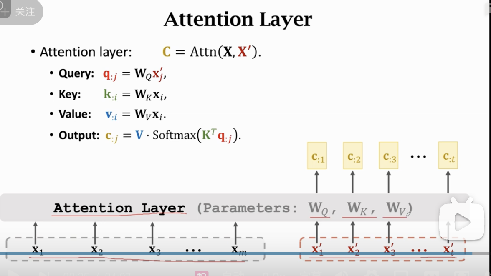
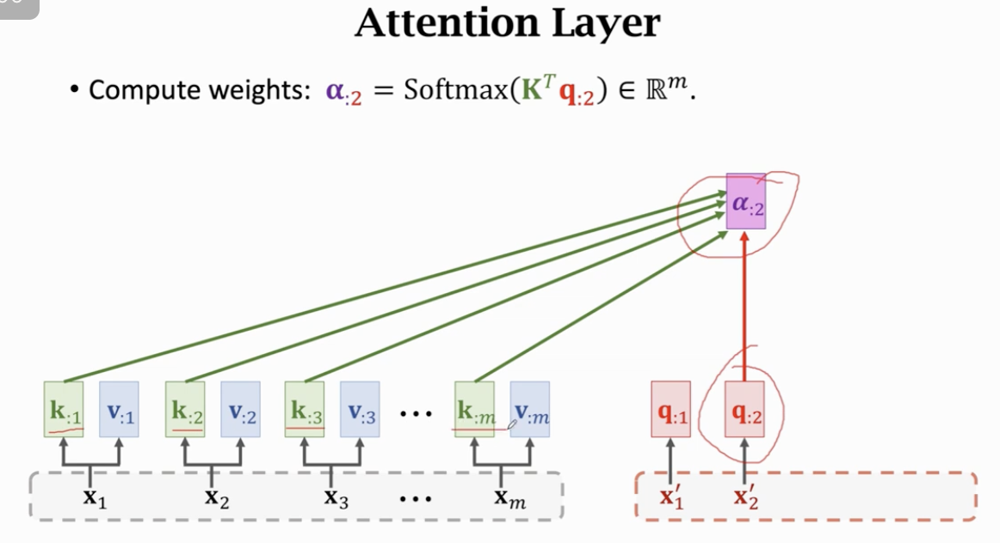
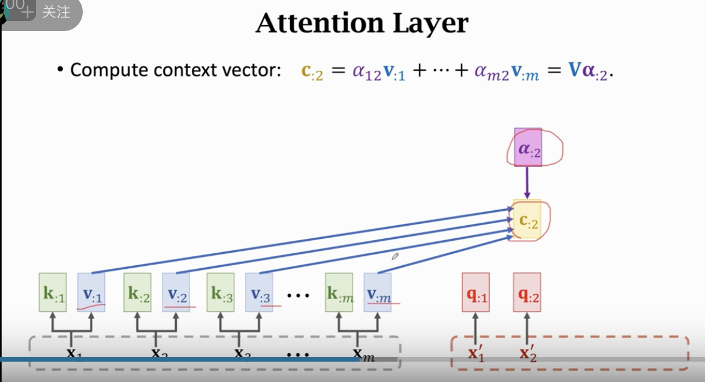
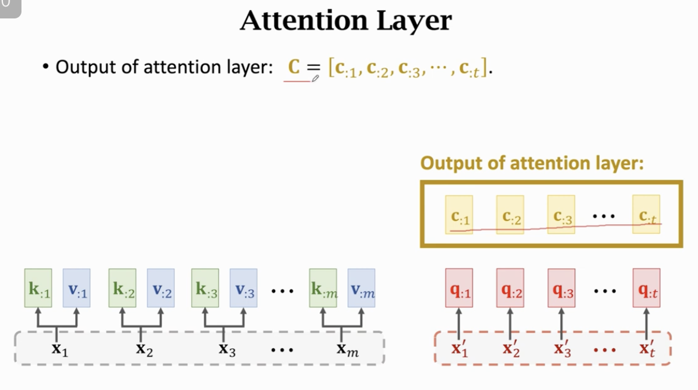
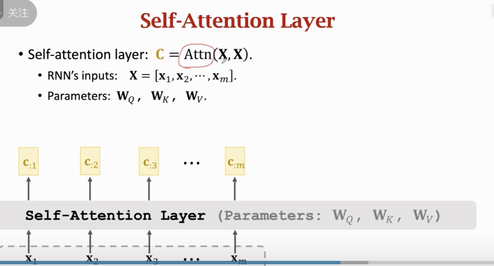

# Transformer

这份 PDF 课件是 Shusen Wang 教授关于 **Transformer 模型** 的第一部分，主题为 **“Attention without RNN” (没有 RNN 的注意力机制)**。

这一节课的主要逻辑是“去依附”：它展示了如何将 Attention 机制从 RNN 架构中剥离出来，使其成为一个独立的组件（Layer），并最终演化出 Self-Attention（自注意力）。

以下是对该课件的**深入分析与解构**：

### 1. 核心思想：从“插件”到“主角”

在 Seq2Seq RNN 模型中，Attention 只是一个辅助“插件”，用于解决长序列遗忘问题。Transformer 的核心突破在于——**如果我们完全扔掉 RNN，只用 Attention 会怎样？**

为了做到这一点，必须重新定义 Attention 的输入和输出，使其不依赖于 RNN 的隐藏状态（Hidden States）。

### 2. 概念解构一：Q、K、V 的提炼

课件首先回顾了 RNN 中的 Attention，意在提炼出三个核心概念（类似于数据库查询的隐喻）：

- **Query ($\mathbf{q}$)**：你现在的关注点是什么？（来自 Decoder 的状态）。
- **Key ($\mathbf{k}$)**：信息库里的索引标签。（来自 Encoder 的隐藏状态）。
- **Value ($\mathbf{v}$)**：索引对应的内容本体。（同样来自 Encoder 的隐藏状态）。

在 RNN 中：
$$ \mathbf{q} = \mathbf{W}\_Q \cdot \mathbf{s} \quad (\text{Decoder state}) $$
$$ \mathbf{k} = \mathbf{W}\_K \cdot \mathbf{h}, \quad \mathbf{v} = \mathbf{W}\_V \cdot \mathbf{h} \quad (\text{Encoder state}) $$
Attention 的本质就是：**拿 Q 去匹配所有的 K，算出权重，然后对 V 进行加权求和。**

### 3. 概念解构二：通用的 Attention Layer

为了摆脱 RNN，课件定义了一个通用的 **Attention Layer**（在 Transformer 中通常指 **Cross-Attention** 或 Encoder-Decoder Attention）：

- **输入来源**：不再是 RNN 的状态 $\mathbf{h}$ 或 $\mathbf{s}$，而是直接基于输入向量序列（比如 Word Embeddings）。
  - **Source Inputs ($\mathbf{X}$)**：比如英语句子的向量序列 $\mathbf{x}_1, \dots, \mathbf{x}_m$。
  - **Target Inputs ($\mathbf{X}'$)**：比如德语句子的向量序列 $\mathbf{x}'_1, \dots, \mathbf{x}'_t$。
- **生成 QKV**：
  - **Key & Value** 来自 source $\mathbf{X}$：$\mathbf{k}_j = \mathbf{W}_K \mathbf{x}_j$, $\mathbf{v}_j = \mathbf{W}_V \mathbf{x}_j$。
  - **Query** 来自 target $\mathbf{X}'$：$\mathbf{q}_i = \mathbf{W}_Q \mathbf{x}'_i$。
- **计算逻辑**：
  1.  每个 Decoder 向量算出一个 Query。
  2.  这个 Query 去和 Encoder 所有向量生成的 Keys 算相似度（点积）。
  3.  Softmax 归一化得到权重 $\boldsymbol{\alpha}$。
  4.  加权求和 Encoder 的 Values 得到 Context Vector $\mathbf{c}_i$。

**结论**：这个层实现了**“用目标（Target）去源（Source）中查找相关信息”**的功能，这完全不再需要时序上的 RNN 连接。

### 4. 概念解构三：Self-Attention Layer (自注意力)

这是 Transformer 的灵魂。如果 Source 和 Target 是**同一个序列**，会发生什么？
这就是 **Self-Attention**：$\text{Attn}(\mathbf{X}, \mathbf{X})$。

- **输入**：只有一个序列 $\mathbf{X} = [\mathbf{x}_1, \dots, \mathbf{x}_m]$。
- **生成 QKV**：三者都源自同一个 $\mathbf{x}$。
  - $\mathbf{q}_i = \mathbf{W}_Q \mathbf{x}_i$
  - $\mathbf{k}_i = \mathbf{W}_K \mathbf{x}_i$
  - $\mathbf{v}_i = \mathbf{W}_V \mathbf{x}_i$
- **物理意义**：
  - 对于序列中的每一个词（比如第 $i$ 个词），它都充当一次“查询者”（Query）。
  - 它去询问序列中的所有其他词（Keys）：_“你们谁跟我有关系？”_
  - 它根据关系的强弱，聚合所有词的信息（Values）来更新自己的表示。
- **结果**：输出的 $\mathbf{c}_i$ 不再只是第 $i$ 个词原本的含义，而是**融合了整个句子上下文信息的、关于第 $i$ 个位置的深层表达**。

### 5. 对比总结 (Slide 45-46)

课件最后给出了极简的公式对比，一针见血：

- **Standard Attention (Cross-Attention)**:
  $$ \mathbf{C} = \text{Attn}(\mathbf{X}_{\text{source}}, \mathbf{X}_{\text{target}}) $$
  - _用途_：机器翻译中 Decoder 看 Encoder。
- **Self-Attention**:
  $$ \mathbf{C} = \text{Attn}(\mathbf{X}, \mathbf{X}) $$
  - _用途_：Encoder 内部或 Decoder 内部，自己理解自己，捕捉内部元素间的距离依赖。

### 深度解读：为什么要这么做？

虽然这份课件没有深入讲 Transformer 的所有细节（这是 1/2 部分），但它清晰地展示了 Transformer 底层的**原子操作**演变：

1.  **并行计算**：RNN 必须等 $t-1$ 算完才能算 $t$。而 Self-Attention 中，$\mathbf{Q}, \mathbf{K}, \mathbf{V}$ 的计算以及最后的加权求和，对于序列中所有位置 $i$ 都是独立的，可以**矩阵运算并行化**。
2.  **全局视野**：RNN 需要一步步传递信息，甚至还要依靠双向 RNN 才能看全。Self-Attention 每个词直接与所有词“握手”，距离永远是 1，极大地增强了对上下文的捕捉能力。

这节课是理解 Transformer 架构之前的“数学铺垫”，解释了 Attention 作为一个独立 Layer 的合法性和在不同场景下的变体。

---

机器翻译没有人用 RNN 了，现在都是 Transformer+BERT.
transformer 没有循环的结构，transformer 只有 attention 和全连接层。
这节课由王树森老师讲解，重点是 **从零构建 Transformer 的基础组件：Attention 层与 Self-Attention 层**。

Transformer 于 2017 年由 Google 在论文《Attention Is All You Need》中提出，它彻底抛弃了 RNN 的循环结构，完全依赖 Attention 机制。

以下是逻辑清晰、深入且不遗漏的分析：

---

### 第一部分：核心思想 —— 剥离 RNN，只留 Attention

#### 1. 演进思路

- **RNN + Attention (上几节课)**：RNN 负责处理序列信息（计算 $h$），Attention 负责解决长距离依赖（计算 $c$）。
- **Transformer 的核心设问**：既然 Attention 这么强，能直接捕捉全局依赖，为什么还需要那个不能并行计算、容易遗忘的 RNN 呢？
- **目标**：设计一个**纯 Attention** 的神经网络层，完全替代 RNN。

#### 2. Sequence-to-Sequence 回顾

- **输入**：
  - Encoder 输入：$X = [x_1, ..., x_m]$ (英语)。
  - Decoder 输入：$X' = [x'_1, ..., x'_t]$ (已生成的德语)。
- **目标**：计算上下文向量 Context Vector $c$。
  - 在 RNN 中，$c$ 是基于 Encoder 状态 $h$ 和 Decoder 状态 $s$ 计算的。
  - **去掉 RNN 后**：我们将直接用 $X$ 和 $X'$ 来计算 $c$。

---

### 第二部分：Attention Layer (用于 Seq2Seq / Encoder-Decoder)

这是 Transformer 中用于连接 Encoder 和 Decoder 的桥梁（也叫 Cross-Attention）。

#### 1. 三种关键向量 (Q, K, V)

Attention 的计算核心是 Query（查询）、Key（键）、Value（值）。

- **Query ($Q$)**：来自 **Decoder** 的输入 $X'$。
  - 映射：$q_j = W_Q \cdot x'_j$。
  - 含义：当前正在翻译的德语词（比如“Ich”），它需要去源句子里找什么信息？
- **Key ($K$)**：来自 **Encoder** 的输入 $X$。
  - 映射：$k_i = W_K \cdot x_i$。
  - 含义：源句子（英语）里每个词的“标签”或“索引”。
- **Value ($V$)**：来自 **Encoder** 的输入 $X$。
  - 映射：$v_i = W_V \cdot x_i$。
  - 含义：源句子里每个词实际包含的“内容”或“数值”。

**总结**：Encoder 提供 $K$ 和 $V$（原文库），Decoder 提供 $Q$（查询请求）。

#### 2. 计算流程

1.  **计算权重 $\alpha$ (匹配度)**：
    - 拿当前的 $q_j$ 去和所有的 $k_i$ 做内积（点积）。
    - $\text{score}_{i,j} = k_i^T \cdot q_j$。
    - **Softmax**：将分数归一化为概率分布 $\alpha_j = [\alpha_{1j}, ..., \alpha_{mj}]$。
2.  **加权求和计算 $c_j$**：
    - 用计算出的权重 $\alpha$ 对所有的 Content ($v_i$) 进行加权平均。
    - $c_j = \sum_{i=1}^{m} \alpha_{ij} v_i$。

#### 3. 矩阵形式

- $\text{Attention}(X, X') = \text{Softmax}(Q K^T) V$
- 输出序列 $C = [c_1, ..., c_t]$，长度与 Decoder 输入 $X'$ 一致。

---

### 第三部分：Self-Attention Layer (用于单独序列)

这是 Transformer 最具革命性的创新，用于替代单独的 RNN 层（如 Encoder 内部或 Decoder 内部）。

#### 1. 区别在于“来源”

- 在 Attention Layer 中，$Q$ 来自 $X'$，$K, V$ 来自 $X$。
- 在 **Self-Attention Layer** 中，$Q, K, V$ **全部来自同一个输入 $X$**。
  - $Q = W_Q X$
  - $K = W_K X$
  - $V = W_V X$

#### 2. 物理意义

- **自己查自己**：序列中的每个词（作为 Query），去查询序列中的其他所有词（作为 Key），收集它们的信息（Value）。
- **上下文感知**：生成的 $c_i$ 不再只是 $x_i$ 的映射，而是 **融合了整句话所有词的信息**（根据相关性加权）。
  - 例如：在 "The animal didn't cross the street because it was too tired" 中，处理 "it" 时，Self-Attention 会自动给 "animal" 分配很高的权重，从而让 "it" 的向量表示中包含 "animal" 的语义。

#### 3. 输入输出

- 输入：$X$ ($m \times d$)。
- 输出：$C$ ($m \times d$)。
- **完美替代 RNN**：输入输出形状完全一致，可以直接替换现有的 RNN 层，且具备并行计算（一次性算出所有 $c$）和捕捉长距离依赖的优势。

---

### 第四部分：总结与伏笔

1.  **参数矩阵**：无论是 Attention 还是 Self-Attention，核心参数都是三个矩阵：**$W_Q, W_K, W_V$**。这是模型需要学习的部分。
2.  **通用公式**：
    - $\text{Attn}(X, X') \rightarrow \text{Seq2Seq Attention}$
    - $\text{Attn}(X, X) \rightarrow \text{Self-Attention}$
3.  **下一步**：这节课只是造出了“零件”。下节课，王老师将用这两种积木，加上全连接层（MLP）、残差连接（Skip Connection）等，正式像搭乐高一样拼出 **Transformer** 的完整大厦。
