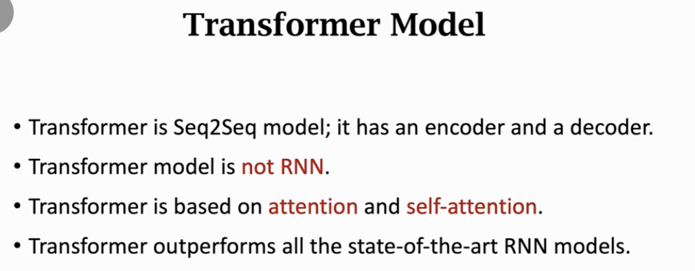

# Transformer

这份 PDF 是 Shusen Wang 教授关于 **Transformer 模型** 的第二部分，主题为 **“From Shallow to Deep” (从浅层到深层)**。

如果说第一部分（1/2）是造出了“积木”（Attention Layer），那么这一部分（2/2）就是教我们如何把积木搭成一座宏伟的摩天大楼。它完整地展示了 Transformer 的整体架构。

以下是对该课件的**深入分析与解构**：

### 1. 核心进化：Multi-Head Attention (多头注意力)

课件首先将简单的 Self-Attention 升级为 Multi-Head Self-Attention。

- **动机**：人看东西时，可能同时关注不同方面（比如既看颜色，也看形状）。Single-Head（单头）注意力只能捕捉一种类型的相关性。
- **实现**：
  - 不做一次 Attention，而是并行做 $l$ 次。
  - 如果你有 $l$ 个头，你就有 $l$ 组不同的参矩阵 $(\mathbf{W}_Q, \mathbf{W}_K, \mathbf{W}_V)$。
  - **Concatenation**：将 $l$ 个头的输出拼接起来。如果每个头输出 $d$ 维向量，拼接后就得到 $l \times d$ 维。
  - **Linear Projection**：虽然课件中简化了这一点，但在拼接后通常还会接一个线性层（Dense）把维度融合。

### 2. 积木单元：Encoder Block 和 Decoder Block

这是 Transformer 架构中最具标志性的“模块化”设计。

#### **Encoder Block (编码器模块)**

一个标准的 Encoder Block 由两部分组成（课件中为了教学简化，略去了 Residual Connection 和 Layer Normalization，专注于核心逻辑）：

1.  **Multi-Head Self-Attention**：让输入的序列“自己理解自己”，捕捉词与词之间的依赖。
2.  **Dense Layer (Feed Forward Network)**：对每个位置的向量进行独立的非线性变换。公式为 $\mathbf{u} = \text{ReLU}(\mathbf{W}\mathbf{c})$。
    - _输入_：$512 \times m$ 矩阵（$m$ 是序列长度）。
    - _输出_：$512 \times m$ 矩阵。
    - **特点**：输入和输出形状完全一致，这意味着我们可以无限**堆叠 (Stack)** 这些模块。

#### **Decoder Block (解码器模块)**

Decoder 稍微复杂一点，因为它不仅要生成序列，还要参考 Encoder 的信息。一个 Block 包含三层：

1.  **Multi-Head Self-Attention**：Decoder 自己看自己（Masked，防止偷看后面，虽然课件此处未详细展开 Mask 细节，但这是生成式任务必须的）。
2.  **Multi-Head Attention (Cross-Attention)**：这是关键桥梁。
    - **Query** 来自 Decoder 上一层的输出。
    - **Key & Value** 来自 **Encoder 的最终输出**（$\mathbf{U}$）。
    - _作用_：生成翻译时，回头看原文（Encoder）里哪里重要。
3.  **Dense Layer**：最后的处理。

### 3. 宏伟蓝图：整体架构 (Put Everything Together)

课件通过一系列图示展示了完整的 Transformer 架构：

- **Encoder 堆叠**：将 6 个 Encoder Block 串联。输入 $\mathbf{X}$ 经过 6 次“Self-Attention + Dense”的洗礼，通过不断抽象，最终输出矩阵 $\mathbf{U}$。$\mathbf{U}$ 包含了原文的深度语义表示。
- **Decoder 堆叠**：将 6 个 Decoder Block 串联。
  - 每个 Decoder Block 都有一根线连到 Encoder 的输出 $\mathbf{U}$ 上（用于 Cross-Attention）。
  - 输入是已经生成的单词序列（$\mathbf{X}'$）。
- **生成过程**：
  1.  Encoder 一次性处理完整个英文句子 $\mathbf{X}$，得到 $\mathbf{U}$。
  2.  Decoder 先接收 `Start Sign`。
  3.  结合 $\mathbf{U}$ 和 `Start`，Decoder 算出第一个词的概率分布 $\mathbf{y}_1$。
  4.  采样出第一个词（比如 "Ich"），把它加到输入里。
  5.  Decoder 接收 `Start, Ich`，算出第二个词的概率...
  6.  直到生成 `Stop Sign`。

### 4. Transformer vs. RNN

课件在 Slide 34 做了一个直观的对比：

- **RNN/LSTM**：水平向右的时间轴依赖。必须按顺序算，$\mathbf{h}_t$ 依赖 $\mathbf{h}_{t-1}$。
- **Transformer**：垂直向上的深度依赖。
  - 没有水平箭头！
  - 层与层之间是并行的，序列中的每个词在同一层是独立计算的（通过 Attention 交互）。
  - 这使得 Transformer 极度适合 GPU 并行加速。

### 总结

这份课件揭示了 Deep Learning 时代模型设计的两个核心哲学：

1.  **模块化与深度**：与其设计一个复杂的巨型网络，不如设计一个精巧的 Block，然后把这个 Block 堆叠 6 次、12 次甚至 100 次（如 GPT-4）。
2.  **注意力就是一切**：通过 Multi-Head 机制，模型可以在不同的语义子空间（Subspaces）里并行捕捉信息，彻底抛弃了循环连接，实现了并行化与长距离依赖的完美统一。

---

这节课是深度学习 NLP 领域最重要的课程之一，王树森老师将上节课的 **Attention / Self-Attention 配件** 正式组装成了 **Transformer 这一终极武器**。

Transformer 于 2017 年由 Google 提出（论文《Attention Is All You Need》），它彻底抛弃了 RNN 的循环结构，完全依赖 Attention 机制，却达到了前所未有的效果和并行训练速度。

以下是对 Transformer 架构的**深度拆解与逻辑还原**：

---

### 第一部分：从“单头”到“多头” (Multi-Head Attention)

上节课我们学的是 Single-Head Attention。但这节课一开始，王老师就引入了 **Multi-Head** 的概念。

#### 1. 为什么要多头？

- **类比**：如果让一个人去观察一幅画，他可能只关注到了色彩（一个视角）。但如果让 8 个人去观察，有的人看色彩，有的人看构图，有的人看笔触。把这 8 个人的观察结果拼起来，理解就全面得多。
- **机制**：
  - 构造 $h$ 个（例如 8 个）独立的 Self-Attention 层。
  - 它们互不共享参数 ($W_Q, W_K, W_V$ 各自独立)。
  - **效果**：每个头捕捉不同的特征子空间（Subspace）。比如头 1 关注语法依存，头 2 关注指代关系，头 3 关注情感色彩。

#### 2. 拼接 (Concatenation)

- 每个头的输出是一个序列 $C^{(i)}$。
- 将所有头的输出 $C^{(1)}, ..., C^{(h)}$ 在特征维度上 **拼接** 起来。
- 为了保持维度不暴涨，通常会再接一个线性层（Linear Projection）把维度降回原来的大小（如 512 维）。

---

### 第二部分：搭建 Encoder (编码器)

Encoder 的任务是“读懂”输入序列。它由 $N=6$ 个完全相同的 **Block (块)** 堆叠而成。

#### 1. Encoder Block 的内部结构 (2 层)

每个 Block 包含两个子层：

1.  **Multi-Head Self-Attention**：
    - 输入：序列 $X$。
    - 作用：利用自注意力机制，让序列中的每个词都能看到整句话的信息，捕捉上下文依赖。
2.  **Position-wise Feed-Forward Network (全连接层)**：
    - 作用：对每个位置的向量进行非线性变换（特征提取）。
    - **注意**：这个全连接层是**独立应用于每个位置**的（Position-wise），虽然参数共享，但计算是独立的。

#### 2. Skip Connection (残差连接)

- 王老师特别提到了类似 ResNet 的 **Skip Connection**。
- 公式：$\text{Output} = \text{Layer}(x) + x$。
- **意义**：让梯度能无损地流到底层，轻松训练深层网络。
- 实际上每个子层后还有 Layer Normalization（王老师课件简化未讲，但这是标配）。

#### 3. 堆叠

- Block 1 的输出 $\rightarrow$ Block 2 的输入 $\rightarrow$ ... $\rightarrow$ Block 6 的输出。
- 最终产出：矩阵 $U$ (Shape: $512 \times m$)，这代表了输入句子的深度语义表示。

---

### 第三部分：搭建 Decoder (解码器)

Decoder 的任务是基于 Encoder 的理解，生成目标序列。它也由 $N=6$ 个 Block 堆叠而成，但结构更复杂。

#### 1. Decoder Block 的内部结构 (3 层)

比 Encoder 多了一层，这非常关键：

1.  **Masked Multi-Head Self-Attention (带掩码的自注意力)**：
    - **输入**：Decoder 自己的历史输入（已翻译出的德语词）。
    - **作用**：看自己已经写了什么。
    - **注意**：这里必须加 **Mask**，防止偷看未来的词（预测第 t 个词时只能看前 t-1 个）。
2.  **Multi-Head Attention (Encoder-Decoder Attention)**：
    - **这是最核心的桥梁**。
    - **Query** 来自 Decoder 上一层的输出（我在找什么）。
    - **Key/Value** 来自 **Encoder 的最终输出 $U$**（原文里有什么）。
    - **作用**：让 Decoder 在生成每个词时，回头去查阅原文（Encoder Output）中最相关的部分。
3.  **Feed-Forward Network (全连接层)**：
    - 同 Encoder。

#### 2. 堆叠逻辑

- Decoder 的输入有两个：
  - 左手接 Encoder 的输出 $U$（提供弹药/原文信息）。
  - 右手接 Decoder 前一个 Block 的输出（提供上下文）。
- 经过 6 层堆叠，最终输出向量序列 $S$。

---

### 第四部分：Transformer 的整体工作流

#### 1. 输入输出

- **Input** (Encoder): 英语句子的词向量矩阵 ($512 \times m$)。
- **Input** (Decoder): 德语句子（Shifted Right，即加了起始符）的词向量矩阵 ($512 \times t$)。
- **Output**: 预测的下一个德语词的概率分布。

#### 2. 核心优势

- **并行计算**：这是 Transformer 击败 RNN 的最大杀手锏。
  - RNN 必须等 $h_{t-1}$ 算完才能算 $h_t$，无法并行。
  - Transformer 在 Encoder 端可以**一次性并行计算所有词**的 Attention，训练速度快飞起。
- **长距离依赖**：
  - RNN 需要 $t$ 步传递信息。
  - Transformer 只需要 1 步（Self-Attention 直接相连），无论距离多远。

---

### 第五部分：总结

1.  **Block 是基石**：Transformer 没有什么神秘的魔法，就是由大量的 **Attention Block** 和 **Dense Block** 像乐高积木一样堆起来的。
2.  **Encoder-Decoder 架构**：依然沿用了 Seq2Seq 的思路，只是把内部组件从 RNN 换成了 Attention。
3.  **输入输出一致**：Transformer 的接口设计与 RNN 完全兼容。这意味着你可以直接把老项目里的 RNN/LSTM 拔掉，插上 Transformer，性能直接起飞。
4.  **行业地位**：Transformer 是当前 AI 的霸主。它是 BERT、GPT-3、ChatGPT、AlphaFold 等所有现代大模型的**元祖架构**。

---

