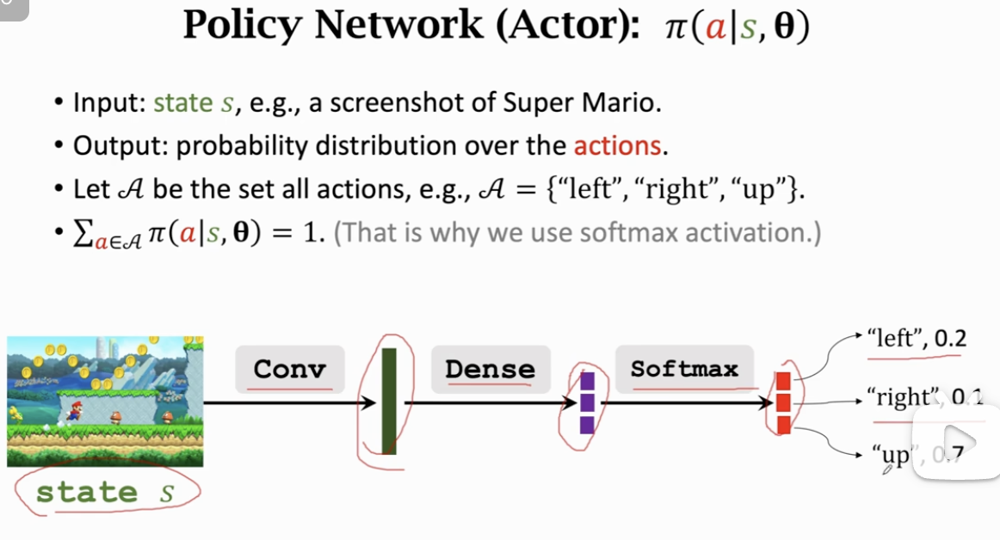
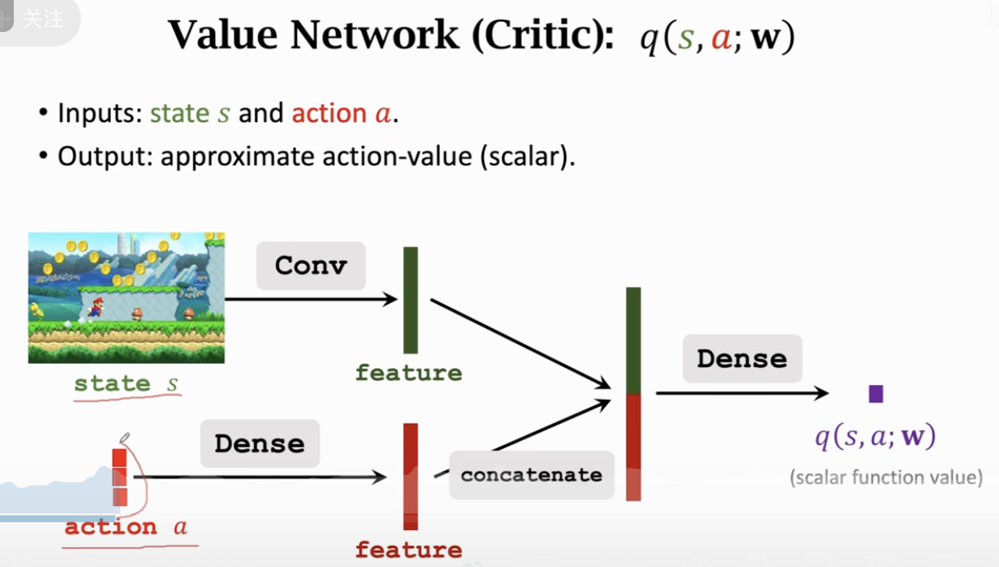
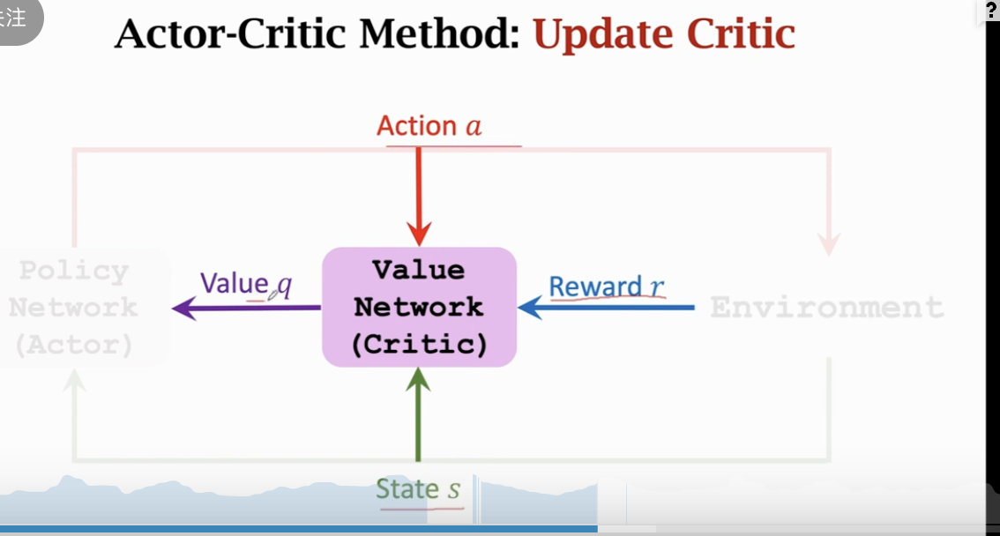

# Actor-Critic\_方法

这份 PDF 是 Shusen Wang 教授关于 **深度强化学习** 系列课程的第 13 讲第四部分，主题为 **《Actor-Critic Methods》（演员-评论家方法）**。

如果说 DQN 是只有“评委”（只打分，通过分高低来间接行动），Policy Gradient 是只有“演员”（只行动，不管分准不准），那么 **Actor-Critic** 就是这两者的**终极融合**。这是目前最主流、最强大的强化学习架构（如 A3C, PPO, DDPG 等算法的基础）。

以下是对这份讲义的深入解构与解读：

### 1. 核心架构：双剑合璧

讲义开篇直接点明了 Actor-Critic 的本质：它结合了 Value-Based（基于价值）和 Policy-Based（基于策略）两种方法的优点。

#### (1) 两个神经网络

- **Actor (演员) - Policy Network $\pi(a|s; \theta)$**
  

  - **职能**：负责**行动**。看到环境状态 $s$，决定动作 $a$ 的概率分布。
  - **比喻**：像一个运动员，负责在场上真正做动作。
  - **参数**：$\theta$。

- **Critic (评论家) - Value Network $q(s, a; \mathbf{w})$**
  
  - **职能**：负责**打分**。看到状态 $s$ 和演员做的动作 $a$，预估这个动作未来能拿多少分。
  - **比喻**：像一个教练，负责告诉运动员“刚才那个动作做得好”或者“做得太差了”。
  - **参数**：$\mathbf{w}$。

#### (2) 为什么需要结合？

- **纯 Policy Gradient (REINFORCE)** 的问题：需要等到游戏结束才能算出总分 $u_t$ 来更新策略。这导致**方差巨大**（一局游戏变数太多，运气成分大），学习很慢。
- **结合后**：Critic 可以**即时**给出评价 $q(s, a)$，不用等游戏结束。这样 Actor 每次做一个动作，就能立即得到反馈去修正参数，学习效率大幅提升。

---

### 2. 训练流程：各司其职，相互促进

这是一个双向的更新过程：**Critic 评判 Actor，真实环境评判 Critic。**

#### (1) Critic 的自我修养 (更新参数 $\mathbf{w}$)

- **目标**：让评分更准。
- **方法**：**TD Learning (时间差分学习)**。
  - Critic 预测当前的价值：$q(s_t, a_t; \mathbf{w})$。
  - Critic 预测下一步的价值：$q(s_{t+1}, a_{t+1}; \mathbf{w})$。
  - **现实打脸 (TD Target)**：$y_t = r_t + \gamma \cdot q(s_{t+1}, a_{t+1}; \mathbf{w})$。
  - **Loss**：让 $q(s_t, a_t)$ 尽量接近 $y_t$。
  - _解读：Critic 通观察真实的奖励 $r_t$ 和自己对未来的预测，来修正自己对现在的预测。_

#### (2) Actor 的自我修养 (更新参数 $\theta$)

- **目标**：获得 Critic 的高分。
- **方法**：**Policy Gradient (策略梯度)**。
  - 梯度公式：
    $$g = \nabla_\theta \ln \pi(a_t|s_t; \theta) \cdot q(s_t, a_t; \mathbf{w})$$
  - _解读：Actor 以前是看“实际胜率”来更新，现在是看“教练给的分 ($q$)”来更新。教练说好，我就增加这个动作的概率；教练说不好，我就减少。_

---

### 3. 请君入瓮：完整的算法循环 (The Loop)

讲义在第 25 页给出了一个单步更新的详细算法，这是理解 Actor-Critic 运作机制的关键：

1.  **观察 (Observe)**：

    - 看到状态 $s_t$。
    - Actor **随机抽样**动作 $a_t \sim \pi(\cdot|s_t; \theta)$。

2.  **执行 (Execute)**：

    - 执行 $a_t$，环境反馈奖励 $r_t$ 和新状态 $s_{t+1}$。

3.  **展望 (Look Ahead)**：

    - 在心中模拟下一步：Actor 针对新状态 $s_{t+1}$ 再次抽样出一个假想动作 $\tilde{a}_{t+1}$。
    - _注意：这一步只是为了让 Critic 估算未来的价值，并不真正执行。_

4.  **打分 (Evaluate)**：

    - Critic 给现在打分：$q_t = q(s_t, a_t; \mathbf{w})$。
    - Critic 给未来打分：$q_{t+1} = q(s_{t+1}, \tilde{a}_{t+1}; \mathbf{w})$。

5.  **计算误差 (TD Error)**：

    - $\delta_t = q_t - (r_t + \gamma \cdot q_{t+1})$。
    - 这就是 Critic 预测偏差了多少。

6.  **更新 (Update)**：
    - **更新 Critic**：用 $\delta_t$ 做梯度下降，修正 $\mathbf{w}$。
    - **更新 Actor**：用 $q_t$ 做作为权重，对 $\ln \pi$ 做梯度上升，修正 $\theta$。

---

### 4. 关键洞察

#### (1) 训练 vs 测试 (Training vs Testing)

这是一个非常重要的工程细节。

- **训练时**：需要 Actor 和 Critic 同时在场。Actor 负责探路，Critic 负责指路。
- **测试/应用时**：**只需要 Actor**。
  - 一旦训练完成，Actor 已经学会了最好的策略（内化了 Critic 的智慧）。
  - 此时我们只需要把画面喂给 Actor，它输出动作即可。Critic 可以直接扔掉（功成身退）。

#### (2) 为什么有效？

- **降低方差**：Critic 用神经网络拟合了价值函数，相比于蒙特卡洛采样（直接玩一整局算平均分），Critic 的评分虽然有偏差（Bias），但方差（Variance）极低。这让训练曲线更平滑。
- **数据效率**：由于是单步更新（TD Learning），每走一步就能学一次，不需要等游戏结束。这对于长流程游戏（如星际争霸、Dota）至关重要。

### 总结

**Actor-Critic** 是深度强化学习的集大成者。

- **Actor** 提供了连续控制能力和随机探索能力。
- **Critic** 提供了稳定的学习信号和低方差的梯度指导。
- 这种架构是理解现代高级 RL 算法（如 PPO, Soft Actor-Critic）的必经之路。
