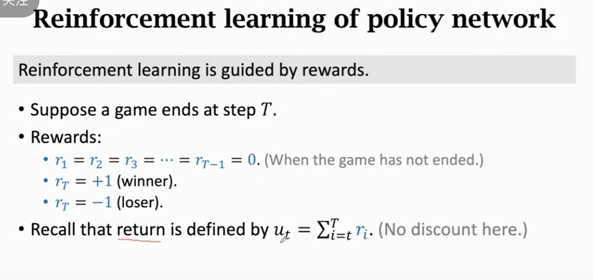

# AlphaGo\_与蒙特卡洛树搜索

这节课分析 AlphaGo 的技术细节，并且介绍 Imitation Learning（模仿学习）、Monte Carlo Tree Search（蒙特卡洛树搜索）等方法。
这节课主要内容：
0:27 围棋游戏
2:52 AlphaGo 主要原理
7:45 训练的第一步：Behavior Cloning
16:13 训练的第二步：策略学习
23:21 训练的第三步：价值学习
27:59 实战：蒙特卡洛树搜索（Monte Carlo Tree Search）
45:07 总结
47:50 新版 AlphaGo Zero 与 旧版 AlphaGo 的主要区别

这份 PDF 是 Shusen Wang 教授关于 **深度强化学习** 系列课程的第 13 讲第五部分，也是该系列的压轴之作—— **《AlphaGo》**。

这份讲义不仅解构了 AlphaGo 的技术细节，更重要的是揭示了**“深度学习（直觉）+ 树搜索（逻辑）”**这一 AI 里的终极范式。以下是对这份材料的深度解构与解读：

### 1. 宏观架构：AlphaGo 的“大脑”构成

AlphaGo 之所以能战胜人类，核心在于它模拟了人类下棋的两种思维模式：**直觉（Intuition）** 和 **推演（Reasoning）**。

- **直觉 (Policy Network & Value Network)**：
  - 人类高手看到棋盘，一眼就能看出“这几步棋感觉不错”（Policy），或者“这局势黑棋要输”（Value）。
  - AlphaGo 用**卷积神经网络 (CNN)** 来实现这种直觉。
- **推演 (Monte Carlo Tree Search, MCTS)**：
  - 人类会往后算几步：“如果我走这里，他走那里，那我再……”
  - AlphaGo 用**蒙特卡洛树搜索**来进行海量的模拟演算。

---

### 2. 训练的三部曲 (Training Pipeline)

AlphaGo 是怎么练成的？讲义将其拆解为三个阶段。这展示了一个从“模仿”到“超越”的过程。

#### 阶段一：行为克隆 (Behavior Cloning) —— 拜师学艺

- **方法**：监督学习 (Supervised Learning)。
- **数据**：KGS 围棋服务器上 16 万局人类高手的棋谱。
- **目标**：训练 Policy Network 去预测人类高手在当前局面下会走哪一步。
- **结果**：学完后能战胜高水平业余选手，但很难超越顶尖职业棋手（因为只是模仿，人类犯错它也学）。
- **局限**：遇到没见过的局面（Out-of-distribution），网络可能会瞎走。

#### 阶段二：策略梯度 (Policy Gradient) —— 左右互搏

- **方法**：强化学习 (Reinforcement Learning)。
- **对手**：自己跟自己下（Self-Play）。
  - Current Policy Network vs Random Previous Policy Network。
- **更新**：赢了就给这局所有的动作加分（增加概率），输了就减分。
  
- **意义**：这是 AlphaGo 能够**超越人类**的关键。它不再局限于人类的下法，而是通过试错发现了人类未知的妙手。

#### 阶段三：价值网络 (Value Network) —— 局势研判

- **目标**：训练一个能看懂“胜率”的网络。
- **输入**：棋盘状态 $s$。
- **输出**：一个标量 $v(s) \in [-1, 1]$，预测最终是赢还是输。
- **数据来源**：使用阶段二训练出的超强 Policy Network 自己对弈产生的几千万局棋局结果。

---

### 3. 实战决策：蒙特卡洛树搜索 (MCTS)

这是讲义中最复杂也最精彩的部分。在比赛时，AlphaGo 并不是直接输出 Policy Network 概率最高的哪一步，而是**把网络当作插件，插进 MCTS 搜索树里**。

AlphaGo 的下棋过程（单步决策）是重复成千上万次以下 4 个步骤：

1.  **选择 (Selection)**：

    - 在搜索树中，总是选择由于 **Q 值高**（胜率高）+ **Bonus 大**（探索少、先验概率高）的节点。
    - _公式解读_：Score = $Q(a) + \eta \cdot \frac{\pi(a|s)}{1+N(a)}$。既相信经验（Q），也相信直觉（$\pi$），同时鼓励去看不常走的路（$N$ 小的时候分数高）。

2.  **扩展 (Expansion)**：

    - 走到叶子节点后，下一步怎么走？
    - 用 Policy Network 预测一下对手可能的动作，作为树的新枝叶。

3.  **评估 (Evaluation)** —— AlphaGo 的核心创新

    - 从这个新局面往下走，到底能不能赢？传统 MCTS 需要随机走到这局下完（Rollout）。
    - AlphaGo 结合了两种评估方式：
      1.  **快速走子 (Fast Rollout)**：用一个轻量级策略快速下完这局，看输赢（$r$）。
      2.  **价值网络 (Value Network)**：直接由 Value Network 瞪一眼，给个分（$v$）。
    - **最终估值**：$V = 0.5 \cdot r + 0.5 \cdot v$。既有实战模拟，又有大局判断，极大地提高了搜索效率。

4.  **回溯 (Backup)**：
    - 把算出来的估值 $V$ 往回传，更新路径上所有节点的平均 $Q$ 值和访问次数 $N$。

**最终决策**：思考时间甚至，选那个被**访问次数 $N$ 最多**的动作，而不是 $Q$ 值最高的（因为访问次数多意味着经过了最多次的反复验证，最稳健）。

---

### 4. 进化版：AlphaGo Zero 的极简主义

讲义最后对比了 AlphaGo Zero，体现了**“奥卡姆剃刀”**原则：

- **去人类化**：完全砍掉阶段一（行为克隆）。不看任何人类棋谱，从零开始乱下，纯靠 RL。
  - _哲学思考_：讲义提出，人类知识在围棋领域可能反而是种“污染”或“局部最优解”。但在医疗机器人等领域，行为克隆依然必要（因为没法像下棋那样随便试错）。
- **合二为一**：Policy Network 和 Value Network 合并为一个网络（只是输出头不同）。
- **MCTS 即训练**：AlphaGo Zero 把 MCTS 的搜索结果（概率分布 $\mathbf{n}$）作为老师（Target），来训练 Policy Network（$\mathbf{p}$）。
  - 即：让神经网络去**拟合“深思熟虑后的结果”**。

### 总结

AlphaGo 的成功不是黑魔法，而是工程与算法的完美结合：

1.  **CNN** 解决了“围棋状态空间太大，无法穷举”的问题（提取特征，模糊直觉）。
2.  **MCTS** 解决了“神经网络有盲区，偶尔犯低级错误”的问题（通过向前搜索来验证直觉）。
3.  **RL (Self-Play)** 解决了“由于数据限制，无法超越人类”的问题。

这份讲义完美地串联了本系列课程之前学过的所有知识点：监督学习、策略梯度、价值函数、探索与利用，汇聚成了 AI 历史上的一座丰碑。
