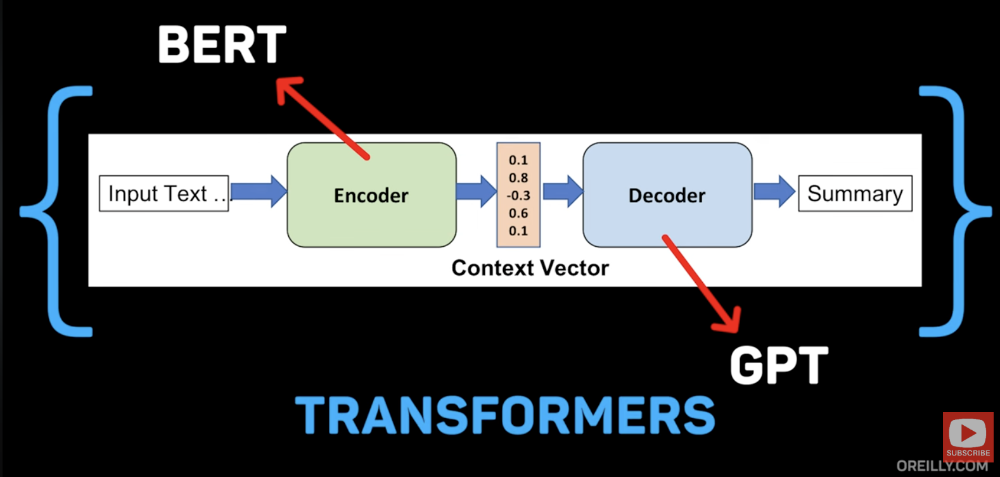

# 强化学习 (Reinforcement Learning) 核心笔记

> 基于 "Reinforcement Learning in 100 Seconds" 视频整理。

## 1. 核心定义

强化学习是通过**试错 (Trial and Error)** 和**奖惩机制 (Rewards & Punishments)** 教机器做决策的过程。

- **学习方式**: 与从示例中学习的监督学习不同，RL 是从**经验**中学习。
- **直观类比**: 就像训练动物，或者在不知道规则的情况下尝试玩通一个视频游戏。

## 2. 关键要素

这个过程由 **智能体 (Agent)** 与 **环境 (Environment)** 的交互构成，包含三个核心组件：

1.  **状态 (States)**: 描述当前的处境。
2.  **动作 (Actions)**: 智能体可以采取的操作。
3.  **奖励 (Rewards)**: 衡量动作好坏的信号（正向奖励或负向惩罚）。

## 3. 目标 (The Goal)

- **长期目标**: 随着时间推移，最大化总奖励。
- **输出产物**: 学习一个 **策略 (Policy)**，即一套在任何状态下决定采取何种动作的战略。

## 4. 核心挑战：探索 vs 利用

这是 RL 中著名的两难困境 (The Exploration-Exploitation Dilemma)：

- **探索 (Exploration)**: 尝试新事物。可能发现更优解，但风险是浪费时间或失败。
- **利用 (Exploitation)**: 坚持使用已知有效的方法。能保证收益，但可能错过最佳方案。
- **难点**: 需要在两者之间找到完美的平衡点。

## 5. 现代应用与局限性

- **深度强化学习 (Deep RL)**: 使用深度神经网络来处理复杂的环境状态。
  - **案例**: DeepMind 的 **AlphaGo** (击败围棋世界冠军)、OpenAI 的机械手 (解魔方)。
- **数据效率问题**: 人类只需几次尝试就能学会，而 RL 智能体往往需要**数百万次**尝试。因此，大部分训练是在**模拟环境**中进行的。
- **适用场景**: 适用于**奖励清晰**且具有**快速反馈循环**的问题。
  - _反之_: 对于许多任务，传统的监督学习或硬编码规则可能更简单有效。

---

# 计算机视觉 (Computer Vision) 核心笔记

> 基于 "Computer Vision in 100 Seconds" 视频整理。

## 1. 核心定义

计算机视觉是教机器像人类一样**理解和解释视觉世界**的技术。

- **本质**: 将图像分解为机器可处理的**像素模式 (Patterns of Pixels)**。
- **差异**: 人眼看到的是“一只猫”，电脑看到的是代表颜色值的**三维数字数组**。

## 2. 核心技术：CNN

现代计算机视觉的主力是 **卷积神经网络 (Convolutional Neural Network, CNN)**：

- **工作原理**: 模仿人脑处理图像的方式，层层递进。
- **分层抽象**:
  1.  **浅层**: 检测简单特征（如边缘、颜色）。
  2.  **中层**: 组合成更复杂的形状。
  3.  **深层**: 识别完整的对象。
- **机制**: 每一层网络都在学习越来越复杂的模式。

## 3. 常见任务

虽然底层架构相似，但可以处理多种任务：

1.  **分类 (Classification)**: 判定图像里“是什么”。
2.  **目标检测 (Object Detection)**: 找出并标记图像中的多个物体。
3.  **分割 (Segmentation)**: 逐像素勾勒出每个物体的轮廓。
4.  **姿态估计 (Pose Estimation)**: 追踪人体的位置和姿态。

## 4. 前沿应用：生成式 AI

结合生成式 AI，计算机视觉不仅能“看”，还能“改”和“造”：

- **风格迁移**: 将自拍变成动漫角色。
- **图像编辑**: 移除照片中不需要的物体。
- **文生图**: 根据文本描述生成全新图像。

## 5. 局限性

尽管在特定任务上可能超越人类（得益于海量数据集和专用硬件），但机器并未真正“看见”：

- **脆弱性**: 简单的干扰可能欺骗模型，而这些干扰骗不了人类。
- **理解力**: 机器在理解场景的**上下文 (Context)** 和**因果关系 (Causality)** 方面仍有困难。

---

# 梯度下降 (Gradient Descent) 核心笔记

> 基于 "Gradient Descent in 100 Seconds" 视频整理。

## 1. 核心定义

梯度下降是机器学习背后的**数学引擎**，一种用于**最小化误差**的优化算法。

- **本质**: 通过迭代更新参数，找到函数的最小值（即最低的 Loss）。
- **地位**: 几乎所有现代神经网络（包括 LLM、AlphaGo）都依赖它或其变体来进行训练。

## 2. 直观类比：迷雾下山

想象你被蒙住双眼站在山上，目标是下到谷底：

1.  **探路**: 用脚感受周围地形，找到下降最陡峭的方向（计算梯度）。
2.  **迈步**: 向该方向走一步（更新参数）。
3.  **循环**: 重复该过程，直到地势变平。

## 3. 核心公式与要素

$$ w*{new} = w*{old} - \alpha \cdot \nabla J(w) $$

1.  **损失函数 (Loss Function / Cost)**: 衡量模型预测有多差（即“山的高度”）。
2.  **梯度 (Gradient, $\nabla J$)**: 上升最快的方向向量。我们取其**负方向**以下降。
3.  **学习率 (Learning Rate, $\alpha$)**: **步长**。决定了每次更新幅度的大小。

## 4. 关键挑战：步长与地形

- **学习率问题**:
  - **过大**: 可能直接跨过最低点，甚至导致模型发散（无法收敛）。
  - **过小**: 下山速度极慢，计算成本过高。
- **局部最小值 (Local Minima)**: 在复杂的非凸函数中，可能会困在一个小坑里（局部最优），而非真正的谷底（全局最优）。

## 5. 常见变体

为了解决上述问题，演化出了多种变体：

- **SGD (随机梯度下降)**: 每次只用**一个样本**计算梯度。速度快，但路径极其震荡。
- **Mini-batch GD**: 每次用**一小批样本**。平衡了计算效率和稳定性，是深度学习的主流选择。
- **Adam / Momentum**: 引入“惯性”概念，帮助算法冲过局部最小值并加速收敛。

---

# 深度学习 (Deep Learning) 核心笔记

> 基于 "Deep Learning in 100 Seconds" 视频整理。

## 1. 核心定义

深度学习是机器学习的一个子集，利用多层神经网络解决复杂问题。

- **应用**: 从 ChatGPT 的对话到 Tesla 的自动驾驶。
- **区别**: 传统算法依赖显式指令，而深度学习通过在海量数据中寻找模式来**发现自己的规则**。

## 2. "深度" (Deep) 的含义

"深度"指的是神经网络的**层数**（现代网络可能有数百层）。每一层都像是一个专家，检测越来越复杂的特征：

1.  **浅层**: 检测简单特征（如边缘、颜色）。
2.  **中层**: 识别形状和纹理。
3.  **深层**: 理解复杂概念（如猫或狗）。

## 3. 关键组件与训练

每个模型由三个关键部分构建：

1.  **神经元 (Neurons)**: 处理信息。
2.  **权重 (Weights)**: 决定连接的重要性。
3.  **激活函数 (Activation Functions)**: 决定神经元何时激活（Fire）。

- **训练机制**: 通过**反向传播 (Back Propagation)** 过程自动调整权重。

## 4. 专用架构

真正的威力来自于针对特定任务的架构：

- **CNNs**: 擅长处理图像（扫描模式）。
- **Transformers**: 擅长处理语言（连接相关词汇）。
- **GANs**: 擅长生成新内容（从现有数据中学习）。

## 5. 驱动要素与局限

- **三驾马车**: 海量数据集、强大的 GPU、成熟的框架 (PyTorch/TensorFlow)。
- **本质**: 并非魔法，而是**大规模的模式识别**。
  - _直观类比_: 想象成数百万个线性回归模型在协同工作。
- **短板**: 只能学习训练数据中存在的模式，且容易被一些对人类无效的手段愚弄。

---

# Transformers 核心笔记

> 基于 "Transformers in 100 Seconds" 视频整理。

## 1. 核心定义

Transformer 是彻底改变 AI 处理序列数据方式的**突破性架构**。

- **革命性**: 颠覆了过去逐个处理元素的模式，能够广泛应用于文本 (GPT)、图像、音频甚至蛋白质结构。
- **并处理念**: 它能一次性“看”到整个序列，而不是一个字一个字地读。

## 2. 核心机制：自注意力 (Self-Attention)

Transformer 的魔法在于**自注意力机制**：

- **直观类比**: 就像读书时，你不需要逐字死记，而是瞬间将当前的词与书中任何相关的词联系起来理解含义。
- **工作方式**: 计算 "Attention Scores" (注意力分数)。
  - 例如：处理句子中的 "it" 时，模型会同时权衡它可能指代的前文（如 "the dog"、"the car"），并即时“关注”最相关的那个词。
- **优势**: 能够轻松捕捉**长距离依赖关系**，无视词与词之间的物理距离。

## 3. 架构组成：编码器与解码器

标准的 Transformer 包含两个部分，但不同模型用法不同：

1.  **Encoder (编码器)**: 负责“理解”输入。
    - _代表_: **BERT** (仅使用编码器，擅长理解任务)。
2.  **Decoder (解码器)**: 负责“生成”输出。
    - _代表_: **GPT** (仅使用解码器，擅长生成任务)。
3.  **Encoder-Decoder**: 像翻译官一样，先理解源语言 (Encoder)，再生成目标语言 (Decoder)。
    - _用途_: 机器翻译。

## 4. 向量化与通用性

名字中的 "Transform" 指的是其转换数据的能力：

- **流程**: Token 序列 (文本块、图像补丁) $\rightarrow$ 高维向量 $\rightarrow$ 输出序列。
- **万能性**: 一旦训练完成，同一个架构只需改变输入输出格式，就能做截然不同的事：
  - 总结文本
  - 生成图像
  - 谱写音乐
  - 编写代码

## 5. 局限性

- **序列长度**: 处理非常长的序列时仍有困难（由于计算复杂度）。
- **计算成本**: 训练和运行都极其昂贵。
- **数据依赖**: 只能处理训练数据中见过的模式，没有真正的“创造”或逻辑推理能力。

---

# GPT (Generative Pre-trained Transformer) 核心笔记

> 基于 "GPT in 100 Seconds" 视频整理。

## 1. 核心定义

GPT 是 ChatGPT 和现代 AI 语言模型背后的架构。

- **本质**: 基于 Transformer 的模型，利用注意力机制处理文本。
- **能力**: 彻底改变了机器理解和生成人类语言的方式。与逐字阅读的旧模型不同，GPT 能一次性“看”到整个序列，理解词与词之间的关系。

## 2. GPT 的三要素解析

### G - Generative (生成式)

- **机制**: 通过预测“下一个 Token 是什么”来创造新文本。
- **类比**: 就像在玩一个高级的词汇联想游戏，每一个预测都基于之前所有的内容。

### P - Pre-trained (预训练)

- **过程**: 在针对特定任务微调之前，先通过阅读海量的互联网文本来学习语言的一般规律。

### T - Transformer

- **基石**: 利用多层**自注意力 (Self-Attention)** 机制。
- **分层理解**:
  - 有的层关注语法。
  - 有的层捕捉语境。
  - 有的层理解事实关系。
- **原理**: 将词表示为高维空间中的**向量**（相似的词聚集在一起），并计算词与词之间的“注意力分数”来确定上下文重要性。

## 3. 规模即智能 (Scale)

模型的能力随着规模指数级增长：

- **参数量**: GPT-3 (1750 亿) -> GPT-4 (1.8 万亿)。
- **效果**: 也就是这种巨大的规模，使其能进行看似智能的对话，尽管本质上它仍是一个**模式匹配机器 (Pattern Matching Machine)**。

## 4. 局限性

尽管强大，但它不是真正的通用人工智能 (AGI)：

- **幻觉 (Hallucination)**: 可能会一本正经地胡说八道，编造事实。
- **理解力**: 并不像人类那样真正理解因果和语境。
- **偏见**: 会继承训练数据中的偏见。

---

# 生成式 AI (Generative AI) 核心笔记

> 基于 "Generative AI in 100 Seconds" 视频整理。

## 1. 核心定义

生成式 AI 是能**创造新内容**的人工智能，涵盖图像、文本、音乐乃至代码。

- **代表应用**: DALL-E (绘画), ChatGPT (对话)。
- **本质**: 从现有数据中学习模式 (Patterns)，并利用这些模式创造全新的原创内容。
- **直观类比**:
  - 像一个看过数百万幅画的画家，能以任何风格创作新画。
  - 像一个读遍互联网的作家，能以此模仿任何语调写作。

## 2. 图像生成两大流派

### A. GANs (生成对抗网络)

- **机制**: 像“伪造者”和“侦探”之间无休止的博弈。
  - **Generator (生成器)**: 试图制造假图。
  - **Discriminator (判别器)**: 试图揪出假图。
- **结果**: 随着竞争升级，两者都越来越强，直到生成的假图逼真到无法分辨。

### B. Diffusion Models (扩散模型)

- **代表**: Stable Diffusion。
- **机制**:
  1.  学习过程：逐渐向图像添加噪点直到变成纯噪声。
  2.  生成过程：**逆向操作**。从随机噪声开始，根据文本提示 (Prompt)，逐步去除噪点，“雕刻”出清晰的图像。

## 3. 文本与代码生成

- **LLM (大型语言模型)**: 如 GPT 系列。
  - 通过不断预测序列中的“下一个词”来生成连贯文本。
- **代码生成**: 原理相同，帮助程序员利用 Devon 等工具更快地编写软件。

## 4. 多模态 (Multimodal)

最新的模型正在打破边界：

- **能力**: 同时理解和生成多种类型的内容（看图写诗、文字生成视频等）。
- **意义**: 正在极大地扩展 AI 的创造力边界。

## 5. 局限性与伦理

- **创造性本质**: 它们本质上是在**重组 (Remix)** 和**重构 (Recombine)** 训练数据中的模式，而非人类那样真正的无中生有。
- **风险**:
  - 可能复制偏见。
  - 可能生成误导性内容 (幻觉)。
