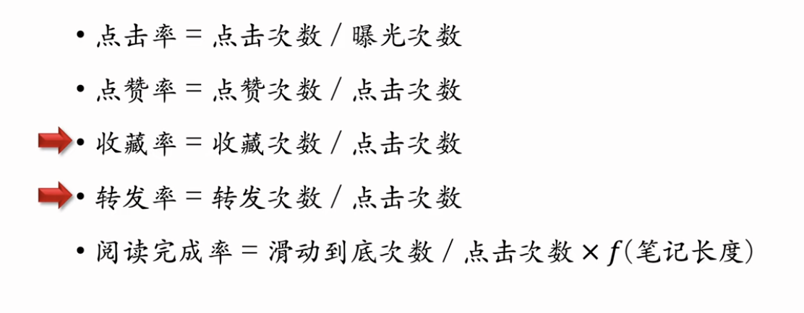
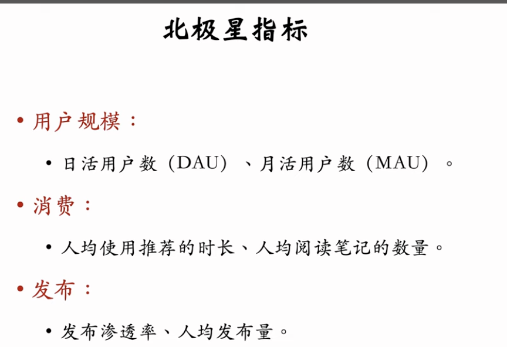

这节课讲解推荐系统的基本概念，包括：
用户行为：点击、点赞、收藏、转发
消费指标：点击率 (click rate)、交互率 (engagement rate)
北极星指标：用户规模、消费、发布
实验流程：离线实验、AB 测试、推全

这段内容是王树森（小红书推荐与搜索算法专家）关于**推荐系统基础与工业界实践**的第一讲。核心在于通过小红书的业务场景，建立对推荐系统**转化链路**及**评估指标**的宏观认知。

以下是逻辑清晰、一针见血的分析：

### 一、 推荐系统的核心逻辑与转化链路

推荐系统的本质是**内容分发与用户兴趣的匹配**。王树森以小红书为例，剖析了用户与内容交互的完整漏斗（Funnel）：

1.  **曝光 (Impression):**
    - **定义:** 系统将内容（笔记）展示在用户屏幕上。
    - **差异点:** 大多数产品（YouTube, B 站, 淘宝, 小红书）有独立的曝光环节（Feed 流列表）；而抖音采用全屏沉浸式，下滑即播放，本质上跳过了传统的“曝光-点击”选择过程。
2.  **点击 (Click):**
    - **定义:** 用户对曝光内容感兴趣，主动点击进入详情页。
    - **判断标准:** 引入“停留时间”作为过滤器，只有停留若干秒的点击才算“有效点击”，排除误触。
3.  **消费与交互 (Conversion):**
    这是用户深度兴趣的体现，层级逐渐加深：
    - **深度阅读:** 滑动到底部（说明读完了）。
    - **轻量交互:** 点赞（表达喜欢）。
    - **中量交互:** 收藏（表达即时价值或长久价值）。
    - **重量交互:** 转发（社交传播）、评论（社区氛围构建）。

**分析:** 这个链路是算法建模的基础。所有的机器学习模型（CTR 预估、CVR 预估等）本质上都是在预测用户在上述链路中各个节点发生行为的概率。

---

### 二、 评估体系的层级结构：短期指标 vs 北极星指标

这是一个非常重要的认知纠偏。算法工程师不能只看模型产生的直接数据，必须对齐公司的战略目标。

#### 1. 短期消费指标 (Operational Metrics)

这些指标直接反映从曝光到交互的转化效率，适合用于模型训练的 Loss 函数优化或初步筛选。

- **点击率 (CTR):** `点击次数 / 曝光次数`。衡量推荐精准度的第一道门槛。
- **点赞率/收藏率/转发率:** `交互次数 / 点击次数`。衡量内容的质量和用户满意度。
- **阅读完成率:** `滑动到底次数 / 点击次数` \* `归一化系数`。
  - _关键细节:_ 必须进行**归一化**处理（Normalize）。因为长文章天生完读率低，若不加权，算法会倾向于推荐短内容，导致内容生态恶化。

**痛点与局限:**

- **“标题党”问题:** 仅优化 CTR 会导致诱导性点击泛滥，用户点进去发现内容不符，产生反感。
- **“信息茧房”与短期主义:** 仅推用户当下最喜欢的内容（如美女图片），数据虽然短期好看，但会透支用户兴趣，导致用户流失（竭泽而渔）。

#### 2. 北极星指标 (North Star Metrics)

这是衡量推荐系统生死的根本标准，通常是长期的、业务导向的指标。如果短期指标与北极星指标冲突，**必须以北极星指标为准**。

- **用户规模 (Scale):**
  - **DAU (日活) / MAU (月活):** 系统的生命线。推荐系统做得好，用户粘性高，留存率提升，自然推动 DAU 增长。
- **消费深度 (Consumption):**
  - **人均使用时长:** 用户停留越久，说明越“上瘾”。
  - **人均阅读篇数:** 消费内容的吞吐量。
  - _战略意义:_ 牺牲一点 CTR，换取更高的多样性和新颖性，往往能带来更长的使用时长。
- **内容发布 (Production):**
  - **发布渗透率 / 人均发布量:** 针对 UGC 社区非常关键。
  - _逻辑:_ 推荐系统通过给新作者/新内容流量（冷启动），激励创作者持续生产，维持内容池的健康水位。

---

### 三、 算法迭代的验证方法论

王树森阐述了工业界标准的算法上线流程，核心在于**降低风险，验证真实收益**。

1.  **离线实验 (Offline Eval):**

    - **手段:** 使用历史日志数据训练和测试。
    - **优点:** 零风险，不占用线上流量，迭代快。
    - **缺点:** 数据有偏差（Bias），无法模拟真实的用户交互反馈，无法得出北极星指标（通过离线无法算出现在线时长）。
    - **定位:** 这是一个筛选机制，淘汰明显不靠谱的算法。

2.  **线上实验 (Online A/B Testing):**
    - **手段:** 流量分桶（Bucketing），实验组 vs 对照组。
    - **关键:** 只有在线上才能观测到时长、留存、DAU 等北极星指标的变化。
    - **流程:** 小流量测试 -> 观察显著性 -> 推全流量。

---

### 总结

这堂课的核心 takeaways 可以归纳为以下三点：

1.  **场景决定模型:** 必须熟悉产品形态（如区别抖音的单列流和小红书的双列流），才能设计正确的特征和标签。
2.  **指标分层:** 短期指标（CTR/互动率）服务于算法优化，长期北极星指标（DAU/时长）服务于业务战略。**切忌为了 CTR 牺牲生态和长期留存。**
3.  **实验为王:** 离线看下限，线上看上限。数据是衡量算法改进的唯一真理。
