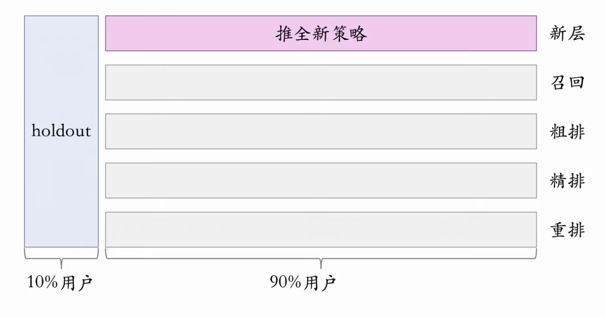
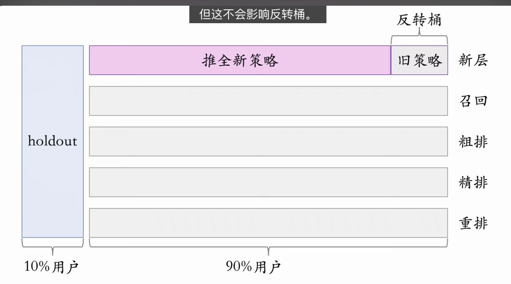

推荐系统算法工程师的日常工作就是改进模型和策略，目标是提升推荐系统的业务指标。所有对模型和策略的改进，都需要经过线上 AB 测试，用实验数据来验证模型和策略是否有效。这节课介绍工业界 AB 测试的一些基本概念。

1. 分层实验，同层互斥，不同层正交，这样可以同时开很多实验。
2. Holdout 机制用于衡量整个部门的业务指标收益。
3. 实验推全、反转实验的基本思想。

这段内容是王树森关于**推荐系统 A/B 测试**的课程，详细剖析了工业界如何通过科学的流量实验来验证算法的效果。

以下是逻辑清晰、一针见血的分析：

### 一、 核心目标与基础逻辑

A/B 测试是推荐系统算法迭代的**唯一真理标准**。离线实验（Offline）只能证明理论可行性，只有线上实验（Online）才能验证真实的业务收益。

1.  **目的:**
    - **验证收益:** 确认新策略（如 GNN 召回）能否提升 DAU、留存、点击等业务指标。
    - **规避风险:** 防止新策略导致用户体验崩盘，因此必须从小流量（如 10%）开始。
    - **参数调优:** 对比不同参数（如神经网络层数）的效果，择优上线。
2.  **基本操作:**
    - **随机分桶 (Bucketing):** 利用哈希函数将用户 ID 映射并均匀切分为 $N$ 个桶（Bucket）。
    - **对照组 vs 实验组:** 控制变量法。对照组用旧策略，实验组用新策略，计算指标 Diff 的显著性。

---

### 二、 工业界核心架构：分层实验 (Layered Experiment)

小丑牌的：增加、版本、蜡封

这是解决“流量不够用”问题的关键架构设计。

- **痛点:** 公司有无数团队（召回、排序、UI、广告）都需要做实验，如果所有实验都互斥，100% 的流量切分完只能做 10 个实验，效率极低。
- **解决方案:** **层（Layer）** 的概念。
  - **同层互斥 (Mutually Exclusive):**
    - _定义:_ 同一类型的策略（如召回策略 A 和 B）不能同时作用于同一个用户。
    - _原因:_ 同类策略往往互相干扰（如两个召回叠加可能效果抵消，或者自然互斥如两种模型结构），导致实验结果不可信。
  - **不同层正交 (Orthogonal):**
    - _定义:_ 不同类型的策略（如召回层 vs UI 层）独立分桶。召回层的第 1 号桶用户，会被均匀打散分布在 UI 层的各个桶中。
    - _结果:_ 一个用户可以同时身上背着召回实验、精排实验、UI 实验。
    - _前提:_ 不同层之间的策略通常是线性叠加的（1+1=2），相互干扰较小。

**一句话总结:** **纵向切分流量做互斥，横向切分功能做正交。** 这样实现了流量的无限复用。

---

### 三、 宏观评估机制：Holdout 桶

这是解决“局部最优不等于全局最优”以及“业绩考核”问题的机制。

- **痛点:** 单个实验都有收益，加起来可能没收益（实验之间有折损）。可以把所有单实验的收益简单相加作为部门业绩吗？不行。
- **机制:**
  - **Holdout 桶 (10%):** 纯净区。在这个考核周期（如双月）内，**任何**新实验都不准碰这群用户，始终使用旧版本的基线策略。
  - **实验桶 (90%):** 实验区。所有新召回、排序策略都在这里跑。
- **考核:** 周期结束时，计算 `实验桶总指标 - Holdout桶总指标`，这就是整个部门的真实业务收益。
- **滚动:** 周期结束后，将成功的策略推全（Holdout 桶也升级），然后重新随机洗牌用户，开始下一个周期。

---

### 四、 策略生命周期：推全与反转实验

这是一个平衡“快速迭代”与“长期观测”矛盾的高级技巧。

1.  **推全 (Launch):**

    

    - 当小流量验证成功后，需要将策略扩大到所有实验用户（90%）。
    - **操作:** 新开一个**正交层**。

2.  **反转实验 (Reverse Experiment):**

    

    - **矛盾:** 留存率等长期指标有严重滞后性，需要观测几个月；但工程上希望赶紧推全腾出流量桶。
    - **解法:**
      - 在推全层中，绝大部分用户（如 99%）用新策略。
      - 特意保留一小撮用户（如 1%）形成**反转桶**，强制**继续使用旧策略**。
    - **价值:** 可以在策略全量上线后，依然有一个锚点来长期观测新策略的长尾效应和长期留存收益。

---

### 总结图谱

- **原子层:** **Bucketing** (随机分桶，基石)。
- **架构层:** **Orthogonal Layers** (正交分层，解决流量复用)。
- **管理层:** **Holdout** (大盘对照，解决 KPI 考核与全局评估)。
- **运营层:** **Launch & Reverse** (推全与反转，解决长期效益观测)。

这一套组合拳构成了现代推荐系统工业级实验平台的方法论基础。

---

- 召回离线测评没有多大价值。排序离线就是看 auc 和 gauc
  这句话是推荐系统和搜索引擎领域中非常经典且具有实战意义的观点。它主要强调了**召回（Recall）**和**排序（Ranking）**在离线评估阶段的不同特质和局限性。

  以下是对这句话的深度解析：

  ### 1. 为什么说“召回离线测评没有多大价值”？

  这里的“没有多大价值”是相对的，通常指**离线指标（如 Recall@K, Precision@K）与线上真实效果（如点击率、转化率、用户时长）的相关性较弱**。

  - **召回的目标是“探索”与“不漏”**：召回层的任务是从海量（百万/千万级）候选集中筛选出几百个用户可能感兴趣的物品。它偏向于广度。
  - **Positives（正样本）是不完备的**：离线测试集通常基于用户“过去产生过行为”的物品作为正样本（Ground Truth）。
    - **问题**：用户没点击某个物品，可能是因为召回系统压根没展示给他看（Exposure Bias），或者是排序把它排到了后面，而不是用户真的不喜欢。
    - **幸存者偏差**：离线数据只能验证“系统过去推出来的且用户点的”东西。如果你上线了一个新的召回策略（比如基于 Graph Embedding），它找出的新颖物品在测试集中根本没有记录，离线指标会显示命中率为 0，但实际线上效果可能非常好。
  - **无法评估“惊喜感”**：好的召回往往能发现用户潜在的兴趣，而离线数据只能验证已知的兴趣。

  **结论**：召回离线指标高，线上未必好；召回离线指标低，线上未必差。因此，召回策略通常更依赖**线上 A/B 测试**来验证。

  ### 2. 为什么说“排序离线就是看 AUC 和 GAUC”？

  相比之下，排序层（尤其是精排）的离线指标与线上效果具有**较强的正相关性**。

  - **排序的目标是“准”**：输入已经是被召回选定的一小撮候选集，排序的任务是确定谁排第一、谁排第二。这是一个典型的二分类问题（点击/不点击）或回归问题。
  - **样本相对完备**：在精排阶段，样本通常来自于真实的曝光日志（Impression Logs）。这意味着我们知道用户在看到这个物品后的确切反馈（点或没点）。
  - **AUC (Area Under Curve)**：
    - **含义**：衡量模型将正样本排在负样本前面的能力。
    - **局限**：推荐系统是个性化的，全局 AUC 会受用户活跃度差异的影响（例如：活跃用户点击多，模型给活跃用户打高分就能刷高 AUC，但对个性化排序无益）。
  - **GAUC (Group AUC)**：
    - **含义**：先计算每个用户的 AUC，然后加权平均。
    - **优势**：GAUC 消除了用户偏差，只关注**同一个用户**面对不同物品时的排序能力。
    - **核心价值**：**GAUC 的涨跌通常能直接反映线上 CTR (点击率) 的涨跌。** 如果离线 GAUC 显著提升，上线大概率能看到正向收益。

  ### 总结

  - **召回层**：离线指标（HitRate, Recall）仅作参考，甚至可以说是“底线检查”（Sanity Check），真正定生死靠 **A/B Test**。
  - **排序层**：离线指标（AUC, **尤其是 GAUC**）非常关键，是模型迭代能否推全上线的核心依据。

  理解这句话，有助于你在工作中合理分配精力：**做召回多做尝试多上线看效果，做排序多抠模型结构和特征以提升 GAUC。**
