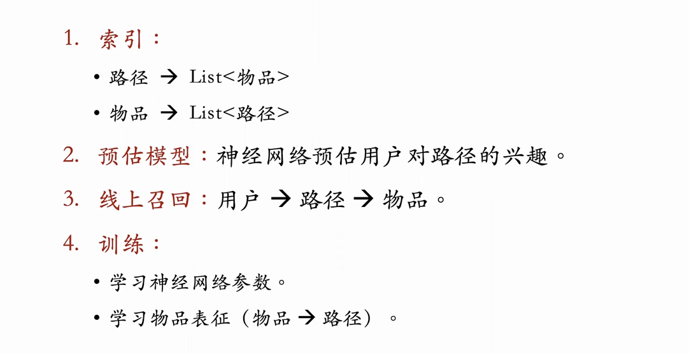

Deep Retrieval 是字节跳动 AML 部门开发的召回技术 [1]，已经在字节很多业务线上落地，对指标有一定提升。但是其他公司尚未复现出 Deep Retrieval。Deep Retrieval 跟阿里的 TDM [2] 较为相似。

---

Deep Retrieval 是字节在推荐领域贡献的一种非常“硬核”的非向量召回技术。它跳出了“Embedding + ANN（近似最近邻搜索）”的传统双塔框架，开辟了一条“路径索引 + 深度学习”的新路。

这节课的内容主要分三块：**路径索引结构**、**线上召回流程**、**离线训练机制**。以下是对黄树森老师讲解内容的深度逻辑拆解：

### 1. 核心思想：用“路径”重新定义召回

- **传统双塔 (Vector Retrieval)**：

  - 中介：向量 (Embedding)。
  - 逻辑：User $\rightarrow$ User Vector $\rightarrow$ (ANN) $\rightarrow$ Item Vector $\rightarrow$ Item.
  - 瓶颈：受限于向量空间的表达能力和 ANN 搜索的精度/耗时。

- **Deep Retrieval**：
  - 中介：**路径 (Path)**。
  - 逻辑：User $\rightarrow$ Neural Network (Beam Search) $\rightarrow$ Path $\rightarrow$ (Index) $\rightarrow$ Item.
  - 本质：将“在海量物品中找 TopK”的问题，转化成了“在多层决策树中做 **分步决策 (Hierarchical Decision)**”的问题。

### 2. Deep Retrieval 的数据结构

- **三层结构 (L1 -> L2 -> L3)**：

  - 每一层有 $K$ 个节点（Cluster）。
  - 一条路径由三个节点组成：$(n_{L1}, n_{L2}, n_{L3})$。
  - 路径总数：$K \times K \times K = K^3$。这是一棵巨大的虚拟决策树。

- **两套双向索引**：
  1.  **Item $\rightarrow$ Path (I2P)**：训练神经网络时用。告诉模型：如果用户喜欢这个物品，那他就得“假装”喜欢这几条对应的路径。
      - **注意**：一个物品对应多条路径 ($J$ 条)，这是为了增加召回的多样性和鲁棒性。
  2.  **Path $\rightarrow$ Item (P2I)**：线上召回时用。告诉系统：既然用户选中了这条路径，那挂在这条路径下的物品都可以拿出来。

### 3. 线上召回 (Inference)：Beam Search 的妙用

线上如何在 $K^3$ 条路径中快速找到用户最爱的几条？暴力算 $K^3$ 次肯定不行。

- **策略：Beam Search (集束搜索)**。
- **过程**：
  1.  **L1 阶段**：输入用户特征 $X$，算 $K$ 个分数，保留 Top-S 个节点（Beam Size = S）。
  2.  **L2 阶段**：基于上一步保留的 $S$ 个节点，展开计算 $S \times K$ 个分数，再保留 Top-S 条局部路径。
  3.  **L3 阶段**：同理，最终选出 Top-S 条完整路径。
- **神经网络设计**：
  - 模型是**分层**的。预估 $P(B|A, X)$（在已知第一层选 A 的情况下，第二层选 B 的概率）。
  - 使用了 Softmax 做多分类。

**一针见血的评价**：Beam Search 在这里起到了**剪枝**的作用，把计算复杂度从指数级 $O(K^3)$ 降到了线性级 $O(3 \cdot S \cdot K)$，使得实时推理成为可能。

### 4. 离线训练 (E-M Like Training)：最烧脑的部分

训练是一个**“鸡生蛋，蛋生鸡”**的循环过程，类似于 EM 算法（期望最大化）。

**难点**：我们只有“用户点击了物品”的数据，没有“用户点击了路径”的数据。路径是隐变量。

- **步骤 A：更新神经网络 (Fix Path, Update Net)**

  - 假设：物品对应的路径是已知的 (Item $\rightarrow$ Path 索引固定)。
  - 逻辑：用户点了 Item $\rightarrow$ Item 属于 Path $\rightarrow$ 用户喜欢 Path。
  - 动作：训练神经网络，让模型给这些正样本 Path 打高分。

- **步骤 B：更新物品表征 (Fix Net, Update Path)**
  - 假设：神经网络已经能判断用户喜欢什么路径了 (Net 固定)。
  - 逻辑：
    1.  找到所有点击过 Item 的 User 集合。
    2.  看这些 User 都对哪些 Path 感兴趣（神经网络打分高）。
    3.  如果很多喜欢 Item 的人都喜欢某条 Path，那这条 Path 就代表了这个 Item。
  - **限制 (Regularization)**：为了防止索引失衡（即所有热门物品都挤在同一条路径上，导致该路径过载），加入惩罚项。
    - $Loss = -Score(item, path) + \alpha \cdot (\text{count}(path))^4$
  - 动作：重新为每个物品分配 $J$ 条分数最高且不拥挤的路径。更新 I2P 和 P2I 索引。

### 5. Deep Retrieval vs TDM (阿里)

- **TDM (Tree-based Deep Match)**：也是树结构，但通常是完全二叉树，或者经过学习的树。召回是逐层二分类或多分类。
- **Deep Retrieval**：结构更扁平（通常 3-4 层，每层节点多），路径是软聚类（Soft Clustering）。
- **优势**：Deep Retrieval 的路径设计可能比 TDM 的固定层级结构更灵活，且离线构建索引的过程显式地考虑了负载均衡。

### 6. 总结

Deep Retrieval 是一种**端到端学习索引结构**的召回技术。

- **它不需要预训练的 Embedding**，而是直接学习“用户特征 $\rightarrow$ 物品索引”的映射。
- **它解决了 ANN 精度损失的问题**，因为路径搜索是模型直接决策的。
- **它解决了索引偏斜问题**，通过训练时的正则项，强制让索引结构平衡。

这种方法在字节跳动这种拥有超大规模数据和强算力的场景下，能榨干数据的最后一点价值，获得比双塔更好的召回效果。对于普通公司，双塔依然是性价比之选，但 DR 提供了高端玩家的优化方向。
