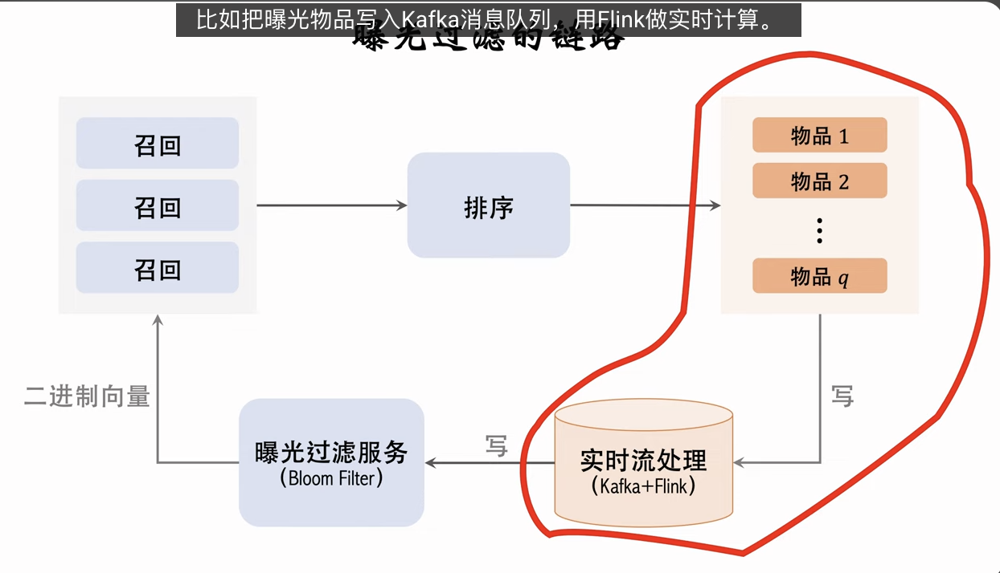

在推荐系统中，如果用户看过某个物品，就不再把物品推荐给这个用户。小红书、抖音都这样做曝光过滤，原因是实验表明重复曝光同一个物品会损害用户体验。但也不是所有推荐系统都有曝光过滤，像 YouTube 这样的长视频就没有曝光过滤，看过的可以再次推荐。

曝光过滤通常是在召回阶段做。想要做曝光过滤，需要对于每个用户，记录已经曝光给他的物品。一个用户历史上看过的物品可能会非常多，为了做到高效的曝光过滤，需要用 Bloom Filter 这种数据结构。

---

这份内容详细讲解了推荐系统中的一个重要但不显眼的环节——**曝光过滤（Exposure Filtering）**，以及实现它的关键技术 **Bloom Filter（布隆过滤器）**。

其核心逻辑链条在于：**为了避免给用户重复推荐，需要记录用户看过的物品此集合庞大，查询和存储成本高需要一种空间效率极高的数据结构 Bloom Filter 完美适配。**

以下是对这节课内容的深度逻辑分析与总结：

### 1. 曝光过滤：Why & Where

- **业务痛点**：对于小红书、抖音这类短内容平台，内容消费快，重复曝光（看到同一个视频两次）极度损害用户体验。
- **适用场景**：短视频、图文推荐（必须做）；长视频如 YouTube（可以不做，甚至可以特意推荐看过的）。
- **过滤范围**：通常只针对**近期（如一个月内）**看过的物品。
  - _逻辑_：更早的物品反正召回策略也不会召回（召回本身就有时间截断），所以不需要过滤。
- **工程位置**：**召回（Retrieval）之后，粗排（Pre-ranking）之前**。
  - _逻辑_：召回出的几千个候选集里可能混杂着刚看过的，必须在进入昂贵的排序计算前剔除。

### 2. 技术选型：为什么是 Bloom Filter？

- **暴力做法的问题**：用户看过 $N$ 个物品，本次召回 $R$ 个物品。暴力对比复杂度 $O(N \times R)$。对于高活跃用户，$N$ 很大，计算和存储开销不可接受。
- **Bloom Filter 的优势**：
  - **极致的空间效率**：不存物品 ID，只存 hash 后的 bit。存储 $N$ 个物品只需 $10N$ bits（误判率 1% 时）。
  - **极快的查询速度**：$O(K)$，只跟哈希函数数量有关，跟历史记录 $N$ 无关。

### 3. Bloom Filter 的原理拆解

- **结构**：一个长度为 $M$ 的 **Bit Array（位数组）**，初始全 0。
- **写入**：对于一个物品 ID，用 $K$ 个哈希函数算出 $K$ 个位置，将数组中这就 $K$ 个位置置为 **1**。
- **查询**：
  - 算出物品 ID 的 $K$ 个哈希位置。
  - **只要有一个位置是 0** $\rightarrow$ **绝对没看过** (True Negative)。
    - _逻辑_：如果看过，写入时这里肯定被置为 1 了。
  - **所有位置都是 1** $\rightarrow$ **很可能看过** (Positive / False Positive)。
    - _误判来源_：这几个位置可能是别的物品写入时不凑巧把它们都填成 1 的。
- **性质**：
  - **宁可错杀，不可放过**：对于推荐系统，把一个没看过的当成看过的过滤掉（误伤），只是损失了一点点内容丰富度，代价很小；但把看过的放过去了，用户体验很差。这个 Trade-off 是划算的。

### 4. 关键参数设置 (工程经验)

误判率 $\delta$ 由三个参数决定：

1.  **N (曝光量)**：用户看过多少个。
2.  **M (向量长度)**：Bit Array 多长。
3.  **K (哈希函数个数)**：算几次哈希。

**结论**：

- 设定好可容忍的误判率 $\delta$（如 1%）。
- 最佳存储大小：$M \approx 10N$ bits。
- 最佳哈希个数：$K \approx 0.44 \times \frac{M}{N}$ (通常很小，如 3-7 个)。

### 5. 工程实现与挑战

- **实时性挑战**：
  - 链路：客户端埋点 $\rightarrow$ Kafka $\rightarrow$ Flink $\rightarrow$ Bloom Filter Service。
  - **SLA**：必须秒级更新。用户刷完第一屏，下一屏请求可能就在几秒后。如果链路 lag，用户会刷出刚刚划过去的内容，体验极差。
- **老化/删除困难**：
  - **缺陷**：Bloom Filter **不支持删除**。因为一个 bit 可能被多个物品共享（哈希冲突），把一个位重置为 0 会误删其他物品的记录。
  - **业务需求**：我们需要移除 30 天前的记录。
  - **解决方案**：通常并不直接“删除”。
    - 方案 A（定期重构）：每天凌晨重建一次 Bloom Filter，只包含最近 30 天的数据。
    - 方案 B（Rolling Bloom Filter）：维护多个按时间分段的 Bloom Filter（如每 10 天一个），查询时查所有，过期则直接丢弃整个旧 Filter。

### 6. 总结

| 环节         | 关键点                | 备注                                                        |
| :----------- | :-------------------- | :---------------------------------------------------------- |
| **功能**     | 过滤已曝光物品        | 提升用户体验，防止疲劳                                      |
| **位置**     | 召回后                | 必须拦截在排序前，节省算力                                  |
| **数据结构** | Bloom Filter          | 空间/时间效率极高，不可删除                                 |
| **误判性质** | False Positive (误报) | 把“没看过”误判为“看过” -> 导致该物品从推荐列表消失 (可接受) |
| **数据链路** | 实时流处理 (Flink)    | 延迟必须极低，否则下一刷会出重复                            |

这节课的内容非常实用，Bloom Filter 是推荐系统这种“海量数据判重”场景下的标准工业级解决方案。
