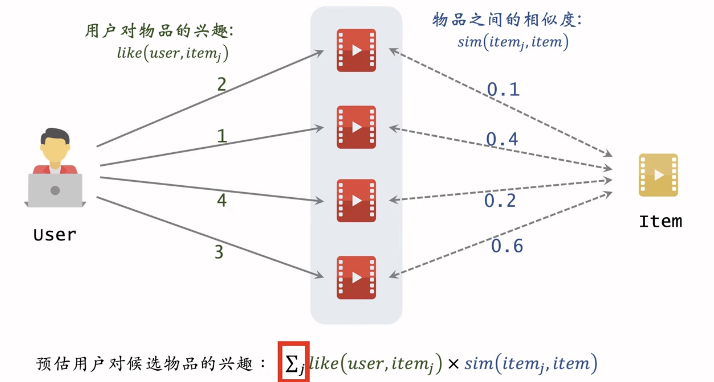

这节课介绍基于物品的协同过滤（Item Based Collaborative Filtering，缩写 ItemCF）。

ItemCF 的原理：如果用户喜欢物品 1，而且物品 1 与物品 2 相似，那么用户很可能喜欢物品 2。

这节课的三个要点：

1. 如何计算两个物品之间的相似度。
2. 如何预估用户对候选物品的兴趣。
3. 如何利用索引在线上快速做召回。

---

这段内容是王树森关于**推荐系统召回通道：ItemCF（基于物品的协同过滤）**的详解。ItemCF 是工业界推荐系统中最经典、最有效且最常用的召回策略之一。

以下是逻辑清晰、一针见血的分析：

### 一、 核心逻辑与直觉

ItemCF 的推荐哲学很简单：**如果用户喜欢 A，而 A 和 B 很像，那么用户也大概率喜欢 B。**

- **区别点:** 这里的“像”不是指内容像（如都是武侠小说），而是指**受众像**（喜欢 A 的人群和喜欢 B 的人群高度重合）。这是一种基于群体智慧（Collaborative）的相似性。
- **计算公式:** 最终预测用户 $u$ 对候选物品 $I$ 的兴趣分数：
  $$
  Score(u, I) = \sum_{j \in \text{History}(u)} \text{Interest}(u, j) \times \text{Sim}(j, I)
  $$
  - $\text{Interest}(u, j)$: 用户 $u$ 对历史交互物品 $j$ 的喜好程度（点击=1, 点赞=2 等）。
  - $\text{Sim}(j, I)$: 物品 $j$ 和候选物品 $I$ 的相似度。

---

### 二、 关键技术细节：相似度计算 (Cosine Similarity)

`受众喜爱程度的向量的余弦相似度(用户重叠度)`

计算物品 $I_1$ 和 $I_2$ 的相似度是 ItemCF 的灵魂。

$$
\text{Sim}(I_1, I_2) = \frac{\sum_{v} \text{Score}(v, I_1) \times \text{Score}(v, I_2)}{\sqrt{\sum_{v} \text{Score}(v, I_1)^2} \times \sqrt{\sum_{v} \text{Score}(v, I_2)^2}}
$$

- **通俗理解:**
  - **分子:** 交集大小。同时喜欢两个物品的人越多，分子越大。
  - **分母:** 归一化。惩罚热门物品。如果 $I_1$ 是大热门（谁都看过），它的向量模长很大，做分母会降低相似度，避免它跟所有物品都强行相似（哈利波特效应）。
- **数学本质:** 物品向量的**余弦相似度**。将物品看作维度为 User 数量的向量，向量夹角越小，相似度约高。

---

### 三、 工业界落地：双索引机制 (Two Indexes)

为了在只有毫秒级延迟要求的线上环境中处理几亿个物品，必须使用**空间换时间**的策略，建立离线索引。

1.  **用户 -> 物品索引 (User-Item Index):**

    - **Key:** User ID
    - **Value:** `[(ItemID_1, Score_1), (ItemID_2, Score_2), ..., (ItemID_N, Score_N)]`
    - _作用:_ 快速获取用户最近感兴趣的 $N$ 个物品（Last-N）。通常 $N \approx 200$。

2.  **物品 -> 物品索引 (Item-Item Index):**
    - **Key:** Item ID
    - **Value:** `[(SimItem_1, SimScore_1), ..., (SimItem_K, SimScore_K)]`
    - _作用:_ 快速获取某个物品最相似的 $K$ 个物品（Top-K）。通常 $K \approx 10$。
    - _注意:_ 这个相似度矩阵计算量巨大（$M \times M$），通常需要 Spark 等大数据框架离线定期计算。

---

### 四、 线上召回流程 (Online Serving)

当用户刷新 Feed 流时，实时召回步骤如下：

1.  **查索引 1:** 获取用户最近交互过的 $N$ 个物品。
2.  **查索引 2:** 对这 $N$ 个物品中的每一个，查出其相似的 $K$ 个物品。
3.  **汇总与打分:**
    - 此时一共拿到了 $N \times K$ 个候选物品（约 2000 个）。
    - 遍历这些候选物品，如果有重复（即多个历史物品都推荐了同一个候选），则分数累加（证明推荐理由更充分）。
    - 利用公式计算总分。
4.  **排序截断:** 按照计算出的总分排序，取 Top 100 作为 ItemCF 通道的最终输出。

### 五、 优缺点简析

- **优点:**
  - **可解释性强:** “因为你点赞过 A，所以推荐 B”，用户容易接受。
  - **即时性:** 用户只要产生新行为（索引 1 更新），就能立刻推荐相关物品。
  - **适用性:** 特别适合兴趣点比较稳定、由兴趣主导的场景（如电商、视频、笔记）。
- **挑战:**
  - **冷启动:** 新物品如果没有用户交互，就没有向量，无法计算相似度，永远不会被推荐出来（Item Cold Start）。
  - **头部效应:** 热门物品更容易与其他物品产生“伪相似”，需要通过归一化和惩罚机制处理。

### 总结

ItemCF 是推荐系统的基石。它不依赖深度学习，完全利用用户行为共现（Co-occurrence）来挖掘关联。在面试或实际工作中，**双索引的设计**和**相似度计算公式的细节**是考察重点。
