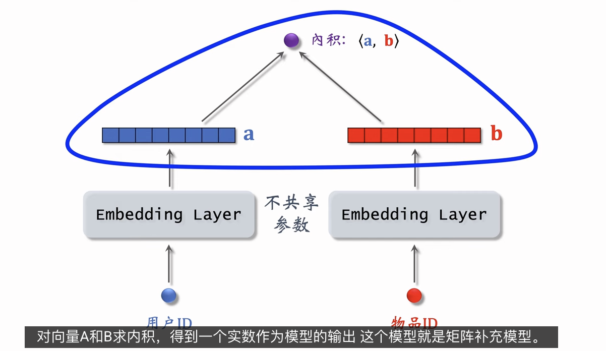
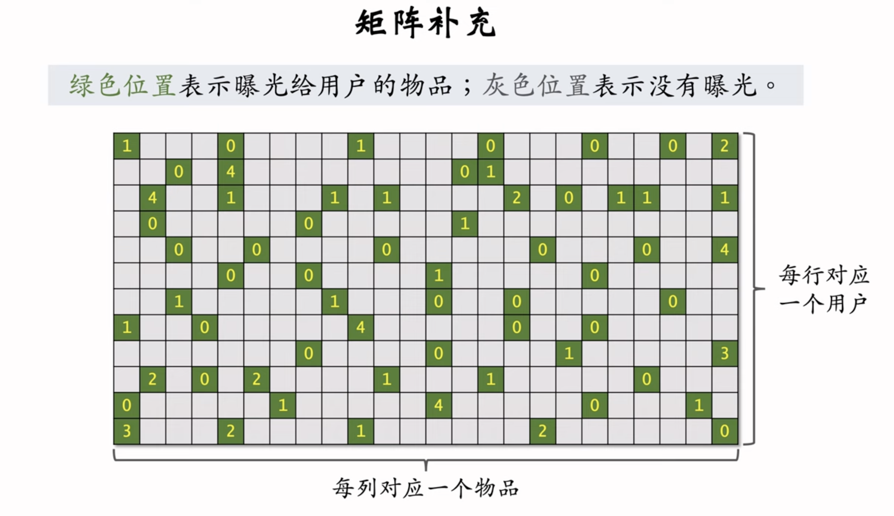
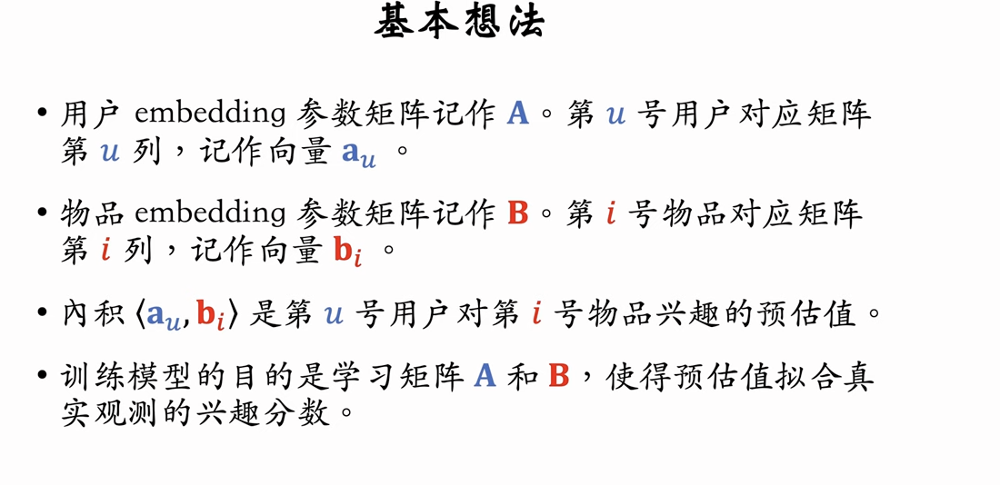
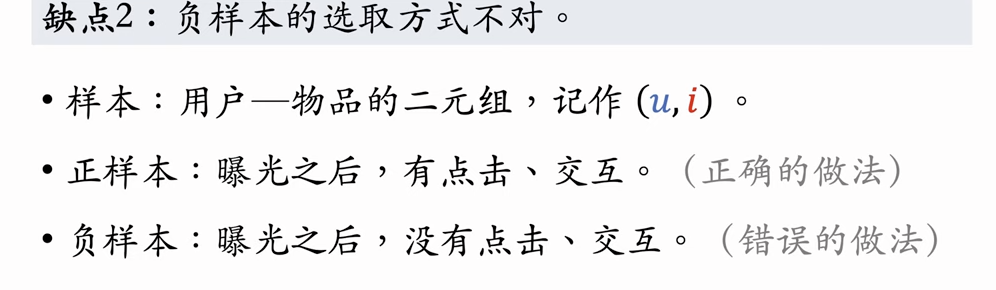
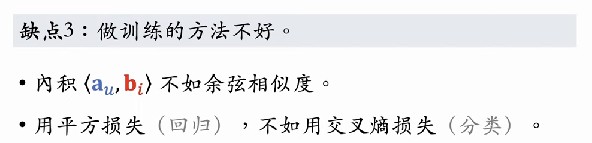
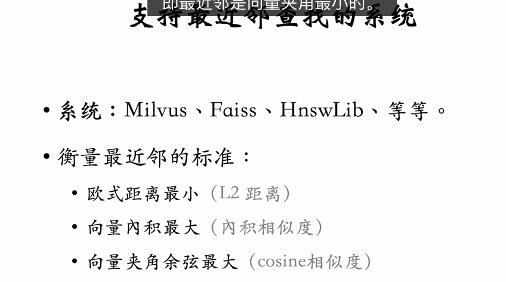
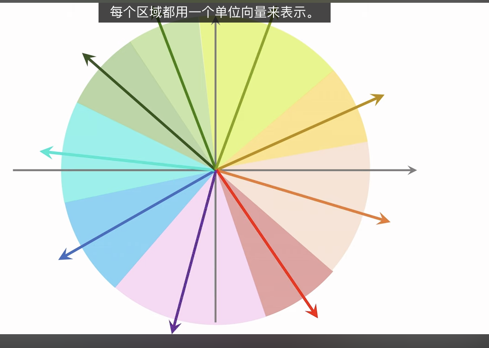
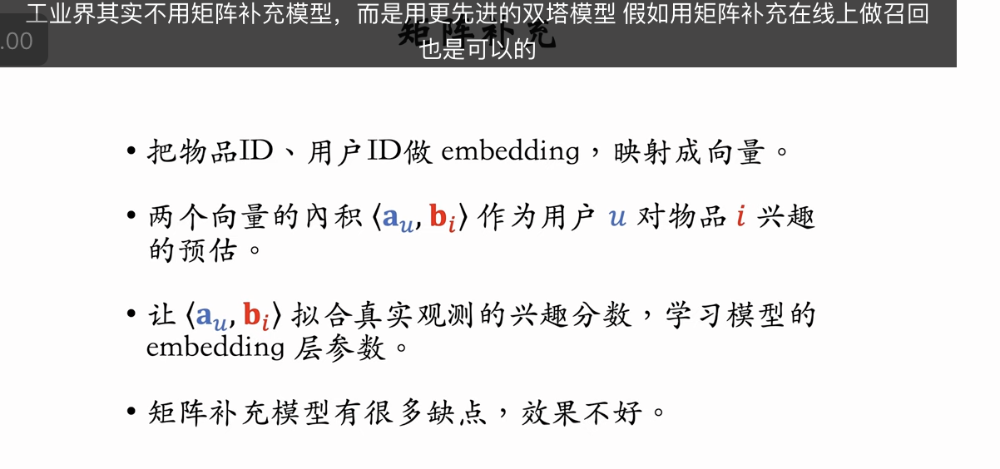

这节课介绍矩阵补充（matrix completion），它是一种向量召回通道。矩阵补充的本质是对用户 ID 和物品 ID 做 embedding，并用两个 embedding 向量的內积预估用户对物品的兴趣。值得注意的是，矩阵补充存在诸多缺点，在实践中效果远不及双塔模型。

做向量召回需要做最近邻查找（nearest neighbor search）。这节课的最后介绍加速最近邻查找的近似算法以及工业界的实践。
这节课介绍矩阵补充（matrix completion），它是一种向量召回通道。矩阵补充的本质是对用户 ID 和物品 ID 做 embedding，并用两个 embedding 向量的內积预估用户对物品的兴趣。值得注意的是，矩阵补充存在诸多缺点，在实践中效果远不及双塔模型。

做向量召回需要做最近邻查找（nearest neighbor search）。这节课的最后介绍加速最近邻查找的近似算法以及工业界的实践。

---

收到，这是王树森关于**矩阵补充（Matrix Factorization）与向量召回（Vector Recall）基础**的课程。这节课是理解现代深度学习召回模型（如双塔模型）的基石。

以下是逻辑清晰、一针见血的分析：

### 一、 核心概念：什么是向量召回？

向量召回的本质是将推荐问题转化为**向量空间中的几何问题**。

1.  **Embedding:** 把每个用户和每个物品都映射到一个向量空间（Vector Space）中。
2.  **相似度:** 计算用户向量和物品向量的距离（内积或余弦相似度）。
3.  **召回:** 找到离用户向量最近的 K 个物品向量。

---

### 二、 矩阵补充模型 (Matrix Optimization / MF)

这是一个经典的学术界模型，它的核心思想是**用两个低秩矩阵的乘积去还原用户-物品交互矩阵**。

#### 1. 模型结构

- **输入:** 用户 ID (One-hot)、物品 ID (One-hot)。
- **处理:** 两个独立的 Embedding 层（不共享参数）。
  - 用户 Embedding 矩阵 $A$: 每列代表一个用户向量 $a_u$。
  - 物品 Embedding 矩阵 $B$: 每列代表一个物品向量 $b_i$。
- **输出:** 预估分数 $\hat{y}_{ui} = \langle a_u, b_i \rangle$ (向量内积)。

#### 2. 训练目标

- **目标:** 让预估分数 $\hat{y}_{ui}$ 尽可能逼近真实观测分数 $y_{ui}$（曝光且交互过的数据）。
- **Loss 函数:** 平方损失 (Square Loss)。
  $$
  \min_{A, B} \sum_{(u, i) \in \Omega} (y_{ui} - \langle a_u, b_i \rangle)^2
  $$
- **为何叫“矩阵补充”:** 用户-物品矩阵极其稀疏（绝大多数是灰色未知区域）。一旦训练好 Embedding，就可以算出任意位置的预估分，相当于把未知的格子**填满了**。

#### 3. 致命缺陷 (为何工业界不用单纯的 MF?)

王树森一针见血地指出了矩阵补充在工业落地时的三个死穴：

1.  **信息利用率低:** 仅用了 ID 信息，丢弃了用户属性（年龄、性别）和物品属性（类目、关键词）。这简直是暴殄天物。
2.  **负样本采样错误:** 简单地把“曝光未点击”当作负样本在某些场景下是不够的（后面课程会细讲 Sample Selection Bias）。
    
3.  **训练目标太弱:** 用内积做回归（拟合分数）不如用余弦做分类（预测点击概率 Cross Entropy）效果好。
    

---

### 三、 线上服务关键技术：近似最近邻查找 (ANN)

训练完模型得到几亿个向量后，线上如何毫秒级召回？这是一个工程难题。

#### 1. 暴力枚举 (Brute Force)

- **逻辑:** 拿用户向量 $a_u$ 跟几亿个 $b_i$ 逐个算内积，排序取 TopK。
- **结果:** **算死机器**。时间复杂度 $O(N)$，对于亿级物品库完全不可接受。

#### 2. 近似最近邻 (ANN - Approximate Nearest Neighbor)

归一化后，内积 = 余弦相似度

- **逻辑:** 牺牲一点点精度，换取极大的速度提升。
- **核心思想:** **空间划分 (Partitioning)**。
  - 把向量空间切成几万个小格子（Cluster/Voronoi cells）。
    
  - 每个格子用一个中心向量代表。
  - 建立倒排索引：`格子中心向量 -> 格子内所有物品列表`。
- **检索流程:**
  1.  **粗筛:** 计算用户向量与几万个格子中心的距离，找到最近的几个格子。
  2.  **精筛:** 只计算这几个格子内部的那几万个物品与用户的距离。
- **收益:** 将计算量从“几亿次”降低到“几万次”，速度提升万倍以上。
- **工具:** 工业界标配向量数据库/库：**Faiss (Facebook)**, **Milvus**, **HNSWLib**。

### 总结

这节课虽然讲的是过时的 MF 模型，但引出了现代推荐系统的两个永恒主题：

1.  **双塔结构的前身:** MF 其实就是最简陋的双塔（左塔只有 UserID，右塔只有 ItemID）。下节课的双塔模型就是给左右塔加上了丰富的特征。
2.  **向量检索工程化:** 无论模型多复杂，最终都要落地为向量检索。理解 ANN（近似最近邻）是做向量召回的必修课。

---

- 负样本采样错误
  这个问题揭示了推荐系统中一个非常隐蔽但致命的陷阱。

  简单把“没点”当作“不喜欢”，在推荐系统中是非常天真且危险的。为了让你彻底理解，我用三个生活化的例子来拆解这个问题：

  ### 1. 为什么“曝光未点击”不等于“不喜欢”？

  在矩阵补充（MF）的训练语料中：

  - **正样本** = 用户点了（明确喜欢）。
  - **负样本** = 曝光给用户了，但他没点。

  这种定义有一个巨大漏洞：**用户没点，原因可能有很多，不仅仅是不喜欢。**

  #### 场景一：时机不对（Context Bias）

  - **现象：** 你给一个正在上班开会的用户推了一个长达 20 分钟的搞笑视频。他没点。
  - **模型的错误理解：** “他不喜欢这个视频，也不喜欢搞笑类。”
  - **真实情况：** 他其实很喜欢，只是现在**没空看**。
  - **后果：** 模型如果不考虑上下文，就会错误地惩罚这个好视频。

  #### 场景二：展示未被注意（Observational Bias）

  - **现象：** 一个很好的商品出现在推荐流的第 5 个位置，但用户快速滑屏，只看了前 2 个就关掉 App 了。第 5 个虽然算是“曝光”了，但用户眼睛根本没扫到。
  - **模型的错误理解：** “曝光了竟然没点，一定是由于他讨厌这个商品。”
  - **真实情况：** 他**根本没看见**。
  - **后果：** 这个商品被冤枉了，属于“无效曝光”。如果把它当负样本训练，就是给模型喂脏数据。

  ***

  ### 2. 什么是样本选择偏差 (Sample Selection Bias)？

  这是更深层次的问题。**我们拿去训练模型的数据，本身就是“幸存者”。**

  - **问题根源：**
    只有那些**已经被之前的模型判定为“比较好”**的物品，才有机会曝光给用户。用户只能对自己**看得到**的东西产生交互（点或不点）。
    这就好比：你在一个高档餐厅吃饭，你评价“不好吃”的菜，其实已经是大厨精选过的了。真正“巨难吃”的菜连菜单都没上。

  - **MF 模型的尴尬：**
    如果你的负样本只来自“曝光未点击”，那么模型实际上只学会在“高分段”物品里挑挑拣拣。对于那些**从未曝光过**的冷门物品，模型根本不知道用户是喜欢还是不喜欢，因为它从来没在这上面训练过。

  ### 3. 如何修正？（工业界做法预览）

  既然简单地把“曝光未点击”当负样本不够，那该怎么办？后面的课程通常会讲到以下策略：

  1.  **全局随机采样 (Global Negative Sampling)：**

      - 不仅用曝光未点击的，还要从所有物品库里**随机抽**一些物品强行当作负样本。
      - **这种负样本代表：** “大概率不相关的物品”或者“因从未曝光而未知的物品”。这能防止模型只在“舒适区”（曝光过的数据）里打转。

  2.  **Hard Negative Mining (挖掘极难负样本)：**
      - 专门去找那些模型**容易误判**的样本。比如用户喜欢“耐克”，模型推了“阿迪达斯”（被点了）和“李宁”（没被点）。“李宁”这种跟正样本很像但没被点的，才是最有价值的“陪练”，能教会模型分辨细微差别。

  ### 总结

  王树森这句话的意思是：
  **“没点击”是一个充满噪声的信号**。如果我们盲目信任这个信号，可能会把好的东西误杀了（冤假错案），或者让模型产生的视野极其狭窄（井底之蛙）。所以，构建负样本是一门需要精细设计的艺术。

- 训练目标太弱：
  这句话不仅指出了矩阵补充（Matrix Factorization, MF）的弱点，也道出了现代推荐系统模型进化的核心方向。

  为了让你简洁易懂地理解，我们可以从**“算分方式”**和**“考试目标”**两个角度来看：

  ### 1. 算分方式：内积 (Dot Product) vs. 余弦 (Cosine)

  - **内积 (MF 的做法) —— 容易被“长度”欺骗**

    - **公式：** $A \cdot B = |A| \times |B| \times \cos(\theta)$
    - **问题：** 内积的结果不仅取决于**方向**（兴趣是否匹配），还取决于**长度**（向量模长）。
    - **直观理解：** 如果一个物品是“超级热门款”，模型为了让它得分高，可能会把它的向量训练得**特别长**。这样一来，它跟大家的内积都很大。
    - **后果：** 推荐变成了“拼谁更热门”，而不是“拼谁更适合你”。

  - **余弦 (双塔/现代做法) —— 只看“方向”**
    - **公式：** $\cos(\theta) = \frac{A \cdot B}{|A| \times |B|}$
    - **优势：** 余弦相似度把向量都做了归一化（除以长度），消除了长短的影响。
    - **后果：** 纯粹比拼向量的**方向是否一致**（即特征是否匹配），这才是真正的“兴趣匹配”。

  ### 2. 考试目标：回归 (Regression) vs. 分类 (Classification)

  - **回归 (MF 的做法) —— 强行拟合数值**

    - **目标：** 预测 $y_{ui}$ 的具体数值（比如评分 4.5 分，或者仅仅是 0 和 1）。
    - **Loss (平方损失)：** $(y - \hat{y})^2$。
    - **问题：** 在大多数推荐场景（新闻、短视频），只有“点击”和“没点击”。强行用线性方式去拟合 0 和 1，对模型的表达能力限制很大，且容易受噪声干扰。

  - **分类 (现代做法) —— 预测概率**
    - **目标：** 预测“点击的概率是多少”（Probability）。
    - **Loss (交叉熵/Cross Entropy)：** 这是专门用来处理“是/否”分类问题的。
    - **优势：** 配合 Sigmoid 或 Softmax 函数，能更平滑、更准确地拉开正样本（喜欢的）和负样本（不喜欢的）之间的距离。

  ### 总结

  王树森这句话的意思是：
  **矩阵补充模型太简陋了**。它还在因陋就简地用**内积**算绝对数值，容易被热门物品带偏；而现代模型已经进化到用**余弦**看匹配度，并用**分类任务**精准预测点击概率。
