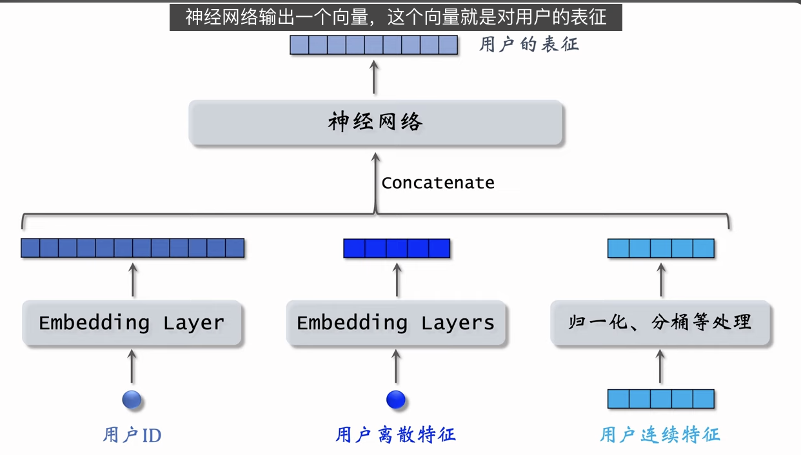
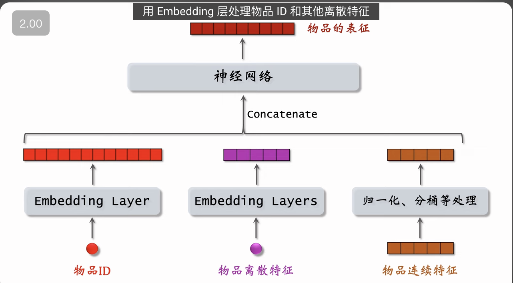
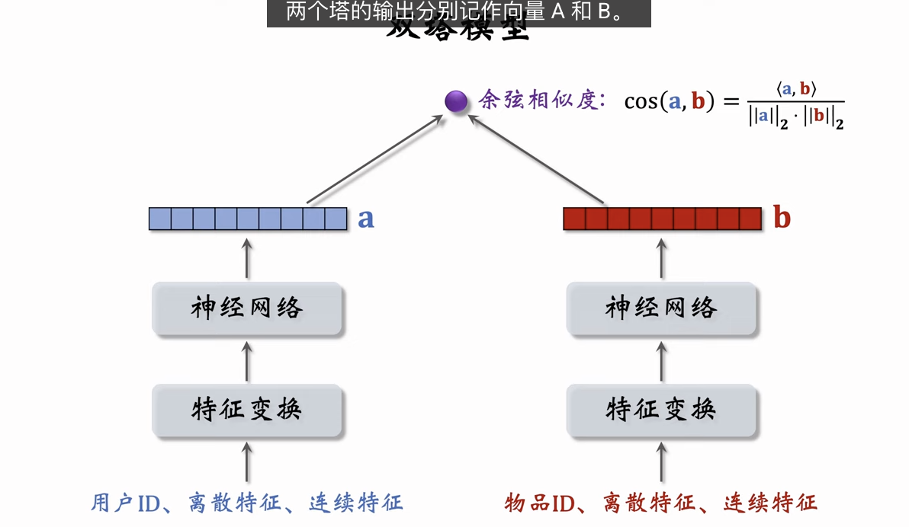
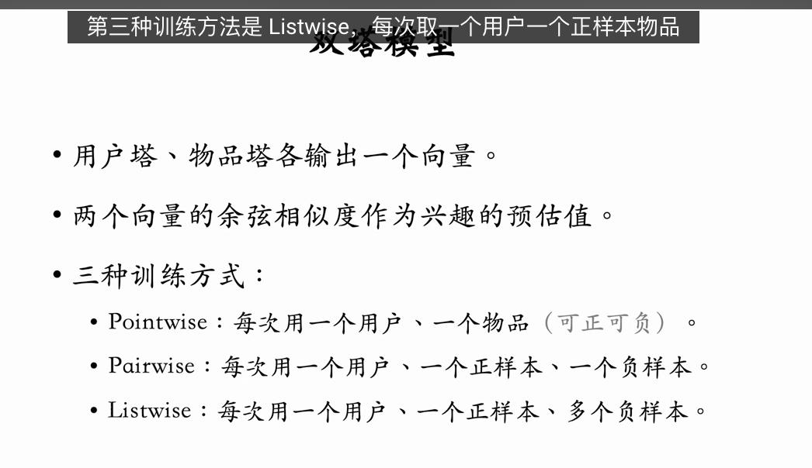
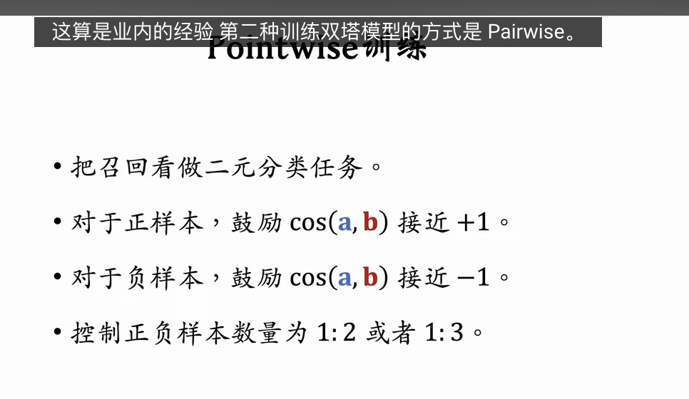
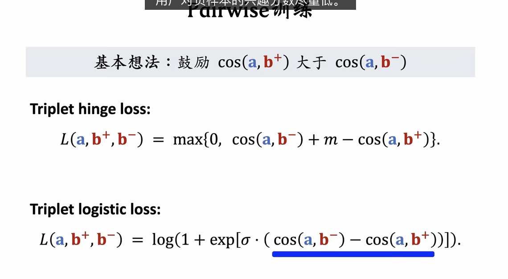
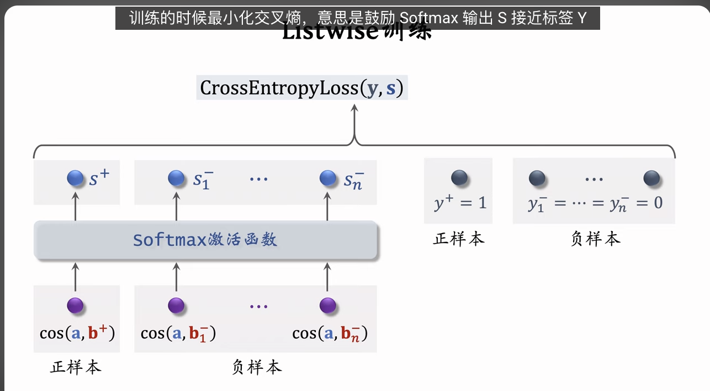
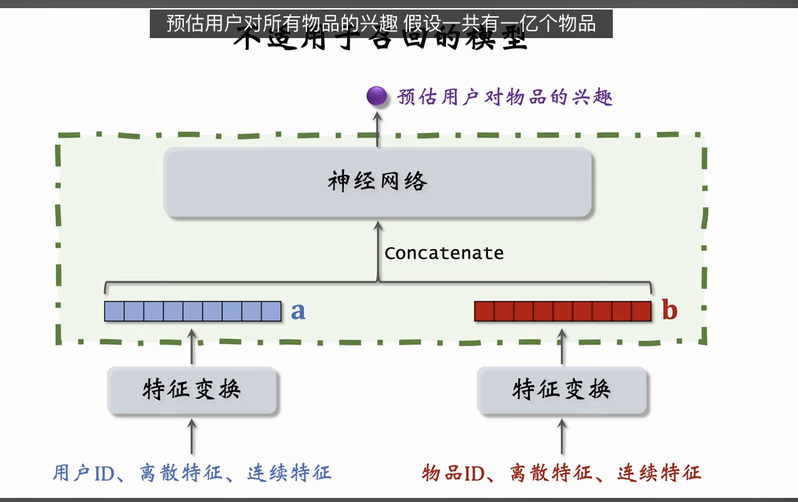

双塔模型（two-tower）也叫 DSSM，是推荐系统中最重要的召回通道，没有之一。这节课的内容是双塔模型的结构、训练方式。

双塔模型有两个塔：用户塔、物品塔。两个塔各输出一个向量，作为用户、物品的表征。两个向量的內积或余弦相似度作为对兴趣的预估。

有三种训练双塔模型的方式：pointwise、pairwise、listwise。

---

这是王树森关于**双塔模型（Two-Tower Model / DSSM）**的核心架构与训练方法的深度解析。这也是工业界推荐系统中最主流、最不可或缺的召回模型。

以下是逻辑清晰、一针见血的分析：

### 一、 核心进化：从矩阵补充到双塔模型

双塔模型本质上是矩阵补充（Matrix Factorization）的**“完全体升级版”**。

1.  **矩阵补充的局限（Weakness）：**
    - 仅利用 User ID 和 Item ID。
    - 浪费了海量的侧面信息（Side Information），如用户年龄、城市、物品类目、关键词等。
2.  **双塔模型的进化（Upgrade）：**
    - **核心逻辑不变：** 依然是把用户和物品分别映射为两个向量，通过向量相似度来预估兴趣。
    - **输入大幅增强：** 不再只看 ID，而是将“ID + 离散特征 + 连续特征”打包输入神经网络。
    - **泛化能力变强：** 即使是新用户（Cold Start），只要有画像特征（如性别、城市），模型就能生成向量进行推荐，不像 MF 对新 ID 束手无策。

---

### 二、 模型架构：Late Fusion（后期融合）

双塔模型的架构设计是为了配合**向量检索技术（ANN）**而存在的。

#### 1. 输入处理 (Feature Engineering)

- **ID/离散特征:** 通过 Embedding 层映射为稠密向量（如用户 ID Embedding、城市 Embedding）。
- **连续特征:** 进行归一化（Normalize）、取对数（Log）或分桶（Bucket），处理成数值特征。
- **拼接 (Concat):** 将上述处理好的一堆向量拼接成一个长向量。

#### 2. 双塔结构 (The Two Towers)

- **用户塔 (User Tower):** 输入用户特征 $\to$ MLP (全连接层) $\to$ 输出向量 $A$。
- **物品塔 (Item Tower):** 输入物品特征 $\to$ MLP $\to$ 输出向量 $B$。
- **独立性:** 两个塔在最后一层之前**互不干扰**，参数独立。

#### 3. 输出层 (Similarity)

- **余弦相似度 (Cosine Similarity):**
  $$
  Sim(A, B) = \cos(\theta) = \frac{A \cdot B}{||A|| \times ||B||}
  $$
  - _工业界习惯:_ 先对输出向量做 L2 Normalization（归一化），然后直接算内积。
  - _范围:_ $[-1, 1]$。1 代表极其匹配，-1 代表完全不匹配。

---

### 三、 训练方法：从简单到进阶

王树森详细介绍了三种训练范式（Loss Function 的设计），这是模型效果的关键。

#### 1. Pointwise (点对点训练)

- **逻辑:** 把召回看作**二分类问题** (Binary Classification)。
- **样本:** 一条数据就是一个 `(User, Item, Label)`。
  - 正样本（点击） Label = 1。
  - 负样本（没点） Label = 0 或 -1。
- **缺点:** 割裂了排序关系。模型只学“是否喜欢”，没学“更喜欢哪个”。

#### 2. Pairwise (成对训练) —— _Facebook 风格_

- **逻辑:** 学习**相对顺序**。
- **样本:** 三元组 `(User, Item+, Item-)`。
- **Loss:** **Triplet Loss** (Hinge Loss 或 Logistic Loss)。
  - _目标:_ 让 $Cos(U, I^+) > Cos(U, I^-) + margin$。
  - 即：正样本的相似度要比负样本高出一大截。
- **优势:** 比 Pointwise 更符合推荐排序的本质。

#### 3. Listwise (列表训练) —— _YouTube 风格_

- **逻辑:** 学习**在一堆候选中的最优解** (Multi-class Classification)。
- **样本:** 一个 User，一个正样本 $I^+$，以及 $N$ 个负样本 $I^-_1...I^-_N$。
- **方法:** **Softmax 交叉熵**。
  - 将 N+1 个分数放入 Softmax，正样本位置的 Label 为 1，其余为 0。
  - 最大化正样本的概率，同时最小化所有负样本的概率。
- **地位:** 目前工业界召回模型最主流、效果最好的训练方式。

---

### 四、 致命误区：前期融合 vs 后期融合

王树森特别强调了一种**绝对不能用于召回**的模型结构：**前期融合（Early Fusion）**。

- **错误结构:** 把用户向量和物品向量**先拼接**，再输入一个大的神经网络，最后输出分数。
- **为什么不能做召回？**
  - **算力崩溃:** 召回需要在几亿个物品中找 TopK。如果用前期融合，必须把 User 和 1 亿个 Item 挨个拼起来跑一遍神经网络，耗时是天文数字。
  - **无法索引:** 前期融合导致物品向量不独立，无法离线存储为向量索引，也就无法使用 Faiss/Milvus 等工具加速。
- **正确结构:** **后期融合（双塔）**。
  - 物品向量 $B$ 可以离线算好存数据库。
  - 用户向量 $A$ 实时算一次。
  - 线上只需做简单的向量检索（计算量极小）。

---

### 五、 关于“不读学术论文”的解析

讲义中提到的“不要读学术界发表的推荐系统论文”，实际上是一种**“重工业、轻学术”**的务实建议：

- **学术界论文 (University):** 往往基于小数据集（如 MovieLens），关注数学技巧，不考虑工程落地、延迟和亿级数据规模。很多算法（如复杂的 GNN 或矩阵分解变体）在工业界根本跑不起来。
- **工业界论文 (Industry):** 王树森推荐阅读 **Facebook (Meta)** 和 **YouTube (Google)** 的论文。这些论文解决了真实的负样本选择、Listwise 训练稳定性、海量特征处理等工程痛点，是“实战圣经”。

### 总结

双塔模型是推荐系统的基建。

1.  **架构:** 必须是**双塔独立**，最后一步才算内积（Late Fusion）。
2.  **特征:** 尽可能多地喂入用户和物品的画像特征。
3.  **训练:** 优先选择 **Listwise (Softmax)** 或 Pairwise (Triplet)，抛弃简单的 Pointwise。
4.  **方向:** 多读 Google/Meta 的论文，少看脱离实际的纯理论。

---

- 不要读学术界发表的推荐系统论文
