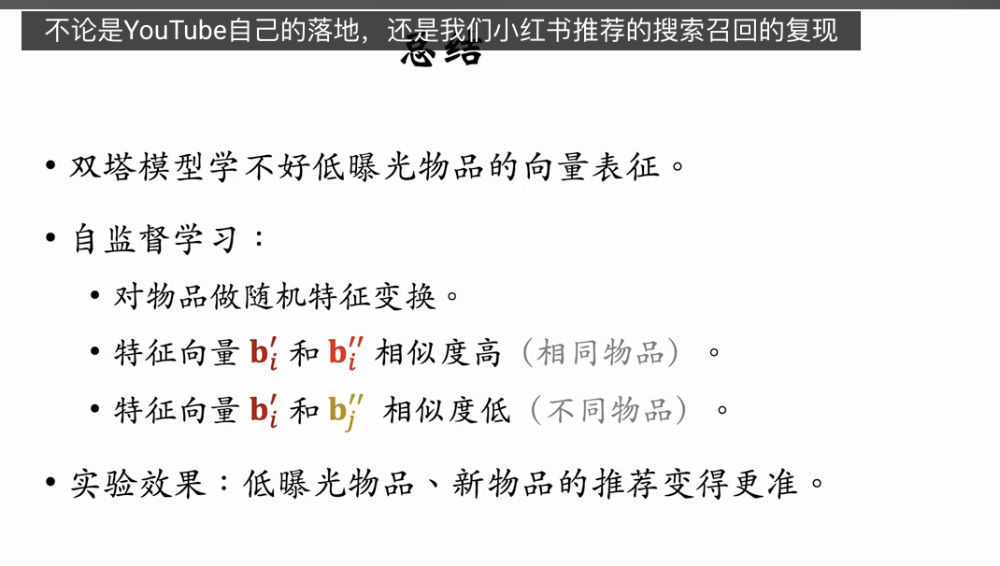
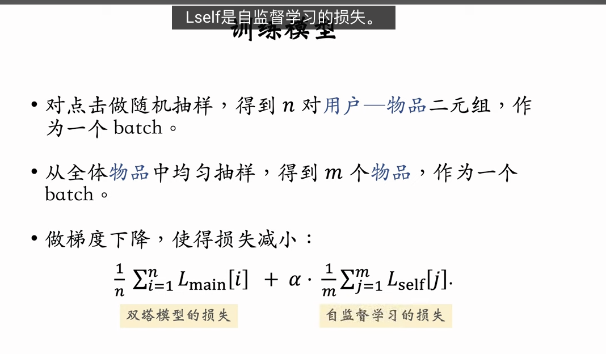

前几节课详细讲解了双塔模型。这节课介绍一种改进双塔模型的方法，叫做自监督学习（self-supervised learning），用在双塔模型上可以提升业务指标。这种方法由谷歌在 2021 年提出，工业界（包括小红书）普遍验证有效。

---

这份课程内容非常前沿且具有极高的实战价值。它解决了一个推荐系统中的顽疾：**长尾（Long-tail）与冷启动问题**。

> “长尾” (The Long Tail) 主要指一种经济和商业现象，即大量小众、冷门但种类繁多的产品或服务，其累积的总需求和总收益可以与少数热门主流产品相当，甚至超越它们

传统的双塔模型严重依赖“点击数据”，导致强者愈强（热门物品学得好）、弱者愈弱（冷门物品学废了）。**Google 提出的这套自监督学习（SSL, Self-Supervised Learning）方案，本质上是在不增加人工标注数据的前提下，强行让模型“看懂”冷门物品。**

以下是对这节课内容的深度逻辑分析与拆解：

### 1. 核心痛点：点击数据的“贫富差距”

- **现象**：二八法则（甚至一九法则）。极少数热门物品占据绝大多数点击，海量长尾物品几乎没有点击。
- **后果**：双塔模型学到的 embedding 是由损失函数（Loss）反向传播更新的。
  - 热门物品 Loss 多，更新频繁，向量位置准。
  - 冷门物品 Loss 少（甚至没有），向量位置是随机初始化的状态，没有任何语义信息。
- **SSL 的切入点**：既然点击数据（Label）不够，那就不要 Label，通过**变换特征**自己造监督信号。

### 2. 自监督学习（SSL）的核心逻辑

SSL 的核心思想是 **对比学习（Contrastive Learning）**。

- **正样本构造（Augmentation）**：同一个物品 $I$，经过两种不同的**随机特征变换**（View 1, View 2），输入物品塔，得到向量 $B'$ 和 $B''$。这俩虽然特征长得不一样，但本质是同一个东西，所以向量应当**相似**。
- **负样本构造**：同一个 Batch 内的其他物品 $J$，与当前物品 $I$ **互斥**。
- **目标**：拉近 $B'$ 和 $B''$ 的距离，推远 $B'$ 和 $B_J''$ 的距离。

### 3. 四种特征变换（Data Augmentation）策略

这是 SSL 能否生效的关键。必须破坏一部分信息，逼迫模型通过剩余信息还原物品本质。

| 变换策略          | 操作细节                                                                          | 适用场景/原理                                                                                                          |
| :---------------- | :-------------------------------------------------------------------------------- | :--------------------------------------------------------------------------------------------------------------------- |
| **Random Mask**   | 随机选特征（如类目），将其替换为 Default 值。                                     | 强迫模型不依赖单一特征，类似完形填空。                                                                                 |
| **Dropout**       | 针对多值离散特征（如多 Tag），随机丢弃部分值（如丢弃“摄影”，保留“美妆”）。        | 增加鲁棒性，让模型理解部分标签也能代表物品。                                                                           |
| **互补特征 Mask** | 将特征分为两组（组 A：ID+关键词 vs 组 B：类目+城市）。分别 Mask 掉另一组。        | **最硬核的策略**。逼迫模型学习特征间的等价性（例如看到“ID+关键词”推导出的向量，应该等同于看到“类目+城市”推导出的）。   |
| **关联特征 Mask** | 计算互信息（Mutual Information），将强关联的特征（如类目+受众性别）同时 Mask 掉。 | **理论效果最好但工程最重**。防止模型通过关联特征“作弊”（如即使遮住类目，靠性别也能猜出七八分），逼迫模型挖掘深层特征。 |

### 4. 训练架构：双任务并行（Multi-task Learning）

这是工程落地的关键架构设计，实际上是在同时做两件事：

- **主任务（Main Task）**：标准的双塔训练。

  - **数据源**：点击日志（User-Item 对）。
  - **采样**：有偏采样（热门物品多）。
  - **Loss**：$L_{main}$ (Listwise Loss)，包含 logQ 纠偏。
  - **更新范围**：同时更新用户塔和物品塔。

- **辅助任务（SSL Task）**：自监督学习。

  - **数据源**：**全体物品库**。
  - **采样**：**均匀采样**（Uniform Sampling）。这是这一招能救活冷门物品的关键！无论多冷门，做辅助任务时大家机会均等。
  - **Loss**：$L_{self}$ (Contrastive Loss, 本质也是 Cross Entropy)。
  - **更新范围**：**只更新物品塔**。

- **总 Loss**：
  $$L = L_{main} + \alpha \cdot L_{self}$$
  其中 $\alpha$ 是超参数，控制 SSL 的辅助强度。

### 5. 深度分析：为什么这能起效？

1.  **纠正特征空间的“塌缩”**：
    - 没有 SSL 时，冷门物品的向量可能混在一起或者挤在角落。
    - 有了 SSL，通过均匀采样和对比学习，强行把冷门物品的向量在空间推开（Spread Out），赋予它们有意义的分布。
2.  **特征鲁棒性**：
    - 线上环境往往存在特征缺失。通过 Mask 训练，模型习惯了“缺胳膊少腿”也能认出物品，`泛化能力极强。`
3.  **隐式数据增强**：
    - 虽然冷门物品没有用户点击，但它们有属性（类目、标题、Tag）。SSL 教会了模型：“只要属性相似，向量就该相似”。这样，当一个从未被点击的新物品上线时，只要它属性填得好，它的初始向量位置就是准确的，从而能被召回。

### 6. 总结与建议

- **方法论**：Google 的这种 SSL 方法是解决长尾物品推荐最“一针见血”的手段，比调整采样率、加权 Loss 更本质。
- **工程取舍**：
  - **首选**：Random Mask 和 Dropout。实现极其简单，收益非常高。
  - **次选**：互补特征（Complementary）。逻辑清晰，实现难度中等。
  - **慎选**：关联特征 Mask。需要维护复杂的互信息矩阵，维护成本高，除非边际收益极其重要。
- **落地**：它不需要额外的标注成本，只需要消耗更多的计算资源（多跑一个辅助任务）。对于追求指标增长（尤其是新物品分发、冷门类目渗透）的团队，这是必须尝试的技术。
