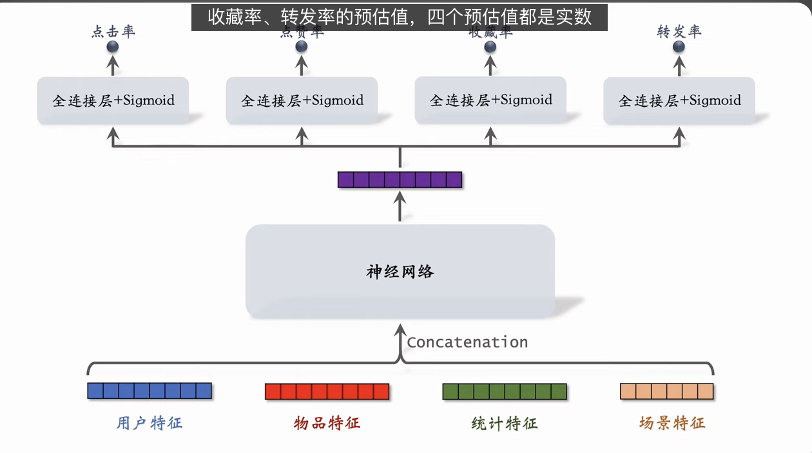

这节课的内容是推荐系统排序的多目标模型。这节课的内容分两部分。
第一部分是模型结构。模型把用户特征、物品特征、统计特征、场景特征作为输入，输出对多个指标的预估。
第二部分内容是降采样和校准。在实际的推荐系统中，正负样本的比例严重不平衡，负样本数量远多于正样本，因此需要对负样本做降采样。以点击率为例，对负样本做降采样会导致模型高估点击率，因此需要用公式做校准。

---

这个提示词覆盖了推荐系统排序阶段（Ranking）最基础且核心的多目标模型（Multi-Task Learning / Multi-Objective Ranking）。内容逻辑从业务链路、到特征工程、模型结构，再到训练中的样本均衡与分数校准，非常完整。

以下是对这节课内容的深度逻辑拆解和总结：

### 1. 推荐系统排序链路全景

- **召回 (Recall)**: 海选，从几亿缩小到几千。目的是**不漏**。
- **粗排 (Pre-Ranking)**: 初筛，从几千缩小到几百。模型简单，特征少，目的是**快**。
- **精排 (Fine Ranking)**: 精选，从几百打分后送入重排。模型复杂，特征全，目的是**准**。
- **重排 (Re-Ranking)**: 调控，做打散、多样性（DPP）、业务规则干预。

### 2. 多目标排序的核心逻辑

为什么不能只预测点击率（CTR）？

- **业务目标多元化**：平台不仅关心用户点没点（CTR），还关心用户喜不喜欢（点赞、收藏）、愿不愿意传播（转发）。
- **信号强弱不同**：
  - **点击**：弱信号，噪音大（可能是误触或标题党）。
  - **交互（赞/藏/转）**：强信号，代表真实满意度。
- **模型结构**：**Shared-Bottom Multi-Task Model**。

  

  - **输入**：User/Item/Context/Stats 特征 $\rightarrow$ Concatenation。
  - **共享层 (Shared Bottom)**：几层全连接网络（MLP），提取通用特征表示。
  - **任务塔 (Task Towers)**：分叉出 4 个小网络，分别预测 CTR、Like、Collect、Share。
  - **输出**：4 个 0~1 之间的概率值。

### 3. 训练关键点：样本不平衡与降采样

- **问题**：推荐场景下，负样本（曝光未点击）远多于正样本（点击/交互）。数据极度偏斜导致模型倾向于预测“全负”，且训练效率低。
- **解决方案**：**负样本降采样 (Negative Down-sampling)**。
  - 保留所有正样本。
  - 按比例 $\alpha$ (如 0.1) 随机抛弃负样本。
- **代价**：破坏了数据的真实分布，导致模型预测出的概率值 $P_{predict}$ **虚高**。

### 4. 预测值校准 (Calibration)

这是本节课最硬核的数学推导部分。因为做了负采样，模型输出的不是真实的 CTR，而是基于“采样后数据分布”的 CTR。

- **推导逻辑**：
  - 真实概率几率 (Odds): $\frac{P_{true}}{1 - P_{true}} \approx \frac{N_+}{N_-}$
  - 训练集概率几率: $\frac{P_{pred}}{1 - P_{pred}} \approx \frac{N_+}{\alpha \cdot N_-}$
- **校准公式**：
  $$ P*{true} = \frac{\alpha \cdot P*{predict}}{1 - P*{predict} + \alpha \cdot P*{predict}} $$
  - $\alpha$：采样率（如 0.1）。
  - $P_{predict}$：模型直接输出的分数。
  - **作用**：将虚高的预测值拉回到真实水平。虽然如果是纯排序（只看相对大小）可能不需要校准，但在涉及广告计费（oCPC）或多目标融合（加权求和）时，分数的绝对值准确性至关重要。

### 5. 最终融合 (Fusion)

$$ Score = w*1 \cdot P*{click} + w*2 \cdot P*{like} + w*3 \cdot P*{collect} + w*4 \cdot P*{share} $$

- 模型输出 4 个分数，通过校准后，加权融合成最终排序分。
- 权重 $w$ 通常通过 A/B 测试调整，反映业务当前的战略重点（如想拉升互动，就调高 $w_2, w_3, w_4$）。

这节课的内容构建了现代推荐系统排序模块的基石。在实际工业界，虽然模型结构会更复杂（如 MMoE, PLE），但底层的多目标思想、负采样与校准逻辑是通用的。

---

- id embedding 得到的向量其实就是对用户或物品特性的记忆
