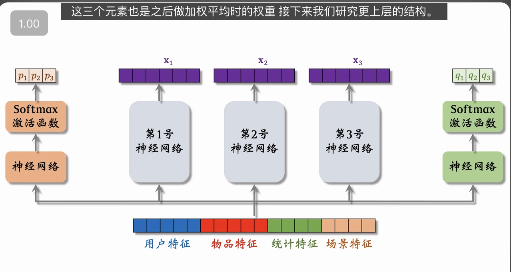
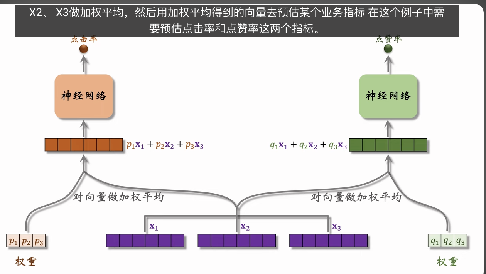
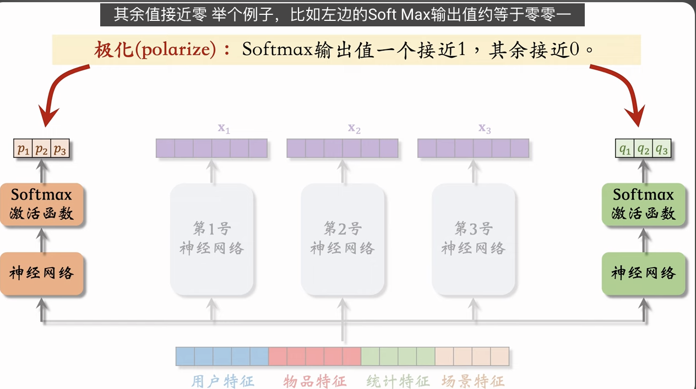

Multi-gate Mixture-of-Experts (MMoE) 是一种多目标排序模型。MMoE 用多个独立的塔提取特征，并对多塔提取的特征向量做加权平均，然后送入多头。MMoE 的训练容易出现极化现象（polarize），可以用 dropout 解决。

---

这节课介绍的是推荐系统多目标模型中一个里程碑式的结构——**MMoE (Multi-gate Mixture-of-Experts)**。

在它之前，最常见的是 Shared-Bottom（共享底层）结构（即上节课讲的那个），也就是底层共用一套参数提取特征，上层分叉出不同的塔。但 Shared-Bottom 有个著名的缺陷：**“跷跷板效应”**（Negative Transfer）。如果你要优化的两个目标相关性不强（比如“点击”和“转发”），`强制共享底层参数会导致模型左右互搏，一个指标涨了，另一个就跌了。`

MMoE 通过引入“专家网络”和“门控机制”完美解决了这个问题。

#### 1. MMoE 的核心结构拆解

- **Experts (专家网络)**

  - 底层不再是一套参数，而是分裂成 $N$ 个独立的神经网络（Expert 1, 2, ... N）。
  - 每个专家都在从原始特征中提取某种维度的信息（比如 Expert 1 擅长提取视觉特征，Expert 2 擅长提取语义特征）。

- **Gates (门控网络)**

  - 对于每一个上层任务（Task A: 点击率, Task B: 点赞率），都有一个专属的 **Gate**。
  - Gate 本质上是一个轻量级的神经网络 + Softmax。
  - **作用**：根据当前的输入特征，动态决定每个专家的**权重**。
  - _形象比喻_：Gate 就像一个指挥官。面对当前这个样本，点击率任务的指挥官说：“我觉得专家 1 和 3 说的对，听他们的”；点赞率任务的指挥官说：“我不信专家 1，我只信专家 2”。

- **Tower (任务塔)**
  - 输入：经过 Gate 加权融合后的专家输出向量。
  - 输出：最终的预测概率。

#### 2. MMoE 的优势

- **解耦**：不同的任务可以灵活选择使用不同的底层专家组合。
- **避免负迁移**：相关性低的任务，可以通过 Gate 自动选择互不干扰的专家，不像 Shared-Bottom 那样被强制绑在一起。

#### 3. 常见问题：Gate 极化 (Softmax Polarization)

- **现象**：Softmax 输出的权重变成了 One-hot 向量（如 `[0.01, 0.99, 0]`）。
- **后果**：Gate 失去了“融合”的能力，每个任务只死盯着某一个专家。这导致模型退化成了多个独立的单任务模型，而且其他没被选中的专家直接“饿死”（梯度为 0，没法更新）。
- **解决方案**：**Dropout**。
  - 在 Gate 输出的 Softmax 结果上加 Dropout。
  - _原理_：强制模型不能只依赖某一个专家。如果模型只依赖专家 2，一旦专家 2 被 Dropout 随机扔掉了，预测就废了。为了在 Dropout 存在的情况下还能预测准，模型被迫去学习利用**多个专家**的信息，从而避免极化。

#### 4. 工业界现状与避坑

- **是银弹吗？** 不是。正如王树森老师所说，MMoE 不一定比简单的 Shared-Bottom 效果好。
- **适用场景**：通常在**任务相关性较低**（如点击 vs 甚至负相关的时长/转化）时效果显著。如果任务高度正相关（如点击 vs 收藏），Shared-Bottom 可能反而更稳。
- **后续演进**：Google 后来又提出了 PLE (Progressive Layered Extraction)，也就是腾讯 PCG 等团队常用的模型，进一步解决了 MMoE 中专家分工不明确的问题。

**一句话总结**：MMoE 是通过“三个臭皮匠（Experts）”和“因地制宜的指挥官（Gates）”来解决多目标冲突的神兵利器，但要注意防范指挥官变得“偏听偏信（极化）”。
