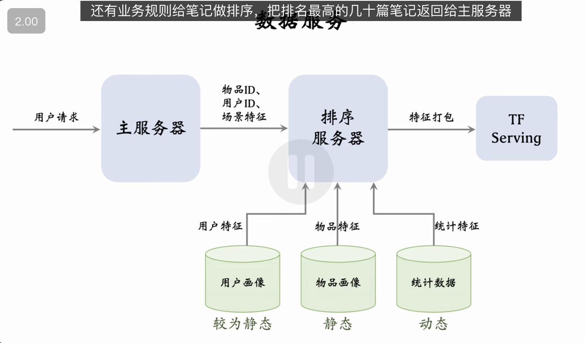

推荐系统中的排序模型需要用户画像、物品画像、统计特征、场景特征。这节课详细讲解这几类特征，以及系统的工程架构。

---

这节课详细讲解了推荐系统排序阶段（Ranking Phase）最核心的燃料——**特征工程（Feature Engineering）**。特征的质量直接决定了模型的天花板，模型结构（如 RNN, Transformer）只是在逼近这个天花板。

以下是这节课的深度逻辑拆解与总结：

### 1. 特征体系全景图

排序模型通常需要四类核心特征：

#### A. 用户特征 (User Profile)

- **基础属性**：ID Embedding（隐式兴趣）、性别、年龄（区分兴趣群）、注册时间/活跃度（新老用户分层）。
- **兴趣标签**：感兴趣的类目（Category）、关键词、品牌。可以是用户填写的（显式）或算法根据历史行为提取的（隐式）。

#### B. 物品特征 (Item Profile)

- **基础属性**：ID Embedding、发布时间（Time decay, 很多内容有时效性）、GeoHash（LBS 相关）。
- **内容属性**：标题/正文的 Embedding、字数、图片数、视频清晰度。
- **质量评分**：CV/NLP 模型预先打好的分（如美学分、信息量分、色情/低俗概率）。

#### C. 统计特征 (Statistical Features) —— _这是提分最快、最重要的特征_

- **时间窗口（Time Window）**：统计过去 1h / 1d / 7d / 30d 的数据。
  - _逻辑_：短窗口反映实时兴趣（刚才一直在看美妆），长窗口反映中长期偏好（是个数码爱好者）。
- **分桶统计（Bucket Statistics）**：
  - **User Side**：用户对“图文” vs “视频”的点击率；用户对“美妆” vs “美食”的点击率。
  - **Item Side**：笔记在“男性” vs “女性”中的点击率；笔记在“18-24 岁”人群中的点击率。
  - **Author Side**：作者维度的曝光、点击、互动数据（反映作者号召力）。
- **核心指标**：曝光数（Impressions）、点击率（CTR）、交互率（CVR, Like/Collect/Share rate）。

#### D. 场景特征 (Context Features)

- **时空信息**：当前时刻（早晚兴趣不同）、当前地点（LBS 推荐）、周末/节假日（休闲娱乐需求增加）。
- **设备信息**：手机品牌、操作系统（反映消费能力、人群画像）。
  - _数据源_：直接从请求（Request）中获取，无需查库。

---

### 2. 特征处理 (Feature Processing)

原始特征不能直接喂给模型，需要标准化处理：

- **离散特征 (Categorical Features)**：
  - **处理**：Embedding。
  - **挑战**：ID 类特征（User ID, Item ID）维度极高（亿级），需要巨大的 Embedding Table，显存/内存消耗大。类目/城市等维度低，处理简单。
- **连续特征 (Continuous Features)**：
  - **分桶 (Bucket/Binning)**：如年龄 23 -> "18-25"区间 -> Embedding。
  - **Log 变换**：针对长尾分布（如曝光数，大部分很小，极少部分超大），做 $\log(x+1)$ 压缩数值范围，防止梯度爆炸。
  - **平滑 (Smoothing)**：针对 CTR/CVR，防止小样本波动（如曝光 1 次点击 1 次，CTR=100%是不合理的）。常用 Wilson Interval 或贝叶斯平滑。

---

### 3. 工程视角：数据源与服务架构

这是一个非常实战的视角，解释了线上服务（Online Serving）是怎么跑起来的。

- **三大数据源**：

  1.  **用户画像 (User Profile)**：KV Store (Redis/HBase)。读压力小（1 次请求读 1 个 User），数据更新慢（静态）。
  2.  **物品画像 (Item Profile)**：KV Store。**读压力极大**（1 次请求读几千个 Item），数据更新极慢（静态）。
      - _优化_：尽量精简 Item 特征，避免网络带宽打爆；可做本地缓存。
  3.  **统计数据 (Stats)**：**读压力大，时效性要求极高**。
      - _难点_：必须实时更新（用户刚点的行为马上要反映在 CTR 里），不能做长时间缓存。

- **线上流程**：
  Request $\rightarrow$ **Recall Server** (拿 Item IDs) $\rightarrow$ **Ranking Server** (并发查 User/Item/Stats 库组装特征) $\rightarrow$ **TF Serving** (模型推理) $\rightarrow$ Ranking & Refinement $\rightarrow$ Response.

---

### 4. 关键点总结

| 特征类别     | 核心作用                    | 存储/服务特点          |
| :----------- | :-------------------------- | :--------------------- |
| **ID 特征**  | 个性化基石 (CF 效应)        | 维度巨大，模型参数大头 |
| **统计特征** | **强信号** (反映热度与偏好) | 需实时计算，工程挑战大 |
| **画像特征** | 泛化能力 (冷启动友好)       | 静态，可缓存           |
| **场景特征** | 捕捉当下意图                | 随请求传参，无需存储   |

**一句话结论**：
特征工程决定了排序模型的上限。在工业界，花在优化“统计特征的时间窗口”和“交叉特征组合”上的精力，往往比调整模型结构（MLP vs Transformer）带来的收益更直接、更显著。同时，必须在特征丰富度（效果）和系统延迟（性能）之间做 Trade-off，特别是在处理物品画像和统计特征的读取压力时。
