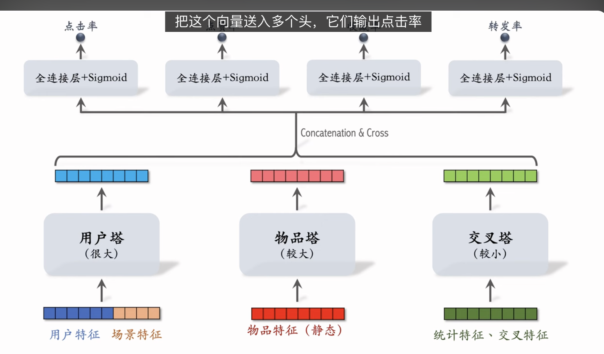
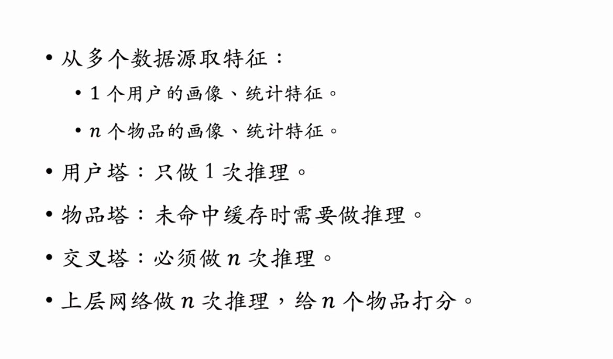

这节课介绍推荐系统的粗排三塔模型，它介于前期融合的双塔模型和后期融合的精排模型之间。用户塔可以很大，因为它只需要做 1 次推理。物品塔可以比较大，因为物品塔的输出可以缓存在 PS(parameter server)。交叉塔必须很小，如果有 n 个物品，交叉塔需要做 n 次推理。三塔模型的计算量主要是上层的全连接层。

---

这个提示词内容精准覆盖了推荐系统中**粗排 (Pre-Ranking / Coarse Ranking)** 这一关键环节。如果说双塔是海选，精排是决赛，那粗排就是资格赛，它需要在**大量候选（数千）**和**有限算力（毫秒级）**之间找到完美的平衡点。

以下是对这节课内容的深度逻辑拆解与总结：

### 1. 粗排的定位与挑战

- **位置**：召回 (Recall) $\rightarrow$ **粗排 (Pre-Ranking)** $\rightarrow$ 精排 (Fine Ranking)。
- **任务**：从几千个召回结果中，筛选出几百个送给精排。
- **核心矛盾**：
  - **量大**：需处理 $N \approx 3000+$ 个物品。
  - **时延苛刻**：必须快，不能像精排那样上大模型。
  - **精度要求**：比双塔（纯向量点积）准，比精排（前期融合大模型）快。
- **演进路线**：早期的粗排要么直接用双塔（精度低），要么是精排模型的蒸馏版（Feature Selection / Model Distillation）。现在主流趋势是**三塔模型 (Three-Tower Model)**。

### 2. 精排 vs 双塔 vs 三塔

**A. 精排模型 (前期融合)**

- **结构**：所有特征 Concat $\rightarrow$ 大 MLP $\rightarrow$ Towers。
- **特点**：精度最高，能捕捉细粒度的特征交叉。
- **代价**：$N$ 次大模型推理。线上做不到处理几千个候选。

**B. 双塔模型 (后期融合)**

- **结构**：用户塔 $\rightarrow$ 向量 $A$，物品塔 $\rightarrow$ 向量 $B$，最后算 $A \cdot B$。
- **特点**：速度极快。用户塔推理 1 次，物品塔可离线存向量，线上只是几十毫秒的向量检索。
- **缺陷**：精度低。**没有特征交叉 (Feature Interaction)**。比如“用户喜欢看美妆”和“笔记是美妆类”这两个特征，在双塔里直到最后一步才碰面，模型很难学到深度关联。

**C. 三塔模型 (Mixture of Pre-Ranking)** —— _本节课核心_
这是一种折中方案，也可以理解为**COLD (Compute Optimized Look-alike Detector)** 架构的一种变体。

### 3. 三塔模型详解

#### Tower 1: 用户塔 (User Tower)

- **输入**：用户特征、场景特征。
- **计算量**：**极小**。
- **逻辑**：一次请求只需推理 **1 次**。模型可以做得很大很复杂，甚至上 Transformer，反正只算一次，不心疼。

#### Tower 2: 物品塔 (Item Tower)

- **输入**：物品静态特征（ID, 标题 Embedding, 类目等）。
- **计算量**：**极小 (通过缓存)**。
- **逻辑**：理论上要推理 $N$ 次。但因为输入都是静态的，可以直接把输出的向量缓存在 KV Store (Parameter Server) 中。
- _缓存策略_：命中率极高 (99%)，只有极少数新物品或是缓存失效时才需要实时推理几十次。

#### Tower 3: 交叉塔 (Cross Tower) —— _灵魂所在_

- **输入**：
  - **统计特征** (User stats & Item stats)：动态变化的，也是推荐系统最强的信号。
  - **显式交叉特征**：如 `User_Category == Item_Category` (Hit)，`User_Gender` x `Item_Gender_Stats`。
- **计算量**：**较大 (N 次)**。这部分不能缓存，甚至不能预计算。
- **优化**：必须做得很轻量。通常是**单层**、**窄宽**的全连接层。它的任务是快速捕捉强信号（比如：这篇笔记现在很火 + 用户现在很爱看这个类目）。

#### Upper Layers (融合层)

- **输入**：User Vector, Item Vector, Cross Vector。
- **逻辑**：将这三个向量 Concat 后，经过上层 MLP 预测 CTR/CVR。
- **计算量**：**大头 (N 次)**。因为无法缓存，主要耗时在这里。必须控制层数和神经元数量。

### 4. 为什么三塔模型有效？

1.  **引入了交叉信息**：相比双塔，三塔的 Cross Tower 显式地输入了统计和交叉特征，这大大提升了模型的精度，解决了双塔“甚至不知道这个物品现在火不火”的问题。
2.  **极致的算力分配**：
    - 把计算量大的部分（User Tower, Item Tower 的高维特征提取）**移到了低频计算区**（做 1 次或做缓存）。
    - 把计算量小的部分（Cross Tower, Upper MLP）**留在了高频计算区**（做 N 次）。
    - 用“田忌赛马”的策略，在有限的 latency 预算内塞进了最多的信息量。

### 5. 总结

| 模型     | 特征融合时机             | 推理复杂度                                                             | 精度 | 适用场景          |
| :------- | :----------------------- | :--------------------------------------------------------------------- | :--- | :---------------- |
| **双塔** | 极晚期 (Dot Product)     | $O(1)$ (User) + $O(0)$ (Item cached)                                   | 低   | 召回              |
| **三塔** | **中期** (Vector Concat) | $O(1)$ (User) + $O(0)$ (Item cached) + $O(N \times \text{Tiny Model})$ | 中   | **粗排 (几千个)** |
| **精排** | 极早期 (Concat)          | $O(N \times \text{Large Model})$                                       | 高   | 精排 (几百个)     |

这节课揭示了推荐系统工程架构中的**Trade-off 艺术**。粗排不是简单的“缩小版精排”，而是针对算力约束重新设计计算图及缓存策略的产物。在小红书或阿里这种规模的系统中，三塔模型是连接海量召回和精准排序的各种关键桥梁。
