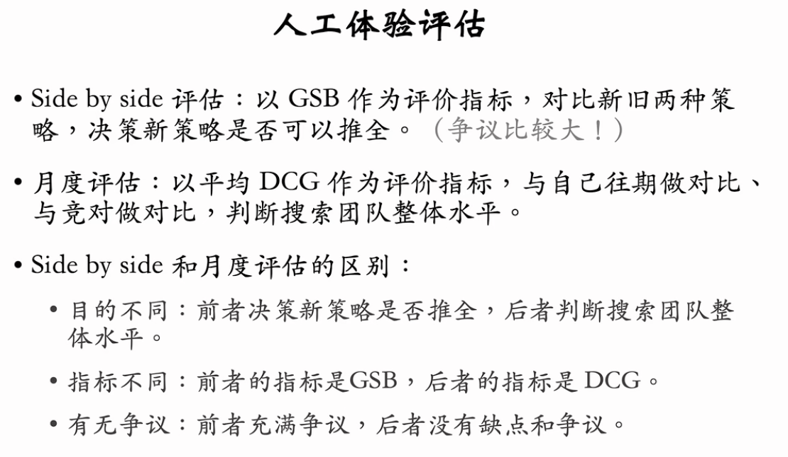
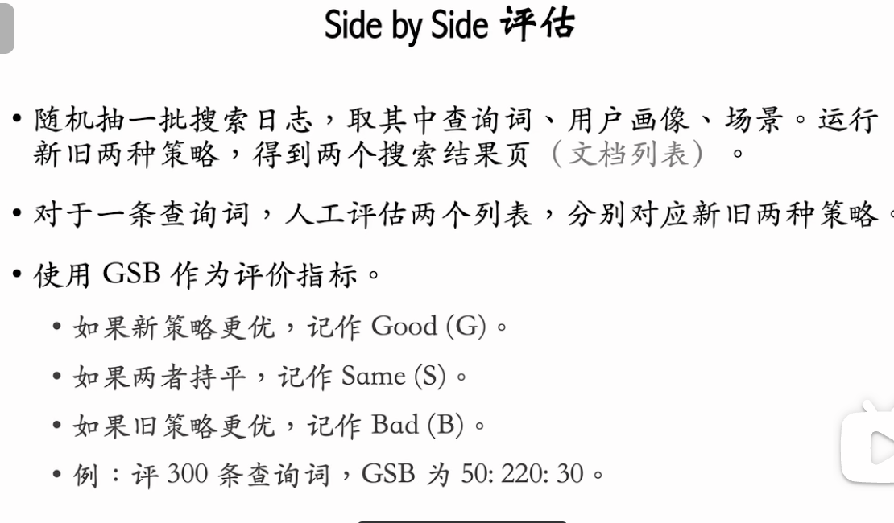
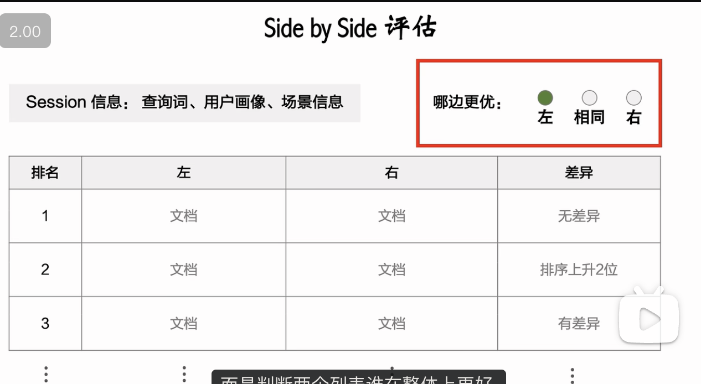
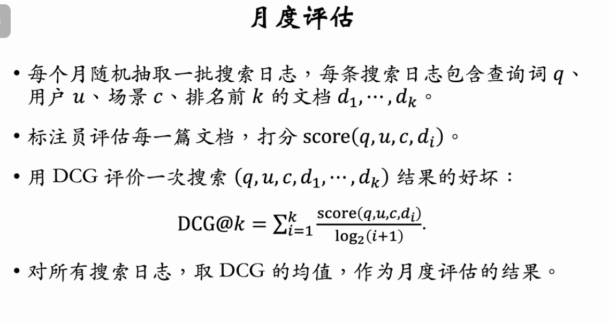

搜索引擎的评价指标分为三类：
01:19 北极星指标，包括用户数（DAU、MAU、搜索渗透率）、留存（次日留存、LT7、LT30）。
03:34 中间指标，包括文档点击率、有点比、首屏有点比、首点位置、主动换词率、交互指标。
10:45 人工体验评估，包括 side by side 评估、月度评估。side by side 评估的指标是 Good Same Bad (GSB)，月度评估的指标是 Discounted Cumulative Gain (DCG)。

---

基于王树森教授的《搜索引擎技术》第三讲视频教程，这节课系统化地构建了搜索引擎的**评价指标体系**（Metric System）。这是衡量搜索质量、指导工程迭代的标尺。

评价指标主要分为三个层级：核心商业指标（北极星指标）、中间过程指标（行为指标）和人工主观评估。

### 1. 核心商业指标 (North Star Metrics)

这些是衡量搜索引擎业务健康度的终极指标，但因其**滞后性**和**不敏感性**，不适合作为短期 A/B 测试的直接优化目标。

- **用户规模 (Scale)**：
  - **DAU/MAU** (日/月活跃用户数)：需区分“APP 整体日活”与“搜索日活”（因为很多搜索入口在抖音/淘宝等综合 APP 内）。
  - **搜索渗透率** (Search Penetration Rate)：$\frac{\text{搜索日活}}{\text{APP总日活}}$。`渗透率高说明搜索功能做得好，用户愿意用。`
- **用户留存 (Retention)**：
  - **次 N 留** (Next-Day Retention)：如次 1 留、次 7 留。
  - **LT7 / LT30** (Life Time)：用户在未来 7/30 天内的平均活跃天数，比单纯的留存率更敏锐，是目前工业界主流。
- **特点**：极难通过单个算法策略提升。通常需要累积几个月的所有优化，才能在这些指标上看到显著变化。

### 2. 中间过程指标 (Proxy Metrics)

这些是**A/B 测试的核心指标**。它们基于用户行为，反应灵敏，且与核心指标强相关。

- **点击类指标 (Click-based)**：
  - **Doc CTR**：文档点击率（低，约 10%）。
  - **UCTR (有点比)**：查询词点击率（高，约 70%）。_核心指标_。
  - **首屏 UCTR**：首屏有点比。衡量**排序质量**。
- **排序类指标 (Ranking-based)**：
  - **平均首点位置 (Average First Click Position)**：数值越小越好。越小说明用户越快找到了想要的文档。
- **满意度/负向指标**：
  - **主动换词率 (Active Reformulation Rate)**：
    - **定义**：用户搜完没点，或者点了不满，手动修改 Query 再次搜索。
    - **逻辑**：这是**坏事**，说明前一次搜索失败。
    - _注意_：要区分“被动换词”（点击搜索建议 SUG）和“主动换词”。被动换词通常是好事（引导准确），主动换词通常是坏事。
- **交互类指标 (Interaction/Engagement)**：
  - **定义**：点赞、收藏、转发、关注等深度行为。
  - **难点**：数据稀疏（Data Sparsity）。解决办法是将多种交互行为加权融合为一个综合指标。

### 3. 人工体验评估 (Human Evaluation)

当数据指标无法解释，或需要做新旧策略的定性对比时使用。

#### A. Side-by-Side (SBS) 评估

- **场景**：决定新策略是否推全（Launch Decision），常用于 A/B 测试的辅助。
- **方法**：左边放新策略结果，右边放旧策略结果（或反之，盲测），让标注员判断哪个更好。
- **指标**：**GSB (Good-Same-Bad)**。
  
  
- **缺点**：
  - **主观性**：标注员不是用户。
  - **个性化难题**：对于千人千面的推荐式搜索（如抖音/小红书），标注员无法模拟特定用户的偏好。如果百度（弱个性化）用 SBS 尚可，强个性化场景下 SBS 往往失效。
  - **成本高、速度慢**。

#### B. 月度评估 (Monthly Evaluation)

- **场景**：宏观监控团队绩效，对标竞争对手（Competitor Analysis）。
- **指标**：**DCG (Discounted Cumulative Gain)**。
  - **公式逻辑**：$\sum \frac{\text{Score}_i}{\log_2(i+1)}$。
  - **核心**：给每个位置的文档打分（Score），位置越靠后，权重（1/log）越低。
  - _用途_：是一个绝对值分数，适合画趋势图，看自己过去一年的进步，或者看跟竞品的差距。

### 4. 课后思考题：日均搜索次数 (Search Volume) 是好指标吗？

- **提示**：商业上是好指标（PV 增加 -> 广告展示增加 -> 收入增加）。
- **但在用户体验 (UX) 上**：通常**不是**好指标，甚至可能是**负向指标**。
- **原因**：
  - $\text{日总 PV} = \text{DAU} \times \text{人均 PV}$。
  - DAU 涨是好事。
  - **人均 PV 涨可能是坏事**。如果搜索结果很烂，导致用户不得不反复换词、翻页、重搜，人均 PV 会暴涨，但这代表用户体验极差。
  - **结论**：如果因为搜索精准，用户“搜一次就走”，人均 PV 下降反而是搜索质量提升的体现。

### 总结

在工业界实战中：

1.  **长期看**：留存率 (Retention/LT)。
2.  **短期 A/B 测试看**：有点比 (UCTR)、首屏有点比、平均首点位置。
3.  **定性分析/竞对分析看**：DCG (月度评估)。
4.  **警惕**：单纯的搜索 PV 增长，这往往掩盖了用户“搜不到”的痛苦。

---

百度内的确 side by side 流行，普遍使用 GSB 评估。
关键在于标准就是产品、技术制定的，技术执行，外包评估，产品 review。而且流程并不严谨。
迭代目标每次都达到，OKR 完成度高，外界反馈却是江河日下。

实际工作中，GSB 人工评估需要频繁的勾兑和交流，有助于混脸熟，形成共同认知。利于晋升。
大量工作交给外包执行。熟人好办事往往时间花的不是很多。
AB test 实打实地正向才是真本事，需要流程上所有人审批确认，周期反而很长，每次实验至少一周以上。
而在百度做到正向实在是太难了，谨小慎微，投鼠忌器，难出成绩。

思考题：
“日均搜索次数” 衡量用户体验，重要但不关键。
降低是万万不行的，无论如何不能降低，AB test 的底线是持平。
升高需要谨慎分析，有理有据。除了搜索体验的提升，还有可能是 “扩召回”。
