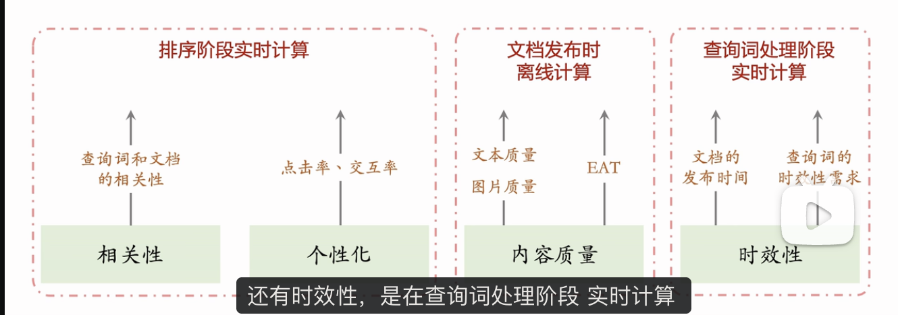

搜索引擎的链路分为 3 个环节，分别是查询词处理（query processing）、召回（retrieval）、排序（ranking）。
01:36 查询词处理：分为很多模块，包括分词、词权重、类目识别、意图识别、查询词改写。
10:04 召回：包括文本召回、向量召回、KV 召回。
15:28 排序：融合相关性、内容质量、时效性、CTR/CVR 等多种分数。

---

基于王树森教授的《搜索引擎技术》第四讲视频教程，这节课系统拆解了现代**通用搜索引擎 (General Search Engine) 的核心链路**。

整个链路呈现典型的**漏斗型架构 (Funnel Architecture)**：从处理单个 Query 开始，到从海量库中捞出数万候选，最后精选出排好序的 Top 10 展示给用户。

---

### 第一环节：查询词处理 (Query Processing/QP)

这是链路的起点，虽然这部分在人力投入上较少，但对效果影响深远——特别是**意图识别**。

1.  **分词 (Tokenization)**：
    - **例子**："冬季卫衣推荐" -> ["冬季", "卫衣", "推荐"]。
    - **目的**：为**文本召回 (Text Retrieval)** 服务。倒排索引的 Key 是 Term，必须切碎才能匹配。
2.  **词权重 (Term Weighting)**：
    - **逻辑**："卫衣" (核心词，权重高，不可丢) > "冬季" > "推荐" (停用词，权重低，可丢)。
    - **作用**：指导文本召回时的**丢词策略 (Try-dropping)**。当长 Query 召回为空时，优先丢弃低权重词进行重试。
3.  **类目识别 (Category Classification)**：
    - **技术**：多标签分类。在线识别 Query 的类目，离线识别 Doc 的类目。
    - **作用**：在召回和排序中作为核心特征。
4.  **意图识别 (Intent Recognition)**：
    - **时效性意图**：识别是否在搜新闻 ("地震") 或新款 ("新款 iPhone")。
    - **地域性意图**：识别是否需要 LBS ("附近的烧烤")。
    - **用户名意图**：识别是否在找人（应路由到用户库而非文档库）。
5.  **查询词改写 (Query Rewriting)**：
    - **技术**：最难的 QP 模块。将 Q 改写为 $Q', Q'', Q'''$。
    - **价值**：
      1.  **解决语义鸿沟**：搜 "LV" 改写为 "Louis Vuitton" (文本匹配不到，改写后能匹配)。
      2.  **扩展召回**：搜 "身高 160...推荐" (限制太多无结果) -> 改写为 "微胖穿搭" (泛化意图，有结果)。

---

### 第二环节：召回 (Recall / Retrieval)

目标：**快**而**全**。从 10 亿+ 文档中，用 ~20ms 捞出 Top ~10,000 相关文档。

1.  **文本召回 (Text Retrieval / Inverted Index)**：
    - **原理**：经典的倒排索引 (Term -> List<Doc>)。
    - **过程**：Key = Query Tokens，Value = Doc ID Lists。取交集 (Intersection)。
    - **地位**：基石，必须有。
2.  **向量召回 (Vector Retrieval / Embedding-based Retrieval)**：
    - **模型**：**双塔模型 (Two-Tower Model)**。
      - **Query 塔**：在线实时计算 $V_q = f(Query)$。
      - **Doc 塔**：离线计算好库中所有文档的 $V_d = g(Doc)$ 并存入向量数据库 (Vector DB)。
    - **检索**：使用 ANN (Approximate Nearest Neighbor) 算法在向量库中找与 $V_q$ 最近的 Top-K $V_d$。
    - **优势**：解决语义匹配（"LV" ~= "包包"），无需精确关键词匹配。
3.  **KV 召回 (Key-Value Retrieval)**：
    - **原理**：针对**高频 Query** (Head Queries) 的缓存/精选池。
    - **Key** = 热门 Query，**Value** = 经过离线精挑细选的高质量 Doc List。
    - **优势**：极快，质量极高（离线可能有复杂模型甚至人工介入）。

---

### 第三环节：排序 (Ranking)

目标：**准**。从 ~10,000 篇文档中精选 Top 10。分为 **粗排 (Pre-ranking)** 和 **精排 (Fine-ranking)**，逻辑一致仅规模不同。

#### 排序的四大核心因子 (Ranking Factors)：

1.  **相关性 (Relevance)**：**最重要，算力消耗最大**。通常使用 **BERT (Cross-Encoder)** 实时计算 Q 和 D 的语义匹配分。
2.  **内容质量 (Content Quality)**：E-A-T、文本质量、美学分。**离线计算**，存入文档画像（Feature Store），排序时直接查表读取。
3.  **时效性 (Freshness)**：由 QP 阶段识别出的 Query 时效性意图强弱，决定 Doc 年龄 (Age) 在排序公式中的权重。
4.  **个性化 (Personalization)**：使用**多目标神经网络 (MTL)** 预估点击率 (pCTR) 和交互率 (pCVR)。

#### 排序流程：

1.  **打分 (Scoring)**：收集上述所有分数。
2.  **融合 (LTR - Learning to Rank)**：即 `Final_Score = w1*Relevance + w2*Quality + w3*Freshness + w4*pCTR`。
3.  **重排 (Re-ranking)**：微调顺序。处理**多样性 (Diversity)**（不要连续出 10 个同一作者的视频）和**业务规则打散**。

---

### 课后思考题解析

**问题**：如果搜索引擎的**时效性体验很差**（搜新东西搜不到，或者搜旧东西排第一），该从链路的哪些环节改进？

**分析方向**：

1.  **QP (查询词处理)**：
    - **意图识别**：即使有新文档，如果 QP 没识别出这个 Query 是“突发时效”或“强时效”意图，下游就不会提权最新的文档。**这是首要排查点**。
2.  **召回 (Recall)**：
    - **索引速度**：新发生的事件（如地震），相关文章其实已经发布了，但搜索引擎爬虫还没抓取/建立索引 (Index Latency)。需要提升索引实时性。
    - **召回通道**：是否建立了专门的“时效性召回通道”？针对时效性 Query，应该去专门存储最新新闻的“即时索引库”里找，而不是去历史大库里找。
3.  **排序 (Ranking)**：
    - **特征权重**：如果 QP 识别对了，召回也有了，但排序模型里“文档发布时间”这个特征的权重 $w_{freshness}$ 太低了，导致老的高质量文档还是把新的文档压下去了。需要调整 LTR 模型对 Age 特征的敏感度。

**总结**：时效性问题通常是全链路的，但瓶颈往往在 **QP 的意图识别准确率** 和 **召回的索引更新速度**。
