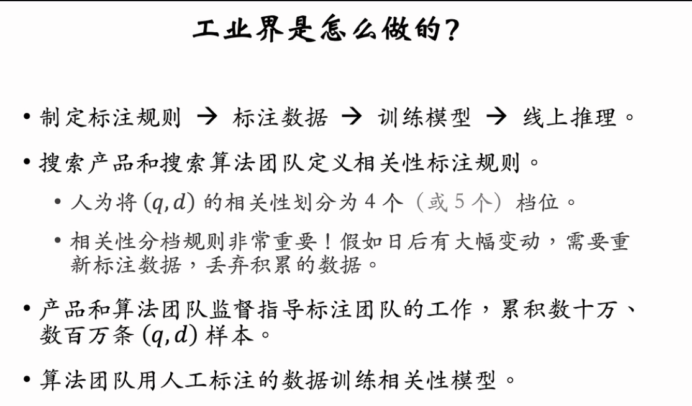

相关性、内容质量、时效性、个性化是影响搜索体验的主要因素，其中相关性的重要性最高。这节课的内容是相关性的定义与分档，都是概念性的内容，没有模型和算法。

---

基于王树森教授的《搜索引擎技术》第五讲视频教程，这一节课的重点在于**相关性的定义、评价标准（分档）及标注流程**。

这是构建高性能搜索引擎的“地基”。没有高质量的标注数据，算法模型再先进也只是空中楼阁。

### 1. 为什么“数据标注”比“算法优化”更重要？

现在标注数据都用大模型了

- **工业界共识**：算法团队忙一年对指标的提升，可能远不如投入几十万人民币多标 100 万条高质量数据带来的提升大。
- **成本极低**：标注一条样本约 0.5 元。100 万条样本仅需 50 万元，低于一个资深算法工程师的年薪。
- **核心资产**：模型可以随时根据数据快速重训，但如果标注规则（Guidelines）制定有误，导致积累的历史数据不可用，损失的是数月的时间和资金。

### 2. 什么是“相关性” (Relevance)？

- **核心定义**：**需求匹配 (Intent Matching)**，而非单纯的**字面匹配 (Lexical Matching/Keyword Matching)**。
  - _正例（字面不匹配但相关）_：
    - Q: "谁掌握芯片制造的尖端技术"
    - D: "ASML 制造全球最先进的光刻机"
    - **判定**：相关。因为 D 回答了 Q 的问题，即使没有出现“芯片制造”等完全匹配的词。
  - _反例（字面匹配但不相关）_：
    - Q: "巴伦西亚旅游"（意图：攻略、景点）
    - D: "西班牙海鲜饭的做法，我在巴伦西亚旅游时吃过..."
    - **判定**：不相关。这属于美食做法，偏离了旅游攻略的核心需求。
- **独立性原则**：相关性标注**只看相关性**，**不考虑**内容质量（Quality）、时效性（Freshness）或个性化。
  - _陷阱_：一篇“用气功在大气层消灭新冠”的文章，虽然是虚假信息（低质量），但在语义上确实是在讨论“消灭新冠”，因此**相关性是匹配的**（虽然最终会被质量模型打压，不给展示）。相关性模型不应承担事实核查（Fact Checking）的任务。

### 3. 五大核心标注难点处理

1.  **多意图 (Multi-Intent)**：
    - Q: "黑寡妇"（意图可能是：蜘蛛、漫威电影、车臣组织）。
    - **规则**：只要命中**任何一种**主要意图，即算相关。
2.  **上下位词关系**：
    - **搜上位出下位**：Q="广东菜"，D="潮汕牛肉丸"。**判定：相关**。
    - **搜下位出上位**：Q="潮汕牛肉丸"，D="广东美食大全"。**判定：通常不相关**（除非 D 花了大量篇幅专门讲牛肉丸，否则太宽泛）。
3.  **丢词 (Term Dropping)**：
    - **丢核心词**：Q="情人节 **餐厅**"，D="情人节 **礼物**"。**判定：不相关**。
    - **丢重要限定词**：Q="**初二** 物理"，D="**初三** 物理"。**判定：不相关**。
    - **丢不重要限定词**：Q="**精彩的** 好莱坞动作片"，D="好莱坞动作片"。**判定：相关**。
4.  **参考价值**：
    - 即使不完全相关，如果文档有一定参考价值（如 Q="初二物理"，D="中考物理"），可给“低相关”，而非“无相关”。

### 4. 四档位标注体系 (4-Grade Scale)

工业界通常将相关性分为 4 档（部分公司划分 5 档）。

| 大档位     | 判定逻辑             | 细分小档位          | 细分规则                                            |
| :--------- | :------------------- | :------------------ | :-------------------------------------------------- |
| **相关**   | 满足 Query 核心需求  | **高 (High)**       | 满足需求的内容篇幅占比 **> 50%**                    |
|            |                      | **中 (Medium)**     | 满足需求的内容篇幅占比 **< 50%**                    |
| **不相关** | 未满足核心需求或丢词 | **低 (Low)**        | 虽然不可用，但有一定**参考价值**（如相近学科/领域） |
|            |                      | **无 (Irrelevant)** | 完全无关且无参考价值                                |

### 5. 工业界标注流程 (Workflow)

这是一个严密的工程管理过程：

1.  **样本抽取**：
    - 从搜索日志采样 Query。必须覆盖**高频、中频、低频**（长尾）。
    - 构建 <Query, Doc> 对。不能只选 Top 排名结果（会导致全是正样本），必须混合负样本，保持 Label 分布平衡。
2.  **人工标注**：
    - **多人盲标**：每条数据至少 2 人标注。
    - **一致率 (Consistency)**：若两人结果不一致，引入第 3 人仲裁或废弃。
3.  **质量控制 (QA)**：
    - **埋雷检测 (Golden Test)**：在 1 万条任务中混入 200 条由专家（产品/算法）标好的标准答案。如果标注员在这些题上错太多，整批数据退回。
    - **抽检**：产品经理随机抽查验收。

### 总结

对于搜索算法工程师而言，这一讲最大的启示是：**不要只盯着模型结构（BERT/GPT），要花更多精力在定义清晰的标注规则（Guidelines）和清洗数据上**。好的标注规则是模型效果的天花板。
