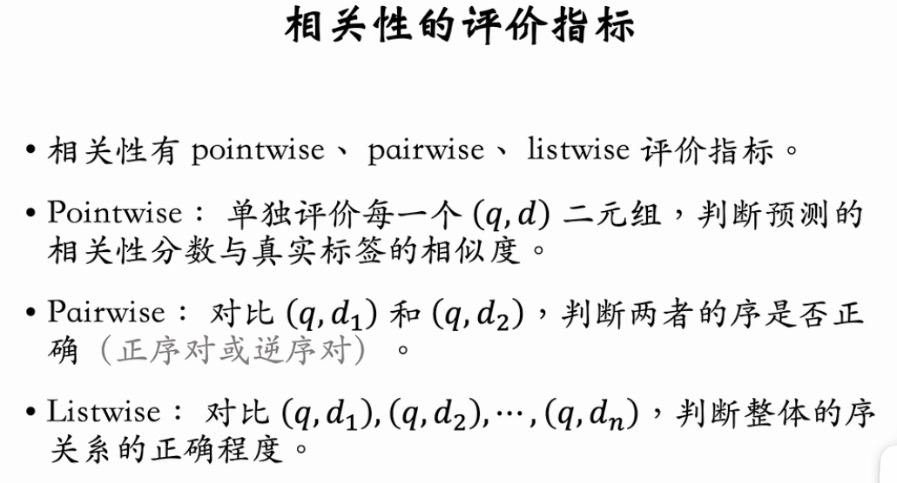
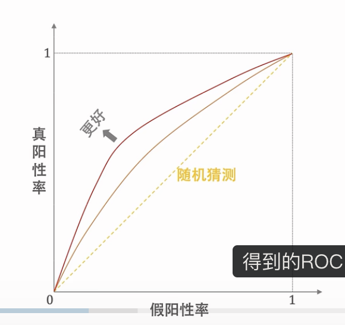
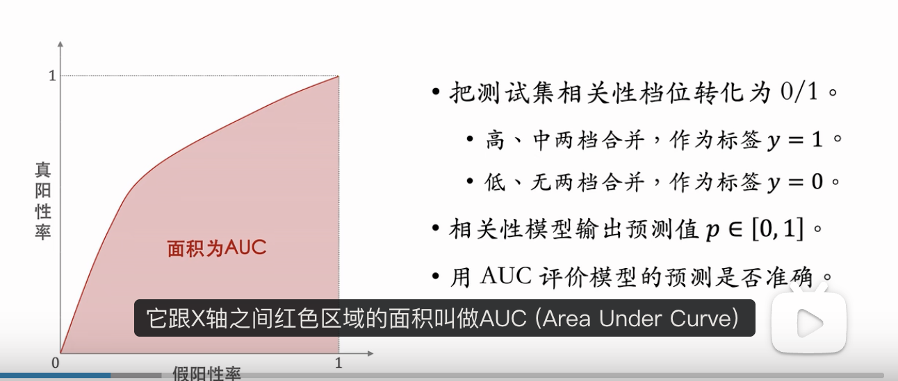
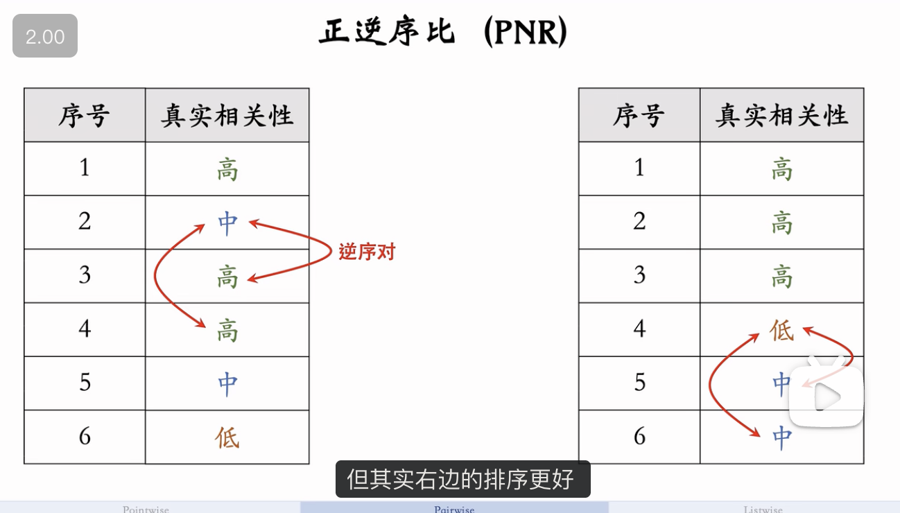

这节课的内容是搜索相关性的评价指标。
01:02 Pointwise 评价指标：Area Under the Curve (AUC)。
03:25 Pairwise 评价指标：正逆序比 (Positive to Negative Ratio, PNR)。
06:43 Listwise 评价指标： Discounted Cumulative Gain (DCG)。
15:52 应用场景：用 AUC 和 PNR 作为离线评价指标，用 DCG 评价模型在线上排序的效果。

---

基于王树森教授的《搜索引擎技术》第六讲视频教程（相关性 02），本节课深入探讨了**衡量相关性的三大核心评价指标体系**。

这些指标分别用于不同的工程阶段（离线模型迭代 vs. 线上产品评估），理解其差异对于设计健壮的搜索系统至关重要。

### 一、 Pointwise 指标：AUC (离线评估)

Pointwise 指标将相关性问题简化为**二分类问题**，独立评估每一对 <Query, Doc> 的预测准确性。

- **标签转换**：
  - 原始 4 档位：{高, 中, 低, 无}
  - **二值化**：{高, 中} $\rightarrow$ Positive (1); {低, 无} $\rightarrow$ Negative (0)。
- **核心指标：AUC (Area Under ROC Curve)**
  
  
  - **含义**：ROC 曲线下的面积，衡量模型把正样本排在负样本前面的概率能力。
  - **基准**：随机猜测 AUC = 0.5。
  - **工业界参考值**：好的相关性模型 AUC 通常在 **0.80 ~ 0.95** 之间。
- **相关性有四个档位，为什么不用 Accuracy / F1 多分类指标？**
  - **不应该把相关性看成多分类问题**
  - 相关性是有序等级 (Ordinal) 问题，而非简单的类别分类 (Categorical) 问题。F1 无法区分“错判严重程度”（例如把“高”判为“无”是严重错误，判为“中”是轻微错误，但 F1 对此一视同仁）。

### 二、 Pairwise 指标：正逆序比 (PNR) (离线评估)

Pairwise 指标关注两两文档之间的相对顺序，比 Pointwise 更贴近排序本质。

- **正序对 (Positive Pair)**：模型预测分数 $Score(D_A) > Score(D_B)$，且真实标签 $Label(D_A) \ge Label(D_B)$。
- **逆序对 (Negative Pair / Inversion)**：模型预测 $Score(D_A) > Score(D_B)$，但真实标签 $Label(D_A) < Label(D_B)$（即把烂文档排在了好文档前面）。
- **指标：正逆序比 (PNR - Positive-Negative Ratio)**

  - $$ \text{PNR} = \frac{\text{正序对数量}}{\text{逆序对数量}} $$
  - **局限性**：Pairwise 指标只看“两两相对关系”，不看“绝对位置”。
    
  - _示例_：同样的逆序对，发生在第 1 名 vs 第 2 名，和发生在第 100 名 vs 第 101 名，对 PNR 的影响是一样的。但对用户体验来说，发生在头部的逆序对是致命的。

### 三、 Listwise 指标：DCG (线上评估)

Listwise 指标关注整个列表的质量，且**位置越靠前，权重越高**。这是最符合用户体感的指标。

- **~~CG (Cumulative Gain)~~**：
  - $\text{CG}@K = \sum_{i=1}^{K} Y_i$ （前 K 个文档真实分数的总和）。
  - _缺陷_：不考虑位置。把第 1 名和第 10 名互换，CG 不变，但这显然降低了体验。
- **DCG (Discounted Cumulative Gain)**：
  前 k 篇文档尽量不要出现逆序对。
  - **公式**：$$ \text{DCG}@K = \sum\_{i=1}^{K} \frac{Y_i}{\log_2(i+1)} $$
  - **核心逻辑**：引入`折损因子 (Discount Factor)` $\frac{1}{\log(i+1)}$。排名 $i$ 越靠后，分母越大，权重越低。
  - **应用场景**：月度评估 (Monthly Evaluation)。抽样真实流量 Session，人工标注 Top-K 结果，计算 DCG 均值，监控全链路（召回+排序）的整体质量。

### 四、 课后思考题：为什么不用 NDCG 代替 DCG？

**问题**：NDCG (Normalized DCG) 是归一化的 DCG ($NDCG = DCG / IDCG$)，取值 [0, 1]。这看起来更标准，为什么工业界线上评估常用 DCG 而非 NDCG？

**深度解析**：

- **场景假设**：假设召回层挂了（或由于 Query 太难），召回回来的全是垃圾文档（全是“低”或“无”）。
- **DCG 的表现**：
  - 分子 $Y_i$ 全是 0 或极低分。
  - **DCG Score $\approx$ 0**。
  - **结论**：准确反映了搜索结果“很烂”。
- **NDCG 的表现**：
  - 理想排序 IDCG 也是基于这些垃圾文档算的。
  - 比如回来的文档全是 0.1 分。模型把它们按 0.1 分排好了。
  - 此时 DCG 很低，但 IDCG 也很低。
  - $NDCG = DCG / IDCG \approx 1.0$ (满分！)。
  - **结论**：**NDCG 掩盖了召回质量差的问题**。它只评估了“排序层”是否在现有候选集里做到了最好，而不管候选集本身有多烂。

**总结**：线上评估关注的是**用户最终看到的绝对体验**，所以 **DCG**（绝对值）优于 **NDCG**（相对值）。

### 知识点对比表

| 指标类型      | 代表指标       | 核心思想                | 应用场景                    | 优缺点                                 |
| :------------ | :------------- | :---------------------- | :-------------------------- | :------------------------------------- |
| **Pointwise** | AUC            | 二分类准确性            | 离线模型训练/评估           | 简单，但忽略了排序位置权重             |
| **Pairwise**  | PNR (正逆序比) | 两两相对顺序            | 离线模型评估                | 关注序关系，但对头部/尾部错误一视同仁  |
| **Listwise**  | DCG            | 列表整体体验 + 位置衰减 | **线上产品评估** / 月度抽检 | 最符合用户体感，头部权重高；需人工标注 |

---

## 为什么 离线 AUC、PNR，线上 DCG，不能都用吗

这是一个非常好的“工程 vs 理论”的问题。

简单来说，**并不是“不能”混用，而是“侧重点”和“成本”决定了它们的分工。**

这一分工的核心逻辑在于：**离线看模型能力（算力便宜），线上看用户体感（流量/人工昂贵）。**

以下是三点核心原因的深度解析：

### 1. 成本与频率的不同 (核心痛点)

- **离线 (AUC/PNR)：自动化、海量、快。**
  - 在训练模型时，我们需要跑几百万次迭代。AUC 和 PNR 计算非常简单，不需要额外的人工介入，只要有标注数据或者点击日志就能算。它们是**低成本的数学代理指标**。
- **线上 (DCG)：人工介入、昂贵、慢。**
  - 注意文档中提到 DCG 用于 **“月度评估”** 和 **“人工标注”**。
  - 要算准确的 DCG（尤其是绝对值），通常需要专业的标注人员去判断搜索出来的 Top 10 到底是不是真的相关。你不可能每训练一个 epoch 就请几千个人来打分一次。因此 DCG 通常用于低频的、高规格的“体检”。

### 2. 关注点的不同 (模型 vs 系统)

- **离线 (AUC/PNR) 测的是：排序模型的“分辨能力”。**
  - 例如：在一堆候选文档里，模型能不能把好的挑出来？
  - **盲区**：如果候选集（Recall）本身全是垃圾（全是相关性为“低”的），模型把“低”的排在“无”的前面，AUC 和 PNR 依然可能很高，**但这没有任何意义**。
- **线上 (DCG) 测的是：整个搜索引擎的“最终效果”。**
  - DCG = 0 的时候，说明用户看到的全是垃圾。这能暴露出**召回层 (Recall)** 的问题（比如根本没把好东西召回回来），这是光看排序模型的 AUC 发现不了的。

### 3. 对“头部位置”的敏感度 (数学特性)

- **PNR/AUC 的缺陷：众生平等。**
  - 把第 1 名和第 2 名搞反了（致命错误），与把第 99 名和第 100 名搞反了（无伤大雅），在 PNR 和 AUC 的计算中，**惩罚是一样的**。
- **DCG 的优势：位置偏见。**
  - DCG 公式里有 log 折损。第 1 名出错扣分极重，第 10 名出错扣分很轻。**这才是用户真实的搜索体验**（用户只看头几条）。

---

### 一张表总结

| 维度           | AUC / PNR (离线)                                                        | DCG (线上/SBS 评估)                  |
| :------------- | :---------------------------------------------------------------------- | :----------------------------------- |
| **评估对象**   | 仅评估 **排序模型 (Ranking Model)**                                     | 评估 **全链路 (Recall + Ranking)**   |
| **头部权重**   | **无** (对所有位置一视同仁)                                             | **极大** (越靠前越重要)              |
| **计算依赖**   | 只要有 Label 就能自动化计算                                             | 依赖全列表的真实相关性 (通常需人工)  |
| **能发现什么** | 模型是不是瞎排序                                                        | 用户到底爽不爽 (包括有没有东西可搜)  |
| **结论**       | **甚至 AUC 提升了，线上 DCG 可能会跌** (比如优化了尾部排序，但头部乱了) | **DCG 才是老板和用户关心的最终指标** |
