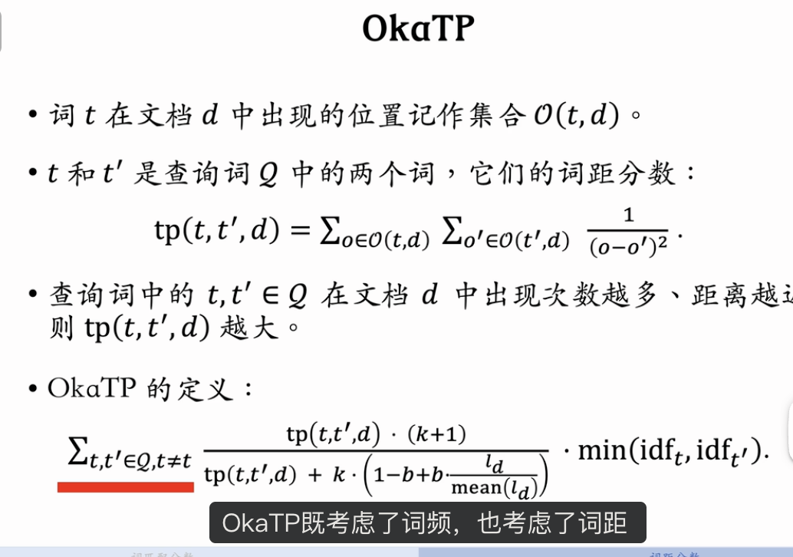

这节课的内容是传统的相关性方法。
在 BERT 等深度学习技术成熟之前，这类方法很流行；目前这类方法正在逐渐被淘汰，仅用于召回海选和粗排。这类方法用人工设计的特征，包括 TF-IDF、BM25、词距、核心词匹配等文本匹配分数，然后把几十种分数作为特征输入线性模型或 GBDT 模型，模型输出查询词和文档的相关性。

---

基于王树森教授的《搜索引擎技术》第七讲（相关性 03），本节课回顾了在深度学习（BERT/LLM）时代之前，搜索引擎判断相关性的传统核心技术——**文本匹配（Text Matching）**。

虽然现代精排早已拥抱深度学习，但这些传统算法因其**极高的计算效率**和**可解释性**，依然在**文本召回（Text Retrieval）**和**海选（Pre-ranking/Selection）**阶段扮演着不可替代的角色。

---

### 一、 词匹配分数 (Term Matching Scores)

这类算法属于**词袋模型 (Bag-of-Words)**，核心假设是：文档中包含查询词的词（Term）越多、越高频，相关性越高。

#### 1. TF-IDF (Term Frequency - Inverse Document Frequency)

这是所有文本匹配的基石。

- **TF (Term Frequency)**：词频。
  - **定义**：Term $t$ 在文档 $d$ 中出现的次数。
  - **直觉**：如果不做归一化，长文档天然 TF 会更高。通常需要除以文档长度进行归一化。
- **IDF (Inverse Document Frequency)**：逆文档频率。
  - **定义**：$IDF(t) = \log(\frac{N}{DF(t)} + 1)$。
  - _N_：文档总数；_DF_：由多少篇文档包含词 $t$。
  - **直觉**：衡量词的“稀缺性”或“判别力”。
    - “的”、“是” (Stop Words)：几乎所有文档都有，$DF \approx N$，$IDF \approx 0$。权重极低。
    - “好莱坞”、“强化学习”：只有少量文档有，$DF$ 很小，$IDF$ 很高。权重极高。
- **公式思想**：$$ Score(Q, D) = \sum\_{t \in Q} TF(t, d) \times IDF(t) $$
  - 即：**相关性 = $\sum$ (这个词在本文中出现了几次 $\times$ 这个词在全语料中有多重要)**。

#### 2. BM25 (Okapi BM25)

**工业界最强**的传统文本匹配算法。它是 TF-IDF 的优化变体，解决了 TF 的非线性饱和问题。

- **核心改进**：
  - **TF 饱和 (Saturation)**：在 TF-IDF 中，次频增加 10 倍，得分也增加 10 倍。BM25 引入了参数 $k_1$（通常 1.2~2.0），使得 TF 增加到一定程度后，分数的增长会趋缓（S 形曲线）。即使你把一个词重复写 100 遍，得分也不会无限膨胀。
  - **文档长度惩罚**：引入参数 $b$（通常 0.75），对长文档进行惩罚，对短文档进行奖励。
- **地位**：`在 BERT 出现之前，BM25 是相关性的天花板。现在依然是 Elasticsearch / Lucene 等搜索引擎的默认评分算法。`

---

### 二、 词袋模型的致命缺陷

TF-IDF 和 BM25 完全忽略了**词序 (Word Order)** 和 **上下文 (Context)**。

- **案例 1（词序颠倒）**：
  - Q1: "男朋友送的礼物" (Gift from boyfriend -> 给女生)
  - Q2: "送男朋友的礼物" (Gift for boyfriend -> 给男生)
  - **结果**：两者切词结果完全一致（{男朋友, 送, 的, 礼物}）。BM25 评分完全相同，无法区分语义。
- **案例 2（语义修饰）**：
  - Q1: "白衬衫灰裤子"
  - Q2: "灰衬衫白裤子"
  - **结果**：切词一致，BM25 无法区分。

---

### 三、 词距分数 (Term Proximity)

为了弥补词袋模型的缺陷，人们引入了词距特征。**词距越小，相关性越高。**

- **直觉**：
  - Q: "亚马逊雨林" -> {亚马逊, 雨林}
  - Doc A: "...**亚马逊**河流域覆盖了广阔的热带**雨林**..." (距离近 -> 语义强相关)
  - Doc B: "我在**亚马逊**网购了一本书...书里讲了东南亚的**雨林**..." (距离远 -> 语义弱相关)
- **计算逻辑 (OkaTP 等)**：
  - 计算 Q 中每对 Term $(t_i, t_j)$ 在文档中出现位置的距离差 $\frac{1}{(pos_i - pos_j)^2}$。
  - 如果距离越近，TP 分数越高。
  - 通常作为特征（Feature）加到排序模型中，辅助 BM25。

---

### 总结与工业界现状

1.  **文本召回 / 海选阶段**：**BM25 依然是王者**。
    - 原因：计算极快（基于倒排索引），能够处理亿级数据。
2.  **粗排 / 精排阶段**：**BERT (语义模型) 已全面取代传统特征**。
    - 原因：BERT 能完美解决“男朋友送礼物”这种词序和语义理解问题。
3.  **组合拳**：现在的搜索引擎通常是 **[BM25 召回] -> [双塔 BERT 粗排] -> [单塔 BERT 精排]** 的流水线。

### 知识点对比

| 算法          | 类别 | 核心思想           | 优点                             | 缺点                | 应用场景              |
| :------------ | :--- | :----------------- | :------------------------------- | :------------------ | :-------------------- |
| **TF-IDF**    | 词袋 | 词频 \* 逆文档频率 | 简单直观                         | 忽略词序、TF 无上限 | 基础特征              |
| **BM25**      | 词袋 | 优化版的 TF-IDF    | 考虑了 TF 饱和度与文档长度归一化 | 忽略词序            | **文本召回 (Recall)** |
| **词距 (TP)** | 距离 | 词离得越近越好     | 弥补词袋模型部分缺陷             | 计算复杂度略高      | 排序特征 (Feature)    |
| **BERT**      | 语义 | 深度注意力机制     | 理解语义、词序、上下文           | 计算昂贵            | **排序 (Ranking)**    |
