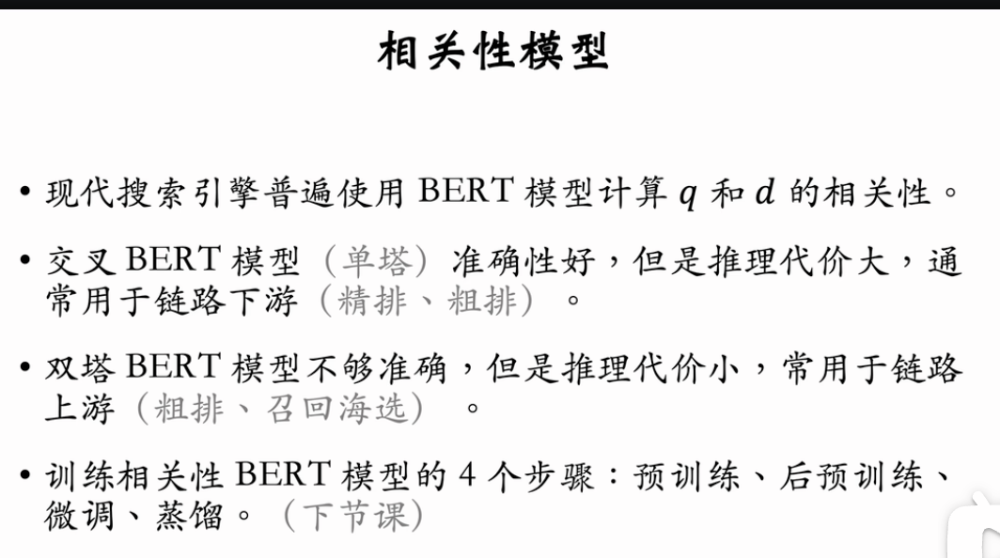
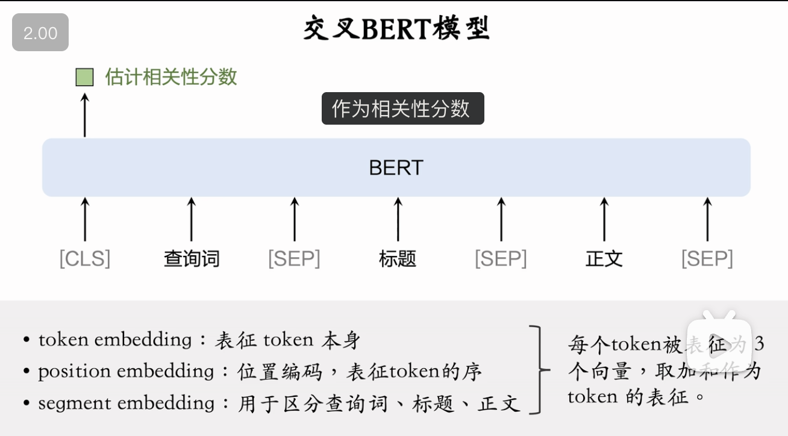
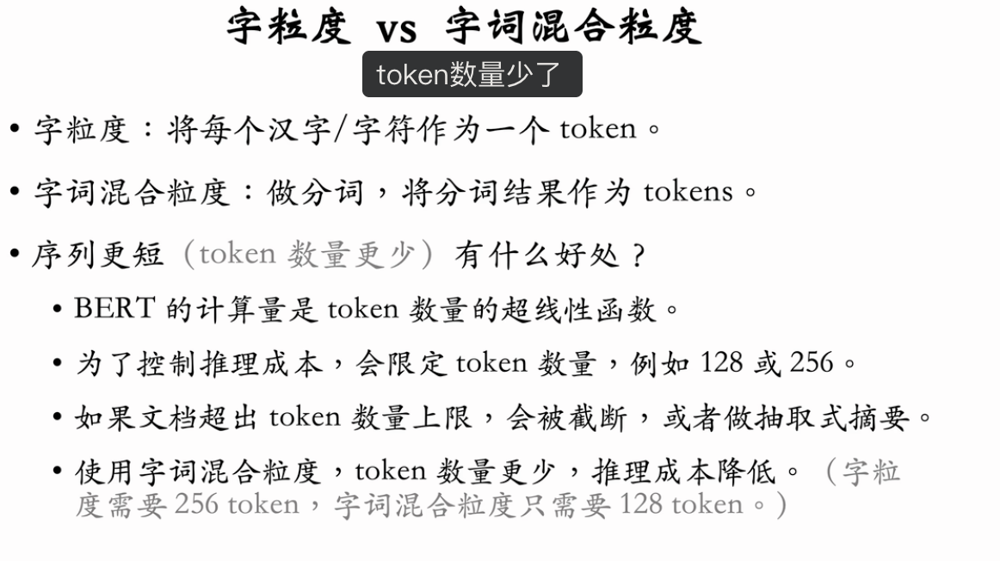

目前（2024 年）搜索引擎主流的相关性模型是 BERT，包括交叉 BERT、双塔 BERT。这节课介绍模型的结构、线上推理，下节课详细讲模型的训练。

交叉 BERT 也叫单塔 BERT，准确性高，但是推理代价大。有如下几种方法加速交叉 BERT 的线上推理。

1. 缩短序列长度（token 数量），包括使用字词混合粒度分词、文本摘要。
2. 使用 Redis 这类内存数据库缓存已经计算过的相关性分数。
3. 做模型量化，比如将 float32 压缩到 int8。

---

基于王树森教授的《搜索引擎技术》第八讲（相关性 04），本节课重点介绍了在工业界大规模应用的**深度语义相关性模型**，具体为 **交叉 BERT (Cross-Encoder)** 和 **双塔 BERT (Bi-Encoder / Two-Tower)** 模型。

这两种模型分别占据了搜索排序链路的不同环节，形成了“精度”与“速度”的权衡组合。

### 一、 交叉 BERT 模型 (Cross-Encoder / Single-Tower)

业内精排（Fine-ranking）的主流模型，准确性最高，但计算最昂贵。

1.  **模型结构**：

    - **输入**：将 Query 和 Doc 拼接为一个长序列发送给 BERT。
      - Format: `[CLS] Query [SEP] Title [SEP] Content [SEP]`
    - **交互**：利用 Transformer 的 Self-Attention 机制，让 Query 中的每个 Token 与 Doc 中的每个 Token 进行**深度交互 (Full Interaction)**。
    - **输出**：取 `[CLS]` 的向量，经过一个全连接层（MLP），输出一个标量分数 (Score)，代表相关性。

2.  **分词粒度 (Tokenization)**：
    

    - **字粒度 (Char-level)**：无需分词，词表小（几千），实现简单。作为 Baseline。
    - **字词混合粒度 (Word-Char Mixed)**：先分词，再输入。
      - **优势**：Token 数量减少约一半（序列变短 -> 速度变快），且引入了先验的词义信息。

3.  **推理降本优化 (Inference Optimization)**：
    由于交叉 BERT 计算量极大（Query 和 Doc 每次都要重算，无法离线缓存 Doc 向量），必须优化：
    - **缓存 (Caching)**：利用 Redis 缓存 `<QueryID, DocID> -> Score`。针对高频 Query，可节省 50%+ 算力。
    - **量化 (Quantization)**：FP32 -> INT8。精度损失极小，速度提升显著。
    - **截断与摘要 (Truncation & Summarization)**：
      - 限制最大 Token 数（如 128）。
      - 对长文档（如 5000 字），先离线生成 100 字摘要，再输入模型，比直接截断尾部效果更好。

### 二、 双塔 BERT 模型 (Bi-Encoder / Two-Tower)

用于粗排（Pre-ranking）或召回海选，速度极快，但无法捕捉细粒度语义交互。

1.  **模型结构**：

    - **Query 塔**：在线实时计算。输入 Query 文本 + 特征，输出向量 $V_q$。
    - **Doc 塔**：**离线计算**。输入 Doc 文本 + 特征，输出向量 $V_d$。
    - **评分**：$Score = \text{Cosine}(V_q, V_d)$ 或 $V_q \cdot V_d$。

2.  **核心优势**：
    - **解耦**：Query 和 Doc 独立编码。
    - **离线计算**：Doc 向量可以（且必须）提前算好存入向量数据库/KV Store。
    - **线上极速**：线上只需算一次 Query 向量，然后做简单的向量点积（Vector Dot Product）。可以轻松处理 10,000+ 候选文档。

### 三、 工业界应用架构对比

| 特性           | 交叉 BERT (Cross-Encoder)                    | 双塔 BERT (Bi-Encoder)                          |
| :------------- | :------------------------------------------- | :---------------------------------------------- |
| **交互方式**   | 深度全交互 (Attention ALL-to-ALL)            | 仅向量层面的点积交互                            |
| **准确性**     | **高** (能理解“A 对 B”与“B 对 A”的区别)      | **中/低** (存在语义损失，是语义的压缩)          |
| **计算复杂度** | 高 (Query 和 Doc 都不固定，每次都要跑大模型) | 低 (Doc 向量查表，仅算一次 Query 塔)            |
| **应用环节**   | **精排 (Fine-Ranking)** (处理 ~数百篇)       | **召回/粗排 (Recall/Pre-Ranking)** (处理 ~万篇) |
| **优化手段**   | 缓存、量化、截断                             | 离线刷库、ANN 索引                              |

### 总结

现代搜索引擎的相关性计算通常是**漏斗型**的：

1.  先用 **双塔 BERT**（或传统 BM25）快速从海量库中捞出几千篇。
2.  再用 **交叉 BERT** 对这几千篇里最有希望的几百篇进行精细打分，确保最终结果的精准度。
