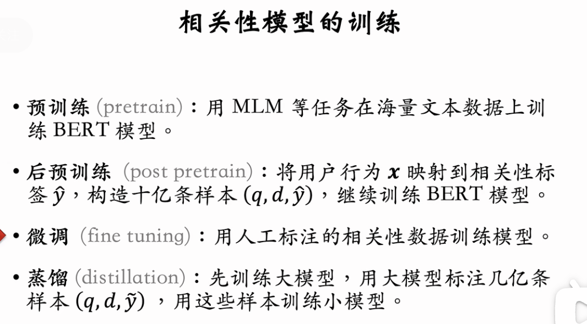
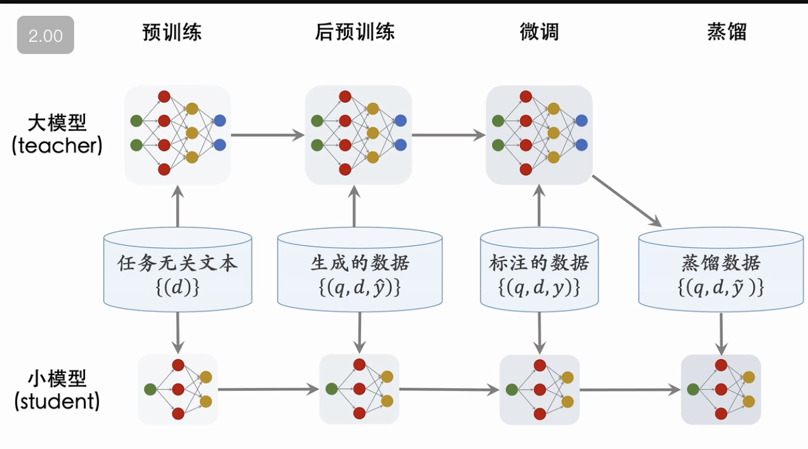
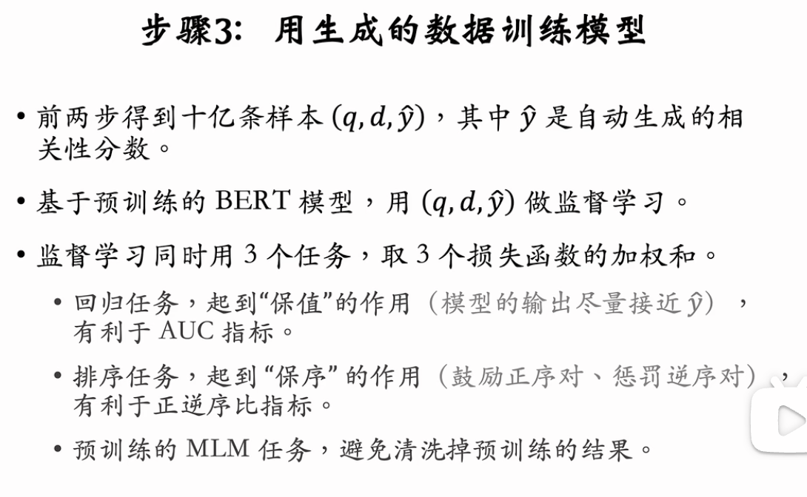
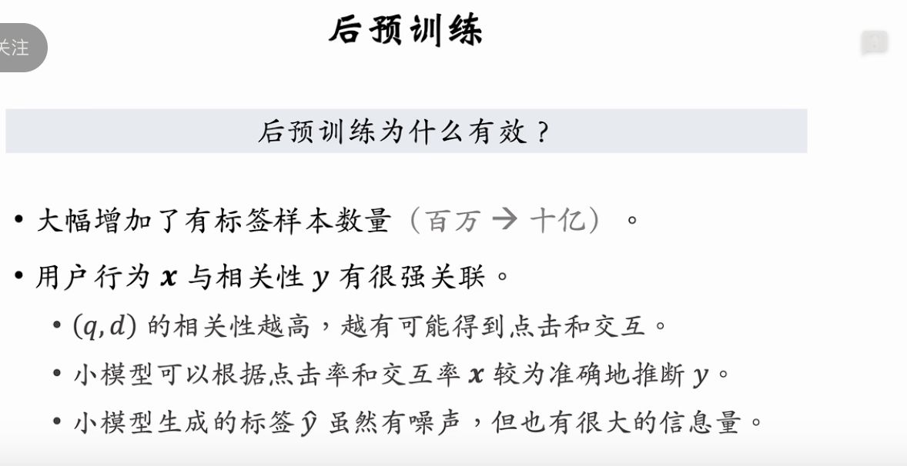
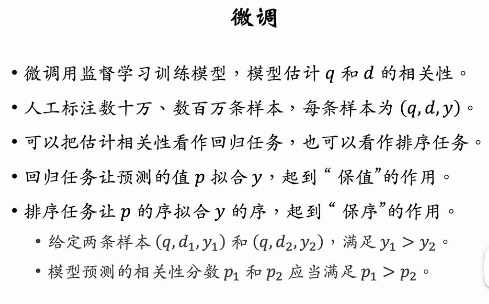
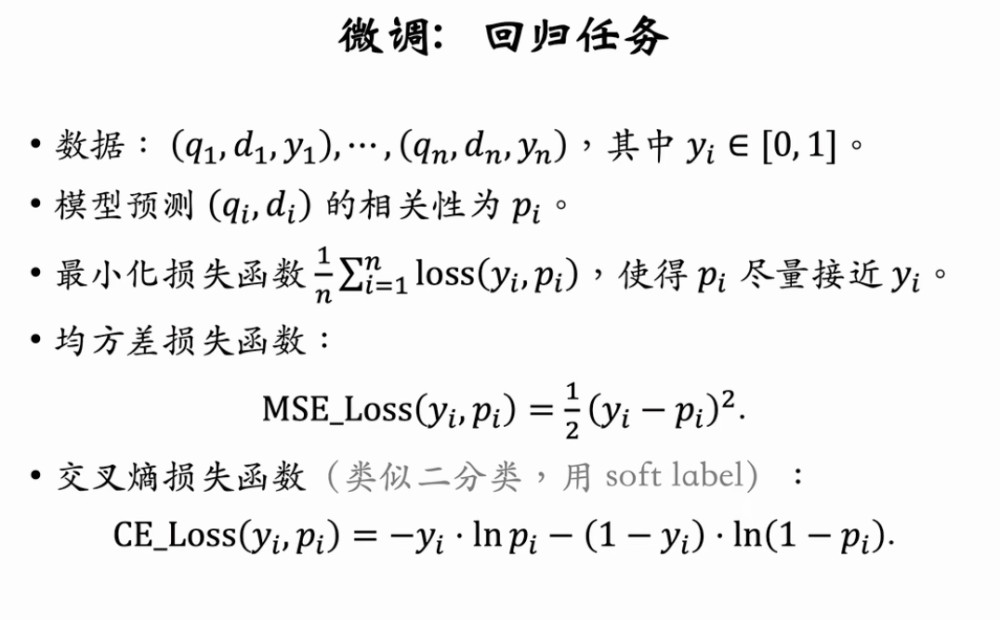
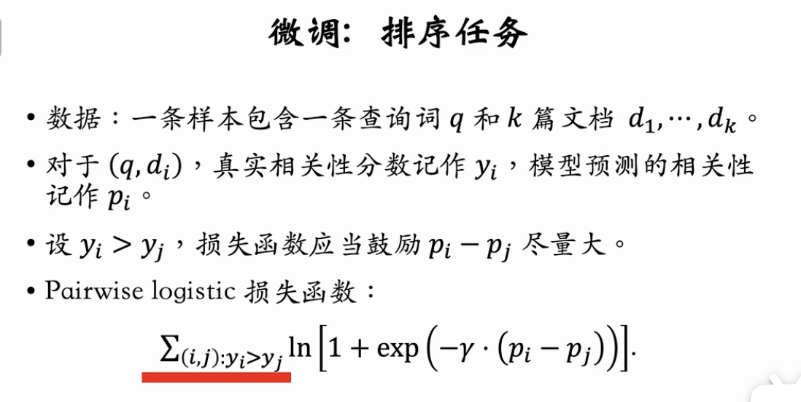
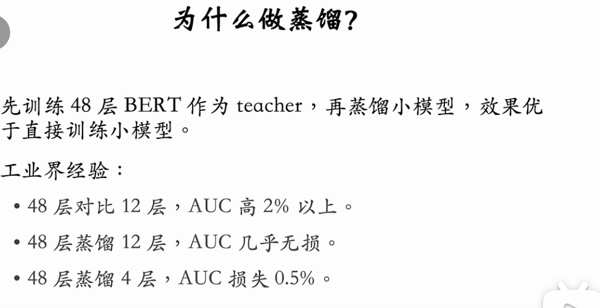
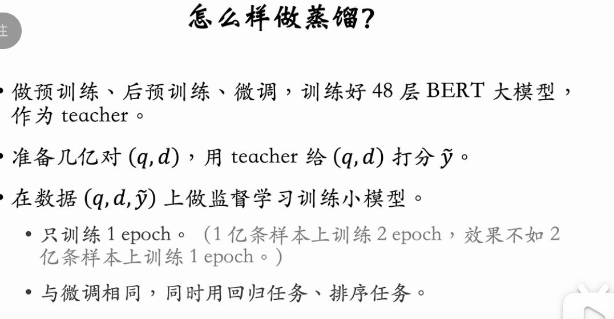

目前（2024 年）搜索引擎主流的相关性模型是 BERT，包括交叉 BERT、双塔 BERT。这节课的内容是模型的训练，具体分为以下 4 个步骤。

1. 预训练：用 MLM 等任务预训练模型。
2. 后预训练：利用用户的点击、交互数据训练模型。
3. 微调：用人工标注的相关性数据训练模型。
4. 蒸馏：得到更小的模型，加速线上的推理。
   
   

---

基于王树森教授的《搜索引擎技术》第九讲（相关性 05），本节课深入讲解了工业界如何**端到端训练**一个高性能的相关性 BERT 模型。

训练流程已从早期的“预训练 -> 微调”进化为更复杂的四阶段流程。这一套组合拳（特别是**后预训练**和**蒸馏**）是各大厂（百度、Google、字节等）提升搜索质量的核心秘密武器。

### 核心训练流程：四步走

1.  **预训练 (Pre-training)**：通用语言理解。
2.  **后预训练 (Post-Pretraining / Pre-finetuning)**：利用海量点击数据注入业务知识。**（提分关键）**
3.  **微调 (Fine-tuning)**：利用人工标注数据对齐人类标准。
4.  **蒸馏 (Distillation)**：大模型教小模型，实现线上高性能推理。

---

### 第一步：预训练 (Pre-training)

- **方法**：经典的 MLM (Masked Language Model)。
- **数据**：通用语料（维基百科等） + **自有文档库**。
- **目的**：让模型学会基础的字词句法和世界知识。这一步非常成熟，可以直接用开源模型（如 ERNIE, RoBERTa）作为起点。

### 第二步：后预训练 (Post-Pretraining) —— **提分神器**

这是工业界与学术界最大的 GAP 之一。利用**10 亿级**的用户点击行为数据，让模型“见多识广”。

1.  **核心思想**：
    - 人工标注数据太贵且少（几百万条顶天了）。
    - **用户行为数据**（点击、交互）虽然有噪声，但规模无限（要多少有多少），且包含强烈的相关性信号（用户点了通常意味着相关）。
2.  **数据构建 (The "Teacher" Method)**：
    - **挖掘日志**：从搜索日志中抽取 10 亿 对 `<Query, Doc>` 及对应的用户行为特征 $X$（点击率 CTR、交互率、停留时间等）。
    - **训练映射模型 $T$**：先用少量人工标注的样本训练一个小模型（如 GBDT），学习 $X \rightarrow Y$ 的映射关系。
    - **自动打标**：用这个小模型 $T$，给 10 亿 数据打上“伪标签” $\hat{y}$。
3.  **训练任务**：
    

    - **回归任务**：拟合 $\hat{y}$。
    - **排序任务**：拟合 Pairwise 序关系。
    - **MLM 任务**：**关键点**。必须保留预训练的 MLM 任务，防止在学习相关性的同时遗忘了基础语言知识（Catastrophic Forgetting）。

### 第三步：微调 (Fine-tuning)

- **数据**：几万 ~ 几百万条**高质量人工标注数据**。
- **目的**：将模型从“拟合用户点击”（含有噪声和偏差）纠正为“拟合人类专家判断”（Clean Label）。
- **损失函数 (Loss Function)**：
  - **回归 (Regression)**：MSE 或 Cross-Entropy。有利于 **AUC** 指标。
  - **排序 (Ranking)**：Pairwise Logistic Loss。有利于 **正逆序比 (PNR)** 指标。
  - **最佳实践**：同时优化这两个 Loss（加权求和）。
- **误区**：**不要把相关性当做多分类任务**（不要用 CrossEntropy 处理 4 个类别），因为“高->中”的错误远轻于“高->无”的错误。回归或排序 Loss 能保留这种序关系。

### 第四步：蒸馏 (Distillation) —— **线上落地的关键**

线上精排需要极高的 QPS，无法跑 48 层甚至 12 层的大 BERT。必须压缩。

1.  **Teacher-Student 架构**：
    - **Teacher**：越大越好（如 48 层 BERT，参数量 10 亿+）。先走完前三步把它训到极致。
    - **Student**：线上实际跑的小模型（如 4 层或 12 层）。
2.  **为什么蒸馏有效？**
    - **数据量压制**：用 Teacher 给几亿条无标签数据打分，Student 学习这些分数。这比直接用几百万人工数据训 Student 效果好得多。
    - **Dark Knowledge**：Teacher 输出的 Logits 包含了比 Hard Label 更丰富的信息（比如“这个文档虽然是不相关，但其实有点像相关的”）。
3.  **避坑指南 (Best Practices)**：
    - **Student 也要预热**：Student 模型本身也要先走完 Pretrain -> Post-Pretrain -> Finetune 流程，再开始被蒸馏。这比随机初始化效果好。
    - **不要迷信逐层蒸馏**：让 Student 的中间层去拟合 Teacher 的中间层，**在数据量足够大（亿级）时是伪命题**。直接拟合最终输出分数（Logits）既简单效果又好。
    - **不要迷信多级蒸馏**：48 层 -> 12 层 -> 4 层，不如直接 48 层 -> 4 层。

### 总结

这套流程的核心逻辑是**数据飞轮**：

1.  用无限的**无标数据**做预训练。
2.  用无限的**弱标数据**（用户行为）做后预训练。
3.  用少量的**精标数据**做微调。
4.  用大模型生成的无限**蒸馏数据**训小模型。

最终产出一个**既聪明（理解语义）、又懂业务（懂点击）、还跑得快（蒸馏过）**的线上模型。

---
