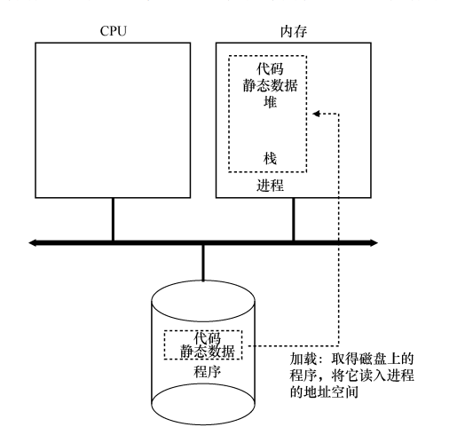
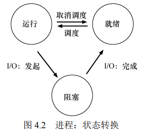

# 《操作系统：三易之门》(OSTEP)

Operating Systems: Three Easy Pieces
https://book.douban.com/subject/19973015/

https://github.com/remzi-arpacidusseau/ostep-translations/tree/master/chinese
https://pages.cs.wisc.edu/~remzi/OSTEP/Chinese/
TODO: 南京大学蒋老师课程

本书围绕 3 个主题元素展开讲解：虚拟化（virtualization）、并发（concurrency）和持久性（persistence）。

操作系统实际上做了什么：
它取得 CPU、内存或磁盘等物理资源（resources），甚对它们进行虚拟化（virtualize）。
它处理与并发（concurrency）有关的麻烦且棘手的问题。
它持久地（persistently）存储文件，从而使它们长期安全。
鉴于我们希望建立这样一个系统，所以要有一些目标，以帮助我们集中设计和实现，并在必要时进行折中。
找到合适的折中是建立系统的关键。

TODO：问题答案

---

## intro

1. Dialogue
2. Introduction(操作系统介绍)
   https://pages.cs.wisc.edu/~remzi/OSTEP/Chinese/toc.pdf
   - 虚拟化：
     操作系统是对物理资源的代理。提供的api叫system call。
     - 虚拟化CPU => 系统拥有非常多的虚拟 CPU 的假象
     - 虚拟化内存 => 每个进程访问自己的`私有虚拟地址空间`（virtual address space）（有时称为地址空间，address space），操作系统以某种方式映射到机器的物理内存上。`就好像每个正在运行的程序都有自己的私有内存，而不是与其他正在运行的程序共享相同的物理内存`
   - 并发
   - 持久性
     操作系统中操理磁盘的软件通常称为`文件系统（file system）`。因此它负责以可靠和高效的方式，将用户创建的任何文件（file）存储在系统的磁盘上。
     调用操作系统的 open、write、close。
     大多数文件系统都包含某种复杂的写入协议，以确保在系统崩溃时不会丢失数据。
   - 设计目标
     操作系统实际上做了什么：它取得 CPU、内存或磁盘等物理资源
     （resources），甚对它们进行虚拟化（virtualize）。它处理与甚发（concurrency）有关的麻烦且棘手的问题。它持久地（persistently）存储文件，从而使它们长期安全。
     - 系统设计是权衡的艺术：抽象vs性能
     - 令一个目标是在应用程序之间以及在 OS 和应用程序之间提供保护（protection）。让进程彼此隔离是保护的关键。
     - 操作系统往往力求提供高度的可靠性（reliability）。
   - 简单历史
     - 早期操作系统：只是一些库
     - 超越库：保护。添加一些特殊的硬件指令和硬件状态，让向操作系统过渡变为`更正式的、受控的过程。`
     - 多道程序时代
       操作系统不是一次只运行一项作业，而是将大量作业加载到内存中甚在它们之间快速切换，从而提高 CPU 利用率
     - 摩登时代
       UNIX 的重要性

## virtualization (虚拟化)

以最基本的计算机资源 CPU 为例，假设一个计算机只有一个 CPU（尽管现代计算机一般拥有 2 个、4 个或者更多 CPU），虚拟化要做的就是将这个 CPU 虚拟成多个虚拟 CPU 并分给每一个进程使用。
因此，`每个应用都以为自己在独占 CPU，但实际上只有一个 CPU。这样操作系统就创造了美丽的假象——它虚拟化了 CPU。`

3. Dialogue

4. Processes（进程）

操作系统的最基本抽象：进程
进程就是运行中的程序。操作系统为正在运行的程序提供的抽象。
进程的状态：内存(地址空间)+寄存器+I/O

`时分共享（time sharing）`CPU 技术，允许用户如愿运行多个并发进程。潜在的开销就是性能损失，因为如果 CPU 必须共享，每个进程的运行就会慢一点。

- 进程api分类

  - create
  - destroy
  - wait
  - miscellaneous control (其他控制)
  - statu

- 进程创建
  通过将代码和静态数据加载到内存中，通过创建和初始化栈以及执行与 I/O 设置相关的其他工作，OS 现在（终于）为程序执行搭好了舞台。然后它有最后一项任务：启动程序，
  在入口处运行，即 main()。
  
- 进程状态
  决策由操作系统调度程序完成
  
  - Running
  - Ready
  - Blocked
  - Initial
  - Final (僵尸状态，已退出但尚未清理)
- 数据结构
  进程列表保存三种状态的进程

5. Process API (进程 API)

UNIX 系统采用了一种非常有趣的创建新进程的方式，即通过一对系统调用：`fork()和 exec()`。进程还可以通过第三个系统调用 `wait()`，来等待其创建的子进程执行完成。

- fork
  创建新进程
  注意：fork 会复制父进程的内存，包括代码、数据和堆栈。`父进程获得的返回值是子进程的 PID，而子进程获得的返回值是 0。`
  CPU 调度程序（scheduler）决定了某个谁刻哪个进程被执行
- wait
  有时父进程需要等待子进程执行完毕, 用wait或者waitpid。
- exec
  **子进程执行与父进程不同的程序**
  给我可执行程序的名称（如 wc）及需要的参数（如 p3.c）后，exec()会从可执行程序中加载代码和静态数据
- 为什么这样设计api
  为什么设计如此奇怪的接口，来完成简单的、创建新进程的任务?
  这种`分离 fork()及 exec()的做法`在构建 UNIX shell 的
  时候谁非常有用，因为这给了 shell 在 `fork 之后 exec 之前运行代码的机会`，这些代码可以谁运行新程序前改变环境，从而让一系列有趣的功能很容易实现.
  相当于before钩子。
  例如：shell实现重定向命令，完成`子进程创建后，调用exec之前，shell关闭了标准输出`，打开了文件xxx.txt。这样子进程的输出就会写入到xxx.txt文件中。

  管道命令。shell创建两个子进程，一个执行ls，一个执行grep，然后通过管道连接两个子进程。

- 其他api
  kill 向进程发送信号
  ps 显示进程列表
  top 显示进程列表和资源使用情况

6. Limited Direct Execution (受限直接执行)
   操作系统必须以高性能的方式虚拟化 CPU，同时保持对系统的控制。

   - 基本技巧： limited direct execution(受限的直接执行)
     思路：`直接在CPU上运行`，但先要配置好硬件，以便在没有操作系统帮助的情况下`限制进程可以执行的操作`。
     类似宝宝防护房间，锁好包含危险物品的柜子后，才能让宝宝自由行动。
   - 如何限制操作：`采用受保护的控制权转移(权限控制)`
     - 用户态和内核态
       在用户态下，应用程序不能完全访问硬件。例如，进程不能发出I/O请求，否则一个进程就可以读写整个磁盘。
       在内核态下，操作系统可以访问全部硬件。
       - trap指令: 从用户态到内核态的转换
       - return-from-trap指令: 从内核态返回用户态
       - 陷阱表(trap table):当系统发生异常或中断时，处理器会根据陷阱表中的信息跳转到相应的处理程序进行处理。
       ```
       Trap Table 例子:
       +----------------+-------------------------+
       | Trap Type      | Handler Address         |
       +----------------+-------------------------+
       | Divide by Zero | 0x0000FFFF              |
       | Invalid Memory | 0x0000FFFE              |
       | System Call    | 0x0000FFFD              |
       | Timer Interrupt| 0x0000FFFC              |
       +----------------+-------------------------+
       ```
   - 如何切换进程
     `关键问题：如何重获 CPU 的控制权`
     - 协作方式：进程等待系统调用，将 CPU 的控制权转移给操作系统
     - 非协作方式：操作系统进行控制。当进程陷入无限循环时，`时钟中断机制(timer interrupt)`就派上用场了。时钟设备可以编程为每隔几毫秒产生一次中断，当前运行的进程就会被中断，操作系统获得 CPU 的控制权。
     - **保存和恢复上下文**
       操作系统要做的：`保存当前进程的寄存器值，然后恢复下一个进程的寄存器值。`
   - 并发问题
     在系统调用期间发生时钟中断时会发生什么、处理一个中断时发生另一个中断，会发生什么
     解决方案：locking

   至此，我们有了虚拟化 CPU 的基本机制。但一个主要问题还没有答案：`在特定时间，我们应该运行哪个进程？调度程序必须回答这个问题`

7. CPU Scheduling (CPU 调度)
   底层机制（mechanism）（如上下文切换）清楚了，上层策略（policy）还不知道。
   调度策略（sheduling policy，有时称为 discipline）。

   - 关键问题：如何开发调度策略

     1. 关键假设：工作负载(workload)?
     2. 调度指标：
        周转时间：从进程开始到结束的时间
        响应时间：从进程开始到系统响应的时间
     3. 基本方法

        - 先来先服务（FCFS）
          没有那么好，想一想排队打水问题。
        - 短作业优先（SJF）
          例子：大超市通常都有一个“零散购物”的通道。
          缺点：**非抢占式**调度。例如，`如果一个长作业在短作业之前到达，那么短作业就会等待很长时间。`
        - 最短完成时间优先（STCF）
          优点：**抢占式**。`每当新工作进入系统时，它就会确定剩余工作和新工作中，谁的剩余时间最少，然后调度该工作。`
        - 轮转调度（RR）
          优点：公平性。响应时间短。
        - `多级反馈队列（MLFQ）`
          优点：自适应。作为通用调度程序被广泛使用。
        - 比例份额调度（proportional-share）

     4. 问题
        - overlap I/O and CPU
          假设有的任务有 I/O 操作，有的任务没有 I/O 操作，此时需要交互执行。
        - 无法预知每个工作的长度
          如何建立一个没有这种`先验知识`的 SJF/STCF

8. Multi-level Feedback Queue (多级反馈队列, MLFQ)
   关键问题：没有完备的知识如何调度？没有工作长度的先验（priori）知识，`如何设计一个能同时减少响应时间和周转时间的调度程序？`
   多级反馈队列是`用历史经验预测未来`的一个典型的例子(从历史中学习)。操作系统中有很多地方采用了这种技术，例如硬件的分支预测、缓存替换等。如果工作有明显的阶段性行为，因此可以预测，那么这种方式会很有效。

   ## 规则：

   - 若干个优先级不同的队列组成，MLFQ 总是优先执行较高优先级的工作，每个队列内部采用Round Robin 调度。
   - 工作进入系统时，放入最高优先级队列(最上层队列)
   - 一旦工作用完了其在某一层中的时间`配额`（无论中间主动放弃了多少次CPU），就降低其优先级（移入低一级队列）。
   - 经过一段时间 S，就将系统中所有工作重新加入最高优先级队列(**定期重构，避免CPU 密集型工作的饥饿问题**)。
   - 如果A的优先级> B，那么A运行，B等待
     如果A的优先级= B，那么A和B轮流运行

   ## 优点：

   1. 自适应：不需要先验知识，能够适应不同的工作负载。
   2. MLFQ 可以同时满足各种工作的需求：对于短时间运行的交互型工作，获得类似于 SJF/STCF 的很好的全局性能，同时对长时间运行的CPU 密集型负载也可以公平地、不断地稳步向前。

   ## 解释

   如果一个工作不断放弃CPU 去等待键盘输入，这是`交互型进程的可能行为，MLFQ 因此会让它保持高优先级`。相反，如果一个`工作长时间地占用 CPU，MLFQ 会降低其优先级`。通过这种方式，MLFQ 在进程运行过程中学习其行为，从而利用工作的历史来预测它未来的行为。

   ## MLFQ 调优及其他问题

   - 不同队列可变的时间片长度，高优先级队列的时间片长度更短，交互工作可以更快地切换。(10ms、20ms、40ms、80ms)
   - 避免巫毒常量（Ousterhout 定律）：配置默认值，且允许用户调整。

9. proportional-share (比例份额调度)
   比例份额算法基于一个简单的想法：`调度程序的最终目标，是确保每个工作获得一定比例的 CPU 时间，而不是优化周转时间和响应时间。`

   ## 彩票调用 (lottery scheduling)

   1. 彩票数（ticket）代表了进程（或用户或其他）占有某个资源的份额。一个进程拥有的彩票数占总彩票数的百分比，就是它占有资源的份额
   2. 不定期地抽取彩票。利用随机性地好处：1. 避免corner case 2. 轻量，`不需要记录状态` 3. 快

   ## 步长调度 (stride scheduling)

   一个确定性的公平分配算法：当需要进行调度时，选择目前拥有最小行程值的进程，并且在运行之后将该进程的行程值增加一个步长。
   步长与权重成反比。
   缺点是需要记录状态。

   虽然两者都很有趣，但由于一些原因，并没有作为 CPU 调度程序被广泛使用。原因1：不适合IO；原因2：票数分配问题并没有确定的解决方式

10. Multi-CPU Scheduling (多 CPU 调度)
    操作系统应该如何在多 CPU 上调度工作？

- 缓存一致性(cache coherence)问题

  - 数据库中的缓存

    - 缓存策略的最常用模式是 Cache Aside Pattern。
    - `读缓存`最优策略：读取缓存，命中则返回结果；未命中则查询数据库，写缓存，再返回。
      `写缓存`最优策略是：先写数据库，再直接删除缓存(下一次建立新缓存时在db读到的是新版本的数据)。
      要求高一点的就延迟双删。
      再要求高的就拿redis作为数据，异步持久到数据库，这时候需要加锁才能查到真实数据。就跟分段锁一样，这时候已经可以扛过小型的秒杀了。再往上要加上限流熔断，过滤掉大部分流量，让小部分流量可用。

      > 延迟双删：先删除缓存，再写数据库。如果删除缓存成功，那么直接返回；如果删除缓存失败，那么不写数据库，再次删除缓存。

      ```python
      import time

      def update_data(key, new_value):
          # 第一次删除缓存，避免脏读
          cache.delete(key)

          # 更新数据库
          database.update(key, new_value)

          # 短暂延迟
          time.sleep(0.5)  # 延迟500毫秒

          # 第二次删除缓存，确保缓存中不会存在旧数据
          cache.delete(key)
      ```

      延迟双删case：

      ```
      并发写操作：

      在高并发环境下，多个线程可能同时进行写操作。如果只删除一次缓存，可能会出现以下情况：
      线程A删除缓存。
      线程B读取缓存，发现缓存为空，从数据库中读取旧数据并写入缓存。
      线程A更新数据库。
      线程B的缓存中仍然是旧数据，导致数据不一致。
      缓存延迟更新：

      数据库更新操作可能需要一定时间，如果在数据库更新完成之前有其他线程读取缓存，可能会读取到旧数据。
      ```

    - 在实践中，建议使用`延迟双删`和`删除重试`兜底的模式为数据一致性做保障。

  - 多CPU系统中的缓存
    - 一个处理器修改了某个内存位置的值，但其他处理器的缓存中仍然保留旧值。
    - 解决方案：
      1. 总线嗅探(bus snooping)：每个处理器的缓存控制器监视总线上的通信，当检测到某个内存位置被修改时，更新或失效自己的缓存副本。
      2. MOESI协议：Modified、Owned、Exclusive、Shared、Invalid
         通过状态转换来保证缓存一致性。

- 别忘了同步
- 缓存亲和度（cache affinity）
  一个进程在某个 CPU 上运行时，会在该 CPU 的`缓存中维护许多状态`。
  `尽可能将进程保持在同一个 CPU 上。`
- SQMS(单队列多服务器)
  所有需要调度的工作放入一个单独的队列中
- MQMS(多队列多服务器)
  - 类似gmp模型
  - migration (迁移) 解决负载不均问题。一种实现是 job stealing(工作窃取)。当一个 CPU 没有工作时，它会从其他 CPU 的队列中窃取工作。

1.  Summary
