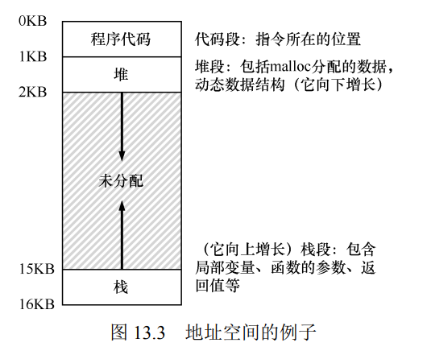

12. 关于内存虚拟化的对话
    用户程序生成的每个地址都是虚拟地址（every address generated by a user program is a virtual address）。
    为什么要这么做？
    - `主要是为了易于使用(ease of use)。`操作系统会让每个程序觉得，它有一个很大的连续地址空间（address space）来放入其代码和数据。
    - 其次是为了`隔离（isolation）和保护（protection）`。
13. Address Spaces (抽象：地址空间)

- 多道程序和时分共享
- 地址空间
  - 是运行的程序看到的系统中的内存，是物理内存的抽象。
  - 一个进程的地址空间包含运行的程序的所有`内存状态`。
    现在假设只有这 3 个部分：`代码、栈和堆。`
    
- 目标
  - 透明（transparency），对程序无感知。
  - 效率（efficiency）。
  - 保护（protection）。每个进程都应该在自己的独立环境中运行，避免其他出错或恶意进程的影响。
- `你看到的所有地址都不是真的`
  只有操作系统，通过精妙的虚拟化内存技术，知道这些指令和数据所在的物理内存的位置。所以永远不要忘记：如果你在一个程序中打印出一个地址，那就是一个虚拟的地址。虚拟地址只是提供地址如何在内存中分布的假象，只有操作系统（和硬件）才知道物理地址。

14. Memory API (内存 API)
    接口简洁。
    主要讨论堆内存。

    - malloc：传入要申请的堆空间的大小，它成功就返回一个指向新申请空间的指针，失败就返回 NULL(值为 0 的宏)

      ```c
      int *y = malloc(10 * sizeof(int));
      malloc(strlen("hello") + 1);  // +1 是为了存放字符串结束符
      ```

    - free：传入一个指针，它会释放这个指针指向的内存。

      ```c
      free(y);
      ```

    `内存管理常见错误:`

    - 忘记分配内存。例如 segmenation fault 段错误。
    - 没有分配足够的内存。缓冲区溢出(buffer overflow)。
    - 忘记初始化分配的内存。可能会导致未定义的行为。
    - 忘记释放内存。内存泄露（memory leak）。
    - 在用完之前释放内存 ：垂悬指针（dangling pointer）。
    - 反复释放内存：双重释放（double free）。
    - 错误地调用 free.

    为什么在你的进程退出时没有内存泄露？
    **系统中实际存在两级内存管理。**
    第一级是操作系统的内存管理，第二级是进程的内存管理。
    `无论进程如何，操作系统也会在程序结束运行时，收回进程的所有内存（包括用于代码、栈，以及相关堆的内存页）。`

    `底层操作系统支持：`
    malloc 和 free 不是系统调用，而是库调用，建立在底层系统调用之上。
    底层系统调用是`brk和mmap。`
    brk 用来改变程序分断（break）的位置：堆结束的位置。
    mmap()可以在程序中创建一个匿名（anonymous）内存区域。

15. Address Translation (地址转换)
    TODO

CPU 虚拟化的原则：LDE(受限直接执行)。
操作系统应该尽量让程序自己运行，同时通过在关键点的及时介入（interposing），来保持对硬件的控制。
**高效和控制**是现代操作系统的两个主要目标。

## 机制：基于硬件的地址转换（hardware-based address translation）

关键是硬件支持。硬件快速地将所有内存访问操作中的虚拟地址（进程自己看到的内存位置）转换为物理地址（实际位置）。

## 实现：`基址加界限`的动态重定位（base and bounds dynamic relocation）：

该技术通过`基址寄存器`和`界限寄存器`来实现地址转换和内存保护。
物理地址 = 基址寄存器 + 虚拟地址
缺点：块内存区域中大量的空间被浪费(内部碎片)。已经分配的内存单元内部有未使用的空间（即碎片）。

16. Segmentation (分段)
    TODO

    > MMU: 内存管理单元

    - 段的定义：一个段是地址空间里的一个连续定长的区域，在典型的地址空间里有 3 个逻辑不同的段：代码、栈和堆。
    - 分段（Segmentation）是操作系统中的一种内存管理技术，用于更有效地组织和管理进程的地址空间。`它将进程的地址空间划分为若干不同大小的逻辑段，每个段都有自己的起始地址和长度，并且通常对应于程序中的逻辑单元，如代码段、数据段和栈段。`
    - 现代操作系统通常结合**分页（Paging）**和**分段**，或者采用纯分页的方式来管理内存，以发挥各自的优势。
    - 分段避免了地址空间的逻辑段之间的大量潜在的内存浪费，能更好地支持稀疏地址空间。

17. Free Space Management (空闲空间管理)

18. Introduction to Paging (分页简介)

19. Translation Lookaside Buffers (TLB)

20. Advanced Page Tables (高级页表)

21. Swapping: Mechanisms (交换：机制)

22. Swapping: Policies (交换：策略)

23. Complete VM Systems (完整的虚拟机系统)

24. Summary
