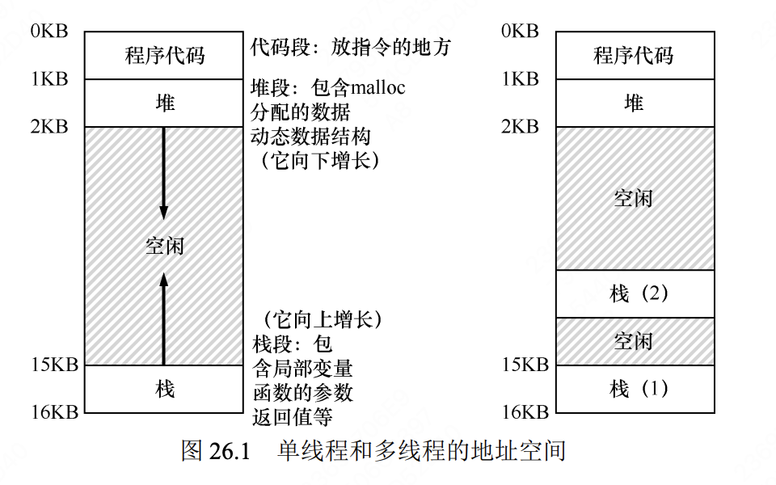

## concurrency (并发)

25. Dialogue
    首先，操作系统必须用锁（lock）和条件变量（condition variable）这样的原语，来支持多线程应用程序。
    其次，`操作系统本身是第一个并发程序` ———— 它必须非常小心地访问自己的内存。

26. Concurrency and Threads (并发和线程)
    线程类似于独立的进程，只有一点区别：`它们共享地址空间，从而能够访问相同的数据。`

    - 线程之间的上下文切换类似于进程间的上下文切换。
      对于进程，我们将状态保存到进程控制块（Process Control Block，PCB）。
      对于线程，我们需要一个或多个线程控制块（Thread Control Block，TCB），保存每个线程的状态。切换的状态包括`程序计数器（Program Counter，PC）、寄存器、栈指针（Stack Pointer，SP）等。`

      > 程序计数器：保存下一条要执行的指令的地址

      与进程相比，线程之间的上下文切换有一点主要区别：`地址空间保持不变（即不需要切换当前使用的页表）。`

    - 多线程的进程中，每个线程独立运行，都有自己的栈，这个栈又叫 `thread-local。`
      
    - 核心问题：不可控的调度（uncontrolled scheduling）。
      - 一个线程可能在任何时候被操作系统挂起，然后另一个线程被调度运行。被挂起的原因可能是时间片用完，也可能时间中断发生。
      - 首先，为了保证线程之间的正确性，我们需要一些同步原语（synchronization primitives）。`要求硬件提供一些有用的指令。`以支持原子性。
      - 然后，还需要睡眠/唤醒交互的机制。

27. Thread API (线程 API)

- 每个线程都有自己的栈。线程之间共享数据，值要在堆（heap）或者其他全局可访问的位置。

28. Locks (锁)

并发编程的一个最基本问题：我们希望原子式执行一系列指令，`但由于单处理器上的中断（或者多个线程在多处理器上并发执行），我们做不到`。程序员在源代码中加锁，放在临界区周围，保证临界区能够像单条原子指令一样执行。

- 评价锁

  1. 互斥性（mutual exclusion）：
     只有一个线程可以持有锁。
  2. 公平性（fairness）：
     饥饿（starvation）问题，一个线程可能永远无法获得锁。
  3. 性能（performance）
     单 CPU+多线程；多 CPU+多线程

- 怎样实现一个锁
  参考 golang mutex 演进之路
  - 比较并交换（compare-and-swap，CAS）指令，是一种原子操作，用于实现锁。
  - 使用队列：休眠替代自旋
- 两阶段锁
  Linux 采用的一种古老的锁方案。
  两阶段锁的第一阶段会先`自旋一段时间`，希望它可以获取锁。但是，如果第一个自旋阶段没有获得锁，第二阶段调用者会`睡眠，直到锁可用`。
  hybrid

29. Locked Data Structures (基于锁的并发数据结构)

关键问题：如何给数据结构加锁？

## 并发 Counter

使用懒惰计数器(sloppy counter)实现。
懒惰计数器是一种在多线程环境下用于提高计数操作性能的技术。通常情况下，多个线程同时更新一个共享的全局计数器会导致严重的锁竞争，影响性能。懒惰计数器通过以下方式优化：

1. 线程本地计数器：为每个线程维护一个本地计数器，线程在本地累加计数，减少对全局计数器的访问频率。
2. 阈值合并：当本地计数器达到预设的阈值时，才将本地计数累加到全局计数器中。这种方法减少了线程之间的同步开销，提升了并发性能。

`batching`的思想。

```python
from threading import Lock, Thread
from collections import defaultdict

class LazyCounter:
    def __init__(self, threshold=10):
        self.global_count = 0
        self.threshold = threshold
        self.lock = Lock()
        self.local_counts = defaultdict(int)

    def increment(self, thread_id):
        self.local_counts[thread_id] += 1
        if self.local_counts[thread_id] >= self.threshold:
            with self.lock:
                self.global_count += self.local_counts[thread_id]
                self.local_counts[thread_id] = 0

    def get_value(self):
        with self.lock:
            total = self.global_count + sum(self.local_counts.values())
        return total

# 使用示例
def worker(counter, thread_id, increments):
    for _ in range(increments):
        counter.increment(thread_id)

if __name__ == "__main__":
    counter = LazyCounter(threshold=5)
    threads = []
    for i in range(4):
        t = Thread(target=worker, args=(counter, i, 20))
        threads.append(t)
        t.start()
    for t in threads:
        t.join()
    print("最终计数:", counter.get_value())
```

## 并发链表

如果方案带来了大量的开销（例如，频繁地获取锁、释放锁），那么高并发就没有什么意义。
实现两种方案（简单但少一点并发，复杂但多一点并发），测试它们的表现。
毕竟，你不能在性能上作弊。结果要么更快，要么不快。

## 并发队列

本质上是一个循环链表。
有两个锁，一个负责队列头，另一个负责队列尾。这两
个锁使得入队列操作和出队列操作可以并发执行，因为入队列只访问 tail 锁，而出队列只访问 head 锁。

```python
import threading

class Node:
    def __init__(self, value=None):
        self.value = value
        self.next = None

class ConcurrentQueue:
    def __init__(self):
        # 初始化假节点
        dummy = Node()
        self.head = dummy
        self.tail = dummy
        # 两个锁分别保护头部和尾部
        self.head_lock = threading.Lock()
        self.tail_lock = threading.Lock()

    def enqueue(self, value):
        new_node = Node(value)
        with self.tail_lock:
            self.tail.next = new_node
            self.tail = new_node

    def dequeue(self):
        with self.head_lock:
            if self.head.next is None:
                return None  # 队列为空
            value = self.head.next.value
            self.head = self.head.next
            return value

# 使用示例
import threading

def producer(queue, items):
    for item in items:
        queue.enqueue(item)
        print(f"Enqueued: {item}")

def consumer(queue, consume_count):
    for _ in range(consume_count):
        item = None
        while item is None:
            item = queue.dequeue()
        print(f"Dequeued: {item}")

if __name__ == "__main__":
    q = ConcurrentQueue()
    producer_thread = threading.Thread(target=producer, args=(q, range(10)))
    consumer_thread = threading.Thread(target=consumer, args=(q, 10))

    producer_thread.start()
    consumer_thread.start()

    producer_thread.join()
    consumer_thread.join()
```

这里的队列（只是加了锁）通常不能完全满足这种程序的需求。更完善的有界队列，在队列空或者满时，能让线程等待。

## 并发 map

参考 java 的 ConcurrentHashMap 实现。
分段(segments)锁。

## 注意：

- 控制流变化时注意获取锁和释放锁；
- 增加并发不一定能提高性能；有性能问题的时候再做优化。
- 避免不成熟的优化（Knuth 定律）
  实现并发数据结构时，先从最简单的方案开始，也就是`加一把大锁来同步`。这样做，你很可能构建了正确的锁。如果发现性能问题，那么就改进方法，只要优化到满足需要即可。正如 Knuth 的著名说法 `“不成熟的优化是所有坏事的根源。`

30. Condition Variables (条件变量)

锁之外的另一个重要同步原语：条件变量。
线程需要检查某一条件（condition）满足之后，才会继续运行。例如，父线程需要检查子线程是否执行完毕 [这常被称为 join()]。这种等待如何实现呢？

关键问题：如何等待一个条件？

## 定义

条件变量是一个显式`队列`，当某些执行状态（即条件，condition）不满足时，线程可以把自己加入队列，等
待（waiting）该条件。另外某个线程，当它改变了上述状态时，就可以唤醒一个或者多个等待线程（通过在该条件上发信号），让它们继续执行。

## API

- wait()：线程调用 wait() 时，它会释放锁，并且进入条件变量的等待队列。
- signal()：唤醒一个等待线程。
- broadcast()：唤醒所有等待线程。

31. Semaphores (信号量)

Dijkstra 及其同事发明了信号量。
有程序员会因为简单实用，只用信号量，不用锁和条件变量。
在有个数限制的资源上，信号量是一种更好的选择.eg：BoundedBuffer。

## API

- `__init__(self, value=1)`：初始化信号量。value 参数指定信号量的初始计数，默认为 1。
- `acquire(self, blocking=True, timeout=None)`：尝试获取信号量。如果信号量的计数大于 0，则将其减 1 并返回 True。如果计数为 0，根据 blocking 参数决定是阻塞等待还是立即返回 False。通过调整 blocking 和 timeout 参数，可以灵活控制线程等待资源的行为，避免线程长时间阻塞或在资源不可用时立即返回。
- `release(self)`：释放信号量，将其计数加 1，并唤醒一个等待的线程（如果有）。

## 使用场景

- 限制并发访问：控制同时访问资源的线程数量，防止资源耗尽。
- 线程同步：协调线程间的执行顺序，确保特定的执行流程。
- 资源管理：有效管理和分配有限的资源，提高资源利用率。

32. Concurrency Bugs (并发 Bug)

- 非死锁缺陷
  - 违反原子性(atomicity violation)
  - 顺序违反(ordering violation)
    多线程环境中，线程的执行顺序不符合预期，导致程序逻辑错误或数据不一致。
    解决方案：事件同步机制(await)
- 死锁

33. Event-based Concurrency (基于事件的并发)

基于事件的并发针对两方面的问题：

- 正确处理并发事件很有难度，忘加锁、死锁和其他烦人的问题会发生。
- 开发者需要手动控制多线程在某一时刻的调度。某些时候操作系统的调度并不是最优的。

关键问题：不用线程，如何构建并发服务器 => 协程

## 基本想法：事件循环

1. 管理任务队列
2. 处理 I/O 事件
   重要 api: select/poll/epoll/kqueue
   通过使用 select、poll、epoll、kqueue 等 I/O 多路复用机制，事件循环能够`监听多个文件描述符的状态变化`（如可读、可写），并在相应的事件发生时执行相应的回调函数。
3. 调用回调函数，实现非阻塞操作

## 一个问题：阻塞系统调用

我们在基于事件的系统中必须遵守一条规则：`不允许阻塞调用。`
解决方案：`异步 I/O`
一些系统提供了基于中断（interrupt）的方法。此方法使用 UNIX
`信号（signal）在异步 I/O 完成时通知应用程序`，从而消除了重复询问系统的需要。

## 另一个问题：状态管理

手工栈管理（manual stack management）。
两种流派：`有栈协程和无栈协程`

34. Summary

---

## 关键并发术语

**临界区、竞态条件、不确定性、互斥执行**
这 4 个术语对于并发代码来说非常重要，我们认为有必要明确地指出。

- 临界区（critical section）是访问共享资源的`一段代码`，资源通常是一个变量或数据结构。
- 竞态条件（race condition）出现在多个执行线程大致同时进入临界区时，它们都试图更新共享的数据结构，导致了令人惊讶的（也许是不希望的）结果。
- 不确定性（indeterminate）程序由一个或多个竞态条件组成，程序的输出因运行而异，具体取决于哪些线程在何时运行。这导致结果不是确定的（deterministic），而我们通常期望计算机系统给出确定的结果。
- 为了避免这些问题，线程应该使用某种互斥（mutual exclusion）原语。这样做可以`保证只有一个线程进入临界区，从而避免出现竞态，并产生确定的程序输出。`
