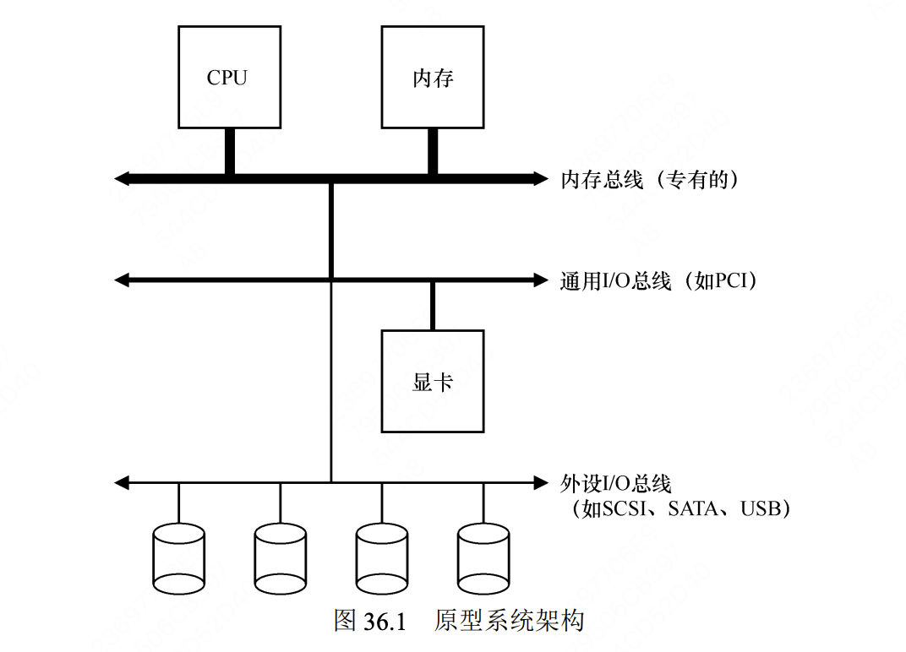

## persistence (持久性)

35. Dialogue
    让信息持久，尽管计算机会崩溃，磁盘会出故障或停电，这是一项艰巨而有趣的挑战
36. I/O Devices (I/O 设备)

## I/O 应该如何集成进系统中？其中的一般机制是什么？如何让它们变得高效？

分层架构：因为物理布局及造价成本，越快的总线越短
要求高性能的设备（比如显卡）离 CPU 更近一些，低性能的设备离 CPU 远一些
将磁盘和其他低速设备连到外围总线的好处很多，其中较为突出的好处就是你可以在外围总线上连接大量的设备。

## 操作系统检查设备状态时如何避免频繁轮询，从而降低管理设备的 CPU 开销？

- 利用中断减少 CPU 开销
  当设备完成了自身操作，会抛出一个硬件中断，引发 CPU 跳转执行操作系统预先定义好的中断服务例程（Interrupt Service Routine，ISR），或更为简单的中断处理程序（interrupt handler）。

37. Hard Disk Drives (硬盘驱动器)

38. Redundant Disk Arrays (RAID)

39. Files and Directories (文件和目录)

40. File System Implementation (文件系统实现)

41. Fast File System (FFS) (快速文件系统)

42. FSCK and Journaling (文件系统检查和日志)

43. Log-Structured File System (LFS) (日志结构文件系统)

44. Data Integrity and Protection (数据完整性和保护)

45. Summary

46. Dialogue

47. Distributed Systems (分布式系统)

48. Network File System (NFS) (网络文件系统)

49. Andrew File System (AFS) (安德鲁文件系统)

50. Summary

## appendices

- Virtual Machines

- Monitors

- Lab Tutorial

- Systems Labs

- xv6 Labs
