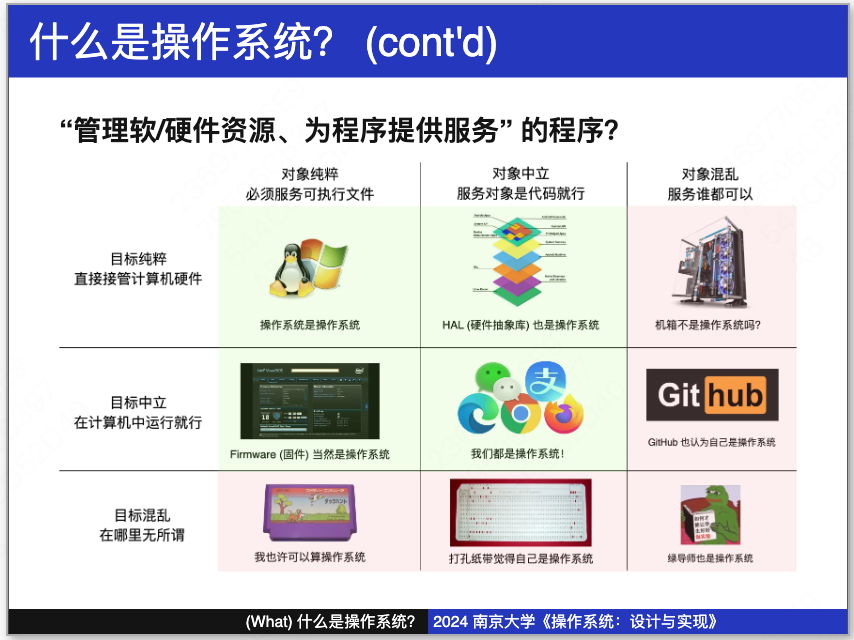
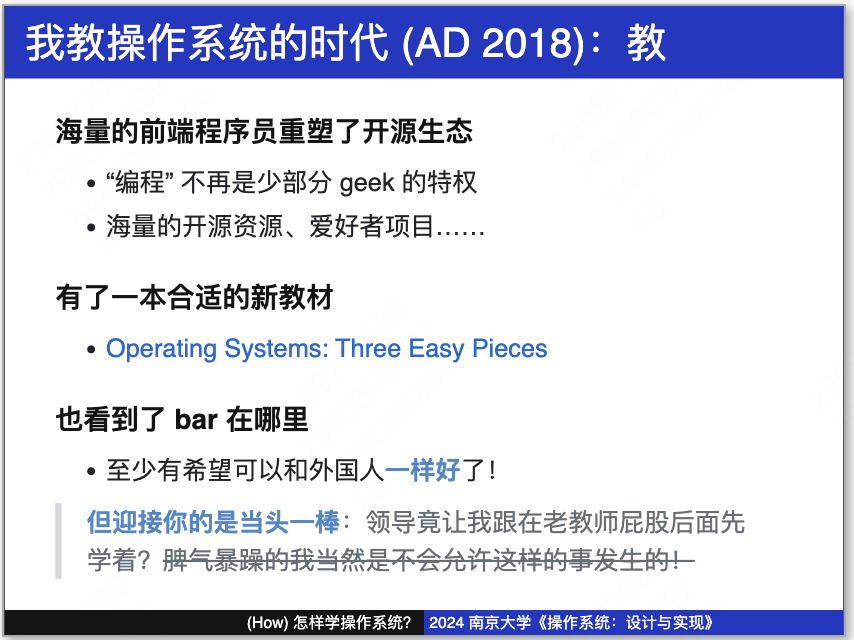
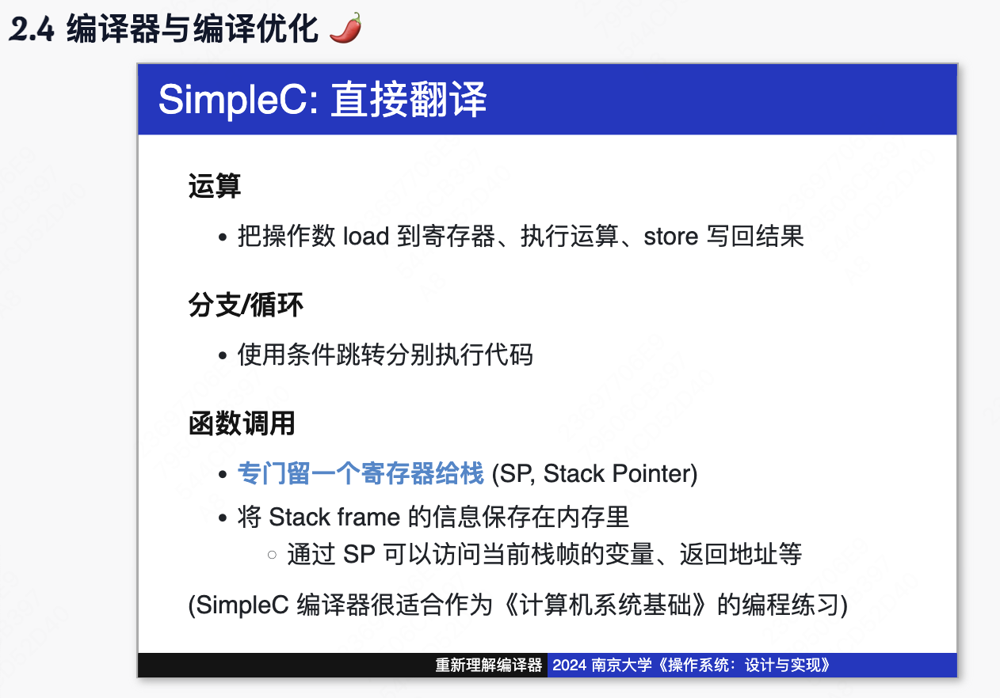

https://jyywiki.cn/OS/2024/
https://www.bilibili.com/video/BV1Xm411f7CM/

## 1. 绪论 操作系统概述 | 应用视角的操作系统 | [M1] pstree

- (Why): 为什么要学操作系统？
- (What): 到底什么是操作系统？
  
  老师说，不需要"精准"的教科书式定义。

操作系统（Operating System，简称 OS）是`管理计算机硬件和软件资源的系统软件。`它为应用程序提供支持，协调各个程序和硬件设备的运行，确保计算机系统的稳定和高效运作。操作系统的主要功能包括：

- **进程管理**：负责创建、调度和终止进程，管理进程之间的通信与同步。
- **内存管理**：分配和回收内存资源，确保各进程有足够的内存运行，同时防止内存冲突。
- **文件系统管理**：组织和管理存储设备上的文件，提供文件的创建、删除、读写等操作。
- **设备管理**：控制和协调输入输出设备的操作，提供设备驱动程序以支持硬件与软件的交互。
- **用户界面**：提供用户与计算机系统交互的接口，如命令行界面（CLI）或图形用户界面（GUI）。

常见的操作系统包括：

- **Windows**：由微软开发，广泛应用于个人电脑和服务器。
- **macOS**：由苹果公司开发，专用于苹果的 Mac 系列电脑。
- **Linux**：开源操作系统，广泛用于服务器、嵌入式系统和个人电脑。
- **Android**：基于 Linux 内核，主要用于移动设备如智能手机和平板电脑。
- **iOS**：由苹果公司开发，专用于 iPhone 和 iPad 等移动设备。

操作系统是计算机系统中不可或缺的部分，为用户和应用程序提供了一个稳定和高效的运行环境。

- (How): 怎么学操作系统？
  

---

- 为什么能创建窗口？
- 为什么 ctrl+C 有时候不能终止程序？
- 为什么有的程序能把组里服务器的 128 个 CPU 用满？

[Stack Overflow: Helping One Million Developers Exit Vim](https://stackoverflow.blog/2017/05/23/stack-overflow-helping-one-million-developers-exit-vim/)

## 2. 绪论 硬件视角的操作系统 | 数学视角的操作系统 | [L0] hello, bare-metal!

- 做减法：把 “不重要” 的部分屏蔽掉
- 推广到学习：如果觉得 “难”，应该有简化的方法

---

- 应用视角
  应用程序 = 计算 + 操作系统 API

  - core utils
  - 系统、工具程序
  - 其他各种应用程序

  
  程序可以用状态机表示，而编译器实现了 “高级语言状态机” 到 “机器指令状态机” 的翻译

  编译正确性: 系统调用是使程序计算结果可见的唯一方法
  状态机的视角：`满足 C/汇编状态机生成的所有 syscall 序列完全一致，任何优化都是允许的`

  C 代码中的不可优化部分：

  - `volatile` 关键字
  - External functions calls (e.g., `printf`); 无法优化带有副作用的函数。

- 硬件视角

  1. 计算机系统的状态机模型
     - 状态：内存、寄存器的数值
     - 初始状态：由系统设计者规定(CPU Reset)
     - 状态转移：从 PC 取指令，执行指令，更新状态

  > 为什么读手册很困难？手册只告诉你 “是什么”、不告诉你 “为什么”

  2. 固件：接管计算机系统的第一个程序
     厂商 “固定” 在计算机系统里的代码
     Firmware：加载存储设备上的引导程序

     计算机系统从 CPU Reset 开始
     CPU Reset 的时候，0x7c00 应该是啥也没有的
     Firmware 的代码扫描了磁盘、加载了它

  3. 从固件到操作系统

- 数学视角

  1. 程序正确性证明
     数学的 “严格性” 都是由人类保证的
     经典案例：“所有三角形都是等腰三角形”

     `程序是一种 “数学严格” 的对象`
     Everything is a state machine

     **我们应该把需要证明的性质写成 assertions**。例如 `asset u.prev.next == u。`
     至少可以避免 “悄悄出错” 的情况发生。

  2. 为操作系统建模
     操作系统的两个视角

     - 应用视角：对象 + API。应用通过 syscall 访问操作系统
     - 机器视角：运行在计算机硬件上的一个普通程序

     [30 行代码讲完《操作系统》](./os-model)
     进程
     系统调用
     上下文切换
     调度

  3. 数学视角的操作系统
     调度：状态机的选择不确定
     I/O：系统外的输入不确定

  | 模块   | 系统调用     | 行为                           |
  | ------ | ------------ | ------------------------------ |
  | 基础   | choose(xs)   | 返回一个 xs 中的随机选择       |
  | 基础   | write(s)     | 向调试终端输出字符串 s         |
  | 并发   | spawn(fn)    | 创建从 fn 开始执行的线程       |
  | 并发   | sched()      | 切换到随机的线程/进程执行      |
  | 虚拟化 | fork()       | 创建当前状态机的完整复制       |
  | 持久化 | bread(k)     | 读取虚拟磁盘块 k 的数据        |
  | 持久化 | bwrite(k, v) | 向虚拟磁盘块 k 写入数据 v      |
  | 持久化 | sync()       | 将所有向虚拟磁盘的数据写入落盘 |
  | 持久化 | crash()      | 模拟系统崩溃                   |

## 3. 并发 多处理器编程 | 并发控制：互斥 (1) | [M2] libco

- 多线程编程模型
  放弃 (1)：状态迁移原子性的假设
  放弃 (2)：程序顺序执行的假设
  放弃 (3)：存在全局指令执行顺序的假设
- 并发控制：互斥 (1)
  人类应对这种复杂性的方法就是退回到不并发。
  `通过互斥实现 stop/resume the world，我们就可以使并发程序的执行变得更容易理解——而只要程序中 “能并行” 的部分足够多，串行化一小部分也并不会对性能带来致命的影响。`

## 4. 并发 并发控制：互斥 (2) | 调试理论与实践

我们希望通过互斥实现 “stop the world” 的并发控制。在许多在共享内存上实现互斥的失败和成功尝试后，我们意识到软件需要和硬件协同工作，并在硬件原子指令基础上实现了基础版本的自旋锁。

- 并发控制：互斥 (2)
  操作系统内核中的互斥：自旋锁
- 调试理论与实践
  需求 → 设计 → 代码 → Fault → Error → Failure
  多写断言：把代码中的 “隐藏性质” 写出来
  AddressSanitizer：AddressSanitizer 通过编译器自动插入和内存相关的断言，实现代码正确性的检查。

## 5. 并发 并发控制：同步 (1) | 并发控制：同步 (2)

我们已经了解如何`通过 “不可优化、保证顺序” 的原子指令实现自旋锁，并在操作系统内核中借助关中断机制实现互斥`。然而，互斥并不总是能满足多个并发线程协作完成任务的需求。如何能便捷地让共享内存的线程协作以共同完成计算任务？

- 并发控制：同步 (1)
  join()
  `同步的本质是线程需要等待某件它所预期的事件发生，而事件的发生总是可以用条件 (例如 depth 满足某个条件，或是程序处于某个特定的状态) 来表达。`因此计算机系统的设计者实现了条件变量，将条件检查和临界区 “放在一起”，以实现线程间的同步。
- 并发控制：同步 (2)

## 6. 并发 真实世界的并发编程 | [L1] pmm

## 7. 并发 并发 Bugs | 应对 (并发) Bugs | [M3] gpt.c

## 8. 虚拟化 操作系统上的进程 | 进程的地址空间 | [M4] crepl

## 9. 虚拟化 系统调用和 UNIX Shell | C 标准库和实现

## 10. 虚拟化 期中测验 (4.28) | Linux 操作系统 | [M5] sperf

## 11. 虚拟化 可执行文件和加载 | 动态链接和加载

## 12. 内核 系统调用、中断和上下文切换 | 进程的实现

## 13. 内核 处理器调度 | 操作系统世界：小结

## 14. 持久化 存储设备原理 | 输入输出设备 | [L2] kmt

## 15. 持久化 文件和设备驱动 | FAT 和 UNIX 文件系统 | [M6] fsrecov

## 16. 持久化 持久数据的可靠性 | 课程总结
