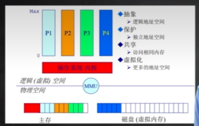
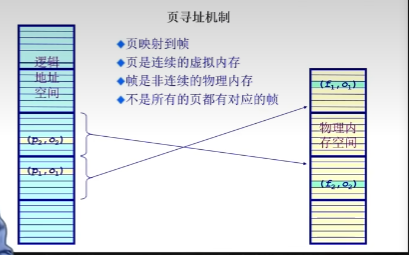
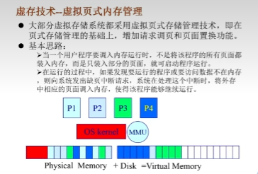
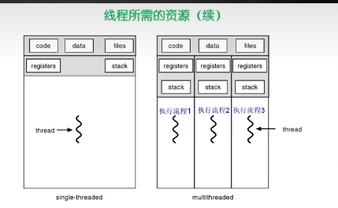
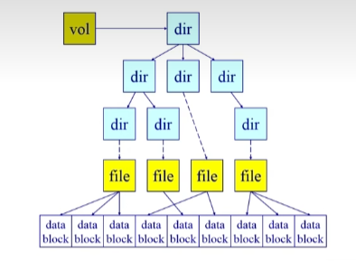
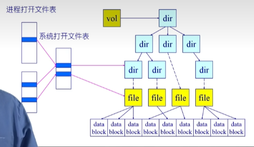
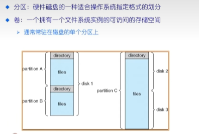
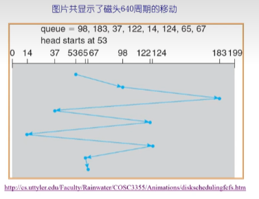

https://github.com/wangfupeng1988/read-notes/blob/master/video/%E6%93%8D%E4%BD%9C%E7%B3%BB%E7%BB%9F.md
https://gjgjh.github.io/%E6%B8%85%E5%8D%8E%E5%A4%A7%E5%AD%A6%E6%93%8D%E4%BD%9C%E7%B3%BB%E7%BB%9F%E7%AC%94%E8%AE%B0.html#/fifo%E7%AE%97%E6%B3%95
[操作系统面试题](https://gjgjh.github.io/%E6%93%8D%E4%BD%9C%E7%B3%BB%E7%BB%9F%E9%9D%A2%E8%AF%95%E9%A2%98.html#/%E7%94%A8%E6%88%B7%E6%80%81%E5%88%B0%E5%86%85%E6%A0%B8%E6%80%81%E7%9A%84%E8%BD%AC%E5%8C%96%E5%8E%9F%E7%90%86)

关注：
进程和线程
CPU 调度算法
内存管理
文件系统和 IO

## 1.1. 前言

## 1.2. chap1 OS概述

OS提供管理（资源角度）、控制（用户角度）和服务（应用程序角度）。
硬件之上，应用软件之下。`OS对外的接口是shell`（GUI，CLI），内核是kernel。

`三个组成：`

- CPU => CPU调度
- 内存 => 物理内存、虚拟内存
- Disk => 文件系统

还有中断处理、设备驱动

OS把硬件虚拟化了，经过OS后：
`cpu抽象为进程，内存抽象为地址空间，磁盘抽象为文件。`多道程序设计，可使每个用户觉得有一个计算机专门为他服务。

- OS结构：
  - 单体内核
    内部各个模块间通过函数调用访问，属于紧耦合方式
  - 微内核
    模块之间通过消息传递实现，属于松耦合方式
  - 外核
    内核分为两块，一块负责和硬件打交道，另一部分和应用打交道。优点速度快，先主要存于学术界。
  - 虚拟机
    硬件资源过剩，VMM (虚拟机监视器)可充分利用资源。

## 1.3. chap2 操作系统基础操作

### 操作系统的启动

- BIOS：`基本IO处理系统`，位于内存。首先会将BootLoader从DISK加载到内存0x7c00，然后跳转到0x7c00。
  CS:IP = 0x7c00:0
  CS：代码段寄存器，IP：指令指针寄存器。
- BootLoader：加载OS到内存，然后跳转到OS起始地址。
- DISK：存放OS和BootLoader（存在DISK第一个扇区，即引导扇区，512字节）。

### 中断/异常和系统调用

- OS与设备（硬件）和程序（软件）的交互
  用户态到内核态的转化原理

1. 中断（源于外设）。异步。不同外设的计时器和网络的中断。
2. 系统调用（源于应用程序）。同步或异步。应用程序主动向OS发出服务请求。
3. 异常（源于不良应用程序）。同步。应用程序意想不到的行为，如非法指令等。

为什么需要OS这个中介（接口设计的原因）

- 安全
  应用程序不能直接访问外设，必须通过OS。因为`OS内核是被信任的第三方。只有OS可执行特权指令。`
- 封装
  提供简单接口给上层应用，屏蔽底层不同硬件的复杂细节和差异。

- 处理过程

1. 中断处理过程

   - **中断表（Map查找表）**，根据中断表，去找到相应的服务执行。
   - 除此之外，还需**保存与恢复机制**，用于硬件和软件上对原正在执行应用程序的保护。
     硬件上。外设发生中断事件后产生中断标记，CPU根据中断标记设置不同外设的中断事件`ID编号（Key）`。
     软件上。`OS保存当前处理状态`。根据Key找到中断服务程序的地址（Value），并执行。`清除中断标记，然后恢复之前现场。`

   `应用程序感受不到中断。`

2. 系统调用处理过程
   （应用）程序访问的是高层次API接口，然后再由OS进行系统调用。
   高层次API接口是什么：

   - POSIX API 用于 Unix/Linux/MacOS
   - Java API 用于 JVM，JVM然后再调用win32 API 或者 POSIX API

   安全的代价：

   - `建立映射关系表`：在系统初始化时，需要建立中断、异常和系统调用ID与对应服务程序的映射关系表。
   - `内核堆栈`： 除了应用程序本身堆栈，还要建立内核自己的堆栈
   - `地址空间映射`：`内核态映到用户态的地址空间`，涉及到从一个内存地方拷贝到另一个地方。更新页面映射权限
   - `TLB`：内核态和用户态的独立地址空间意味着在切换时需要刷新TLB，这会带来一定的性能开销。

3. 异常处理过程
   与中断有类似地方。

   - 异常编号
   - 保存现场
   - 异常处理。两种情况。
     1. 直接杀死该程序。`程序直接退出。`
     2. 恢复现场后，重新执行引起异常的那条指令（如除零指令）。此时，`应用程序感受不到异常。`

## 1.4. chap3 连续式内存分配

### 计算机体系结构及内存分层体系

CPU，内存，IO设备连接于总线。速度和容量反比。

- OS内存管理的四个任务：
  
  1. 抽象：使上层应用程序只需访问`逻辑地址空间`，屏蔽底层如`物理地址空间`、外设等。
     程序看到的是逻辑地址空间，内存和硬盘看到的是物理地址空间。
  2. 保护：多个应用程序之间隔离，独立地址空间。
  3. 共享。访问相同内存，从而实现不同程序交互。
  4. 虚拟化(更多的地址空间)。`将暂时不需要的数据临时放在磁盘，虚拟地扩展内存大小。`
- OS内存管理的方法：

  程序重定位
  分段
  分页
  虚拟内存
  按需分页虚拟内存

`OS内存管理高度依赖于硬件`：

1. 必须知道内存架构；
2. 内存管理单元MMU，硬件组件，负责处理CPU的内存访问请求。

### 地址空间与地址生成

地址空间分为`逻辑地址空间(LA)`和`物理地址空间(PA)`。
二者转换关系由OS完成。

地址生成：LA-PA映射表
地址安全检查:每个程序在内存中有各自的一片地址空间。OS必须确保程序间相互不干扰，确保CPU要访问逻辑地址在该程序的合法地址范围内（长度为MAXprog的一个范围，即limit）。否则，返回内存访问异常给CPU。

### 连续内存分配

- 内存碎片问题
  无法充分利用一些内存：
  外碎片。分配单元`间`的未使用内存，导致下次不好分配。
  内碎片。分配单元`中`的未使用内存，导致分配有点浪费。
- 分区的动态分配策略
  首次适应算法
  最佳适应算法
  最坏适应算法
  伙伴系统
  都有各自的缺点。因此在实际中，往往使用更复杂的策略。
- 压缩式与交换式碎片整理
  如何减少碎片。

  - 压缩式：

  压缩式整理是一个内存拷贝的过程（`将一段内存移动到另一块区域，也叫重定位`），只能发生在程序停止、等待时。

  开销很大。

  - 交换式swap：

  把等待的程序，换入换出到虚拟内存空间。

## 1.5. chap4 非连续式内存分配

连续内存分配缺点：

- 分配给一个程序的物理内存是连续的
- 内存利用率低
- 外碎片、内碎片问题

非连续内存分配优点：

- 一个程序的物理地址空间是非连续的
- 更好地内存利用和管理
- 允许共享代码与数据（共享库等）
- 支持动态加载和动态链接

代价：建立虚拟地址和物理地址之间的转换
软件方案：开销大。
`硬件方案：分段和分页。`

### 分段Segmentation

1. 程序的分段地址空间
2. 分段寻址方案
   段寄存器+地址寄存器实现

### 分页Paging

`当前绝大多数CPU不采用分段，而采用分页。`
最大区别：`段的分段大小不固定。`

- 程序的分页地址空间
  帧：frame，物理页，非连续物理内存。物理内存大小固定（2的次幂）。
  页：page，逻辑页，连续虚拟内存。逻辑地址大小固定（2的次幂）
- 页寻址方案
  
  逻辑地址=（页号，页偏移）
  物理地址=（帧号，帧偏移）
  其中，页偏移=帧偏移
- 页表(Page Table)
  LA->PA。页表存放的是`页号对应的帧号`。由OS建立。页表还会有一些标志位（对应的物理页是否存在、可读、可写等）。
  LA>PA。`不是所有的页都有对应的帧，如果内存不够，用虚拟内存解决。`

  问题：

  1. 时间：访问内存单元需要两次内存访问，`一次访问页表，一次访问数据。`
  2. 空间：页表占用内存大。

  优化：

  - 时间：TLB(快表)缓存。
    注意写程序时，使程序具有访问局部性，把访问集中在一个区域，可`有效减少TLB的缺失`，提高效率。
  - 空间：多级页表
    虽然又多了一次寻址，但是使得某些`不存在映射关系的页表项可以省略`。相当于时间换空间。

## 1.6. chap5 虚拟内存

起因：内存不够用。


### 覆盖技术（overlay）

把需要的指令和数据放在内存中。
将程序划分为独立的模块，（相互之间没有调用关系），按照时间先后来运行。
**类似扫描线，不相交的区间可以共享同一块内存空间。**
例如DOS系统。早期技术。

时间换空间。
`缺点是程序员需要负责划分和设计，编程复杂度增加。`

### 交换技术（swap）

把暂时不能执行的程序送到外存中。
自动交换程序。由OS负责换入换出。交换发生在程序与操作系统之间。
缺点是交换粒度大，大小为整个程序的地址空间。

需要考虑的三个问题：

- 交换时间：内存快要不够时
- 交换区大小：必须足够放入内存映像的拷贝。
- 换入时的`重定位`：换回去后原来的地址可能变动，因此要使用动态地址映射（还是维护页表等映射关系）。

**### 虚存技术**

- 保持了覆盖技术的优点：不将整个程序加载到内存中，因而能够运行比物理内存大的程序。做的更好，操作系统自动完成。
- 保持了交换技术的优点：实现进程在内存与外存之间的交换，因而获得更多的空闲空间。做的更好，只对进程的一部分进行交换。

更小的页粒度或段粒度导入导出到内存。
如果需要执行的指令或数据尚未在内存中（缺页或缺段），则`由CPU通知OS将页面或段调入内存，再继续执行。`
程序局部性好的程序，可以高效实现虚存效果。例如for循环遍历二维数据，最外层进行行循环，最内层进行列循环产生的缺页中断次数最少。

大部分虚拟存储系统都采用虚拟页式内存管理。

`虚拟页式内存管理=页式存储管理+请求调页+页面置换`
请求调页：CPU向OS发出缺页中断信号。
页面置换：换入换出。

## 1.7. chap6 页面置换算法

目标：减少页面换入换出次数。在局部性原理的指导下，依据历史统计数据进行预测。

### 局部页面置换算法

- 最优页面置换算法OPT
  选择未来等待时间最长(距离下一次出现位置最远的元素)的那个页面，作为被置换页面。
  需要预知未来。不实用，常用来作为基准评价其他算法好坏。
- FIFO算法
  性能差，用的少。
  Belady现象：有时会出现分配的物理页面数增加，缺页率反而提高的异常现象。
- LRU
- CLOCK
  LRU的近似，对FIFO的改进。
- 增强时钟算法（二次机会法）
- LFU

Clock算法是一个折中。Clock算法没有记录精确的时间，`使用标志位来近似模拟LRU算法，`同时也保证了较高的效率，更加实用。
这些算法，`都是基于局部性原理这个前提`。如果局部性原理不成立，比如页面访问顺序是单调递增的1，2，3，4，5...那么不管采用哪种算法，每次访问都必然导致缺页中断。

### 全局页面置换算法

工作集页置换算法：基于局部性原理，维护一个进程的工作集，确保内存中保留当前需要的页面。
缺页率置换算法：通过监控缺页率动态调整内存分配，确保内存资源合理分配。

---

局部页面置换算法的问题：
`针对一个进程，而不是整个系统`
局部页面置换算法只在没有空闲物理内存时置换，而全局置换算法根据工作集和缺页率动态调整，可使整个系统层面缺页率降低。

- 工作集模型

  - 工作集：一个进程当前正在使用的逻辑页面集合set。`是一个滑动窗口。`即该进程在最近一段时间内频繁访问的页面集合。
  - 常驻集：当前时刻，进程实际驻留在内存中的页面集合。

- **工作集页置换算法**
  `置换不在工作集的页`
  只要某页不属于工作集，即使没有发生缺页，也换出。
- **缺页率置换算法**
  使用缺页率算法（PFF，Page Fault Frequency）来`动态调整常驻集大小`。缺页率越高，应该分配更大的常驻集（物理内存）；反之应减小常驻集。
  缺页率：缺页次数/内存访问次数

- 抖动问题
  抖动thrashing：常驻集包含于工作集，造成很多缺页中断，`需要频繁换入换出`。

## 1.8. chap7 进程和线程

程序跑起来就叫进程(类和对象实例的关系)
`OS为每个进程维护一个进程控制块PCB（链表）`，保存各种状态信息。PCB含三大类信息：

- 进程标识信息
  如本进程标识，父进程标识，用户标识
- 进程控制信息
- 处理机状态信息保护区。保护进程的运行现场信息
  - 用户可见寄存器
  - 栈指针
  - 控制和状态寄存器

挂起：进程暂时停止运行，但保留在内存中，等待被唤醒。目的是合理充分利用系统资源。
分为：
阻塞挂起
就绪挂起

---

多线程方案：1）线程实体之间可以并发执行；2）实体之间共享相同地址空间。
由于资源共享，一个线程崩溃，会导致其他线程也崩溃

`多个线程具有各自独立的PC、寄存器、堆栈（这些资源必不可少，以确保相互是独立运行的），但共享代码段、数据段、文件等资源。`


线程能减少并发执行的时间和空间开销：

- 线程创建时间更短（不用创建那么多资源）
- 线程终止时间更短（不用考虑其他资源释放问题）
- 同一进程内线程`切换`时间更短（各线程拥有同一个页表，切换进程时需要`切换页表`）
- 同一进程内各线程共享`内存、文件资源、代码段、数据段等资源`（但也有独立的堆栈、寄存器、PC），可直接进行不通过内核的通信（直接通过内存地址通信）

### 线程的实现

用户线程与内核线程对应关系：多对一，一对一，多对多。

- 用户线程：在用户空间实现（应用程序来管理）
- 内核线程：在内核中实现（操作系统来管理）
  Windows，Linux
  TCB由内核管理。由OS内核负责线程创建、终止、切换和管理，粒度更小。

### 上下文切换

进程上下文（存储于PCB中）：寄存器（PC，SP，...），CPU状态等

## 1.9. chap8 CPU调度

CPU调度：从就绪队列中挑选一个进程/线程作为CPU将要运行的下一个进程/线程。
看OSTEP

## 1.10. chap9 互斥

看OSTEP

## 1.11. Chap10 同步

看OSTEP

## 1.12. chap11 死锁和IPC

看OSTEP

- 信号
  软件级的”中断“，用于通知事件处理。例子：SIGFPE，SIGKILL，SIGUSER1，SIGSTOP，SIGCONT
- 管道
  用于连接一个读进程和一个写进程，以实现它们之间通信。写进程在管道的尾端写入数据，读进程在管道的首端读出数据。
- 消息队列
  在内核中存放一个消息队列，按FIFO管理消息（但进程读取消息不一定要按FIFO顺序，根据消息类型读即可）。
- 共享内存

## 1.13. chap12 文件系统

文件系统的功能：

- 硬件层面：分配文件磁盘空间。
- 用户层面：管理文件集合。

### 基本概念

文件系统：一种用于`持久性存储`的系统抽象（与内存不同）
文件：文件系统中一个单元的相关数据在OS中的抽象。
文件头（文件块）：保存文件信息，属性(metadata)
文件描述符：`打开文件表数组的index`。用于帮助OS找到该文件。

```c
fileDescriptor=open(name, flag); // 返回文件描述符，整型
data=read(fileDescriptor, ...);
close(fileDescriptor);
```

目录：文件的集合，用于组织文件。
文件别名：
**硬链接查找源文件是多条路径，软连接是一条路径。**

- 硬链接：多个文件项指向同一个文件。
  有一个引用计数，当所有的链接都删除后，该文件才真正被删除。
- 软链接：以”快捷方式“指向其他文件。（存的是文件路径）

文件系统种类：

- 硬盘文件系统。
- 数据库文件系统。WinFS。
- 日志文件系统。
- 网络/分布式文件系统。GFS。
- 特殊/虚拟文件系统。

分布式文件系统：

- 文件可通过网络共享
  - 文件位于远程服务器
  - 客户端远程挂载服务器文件系统
  - 系统文件访问转换为远程访问
- 问题
  - 客户端上用户辨别复杂
  - NFS不安全
  - **一致性**问题
  - 错误处理模式

### 虚拟文件系统

- 上层：虚拟（逻辑）文件系统。抽象统一访问的接口，屏蔽底层不一致性。

- 底层：特定文件系统模块
  
  - 卷控制块(Vol/SuperBlock)
    每个文件系统只有一个，文件系统详细信息
    系统挂载时进入内存
  - 目录节点(Dentry)
    每个目录项一个
    文件被访问时，目录项被加载到内存
  - 文件控制块(Vnode/INode)
    每个文件一个
    文件被访问时，文件控制块被加载到内存

### 数据块缓存

- 数据块按需读入内存
  预读：预先读取后面的数据块
- 数据块使用后缓存
  延迟写入
- 缓存方式
  磁盘块缓存
  页缓存（类似页置换算法，只不过是IO）

### 打开文件的数据结构



### 文件分配

如何为一个文件分配数据块，兼顾小文件和大文件
指标：
空间：碎片、空间利用率
时间：访问速度

方式：

- 连续分配
  高效读取；
  缺点：碎片、扩容问题
- 链式分配
  创建、增大、缩小很容易；没碎片
  缺点：不能真正的随机访问
- 索引分配
  链式分配的改进，分块链表

### 空闲空间列表

- 创建新文件时必须快速查找空闲区域。
- 创建新文件时，磁盘和内存需要保持一致（尽量防止电脑突然掉电使得不一致出现）：

  在磁盘设置bit[i]=1（表示占用）
  分配block[i]
  在内存中设置bit[i]=1

- 为快速查找，可以使用位图列表（数组）、链式列表、分组列表等。

### 多磁盘管理-RAID(冗余磁盘阵列)

- 磁盘通过分区最大限度减小寻道时间
  
  一个分区是一个柱面集合
  每个分区是逻辑上独立的磁盘
- 使用多个并行磁盘来增加
  吞吐量（通过并行）
  可靠性和可用性（通过冗余）

### 磁盘调度

寻道时间。开销最大，必须减少

寻道策略：

- FCFS(先到先服务)
  性能差，磁臂粘着(磁壁停留在某处不动)。
  
- SCAN法（电梯算法）。
  在一个方向移动，直到到达该方向最后的磁道，再调换方向。
- N-step-SCAN
  分为N个子队列。先按FCFS处理这些子队列，每个子队列按SCAN处理。（两种方法结合）
  `正在处理某子队列时，如果又出现新的磁盘IO请求，则将新请求进程放入其他队列，避免了黏着现象。`
- **FSCAN**
  N=2的N-step-SCAN

---

[操作系统面试题](https://gjgjh.github.io/%E6%93%8D%E4%BD%9C%E7%B3%BB%E7%BB%9F%E9%9D%A2%E8%AF%95%E9%A2%98.html#/%E6%93%8D%E4%BD%9C%E7%B3%BB%E7%BB%9F%E9%AB%98%E9%A2%91%E9%A2%98)

- 用户态到内核态的转化原理
  1. 中断: `外围设备完成用户请求的操作后`，会向CPU发出相应的中断信号，这时CPU会暂停执行下一条即将要执行的指令转而去执行与中断信号对应的处理程序
  2. 系统调用：这是用户态进程主动要求切换到内核态的一种方式
  3. 异常：触发由当前运行进程切换到处理此异常的内核相关程序中
- 中断的作用
  1. CPU和外设同时工作
  2. 多个外设同时工作
  3. CPU及时处理各种软硬件故障
- 用户态和内核态的区别

  1. 运行在用户态下的程序不能直接访问操作系统内核数据结构和程序
  2. 处于用户态执行时，`进程所能访问的内存空间和对象受到限制，其所处于占有的处理机是可被抢占的` ； 而处于核心态执行中的进程，则能访问所有的内存空间和对象，且所占有的处理机是不允许被抢占的。

- 进程可以认为是程序执行的一个实例
