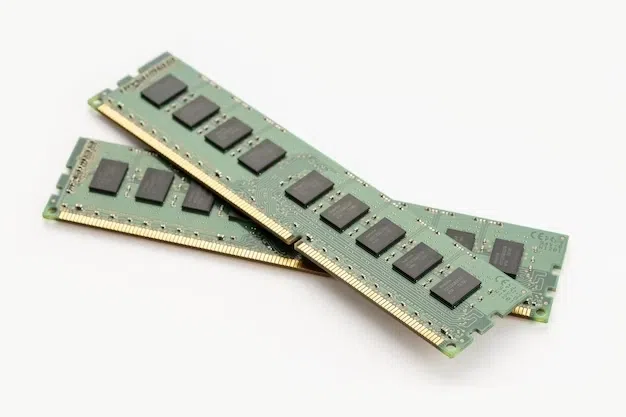

北京大学 Coursera Computer Organization 计算机组成原理
笔记：https://github.com/wangfupeng1988/read-notes/blob/master/video/%E8%AE%A1%E7%AE%97%E6%9C%BA%E7%BB%84%E6%88%90.md

关注：
冯诺依曼结构
二进制
算术运算和逻辑运算
各级存储器的区别

计算机的主要组成部分：输入、输出、存储、控制、运算，以及他们的实现原理和依赖关系
CPU 如何集结这些部分来完成运算

# 一 计算机基本结构

1. 冯.诺依曼 结构(这个结构一定要理解并且能体会到他的价值!)
   图灵机是一个计算机的理论模型，而 冯.诺依曼 结构是图灵机的具体实现。

   最核心的几个理念：

   - 计算机的组成部分：运算器 控制器 存储器 输入设备 输出设备
   - 程序和数据一样，被计算机存储起来，而不是靠人工插拔开关来控制程序，那样效率太低
   - 内部计算使用二进制，而非十进制。其实此前有人设计出计算机使用十进制，不过很快就被淘汰了

   **五大组成部分：**
   
   

   - 运算器：负责算术运算和逻辑运算
   - 控制器：负责指挥整个计算机工作

   - 存储器：存储数据和程序
     “冯.诺依曼结构”中指的存储器通常指内存，但是内存的访问速度远远低于 CPU ，因此现代计算机还有一个高速缓存 cache 。
   - 输入设备：输入数据
   - 输出设备：输出数据

   在现代计算机中，
   `运算器和控制器都被集成在 CPU 中，分别对应着 CPU 的 ALU 单元和控制模块（控制电路和指令译码）。`
   `存储器通常指的是内存，也包括 CPU 中的寄存器和高速缓存。`内存的最小存储单元是 1 byte （即单位 B ，如一个文件大小是 5B），即 8 bit ，每个单元都有一个地址，CPU 根据这个地址来访问内存的数据。
   输入、输出设备就是我们常见的键盘、鼠标、硬盘、耳机、显示器、打印机等等。

   PS：暂定 1 分钟思考一个问题：为何有些程序、数据都用 16 进制来表示？—— 那是因为 2 位的 16 进制数字，正好能表示 1 byte （即 8 bits）大小。

   类比厨房
   
   厨房: CPU
   仓库：主存

2. 执行一条指令
   CPU 执行一条指令的步骤如下：

   取指 fetch ，从寄存器中获取指令
   译码 decode ，交给控制器来译码
   执行 excute，将译码结构交给 ALU 来执行
   回写 write-back ，将计算结果填写回寄存器

3. **CPU 的组成部分**
   运算器(ALU)、控制器、寄存器
4. 寄存器
   寄存器本身就是 CPU 的一个重要组成部分，是一个一个有限存储容量的`高速存储单元`，可以存储指令，数据和地址。寄存器数量很少，因此每个寄存器都有其固定的名称，而不是像内存一样需要地址编号。
   寄存器`不依靠地址区分数据，而依靠名称`。每一个寄存器都有自己的名称，我们告诉 CPU 去具体的哪一个寄存器拿数据，这样的速度是最快的。`有人比喻寄存器是 CPU 的零级缓存。`
   早期的 x86 CPU 只有 8 个寄存器，而且每个都有不同的用途。现在的寄存器已经有 100 多个了，都变成通用寄存器，不特别指定用途了，但是早期寄存器的名字都被保存了下来。

   EAX
   EBX
   ECX
   EDX
   EDI
   ESI
   EBP
   ESP
   上面这 8 个寄存器之中，前面七个都是通用的。`ESP 寄存器有特定用途，保存当前 Stack 的地址。`

5. 冯诺依曼结构与实现的对应
   南北桥架构的演变

# 二 指令系统体系结构

1. 对于指令最直观的认识就是`汇编语言的一个命令`，例如 ADD R3, [6] ，但是汇编语言仅仅是二进制的一个助记符或者语法糖，它的本质还是一段二进制代码，翻译出来可能是 0000001100000101 。即一条指令，就是一段二进制数字。

以上二进制数字是 16 位，那可能是一个 16 位 CPU （寄存器也是 16 位）的一条指令。那么这个指令一共有 16 位，即 2 byte，还要在其中区分指令的类型和参数，例如：
第一个 byte `高 4 位代表指令类型，低 4 位代表寄存器号`
第二个 byte 是`存储单元`

一般来说，一个计算机必包含如下几个类型的指令，才能完成基本的运算：
运算类指令，如 ADD
传送类指令，如 LOAD STORE （从主存中读取，和写入主存）
转移类指令，如 JMP

2. 指令集架构(ISA)
   CPU 指令集可分为`复杂指令集 cisc` （指令复杂，参数多，不是原子指令，类似“指令糖”）和`精简指令集 risc` （指令简洁，原子操作）两种思路。

   x86、ARM、MIPS 是三种不同的指令集框架，产出不同的种类的 CPU

# 三 算术逻辑单元

1. 门电路
   二进制的算数运算都可以用逻辑运算来实现
2. 加法器

3. 乘法器

# 四 乘法器和除法器

# 五 单周期处理器

# 六 流水线处理器

1. 数据通路和流水线
   流水线的优化：**尽量让每个阶段都花费相同的时间周期，避免出现“不平衡流水线”。**如果某个步骤花费的时间较长，就讲起查分为多个步骤，以平衡所有步骤的时间周期。

# 七 存储器层次结构(关键)

“冯.诺依曼结构”中指的存储器通常指内存，但是内存的访问速度远远低于 CPU ，因此现代计算机还有一个高速缓存 cache 。

1. 必备特点
   一个存储器必须具备以下特点：

   - 非易失性，保证数据不丢失
   - 可读可写，不能只读，像 BIOS 芯片
   - 随机访问，对数据的访问和位置无关，磁带就不是随机访问的
   - 访问时间短（最短的是 CPU 寄存器），硬盘访问速度远远小于 CPU ，内存（DRAM）的访问速度也远小于 CPU，因此现代 CPU 和 DRAM 之间还有一个高速缓存（SRAM）
   - 还要考虑价格、存储容量、功耗等其他因素 —— 价格很重要！！！`例如 SRAM 比 DRAM 贵太多`

2. **存储器的层次关系**
   现代计算机的存储结构基本是：CPU —> SRAM —> DRAM —> Disk 。越往后访问速度越慢，但价格越便宜、容量越大。
   
   
   
   CPU (通用寄存器，Byte 量级)
   ↓
   SRAM (高速缓存，KB-MB 量级)
   ↓
   DRAM (主存/内存，MB-GB 量级)
   ↓
   Disk (本地二级存储，GB-TB 量级)
3. CPU 读取数据的过程（其中的 cache 就是高速缓存 SRAM）：

   1. CPU 向 cache 索取数据
   2. 如果 cache 有这个数据即立即返回，很快
   3. 如果 cache 没有这个数据，cache 就去主存中获取这个数据，这个过程可能很长，但是 CPU 并不知情，仍然苦苦的等待
   4. cache 获取完内存数据之后，像 CPU 返回，并存储到 cache 中

4. DRAM 和 SRAM 的区别
   RAM（随机访问存储器）是可由 CPU 直接访问的计算机内存。 RAM 存储临时数据，即在断电的情况下，存储的信息会丢失。它存储当前 CPU 正在处理的数据。容易修改的数据通常存储在 RAM 中。
   RAM 有两种类型：
   - SRAM，Static RAM，静态随机访问存储器
     
     - 用于高速缓存
   - DRAM, Dynamic RAM，动态随机访问存储器
     
     - 用于主存
5. DRAM 工作原理

6. SRAM 工作原理
   局部性原理
   对于空间局部性：cache 在访问一个存储单元时，`同时会取出`相邻单元的数据
   对于时间局部性：近期频繁访问的存储单元，`会一直在` cache 中

7. **Cache 的写策略**

- Cache 命中时，有两种写策略：写穿透和写返回
  - 写穿透(write through)：写操作直接写入主存，保证主存和 cache 的一致性
  - 写返回(write back)：写操作只写入 cache，等到 cache 满了或者被替换时，再写回主存
- Cache 失效时，有两种写策略：写分配和写不分配
  - 写分配(write allocate)：读操作时，如果 cache 失效，会从主存中读取数据，并将数据写入 cache
  - 写不分配(write non-allocate)：读操作时，如果 cache 失效，直接从主存中读取数据，不写入 cache

性能要求不高：写穿透 + 写不分配
性能要求高：写返回 + 写分配

8. 多级缓存
   - L1、L2、L3 缓存

# 八 中断和异常

程序运行难免会出错，例如两个数相加，结果超出了存储范围而溢出。如果计算机不处理这些错误，任其自生自灭肯定会导致停机。现代计算机的处理方式是，**在一个特定的内存区域，存储一个中断向量(interrupt vector)表。**

- 中断向量表，即一个 1kb 大小的存储区，存储了 256 个`中断程序的内存地址`。每个占 4bit ，正好 1kb 。 CPU 会从中断向量表中找到处理程序的地址，然后拿到这条程序进行执行。
- 遇到中断问题：
  1. 关中断
     CPU 关闭中断响应，不再接受其他外部中断请求
  2. 保存断点
     将发生中断出的`指令地址`压入堆栈，以使中断处理完后能够正确地返回
  3. 识别中断源
  4. 保护现场
     将发生终端处的有关`寄存器`相关内容压入堆栈
  5. 执行中断服务程序
- 这样中断操作有程序决定而非硬件决定，而且这还大大增加了中断程序的扩展性，可以存储很多种中断操作。

# 九 输入输出设备

CPU 操作输入和输出的基本流程是 CPU —> I/O 接口 —> 外部设备 ，每种不同的外部设备，都可能对应不同的 I/O 接口。I/O 接口的基本功能是：

- 数据缓冲，解决 CPU 和外部设备之间的速度差距
- 提供联络信息，例如打印机何时才能开始打印
- 信号和信息格式的转换
- 设备选择，因为可能连接了多个设备

各个设备存储容量的争议问题，例如为何买了 4G 的 U 盘，电脑上显示容量却只有 3.72G ？
**国际标准 vs 计算机标准**
这是因为，`国际单位`的标准，K M G 就是以 1000 为底数的。而`计算机`中：

- `内部存储器（缓存、主存）以 1024 为底数`，因为内部存储器接近 CPU ，而 CPU 计算采用二进制，用 1024 更合适。
- `外部存储器（硬盘、U 盘）以 1000 为底数`，外部存储器离 CPU 很远，没必要用 1024 ，就遵守国际标准。
- 而计算机的一些时间单位（如主频 2Ghz），也是以 1000 为底数的。

---

Cache 这个思想本身特别简单，利用的核心原理就是数据的局部性，即把最常用到的东西放在最容易拿到的地方，这种局部性即包含了数据的空间局部性也包含了使用数据的时间局部性，但实际用起来效果却是非常地好，并且广泛应用在各种不同的场合中，例如：CPU 中的 Cache 用来加速对主存数据的访问，TLB 可以看成是对虚拟地址 - 物理地址转换的页表的 Cache，分布式环境中有的时候也会做个本地数据缓存，也是 Cache 的思想。

对 Context Switch 和 Cache 访存需要大概花费多少个 Cycle 有概念吗？

Register：1 Cycle
L1 Cache：3 Cycles
L2 Cache：10+ Cycles
L3 Cache：20~30+ Cycles
Main Memory：~100 Cycles
