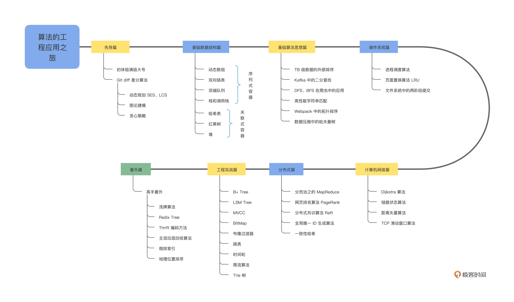
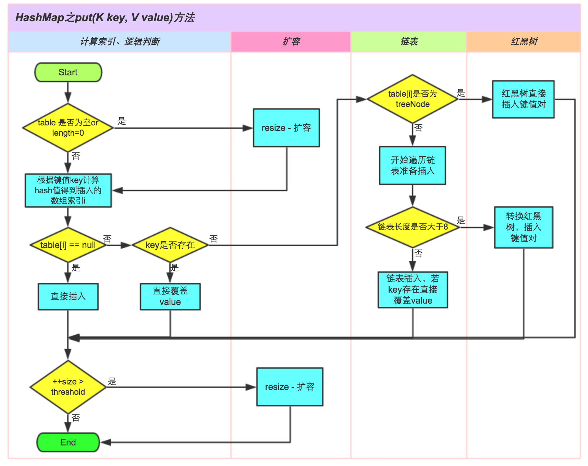

# 业务开发算法 50 讲

## 1 开篇词｜真实世界的算法，和你想的不一样



## 2 先导篇｜诶，这个 git diff 好像不是很直观？

git diff 的默认算法：Myers 差分算法

- 编辑脚本的长度，长度越短越好
- 在最短的编辑脚本里，尽量找到删除在增加前面，且尽可能多地连续删除更多行的方式

### Myers 差分算法是什么

**Myers 差分算法**是一种高效的文本比较算法，用于找出两个文本序列（如文件或字符串）之间的最小编辑路径。该算法由尤金·迈尔斯（Eugene Myers）在 1986 年提出，并广泛应用于版本控制系统（如 Git）中，用于生成文件变更的差异报告（diffs）。

#### 主要特点

1. **最小编辑距离**：

   - 目标是找到将一个序列转换为另一个序列所需的**最少插入和删除**操作。
   - 确保生成的差异报告是最优的，即包含最少的变更步骤。

2. **高效性**：

   - Myers 算法的时间复杂度为 `O(ND)`，其中 N 是两个序列的长度，D 是最小编辑距离。
   - 在实际应用中，通常接近线性时间，能够快速处理大规模文本。

3. **广泛应用**：
   - 被广泛应用于版本控制系统（如 Git 的 `git diff` 命令）、文本处理工具以及其他需要比较和合并文本的领域。

#### 工作原理

Myers 算法通过构建一个“路径图”来表示从一个序列到另一个序列的编辑过程。每个节点代表序列中的一个位置，边则代表插入、删除或匹配操作。算法的目标是找到从起点（序列开始）到终点（序列结束）的最短路径。

**具体步骤包括**：

1. **路径扩展**：

   - 从起点开始，逐步扩展路径，每一步尝试插入或删除字符，以靠近目标序列。
   - 路径扩展的过程利用了“蛇”（snake）的概念，即在匹配的区域内快速前进，减少不必要的操作。

2. **记录最大前进点**：
   - 使用一个数组来记录在每个编辑距离下的最大前进位置，优化搜索过程。
3. **回溯生成差异**：
   - 当找到最短路径后，算法回溯路径，生成详细的编辑操作列表（插入、删除和匹配）。

#### 应用实例

- **版本控制系统**：
  - 在 Git 中，`git diff` 命令使用 Myers 算法来比较不同版本的文件，生成变更报告。
- **文本比较工具**：

  - 各种文本编辑器和集成开发环境（IDE）中的比较功能，通常采用 Myers 算法来高效显示文件差异。

- **生物信息学**：
  - 在基因序列比较中，Myers 算法用于识别基因序列之间的差异。

#### 优缺点

**优点**：

- **高效性**：能够快速处理大规模文本，适用于实时比较需求。
- **最优性**：确保找到最小编辑距离，生成最简洁的差异报告。
- **广泛适用性**：适用于多种类型的序列比较，不限于文本数据。

**缺点**：

- **实现复杂性**：相比于简单的差分算法，实现 Myers 算法较为复杂，需要深入理解其递归和动态规划的机制。
- **资源消耗**：在某些极端情况下，如极长且差异较大的序列，可能需要较多的内存和计算资源。

#### 实现示例

以下是一个简化的 Myers 差分算法实现示例（伪代码）：

```go
package main

import (
    "fmt"
)

// Point represents a position in the two sequences
type Point struct {
    X int
    Y int
}

// myersDiff finds the minimum edit distance between two strings using Myers' algorithm
func myersDiff(a, b string) int {
    aLen := len(a)
    bLen := len(b)
    max := aLen + bLen
    v := make([]Point, 2*max+1)

    // Initialize
    v[max+1].X = 0
    v[max+1].Y = 0

    for d := 0; d <= max; d++ {
        for k := -d; k <= d; k += 2 {
            idx := max + k
            if k == -d || (k != d && v[idx-1].X < v[idx+1].X) {
                v[idx].X = v[idx+1].X
            } else {
                v[idx].X = v[idx-1].X + 1
            }
            v[idx].Y = v[idx].X - k

            // Extend the snake
            for v[idx].X < aLen && v[idx].Y < bLen && a[v[idx].X] == b[v[idx].Y] {
                v[idx].X++
                v[idx].Y++
            }

            if v[idx].X >= aLen && v[idx].Y >= bLen {
                // Found the shortest path
                return d
            }
        }
    }

    return -1
}

func main() {
    a := "ABCABBA"
    b := "CBABAC"
    d := myersDiff(a, b)
    fmt.Printf("The minimum edit distance between \"%s\" and \"%s\" is %d\n", a, b, d)
}
```

以上伪代码展示了 Myers 算法的核心思想，实际应用中需要更多的边界处理和回溯逻辑。

### 总结

Myers 差分算法以其高效性和最优性，成为文本比较领域的经典算法。它在版本控制系统、文本编辑工具以及其他需要比较和合并序列的应用中发挥着重要作用。尽管实现较为复杂，但其在实际应用中的性能和准确性使其成为首选的差分算法之一。

## 3 01 ｜动态数组：按需分配的 vector 为什么要二倍扩容？

为什么扩容是采用倍增的方式，而不是每次扩展固定大小?
倍增扩容策略在摊销时间复杂度和实际性能上均优于固定扩容策略，因此被广泛采用。

## 4 02 ｜双向链表：list 如何实现高效地插入与删除？

## 5 03 ｜双端队列：并行计算中的工作窃取算法如何实现？

C++并没有选择依赖已有的序列式容器 vector 或者 list 来实现，原因是什么呢？

## 6 04 ｜栈：函数调用的秘密究竟是什么？

## 7 05 ｜ HashMap：一个优秀的散列表是怎么来的？

- 计算哈希值的 hash 方法

`^ h >>> 16 是一个什么样的作用呢？它的意思是就是将h右移16位并进行异或操作`
**把高 16 位的信息叠加到了低 16 位，这样我们在取模的时候就可以用到高位的信息了**

```java
static final int hash(Object key) {
    int h;
    return (key == null) ? 0 : (h = key.hashCode()) ^ (h >>> 16);
}
```

- StringUTF16 中 hashcode 的实现， 为什么选择 31 作为乘数？
  `31 * i == (i << 5) - i`

  ```java
  public static int hashCode(byte[] value) {
      int h = 0;
      int length = value.length >> 1;
      for (int i = 0; i < length; i++) {
          h = 31 * h + getChar(value, i);
      }
      return h;
  }
  ```

- HashMap put 操作



## 8 06 ｜ TreeMap：红黑树真的有那么难吗？

## 9 07 ｜堆：如何实现一个高效的优先队列？

- java PriorityQueue 的 api

```java
interface Queue<E> extends Collection<E> {
    add(E e);
    boolean offer(E e);
    E remove();
    E poll();
    E element();
    E peek();
}
```

以下是 `Queue` 接口中各个方法的区别：

| 方法         | 描述                                                           | 容错行为                                          |
| ------------ | -------------------------------------------------------------- | ------------------------------------------------- |
| `add(E e)`   | 将元素插入队列末尾。如果队列受容量限制，插入时可能会抛出异常。 | **当队列已满**时，抛出 `IllegalStateException`。  |
| `offer(E e)` | 将元素插入队列末尾，通常用于无界队列。                         | **当队列已满**时，返回 `false` 而不是抛出异常。   |
| `remove()`   | 移除并返回队列头部的元素。                                     | **当队列为空**时，抛出 `NoSuchElementException`。 |
| `poll()`     | 移除并返回队列头部的元素，若队列为空则返回 `null`。            | **当队列为空**时，返回 `null`。                   |
| `element()`  | 返回队列头部的元素但不移除它。                                 | **当队列为空**时，抛出 `NoSuchElementException`。 |
| `peek()`     | 返回队列头部的元素但不移除它，若队列为空则返回 `null`。        | **当队列为空**时，返回 `null`。                   |

### 详细说明

- **插入元素**

  - `add(E e)` 和 `offer(E e)` 都用于将元素添加到队列末尾。
  - 区别在于：
    - `add(E e)` 在操作失败时（如队列已满）会抛出异常。
    - `offer(E e)` 在操作失败时会返回 `false`，不抛出异常。

- **移除元素**

  - `remove()` 和 `poll()` 都用于移除并返回队列头部的元素。
  - 区别在于：
    - `remove()` 在队列为空时会抛出异常。
    - `poll()` 在队列为空时会返回 `null`。

- **查看元素**
  - `element()` 和 `peek()` 都用于查看队列头部的元素但不移除它。
  - 区别在于：
    - `element()` 在队列为空时会抛出异常。
    - `peek()` 在队列为空时会返回 `null`。

### 使用建议

- **使用 `add` 和 `remove`**：

  - 适用于你希望在操作失败时获得明确异常通知的场景。

- **使用 `offer` 和 `poll`**：

  - 适用于希望操作失败时通过返回值处理的场景，避免异常处理的开销。

- **使用 `element` 和 `peek`**：
  - 适用于需要查看队列头部元素但不删除的场景，根据是否需要处理异常选择使用哪一个方法。

---

PQ 扩容机制：

```java
/**
 * Increases the capacity of the array.
 *
 * @param minCapacity the desired minimum capacity
 */
private void grow(int minCapacity) {
    int oldCapacity = queue.length;
    // Double size if small; else grow by 50%
    int newCapacity = ArraysSupport.newLength(oldCapacity,
            minCapacity - oldCapacity, /* minimum growth */
            oldCapacity < 64 ? oldCapacity + 2 : oldCapacity >> 1
                                       /* preferred growth */);
    queue = Arrays.copyOf(queue, newCapacity);
}
```

**如果原来的数组已经比较大了(>=64)，那新数组的大小是旧数组大小的 1.5 倍，否则是 2 倍再+2。**
newLength 的方法还有个参数用于保证最小的扩容大小

## 10 08 ｜外部排序：如何为 TB 级数据排序？

- 对于 1TB 任意文本的排序问题，大致思路就是：
  1. 先用`内排序`算法，尽可能多的加载源文件，将其变成 n 个有序顺段。
  2. 在内存有限的前提下每 k 个文件为一组，`多路归并`，每次流式地从各个文件中读取一个单词，输出到文件中，这样就可以将 k 个顺段合并到一个顺段中了；反复执行这样的操作，直至所有顺段被归并到同一个顺段。

## 11 09 ｜二分：如何高效查询 Kafka 中的消息？

## 12 10 ｜搜索算法： 一起来写一个简单的爬虫？

## 13 11 ｜字符串匹配：如何实现最快的 grep 工具

## 14 12 ｜拓扑排序：Webpack 是如何确定构建顺序的？

## 15 13 ｜哈夫曼树：HTTP2.0 是如何更快传输协议头的？

## 16 14 ｜调度算法：操作系统中的进程是如何调度的？

## 17 15 ｜ LRU：在虚拟内存中页面是如何置换的？

## 18 16 ｜日志型文件系统：写入文件的时候断电了会发生什么？

## 19 17 ｜选路算法：Dijkstra 是如何解决最短路问题的？

## 20 18 ｜选路算法：链路状态算法是如何分发全局信息的

## 21 19 ｜选路算法：距离矢量算法为什么会产生无穷计算问题？

## 22 20 ｜滑动窗口：TCP 是如何进行流量控制和拥塞控制的？

## 23 21 ｜分而治之：MapReduce 如何解决大规模分布式计算问题

## 23 特别策划｜面试：BAT 面试三关准备方法大揭秘

## 24 22 ｜ PageRank：谷歌是如何计算网页排名的

## 25 23 ｜ Raft：分布式系统间如何达成共识？

## 26 24 ｜ UUID：如何高效生成全局的唯一 ID？

## 27 25 ｜一致性哈希：如何在集群上合理分配流量？

## 28 26 ｜ B+ Tree：PostgreSQL 的索引是如何建立的？

## 29 27 ｜ LSM Tree：LevelDB 的索引是如何建立的？

## 31 29 ｜位图：如何用更少空间对大量数据进行去重和排序？

## 32 30 ｜布隆过滤器：如何解决 Redis 缓存穿透问题？

## 33 31 ｜跳表：Redis 是如何存储有序集合的？

## 34 32 ｜时间轮：Kafka 是如何实现定时任务的？

## 35 33 ｜限流算法：如何防止系统过载？

## 36 34 ｜前缀树：Web 框架中如何实现路由匹配？

## 37 结束语｜在技术的世界里享受思维的乐趣

## 38 期末测试｜来赴一场满分之约！

## 39 特别策划｜面试：BAT 面试三关准备方法大揭秘

## 40 即学即练｜基础数据结构篇：复习卡 & 算法题特训

## 41 即学即练｜基础算法思想篇：复习卡 & 算法题特训

## 42 即学即练｜操作系统篇：复习卡 & 算法题特训

## 43 即学即练｜计算机网络篇：复习卡 & 算法题特训

## 44 即学即练｜分布式篇：复习卡一键直达

## 45 即学即练｜工程实战篇：复习卡一键直达
