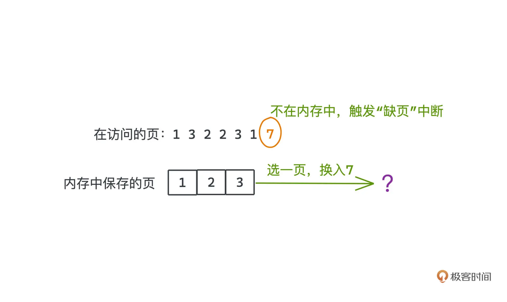

# 业务开发算法 50 讲

https://freegeektime.com/posts/100100901/

## 1 开篇词｜真实世界的算法，和你想的不一样



## 2 先导篇｜诶，这个 git diff 好像不是很直观？

git diff 的默认算法：Myers 差分算法

- 编辑脚本的长度，长度越短越好
- 在最短的编辑脚本里，尽量找到删除在增加前面，且尽可能多地连续删除更多行的方式

### Myers 差分算法是什么

**Myers 差分算法**是一种高效的文本比较算法，用于找出两个文本序列（如文件或字符串）之间的最小编辑路径。该算法由尤金·迈尔斯（Eugene Myers）在 1986 年提出，并广泛应用于版本控制系统（如 Git）中，用于生成文件变更的差异报告（diffs）。

#### 主要特点

1. **最小编辑距离**：

   - 目标是找到将一个序列转换为另一个序列所需的**最少插入和删除**操作。
   - 确保生成的差异报告是最优的，即包含最少的变更步骤。

2. **高效性**：

   - Myers 算法的时间复杂度为 `O(ND)`，其中 N 是两个序列的长度，D 是最小编辑距离。
   - 在实际应用中，通常接近线性时间，能够快速处理大规模文本。

3. **广泛应用**：
   - 被广泛应用于版本控制系统（如 Git 的 `git diff` 命令）、文本处理工具以及其他需要比较和合并文本的领域。

#### 工作原理

Myers 算法通过构建一个“路径图”来表示从一个序列到另一个序列的编辑过程。每个节点代表序列中的一个位置，边则代表插入、删除或匹配操作。算法的目标是找到从起点（序列开始）到终点（序列结束）的最短路径。

**具体步骤包括**：

1. **路径扩展**：

   - 从起点开始，逐步扩展路径，每一步尝试插入或删除字符，以靠近目标序列。
   - 路径扩展的过程利用了“蛇”（snake）的概念，即在匹配的区域内快速前进，减少不必要的操作。

2. **记录最大前进点**：
   - 使用一个数组来记录在每个编辑距离下的最大前进位置，优化搜索过程。
3. **回溯生成差异**：
   - 当找到最短路径后，算法回溯路径，生成详细的编辑操作列表（插入、删除和匹配）。

#### 应用实例

- **版本控制系统**：
  - 在 Git 中，`git diff` 命令使用 Myers 算法来比较不同版本的文件，生成变更报告。
- **文本比较工具**：

  - 各种文本编辑器和集成开发环境（IDE）中的比较功能，通常采用 Myers 算法来高效显示文件差异。

- **生物信息学**：
  - 在基因序列比较中，Myers 算法用于识别基因序列之间的差异。

#### 优缺点

**优点**：

- **高效性**：能够快速处理大规模文本，适用于实时比较需求。
- **最优性**：确保找到最小编辑距离，生成最简洁的差异报告。
- **广泛适用性**：适用于多种类型的序列比较，不限于文本数据。

**缺点**：

- **实现复杂性**：相比于简单的差分算法，实现 Myers 算法较为复杂，需要深入理解其递归和动态规划的机制。
- **资源消耗**：在某些极端情况下，如极长且差异较大的序列，可能需要较多的内存和计算资源。

#### 实现示例

以下是一个简化的 Myers 差分算法实现示例（伪代码）：

```go
package main

import (
    "fmt"
)

// Point represents a position in the two sequences
type Point struct {
    X int
    Y int
}

// myersDiff finds the minimum edit distance between two strings using Myers' algorithm
func myersDiff(a, b string) int {
    aLen := len(a)
    bLen := len(b)
    max := aLen + bLen
    v := make([]Point, 2*max+1)

    // Initialize
    v[max+1].X = 0
    v[max+1].Y = 0

    for d := 0; d <= max; d++ {
        for k := -d; k <= d; k += 2 {
            idx := max + k
            if k == -d || (k != d && v[idx-1].X < v[idx+1].X) {
                v[idx].X = v[idx+1].X
            } else {
                v[idx].X = v[idx-1].X + 1
            }
            v[idx].Y = v[idx].X - k

            // Extend the snake
            for v[idx].X < aLen && v[idx].Y < bLen && a[v[idx].X] == b[v[idx].Y] {
                v[idx].X++
                v[idx].Y++
            }

            if v[idx].X >= aLen && v[idx].Y >= bLen {
                // Found the shortest path
                return d
            }
        }
    }

    return -1
}

func main() {
    a := "ABCABBA"
    b := "CBABAC"
    d := myersDiff(a, b)
    fmt.Printf("The minimum edit distance between \"%s\" and \"%s\" is %d\n", a, b, d)
}
```

以上伪代码展示了 Myers 算法的核心思想，实际应用中需要更多的边界处理和回溯逻辑。

### 总结

Myers 差分算法以其高效性和最优性，成为文本比较领域的经典算法。它在版本控制系统、文本编辑工具以及其他需要比较和合并序列的应用中发挥着重要作用。尽管实现较为复杂，但其在实际应用中的性能和准确性使其成为首选的差分算法之一。

## 3 01 ｜动态数组：按需分配的 vector 为什么要二倍扩容？

为什么扩容是采用倍增的方式，而不是每次扩展固定大小?
倍增扩容策略在摊销时间复杂度和实际性能上均优于固定扩容策略，因此被广泛采用。

## 4 02 ｜双向链表：list 如何实现高效地插入与删除？

## 5 03 ｜双端队列：并行计算中的工作窃取算法如何实现？

C++并没有选择依赖已有的序列式容器 vector 或者 list 来实现，原因是什么呢？

## 6 04 ｜栈：函数调用的秘密究竟是什么？

## 7 05 ｜ HashMap：一个优秀的散列表是怎么来的？

- 计算哈希值的 hash 方法

`^ h >>> 16 是一个什么样的作用呢？它的意思是就是将h右移16位并进行异或操作`
**把高 16 位的信息叠加到了低 16 位，这有助于减少哈希冲突，改善哈希表的分布性**

```java
static final int hash(Object key) {
    int h;
    return (key == null) ? 0 : (h = key.hashCode()) ^ (h >>> 16);
}
```

- StringUTF16 中 hashcode 的实现， 为什么选择 31 作为乘数？
  `31 * i == (i << 5) - i`

  ```java
  public static int hashCode(byte[] value) {
      int h = 0;
      int length = value.length >> 1;
      for (int i = 0; i < length; i++) {
          h = 31 * h + getChar(value, i);
      }
      return h;
  }
  ```

- HashMap put 操作


## 8 06 ｜ TreeMap：红黑树真的有那么难吗？

rust 用 BTreeMap 代替 TreeMap

## 9 07 ｜堆：如何实现一个高效的优先队列？

- java PriorityQueue 的 api

```java
interface Queue<E> extends Collection<E> {
    add(E e);
    boolean offer(E e);
    E remove();
    E poll();
    E element();
    E peek();
}
```

add、remove、element 是一组, 可能会抛出异常
offer、poll、peek 是一组, 返回值为 null, 不会抛出异常

以下是 `Queue` 接口中各个方法的区别：

| 方法         | 描述                                                           | 容错行为                                          |
| ------------ | -------------------------------------------------------------- | ------------------------------------------------- |
| `add(E e)`   | 将元素插入队列末尾。如果队列受容量限制，插入时可能会抛出异常。 | **当队列已满**时，抛出 `IllegalStateException`。  |
| `offer(E e)` | 将元素插入队列末尾，通常用于无界队列。                         | **当队列已满**时，返回 `false` 而不是抛出异常。   |
| `remove()`   | 移除并返回队列头部的元素。                                     | **当队列为空**时，抛出 `NoSuchElementException`。 |
| `poll()`     | 移除并返回队列头部的元素，若队列为空则返回 `null`。            | **当队列为空**时，返回 `null`。                   |
| `element()`  | 返回队列头部的元素但不移除它。                                 | **当队列为空**时，抛出 `NoSuchElementException`。 |
| `peek()`     | 返回队列头部的元素但不移除它，若队列为空则返回 `null`。        | **当队列为空**时，返回 `null`。                   |

### 详细说明

- **插入元素**

  - `add(E e)` 和 `offer(E e)` 都用于将元素添加到队列末尾。
  - 区别在于：
    - `add(E e)` 在操作失败时（如队列已满）会抛出异常。
    - `offer(E e)` 在操作失败时会返回 `false`，不抛出异常。

- **移除元素**

  - `remove()` 和 `poll()` 都用于移除并返回队列头部的元素。
  - 区别在于：
    - `remove()` 在队列为空时会抛出异常。
    - `poll()` 在队列为空时会返回 `null`。

- **查看元素**
  - `element()` 和 `peek()` 都用于查看队列头部的元素但不移除它。
  - 区别在于：
    - `element()` 在队列为空时会抛出异常。
    - `peek()` 在队列为空时会返回 `null`。

### 使用建议

- **使用 `add` 和 `remove`**：

  - 适用于你希望在操作失败时获得明确异常通知的场景。

- **使用 `offer` 和 `poll`**：

  - 适用于希望操作失败时通过返回值处理的场景，避免异常处理的开销。

- **使用 `element` 和 `peek`**：
  - 适用于需要查看队列头部元素但不删除的场景，根据是否需要处理异常选择使用哪一个方法。

---

PQ 扩容机制：

```java
/**
 * Increases the capacity of the array.
 *
 * @param minCapacity the desired minimum capacity
 */
private void grow(int minCapacity) {
    int oldCapacity = queue.length;
    // Double size if small; else grow by 50%
    int newCapacity = ArraysSupport.newLength(oldCapacity,
            minCapacity - oldCapacity, /* minimum growth */
            oldCapacity < 64 ? oldCapacity + 2 : oldCapacity >> 1
                                       /* preferred growth */);
    queue = Arrays.copyOf(queue, newCapacity);
}
```

**如果原来的数组已经比较大了(>=64)，那新数组的大小是旧数组大小的 1.5 倍，否则是 2 倍再+2。**
newLength 的方法还有个参数用于保证最小的扩容大小

## 10 08 ｜外部排序：如何为 TB 级数据排序？

- 对于 1TB 任意文本的排序问题，大致思路就是：
  1. `内排序`：先用`内排序`算法，尽可能多的加载源文件，将其变成 n 个有序顺段。
  2. `多路归并`：在内存有限的前提下每 k 个文件为一组，`多路归并(HeapMerge 或者 LoserTree)`，每次流式地从各个文件中读取一个单词，输出到文件中，这样就可以将 k 个顺段合并到一个顺段中了；反复执行这样的操作，直至所有顺段被归并到同一个顺段。

## 11 09 ｜二分：如何高效查询 Kafka 中的消息？

- 你可能会说，平时写业务代码的时候好像也没怎么写过二分查找。这其实也很正常。

  - 一是因为大部分时候，业务代码`很少会在内存中存储大量的线性有序数据`，在需要比较大量数据的检索时，我们往往会依赖底层的中间件；
  - 而数据量比较小时，线性查找和二分查找可能也差别不大了；另外我们也常常会用一些如红黑树这样的结构去存储有序集合，检索的时候也不会用到二分搜索这样在线性容器内的操作。

- kafka 索引查询
  Kafka 是一款性能强大且相当常用的分布式消息队列，常常用于对流量进行消峰、解耦系统和异步处理部分逻辑以提高性能的场景
  在 Kafka 中，所有的消息都是以“日志”的形式存储的。这里的“日志”不是说一般业务代码中用于 debug 的日志，而是一种存储的范式，这种范式只允许我们在**文件尾部追加新数据**，而不允许修改文件之前的任何内容。
  简单理解，你可以认为 **Kafka 的海量消息就是按照写入的时间顺序，依次追加在许多日志文件中**。那在某个日志文件中，每条消息自然会距离第一条消息有一个对应的 offset，不过这里的 offset 更像是一个消息的自增 ID，而不是一个消息在文件中的偏移量。
  Kafka 日志文件具体的存储方式可以参考这张图。Kafka 的每个 topic 会有多个 partition，每个 partition 下的日志，都按照顺序分成一个个有序的日志段，顺次排列。
  

- 二段二分查找
  https://cloud.tencent.com/developer/article/1762135
  **Kafka 对二分查找进行了改进。既然一般读取数据集中在索引的尾部。那么将索引中最后的 8192B（8KB）划分为“热区”，其余部分划分为“冷区”，分别进行二分查找。**
  **这样做的好处是，在频繁查询尾部的情况下，尾部的页基本都能在 page cahce 中，从而`避免缺页中断`。**

```java
private def indexSlotRangeFor(idx: ByteBuffer, target: Long, searchEntity: IndexSearchType): (Int, Int) = {
  // 1. 如果当前索引为空，直接返回(-1,-1)表示没找到
  if(_entries == 0)
    return (-1, -1)

 // 二分查找封装成方法
  def binarySearch(begin: Int, end: Int) : (Int, Int) = {
    var lo = begin
    var hi = end
    while(lo < hi) {
      val mid = (lo + hi + 1) >>> 1
      val found = parseEntry(idx, mid)
      val compareResult = compareIndexEntry(found, target, searchEntity)
      if(compareResult > 0)
        hi = mid - 1
      else if(compareResult < 0)
        lo = mid
      else
        return (mid, mid)
    }
    (lo, if (lo == _entries - 1) -1 else lo + 1)
  }

  /**
   * 2. 确认热区首个索引项位。_warmEntries就是所谓的分割线，目前固定为8192字节处
   * 对于OffsetIndex，_warmEntries = 8192 / 8 = 1024，即第1024个索引项
   * 大部分查询集中在索引项的尾部，所以把尾部的8192字节设置为热区
   * 如果查询target在热区索引项范围，直接查热区，避免页中断
   */
  val firstHotEntry = Math.max(0, _entries - 1 - _warmEntries)
  // 3. 判断target偏移值在热区还是冷区
  if(compareIndexEntry(parseEntry(idx, firstHotEntry), target, searchEntity) < 0) {
    // 如果在热区，搜索热区
    return binarySearch(firstHotEntry, _entries - 1)
  }

  // 4. 确保要查找的位移值不能小于当前最小位移值
  if(compareIndexEntry(parseEntry(idx, 0), target, searchEntity) > 0)
    return (-1, 0)

  // 5. 如果在冷区，搜索冷区
  binarySearch(0, firstHotEntry)
}
```

**解析 Kafka 中的二段二分检索**

在 Kafka 中，为了高效地检索指定偏移量的消息，采用了**二段二分检索**的策略。这种策略主要是为了减少由于磁盘 IO 和内存分页带来的性能问题。下面我们详细分析一下您提供的源码，理解这种检索方式的具体实现。

---

### **核心函数：`indexSlotRangeFor`**

```scala
private def indexSlotRangeFor(idx: ByteBuffer, target: Long, searchEntity: IndexSearchEntity): (Int, Int) = {
  // 检查索引是否为空
  if(_entries == 0)
    return (-1, -1)

  // 定义二分搜索函数
  def binarySearch(begin: Int, end: Int) : (Int, Int) = {
    var lo = begin
    var hi = end
    while(lo < hi) {
      val mid = ceil(hi/2.0 + lo/2.0).toInt
      val found = parseEntry(idx, mid)
      val compareResult = compareIndexEntry(found, target, searchEntity)
      if(compareResult > 0)
        hi = mid - 1
      else if(compareResult < 0)
        lo = mid
      else
        return (mid, mid)
    }
    (lo, if (lo == _entries - 1) -1 else lo + 1)
  }

  val firstHotEntry = Math.max(0, _entries - 1 - _warmEntries)
  // 检查目标是否在“热区”
  if(compareIndexEntry(parseEntry(idx, firstHotEntry), target, searchEntity) < 0) {
    return binarySearch(firstHotEntry, _entries - 1)
  }

  // 检查目标是否小于索引最小值
  if(compareIndexEntry(parseEntry(idx, 0), target, searchEntity) > 0)
    return (-1, 0)

  // 在“冷区”进行二分搜索
  return binarySearch(0, firstHotEntry)
}
```

---

### **为什么要进行二段二分检索？**

- **减少磁盘 IO 和缺页中断**

  - Kafka 使用 **内存映射文件（mmap）** 方式来提升 IO 性能，但这导致**一次查询可能触发多次缺页中断**，尤其是在访问大量数据时。
  - **缺页中断**：当访问的内存页不在物理内存中时，需要从磁盘加载，代价高昂。

- **热点数据集中在“热区”**

  - **Kafka 的消息大多是顺序追加的**，消费者也多半消费近期的数据。
  - 因此，索引的末尾部分（“热区”）更有可能被频繁访问，这部分数据也更可能已经在内存中。

- **优化查询性能**

  - **优先在“热区”内进行二分查找**，大多数查询都会在这里命中，避免访问“冷区”导致的磁盘 IO。
  - **如果在“热区”未找到，再在“冷区”进行二分查找**，确保查询的完整性。

- **示意图**

  ```
  索引文件：
  -----------------------------------------------------
  |                    冷区                  |   热区  |
  |-----------------------------------------|---------|
  |                                         |         |
  0                                         N       N+M
  ```

  - `N`：索引中“冷区”的结束位置。
  - `M`：索引中“热区”的大小。

---

### **总结**

Kafka 的二段二分检索通过将索引分为“热区”和“冷区”，结合二分查找算法，**有效地降低了查询过程中可能产生的磁盘 IO 和缺页中断次数**。这种设计充分利用了 **Kafka 消息消费的局部性原理**，使得常用数据查询更加高效，同时保证了在全局范围内的准确性。

---

### **与普通二分查找的区别**

- **普通二分查找**

  - 在整个有序数据范围内进行一次二分查找。
  - 每次选择中间位置，`可能导致访问的数据不在内存中，产生缺页中断。`

- **Kafka 的二段二分查找**

  - **第一段**：优先在“热区”进行二分查找，命中概率高，且数据多在内存中。
  - **第二段**：如果“热区”未命中，再在“冷区”进行二分查找。
