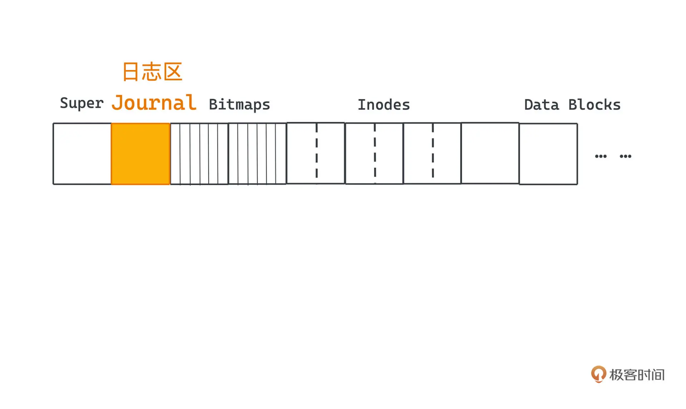
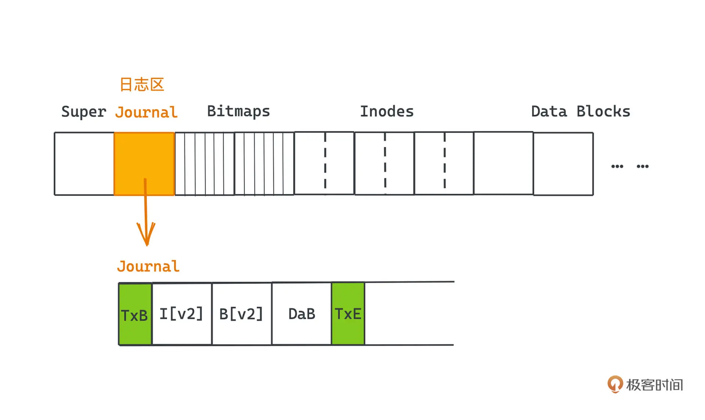
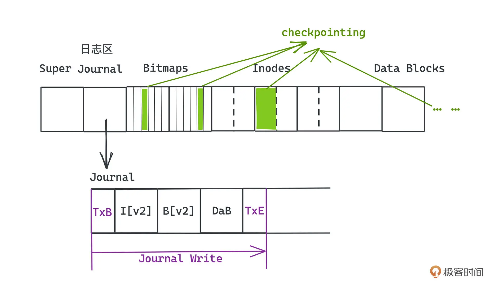
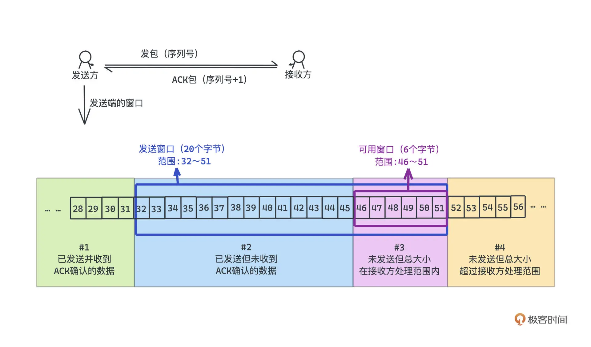
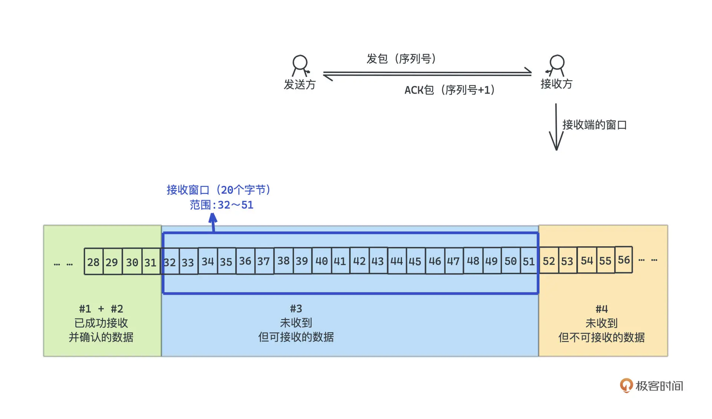

## 12 10 ｜搜索算法： 一起来写一个简单的爬虫？

- bfs
  简单爬虫实现

```py
import requests
from bs4 import BeautifulSoup
from collections import deque

def bfs_crawler(start_url, max_depth=2):
    visited = set()
    queue = deque()
    queue.append((start_url, 0))
    visited.add(start_url)

    while queue:
        current_url, depth = queue.popleft()
        if depth > max_depth:
            continue
        print(f"Crawling: {current_url} at depth {depth}")
        try:
            response = requests.get(current_url, timeout=5)
            if response.status_code != 200:
                continue
            soup = BeautifulSoup(response.text, 'html.parser')

            for link in soup.find_all('a', href=True):
                url = requests.compat.urljoin(current_url, link['href'])
                if url not in visited:
                    visited.add(url)
                    queue.append((url, depth + 1))
        except Exception as e:
            print(f"Failed to crawl {current_url}: {e}")

if __name__ == '__main__':
    start_url = 'https://www.example.com'
    bfs_crawler(start_url)
```

## 13 11 ｜字符串匹配：如何实现最快的 grep 工具

- GNU Grep 用到了非常知名的字符串匹配算法：Boyer Moore
- 要写出真正高性能的程序，不只要懂算法，也要懂计算机底层原理；只有这样，才能真正了解程序在运行时可能存在的各种性能瓶颈，找到不同场景下的最优解。

## 14 12 ｜拓扑排序：Webpack 是如何确定构建顺序的？

- 所有拓扑排序都是建立在有向无环图（DAG）上的，DAG 这个词相信很多同学都很眼熟，`在 Flink 和 Spark 这类可以用来做数据批计算或者流计算的框架中，就常常可以见到 DAG 这样的概念，用来做计算任务的调度。`
- 两种拓扑排序算法：
  - Kahn 算法
  - dfs 算法
    这也是 html-webpack-plugin v3.2.0 所采用的策略

## 15 13 ｜哈夫曼树：HTTP2.0 是如何更快传输协议头的？

- HTTP/2.0 为了提高传输效率而引入的用于头部压缩的杀招：HPACK。
  HPACK 应用了静态表、动态表和哈夫曼编码三种技术，把冗余的 HTTP 头大大压缩，常常可以达到 50%以上的压缩率。其中的哈夫曼编码，底层主要就依赖了我们今天会重点学习的哈夫曼树，这也是广泛运用在各大压缩场景里的算法。

  1. 静态表：对 61 个常用的头，以及头和值的组合做了编码。客户端和服务器端都共享同一个静态表，避免重复传输常用头部信息。
  2. 动态表：通过通信的方式，维护一张动态的“字典”，`将字符串映射成数字，减少传输大小。`
  3. 哈夫曼编码：
     一种变长编码，将频繁出现的字符使用较短的编码表示，罕见字符使用较长的编码。
     **为了避免歧义问题，规定不同的字符编码间不能彼此成为对方的前缀, 只有一种解码方式.**
     贪心的算法思想：用一棵二叉树来标记每个字符的编码方式，左分支代表 0、右分支代表 1，所有需要编码的字符都对应二叉树的叶子节点，根结点到该叶子结点的路径就代表着该字符的编码方式。`由于各节点是独立的不可能重复，每个字符又都唯一对应着一个叶子节点，所以它们一定不会互相成为对方的前缀。`

     HPACK 采用的是静态 huffman 编码，HTTP/2.0 协议制定者`利用一个很大的 HTTP Header 的 sample，统计了所有字符出现的频率，并基于此构建了一个 huffman 编码表，需要内置在服务端和客户端里，最多能带给我们大约 37.5%的压缩率。`

- 反思
  前两招静态表和动态表的思想其实非常常见。
  比如在设计消息系统时，微服务架构下经常涉及消息在不同系统间传递的需求，如果只是为了定位消息而不用真的读取消息体，我们完全可以把`消息编码成“消息 ID +消息体”的格式`，存储在数据库或者其他缓存系统中，这样，`在系统间传递的时候只需要传递 ID 即可，等真的需要取出消息体的时候，再到数据库等系统里读取具体内容`。这可以大大减少系统通信的开销，背后其实就是类似动态表的思想，你可以举一反三。

  第三招哈夫曼编码，引入不同的字符编码间不能彼此成为对方前缀的约束下，使用哈夫曼树来编码。哈夫曼树基于贪心的思想，以及用树对编码进行抽象的想法，也非常精巧，也值得你好好学习一下。

## 16 14 ｜调度算法：操作系统中的进程是如何调度的？

- 进程调度算法(Process Scheduling Algorithms)
  **在许多中间件、语言设计甚至日常开发的业务系统中遇到问题时，我们常常会参考操作系统中成熟的解决办法**
  经典算法：计算机进程调度算法、内存页面置换算法和日志文件系统。
  - 抢占式调度算法(适合调度交互性要求高的实时进程)
    - 优先级调度算法
    - 时间片轮转调度算法
    - 多级反馈队列调度算法
  - 非抢占式调度算法(适合调度可以忍受延迟执行的普通进程)
    - 先来先服务调度算法
    - 短作业优先调度算法
    - 最短作业优先调度算法
    - 高响应比优先调度算法
    - 多级队列反馈调度算法

## 17 15 ｜ LRU：在虚拟内存中页面是如何置换的？

- 操作系统的缓存淘汰
  操作系统的一大作用就是，通过虚拟和抽象为应用开发者提供了一套操作硬件的统一接口，而分页机制的发明，就是为了不需要让用户过度操心物理内存的管理和容量。通过虚拟内存和分页机制，用户可以在一个`大而连续的逻辑地址和非连续的物理地址之间，建立起映射`。其中，物理地址既可以真的指向物理内存，也可以指向硬盘或者其他可以被寻址的外部存储介质。
  用户的程序可以使用比物理内存容量大得多的连续地址空间；而计算机在运行程序的时候，也`不再需要把进程所有信息都加载到内存里，只加载几个当前需要的页就可以了。`
  
  但是内存容量并不是无限的，**访问到不在内存中的其他页，硬件会触发“缺页”中断，操作系统会在内存中选出一个页，把它替换为需要访问的目标页**。这样我们才能访问到需要的数据。
- 置换策略
  怎么样的置换策略是更合理的呢?
  - `缓存命中率`
    从缓存中读到的次数/数据访问的总次数
    命中率越高，就代表越多数据可以直接从缓存中获取到，系统更少访问成本更高的存储，系统的整体时延就会降低。以操作系统为例，命中率高，就意味着我们发生缺页中断和从外存中获取数据的次数会减少，而访问内存的速度比访问外存要快得多，CPU 利用率当然也就会更高。
  - 最优页面置换算法(贪心)
    理论上存在的“上帝”算法，因为它的工作方式是，在替换页面的时候，`永远优先替换内存中最久不被访问的那个页面，尽可能晚地触发缺页中断。`

## 18 16 ｜日志型文件系统：写入文件的时候断电了会发生什么？

- 崩溃一致性问题
  如果没有执行完全部步骤就遭遇了断电等情况，文件系统在大部分时候仍然都会进入不正确的状态，这就是崩溃一致性问题。
- 操作系统最常见的外存——磁盘的问题
  写文件写到一半断电了，或者因为各种各样的原因系统崩溃了，系统重启之后文件是否还能被正常地读写呢？如果不能的话，我们应该怎么办呢？
  这个问题，我们一般叫`崩溃一致性问题（crash-consistent problem）`。目前最流行的解决方案是 Linux 中的 Ext3 和 Ext4 文件系统所采用的日志方案，也就是 journaling，而 Ext3 和 Ext4 自然也就是所谓的**日志型文件系统。**
- 解决方案

  1. 早期操作系统普遍采用的 FSCK 机制（file system check）**(不推荐)**

     - FSCK 机制的策略很简单：错误会发生，没关系，我们挂载磁盘的时候检查这些错误并修复就行。
       但因为崩溃，毕竟有一部分信息是丢失了的，所以很多时候我们也没有办法智能地解决所有问题
       FSCK 真正的问题是，`每次出现问题需要执行FSCK的时候的时间非常久。`
       因为需要扫描全部磁盘空间，并对每种损坏的情况都做校验，才能让磁盘恢复到一个合法的状态，对普通的家用电脑来说，很可能需要长达几十分钟甚至几小时的时间。
       所以，现在 FSCK 基本上已经不再流行，取而代之的就是日志型文件系统。

  2. 日志机制（journaling file system）**(推荐)**
     日志型文件系统这个方案，其实是从 DBMS 也就是数据库系统中借鉴而来的。
     journaling file system 的核心思想是鼎鼎大名的**预写日志 WAL 也就是 write-ahead logging**，这个也正是数据库系统中用于实现原子事务的主要机制，也很好理解，毕竟事务和文件系统一样，都需要保证一致性。
     思想也很简单，**就是每次在真正更新磁盘中的数据结构之前，我们把要做的操作先记录下来，然后再执行真正的操作，这也就是先写日志，WAL 中 write-ahead 的意思。**
     这样做的好处在于，如果**真的发生错误的时候，没有关系，我们回去查阅一下日志，按照日志记录的操作从头到尾重新做一遍就可以了。**
     存放日志的区域叫日志区（journal）。
     

     那 Journal 区里到底要存放点什么样的内容呢？
     这里会涉及一次完整的写文件对磁盘的一系列操作，你不熟悉的话也没有关系，就当这是几个独立的操作就行。我们核心就是要实现：希望可以通过某种记录日志的方式，让这些操作一旦决定被提交，`即使后续对磁盘上元数据和数据块上数据结构的改动进行到一半，系统断电了，仍然可以根据这个日志恢复出来。`

     和数据库一样，我们为了让一系列操作看起来具有原子性，需要引入“事务”的概念。
     我们每次进行一次对文件的写操作，除了会先在预写日志中，记录对 Inodes 的修改记录、对 Bitmaps 的修改记录，以及对具体数据块的修改记录之外，还会同时在这几条记录的前后，`分别引入一个事务开始记录和一个事务结束记录。`
     

     第一个写入的记录是 TxB，也就是 Transaction Begin 记录，最后一个写入的记录就是 TxE 也就是 Transaction End 记录，`在 TxE 记录完成后，就意味着整个写文件的操作全过程都被记录在案了`。我们把这个步骤叫做 **Journal Write**。从而，日志的组织形式就是由这样一个个事务拼接而成，日志的首尾是 TxB 和 TxE 块，中间是具体对元数据和数据块修改的记录块。

     当我们完成 Journal Write 操作之后，就可以放心大胆地`把这些实际的元数据或文件数据覆写到磁盘上对应的数据结构中了，这个步骤我们叫做 checkpointing。`
     
     如果这三个 blocks 都成功写入了磁盘，那么我们说这个文件系统被成功 checkpointed，用于记录 log 的 journal 区域(即上图)也可以被释放，给其他操作使用。

     当这个步骤也成功完成，我们就可以说整个写文件的操作被完成了，在全部成功的情况下当然没什么特别的，但整个设计的关键之处就在于，**面对任意时刻崩溃的情况，我们也能把文件系统恢复到某一合法状态的能力。**

     - 如果崩溃出现在 journal write 步骤中
       事务没有被成功提交，而我们写的是日志，对文件本身也没有任何实际影响。
       `当系统断电又恢复之后，只要发现某个事务 ID 没有对应的 TxE 块，说明这个事务没有提交成功，不可能进入 checkpointing 阶段`，丢弃它们对文件系统没有任何不良影响，只是相当于上次写文件的操作失败了而已。
     - 如果崩溃刚好发生在 journal write 结束之后
       直接按照日志重做一遍就可以，最坏的下场是重新执行了一遍执行过的操作 => 要求更新幂等

3. 总结
   优化：
   1. 可以进行批量日志的更新，把多个独立的文件写操作放到一个事务里提交，提高吞吐量
   2. 记录日志的时候只记录元数据，而不记录文件写操作的大头数据块

## 19 17 ｜选路算法：Dijkstra 是如何解决最短路问题的？

- 每台路由器都是一台网络设备，也就是网络中的一个节点，在其中就保存有一张路由表，每次网卡收到包含目标地址的数据包（packet）时，就会根据路由表的内容决定如何转发数据。
  你的电脑也是一个网络上的一个节点，我们在 Mac 上通过命令就可以看到自己节点的路由表：

  ```
  netstat -nr
  ```

  路由表概述
  路由表用于决定网络数据包的转发路径。每个网络设备（如路由器或计算机）维护一个路由表，根据目标地址选择最佳的下一跳网关和接口，以确保数据包能够到达正确的目的地。
  因为每个数据包里包含了目标地址，所以路由器工作的基本原理就是，网卡基于路由表匹配数据包对应的规则，转发到下一跳的路由器直至抵达终点就可以了。

  ```txt
  Routing tables

  Internet:
  Destination        Gateway            Flags               Netif Expire
  default            192.168.71.1       UGScg                 en0
  default            link#24            UCSIg               utun5
  10                 11.36.21.244       UGSc                utun5
  10.20.205.49/32    11.36.21.244       UGSc                utun5
  10.20.205.50/32    11.36.21.244       UGSc                utun5
  10.20.205.51/32    11.36.21.244       UGSc                utun5
  10.76.63.49/32     11.36.21.244       UGSc                utun5
  11                 11.36.21.244       UGSc                utun5
  11.11.11.11/32     11.36.21.244       UGSc                utun5
  11.11.11.12/32     11.36.21.244       UGSc                utun5
  11.36/19           link#24            UCS                 utun5
  11.36.21.244/32    127.0.0.1          UGSc                  lo0
  11.36.21.244       link#24            UHWIig              utun5
  11.248.53.51       11.248.53.51       UH                  utun4
  13.225.94/24       11.36.21.244       UGSc                utun5
  13.225.103/24      11.36.21.244       UGSc                utun5
  13.229.188.59/32   11.36.21.244       UGSc                utun5
  13.250.177.223/32  11.36.21.244       UGSc                utun5
  20.205.243.166/32  11.36.21.244       UGSc                utun5
  27.115.34.203/32   11.36.21.244       UGSc                utun5
  31.13.74.17/32     11.36.21.244       UGSc                utun5
  33                 11.36.21.244       UGSc                utun5
  36.110.144.57/32   11.36.21.244       UGSc                utun5
  42.193.112.229/32  11.36.21.244       UGSc                utun5
  43.135.62.226/32   11.248.53.51       UGSc                utun4
  49.232.53.63/32    11.36.21.244       UGSc                utun5
  49.232.90.224/32   11.36.21.244       UGSc                utun5
  49.232.171.56/32   11.36.21.244       UGSc                utun5
  49.232.234.39/32   11.36.21.244       UGSc                utun5
  54.192.18/24       11.36.21.244       UGSc                utun5
  58.211.78.134/32   11.36.21.244       UGSc                utun5
  61.149.51.156/32   11.36.21.244       UGSc                utun5
  62.234.19.69/32    11.36.21.244       UGSc                utun5
  62.234.20.15/32    11.36.21.244       UGSc                utun5
  64.18/20           11.36.21.244       UGSc                utun5
  64.233.160/19      11.36.21.244       UGSc                utun5
  66.102/20          11.36.21.244       UGSc                utun5
  66.159.192/19      11.36.21.244       UGSc                utun5
  66.170.109/24      11.36.21.244       UGSc                utun5
  66.249.64/19       11.36.21.244       UGSc                utun5
  72.14.192/19       11.36.21.244       UGSc                utun5
  74.86.12.173/32    11.36.21.244       UGSc                utun5
  74.125/16          11.36.21.244       UGSc                utun5
  81.70.216.198/32   11.36.21.244       UGSc                utun5
  81.70.242.240/32   11.36.21.244       UGSc                utun5
  81.70.252.248/32   11.36.21.244       UGSc                utun5
  82.156.169.217/32  11.36.21.244       UGSc                utun5
  82.157.136.133/32  11.36.21.244       UGSc                utun5
  100.64/10          11.36.21.244       UGSc                utun5
  101.43.212.236/32  11.36.21.244       UGSc                utun5
  101.50.8.33/32     11.248.53.51       UGSc                utun4
  103.37.138.209/32  11.36.21.244       UGSc                utun5
  103.37.138.210/32  11.36.21.244       UGSc                utun5
  103.37.138.211/32  11.36.21.244       UGSc                utun5
  103.37.138.237/32  11.36.21.244       UGSc                utun5
  103.37.138.238/32  11.36.21.244       UGSc                utun5
  103.37.153.213/32  11.36.21.244       UGSc                utun5
  103.37.153.215/32  11.36.21.244       UGSc                utun5
  103.37.154.241/32  11.36.21.244       UGSc                utun5
  103.37.154.248/32  11.36.21.244       UGSc                utun5
  103.63.160.33/32   11.248.53.51       UGSc                utun4
  103.202.145.204/32 192.168.71.1       UGSc                  en0
  103.202.147.97/32  11.36.21.244       UGSc                utun5
  103.202.147.104/32 11.36.21.244       UGSc                utun5
  104.16.18.94/32    11.36.21.244       UGSc                utun5
  104.16.19.94/32    11.36.21.244       UGSc                utun5
  104.16.51.111/32   11.36.21.244       UGSc                utun5
  104.16.53.111/32   11.36.21.244       UGSc                utun5
  104.18.6.10/32     11.36.21.244       UGSc                utun5
  104.18.6.238/32    11.36.21.244       UGSc                utun5
  104.18.7.10/32     11.36.21.244       UGSc                utun5
  104.18.7.238/32    11.36.21.244       UGSc                utun5
  104.18.42.167/32   11.36.21.244       UGSc                utun5
  104.18.70.113/32   11.36.21.244       UGSc                utun5
  104.19.72.113/32   11.36.21.244       UGSc                utun5
  106.75/16          11.36.21.244       UGSc                utun5
  106.75.28.102/32   11.36.21.244       UGSc                utun5
  108.177.8/21       11.36.21.244       UGSc                utun5
  108.177.96/19      11.36.21.244       UGSc                utun5
  114.132.192.22/32  11.36.21.244       UGSc                utun5
  114.132.192.83/32  11.36.21.244       UGSc                utun5
  114.132.192.129/32 11.36.21.244       UGSc                utun5
  116.228.111.118/32 192.168.71.1       UGSc                  en0
  117.50/16          11.36.21.244       UGSc                utun5
  117.50.36.180/32   11.36.21.244       UGSc                utun5
  118.25.166.8/32    11.36.21.244       UGSc                utun5
  118.98.26/24       11.36.21.244       UGSc                utun5
  120.53.17.254/32   11.36.21.244       UGSc                utun5
  120.132/16         11.36.21.244       UGSc                utun5
  120.133.131.107/32 11.36.21.244       UGSc                utun5
  122.152.245/24     11.36.21.244       UGSc                utun5
  123.59/16          11.36.21.244       UGSc                utun5
  127                127.0.0.1          UCS                   lo0
  127.0.0.1          127.0.0.1          UH                    lo0
  134.175.234/24     11.36.21.244       UGSc                utun5
  139.199.54.253/32  11.36.21.244       UGSc                utun5
  140.82.112/20      11.36.21.244       UGSc                utun5
  140.207.254.30/32  11.36.21.244       UGSc                utun5
  142.250/15         11.36.21.244       UGSc                utun5
  152.136.151.113/32 11.36.21.244       UGSc                utun5
  152.136.158.167/32 11.36.21.244       UGSc                utun5
  152.136.165.215/32 11.36.21.244       UGSc                utun5
  152.136.172.225/32 11.36.21.244       UGSc                utun5
  169.254            link#15            UCS                   en0      !
  169.254.169.254    link#15            UHLSW                 en0      !
  172.16/12          11.36.21.244       UGSc                utun5
  172.64.145.89/32   11.36.21.244       UGSc                utun5
  172.217            11.36.21.244       UGSc                utun5
  173.194            11.36.21.244       UGSc                utun5
  180.153.132.35/32  11.36.21.244       UGSc                utun5
  180.153.132.105/32 11.36.21.244       UGSc                utun5
  180.166.152.91/32  11.36.21.244       UGSc                utun5
  180.168.255.18/32  192.168.71.1       UGSc                  en0
  185.199.108/22     11.36.21.244       UGSc                utun5
  192.30.252/22      11.36.21.244       UGSc                utun5
  192.168.0/16       11.36.21.244       UGSc                utun5
  192.168.71         link#24            UCS                 utun5
  192.168.71.1       7c:c9:26:ef:1:ea   UHLSr                 en0
  192.168.71.1/32    link#24            UCS                 utun5
  192.168.71.63/32   link#15            UCS                   en0      !
  203.76.216.1/32    11.36.21.244       UGSc                utun5
  203.76.217.6/32    11.36.21.244       UGSc                utun5
  207.126.144/20     11.36.21.244       UGSc                utun5
  208.101.48.171/32  11.36.21.244       UGSc                utun5
  209.85.128/17      11.36.21.244       UGSc                utun5
  216.58.0/16        11.36.21.244       UGSc                utun5
  216.239.32/19      11.36.21.244       UGSc                utun5
  221.122.73.123/32  11.36.21.244       UGSc                utun5
  224.0.0/4          link#15            UmCS                  en0      !
  224.0.0/4          link#24            UmCSI               utun5
  224.0.0.251        1:0:5e:0:0:fb      UHmLWI                en0
  255.255.255.255/32 link#15            UCS                   en0      !
  255.255.255.255    ff:ff:ff:ff:ff:ff  UHLWbI                en0      !
  255.255.255.255/32 link#24            UCSI                utun5

  Internet6:
  Destination                             Gateway                                 Flags               Netif Expire
  default                                 fe80::%utun0                            UGcIg               utun0
  default                                 fe80::%utun1                            UGcIg               utun1
  default                                 fe80::%utun2                            UGcIg               utun2
  default                                 fe80::%utun3                            UGcIg               utun3
  ::1                                     ::1                                     UHL                   lo0
  fe80::%lo0/64                           fe80::1%lo0                             UcI                   lo0
  fe80::1%lo0                             link#1                                  UHLI                  lo0
  fe80::%en0/64                           link#15                                 UCI                   en0
  fe80::10ae:57a7:6a04:5fde%en0           5c:e9:1e:bc:be:c3                       UHLI                  lo0
  fe80::20d2:b1ff:fee3:d6f%awdl0          22:d2:b1:e3:d:6f                        UHLI                  lo0
  fe80::20d2:b1ff:fee3:d6f%llw0           22:d2:b1:e3:d:6f                        UHLI                  lo0
  fe80::%utun0/64                         fe80::f145:8eec:93ce:f2f7%utun0         UcI                 utun0
  fe80::f145:8eec:93ce:f2f7%utun0         link#19                                 UHLI                  lo0
  fe80::%utun1/64                         fe80::7aca:73ca:f460:74d%utun1          UcI                 utun1
  fe80::7aca:73ca:f460:74d%utun1          link#20                                 UHLI                  lo0
  fe80::%utun2/64                         fe80::45d8:6b2:a62a:f471%utun2          UcI                 utun2
  fe80::45d8:6b2:a62a:f471%utun2          link#21                                 UHLI                  lo0
  fe80::%utun3/64                         fe80::ce81:b1c:bd2c:69e%utun3           UcI                 utun3
  fe80::ce81:b1c:bd2c:69e%utun3           link#22                                 UHLI                  lo0
  ff00::/8                                ::1                                     UmCI                  lo0
  ff00::/8                                link#15                                 UmCI                  en0
  ff00::/8                                link#16                                 UmCI                awdl0
  ff00::/8                                link#17                                 UmCI                 llw0
  ff00::/8                                fe80::f145:8eec:93ce:f2f7%utun0         UmCI                utun0
  ff00::/8                                fe80::7aca:73ca:f460:74d%utun1          UmCI                utun1
  ff00::/8                                fe80::45d8:6b2:a62a:f471%utun2          UmCI                utun2
  ff00::/8                                fe80::ce81:b1c:bd2c:69e%utun3           UmCI                utun3
  ff01::%lo0/32                           ::1                                     UmCI                  lo0
  ff01::%en0/32                           link#15                                 UmCI                  en0
  ff01::%utun0/32                         fe80::f145:8eec:93ce:f2f7%utun0         UmCI                utun0
  ff01::%utun1/32                         fe80::7aca:73ca:f460:74d%utun1          UmCI                utun1
  ff01::%utun2/32                         fe80::45d8:6b2:a62a:f471%utun2          UmCI                utun2
  ff01::%utun3/32                         fe80::ce81:b1c:bd2c:69e%utun3           UmCI                utun3
  ff02::%lo0/32                           ::1                                     UmCI                  lo0
  ff02::%en0/32                           link#15                                 UmCI                  en0
  ff02::%utun0/32                         fe80::f145:8eec:93ce:f2f7%utun0         UmCI                utun0
  ff02::%utun1/32                         fe80::7aca:73ca:f460:74d%utun1          UmCI                utun1
  ff02::%utun2/32                         fe80::45d8:6b2:a62a:f471%utun2          UmCI                utun2
  ff02::%utun3/32                         fe80::ce81:b1c:bd2c:69e%utun3           UmCI                utun3
  ```

## 20 18 ｜选路算法：`链路状态算法`是如何分发全局信息的

> 泛洪(Flooding)，也是在计算机网络中常用的一种传播消息的机制，类似广播，每个节点都会把自己封装好的包和收到的包，发送或转发给所有除了该包发送方的节点。

我们希望从上海坐汽车去北京，但没有全局的地图（来源百度地图）不知道怎么走更短，只能打电话问相邻城市的好朋友。如果我们要找出一条最短的路径。
一种就是让所有人都问自己邻居城市的朋友，收集好所有的公路信息，然后传播给自己邻居城市的朋友；这样经过一段时间，我们就可以从邻居那里获得整个地图各站间的全部信息，从而可以自己研究出一条最短路径，这个思想就是链路状态法。

## 21 19 ｜选路算法：距离矢量算法为什么会产生无穷计算问题？

Bellman-Ford 算法思想发展而来的距离矢量算法

负环问题。
这个问题就是路由环路问题，也被称为无限计算问题。解决思路也比较多，比较常见的做法就是**设定一个跳数上限**。
**比如在 RIP 协议中 16 跳就是一个常用的上限，如果路径跳数多于 16，我们就会把这个路径看成不可达的**，这个时候我们可以让发现某个节点不可达的节点，暂时不要相信其他节点发来的距离矢量，从而避免路由环路问题的无限计算问题。当然，如果有节点和网络断开连接，但在跳数没有到达上限之前，还是会进行大量无谓的计算。

## 22 20 ｜滑动窗口：TCP 是如何进行流量控制和拥塞控制的？

滑动窗口机制，可以用来控制流量，防止接收方处理不过来消息；同样基于窗口机制的拥塞控制算法，则用来处理网络上数据包太多的情况，以避免网络中出现拥塞。
为什么发送端需要滑动窗口？=> 为了提高网络利用率，避免发送方发送数据太快，导致接收方处理不过来
为什么需要接受端需要滑动窗口？=> buffer，实现 FIFO 一致性

- 流量控制
  主要就是为了`防止接收方处理数据的速度跟不上发送方`，避免随着时间推移，数据自然溢出接收方的缓冲区。
  `双方会建立一个滑动窗口，由对方通告，TCP 首部里的 window 字段就是用来表示窗口大小的`，窗口表示的就是接收方目前能接收的缓冲区的剩余大小。

  - 发送方的窗口
    
    是否发送？是否收到 ACK? 是否在接收方通告处理范围内? => 窗口被分为 4 段

    - 零窗口：发送端可用窗口为零的情况
    - 分布式系统中常见的处理丢包的方式之一：零窗口定时器，如果发送端陷入零窗口的状态，就会启动这个定时器，去定时地询问接收端窗口是否可用了

  - 接收方的窗口
    
    是否成功接收？是否可接收？ => 窗口被分为 3 段

- 拥塞控制
  在发送端定义一个窗口 CWND（congestion window），也就是拥塞窗口；发送端能发送的最多没有收到 ACK 的包，也不会超过拥塞窗口的范围。
  慢启动、拥塞避免、快重传、快恢复

### 总结

TCP 就是通过滑动窗口、拥塞窗口这两个简单的窗口实现了流量控制和拥塞控制。

滑动窗口由接收端控制，向发送端通告，这样就可以保证发送端发出的包数量上限是明确的，也就不会存在淹没接收端导致来不及处理的情况。

拥塞窗口由发送端控制，它会根据网络中的情况动态的调整，通过慢启动、拥塞避免、拥塞发生、快速恢复四个算法，`就可以很好地调整窗口的大小`。和滑动窗口一起限制了发送端最大的发送范围，从而保证了拥塞在网络上不会发生。

## 23 21 ｜分而治之：MapReduce 如何解决大规模分布式计算问题

谷歌提出的 MapReduce 算法，知名的开源项目 **Hadoop 其实就是对 MapReduce 的工业级实现之一**

- 要是每个业务方都针对这些雷同的问题，各自实现一遍处理这些问题的逻辑，显然是非常低效的
- 通过 filter map reduce 等原语，我们把`控制逻辑和计算逻辑分离地非常清楚`
  1. 让众多进程中的一个成为 master 进程，由它来进行任务的调度，其他进程都是 worker 进程，进行实际的计算任务
  2. 算法的计算逻辑与控制逻辑分离
- 大多数的运算和业务逻辑，其实都是可以通过这样简单的 map 和 reduce 函数来实现的。`因为一个很复杂的计算，也无非就是对某些数据据进行一系列规则的变换，转化成另一些数据`
- 系统设计，非常重要的一点就是对`容灾能力的支持，主要就要分为故障检测和故障恢复两个步骤`。
  检测 -> 心跳检测，引入一个控制节点对其他节点进行监控是一个非常有效的手段，通过定时的心跳(定时 ping 操作)，控制节点就很容易发现其他节点的异常
  恢复 -> checkpoint，定时设置 checkpoint，周期性的把 master 相关的状态信息保存到磁盘中，形成一个个检查点，这样异常发生的时候就可以快速恢复，重新执行需要的计算。

## 23 特别策划｜面试：BAT 面试三关准备方法大揭秘

## 24 22 ｜ PageRank：谷歌是如何计算网页排名的

## 25 23 ｜ Raft：分布式系统间如何达成共识？

## 26 24 ｜ UUID：如何高效生成全局的唯一 ID？

## 27 25 ｜一致性哈希：如何在集群上合理分配流量？

## 28 26 ｜ B+ Tree：PostgreSQL 的索引是如何建立的？

## 29 27 ｜ LSM Tree：LevelDB 的索引是如何建立的？

## 31 29 ｜位图：如何用更少空间对大量数据进行去重和排序？

## 32 30 ｜布隆过滤器：如何解决 Redis 缓存穿透问题？

## 33 31 ｜跳表：Redis 是如何存储有序集合的？

## 34 32 ｜时间轮：Kafka 是如何实现定时任务的？

## 35 33 ｜限流算法：如何防止系统过载？

## 36 34 ｜前缀树：Web 框架中如何实现路由匹配？

## 37 结束语｜在技术的世界里享受思维的乐趣

## 38 期末测试｜来赴一场满分之约！

## 39 特别策划｜面试：BAT 面试三关准备方法大揭秘

## 40 即学即练｜基础数据结构篇：复习卡 & 算法题特训

## 41 即学即练｜基础算法思想篇：复习卡 & 算法题特训

## 42 即学即练｜操作系统篇：复习卡 & 算法题特训

## 43 即学即练｜计算机网络篇：复习卡 & 算法题特训

## 44 即学即练｜分布式篇：复习卡一键直达

## 45 即学即练｜工程实战篇：复习卡一键直达
