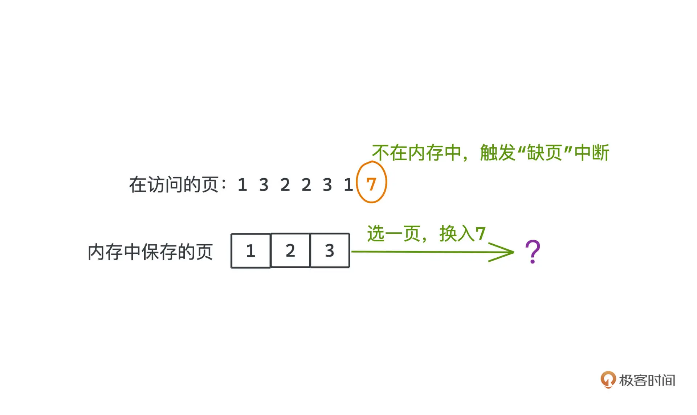

## 12 10 ｜搜索算法： 一起来写一个简单的爬虫？

- bfs
  简单爬虫实现

```py
import requests
from bs4 import BeautifulSoup
from collections import deque

def bfs_crawler(start_url, max_depth=2):
    visited = set()
    queue = deque()
    queue.append((start_url, 0))
    visited.add(start_url)

    while queue:
        current_url, depth = queue.popleft()
        if depth > max_depth:
            continue
        print(f"Crawling: {current_url} at depth {depth}")
        try:
            response = requests.get(current_url, timeout=5)
            if response.status_code != 200:
                continue
            soup = BeautifulSoup(response.text, 'html.parser')

            for link in soup.find_all('a', href=True):
                url = requests.compat.urljoin(current_url, link['href'])
                if url not in visited:
                    visited.add(url)
                    queue.append((url, depth + 1))
        except Exception as e:
            print(f"Failed to crawl {current_url}: {e}")

if __name__ == '__main__':
    start_url = 'https://www.example.com'
    bfs_crawler(start_url)
```

## 13 11 ｜字符串匹配：如何实现最快的 grep 工具

- GNU Grep 用到了非常知名的字符串匹配算法：Boyer Moore
- 要写出真正高性能的程序，不只要懂算法，也要懂计算机底层原理；只有这样，才能真正了解程序在运行时可能存在的各种性能瓶颈，找到不同场景下的最优解。

## 14 12 ｜拓扑排序：Webpack 是如何确定构建顺序的？

- 所有拓扑排序都是建立在有向无环图（DAG）上的，DAG 这个词相信很多同学都很眼熟，`在 Flink 和 Spark 这类可以用来做数据批计算或者流计算的框架中，就常常可以见到 DAG 这样的概念，用来做计算任务的调度。`
- 两种拓扑排序算法：
  - Kahn 算法
  - dfs 算法
    这也是 html-webpack-plugin v3.2.0 所采用的策略

## 15 13 ｜哈夫曼树：HTTP2.0 是如何更快传输协议头的？

- HTTP/2.0 为了提高传输效率而引入的用于头部压缩的杀招：HPACK。
  HPACK 应用了静态表、动态表和哈夫曼编码三种技术，把冗余的 HTTP 头大大压缩，常常可以达到 50%以上的压缩率。其中的哈夫曼编码，底层主要就依赖了我们今天会重点学习的哈夫曼树，这也是广泛运用在各大压缩场景里的算法。

  1. 静态表：对 61 个常用的头，以及头和值的组合做了编码。客户端和服务器端都共享同一个静态表，避免重复传输常用头部信息。
  2. 动态表：通过通信的方式，维护一张动态的“字典”，`将字符串映射成数字，减少传输大小。`
  3. 哈夫曼编码：
     一种变长编码，将频繁出现的字符使用较短的编码表示，罕见字符使用较长的编码。
     **为了避免歧义问题，规定不同的字符编码间不能彼此成为对方的前缀, 只有一种解码方式.**
     贪心的算法思想：用一棵二叉树来标记每个字符的编码方式，左分支代表 0、右分支代表 1，所有需要编码的字符都对应二叉树的叶子节点，根结点到该叶子结点的路径就代表着该字符的编码方式。`由于各节点是独立的不可能重复，每个字符又都唯一对应着一个叶子节点，所以它们一定不会互相成为对方的前缀。`

     HPACK 采用的是静态 huffman 编码，HTTP/2.0 协议制定者`利用一个很大的 HTTP Header 的 sample，统计了所有字符出现的频率，并基于此构建了一个 huffman 编码表，需要内置在服务端和客户端里，最多能带给我们大约 37.5%的压缩率。`

- 反思
  前两招静态表和动态表的思想其实非常常见。
  比如在设计消息系统时，微服务架构下经常涉及消息在不同系统间传递的需求，如果只是为了定位消息而不用真的读取消息体，我们完全可以把`消息编码成“消息 ID +消息体”的格式`，存储在数据库或者其他缓存系统中，这样，`在系统间传递的时候只需要传递 ID 即可，等真的需要取出消息体的时候，再到数据库等系统里读取具体内容`。这可以大大减少系统通信的开销，背后其实就是类似动态表的思想，你可以举一反三。

  第三招哈夫曼编码，引入不同的字符编码间不能彼此成为对方前缀的约束下，使用哈夫曼树来编码。哈夫曼树基于贪心的思想，以及用树对编码进行抽象的想法，也非常精巧，也值得你好好学习一下。

## 16 14 ｜调度算法：操作系统中的进程是如何调度的？

- 进程调度算法(Process Scheduling Algorithms)
  **在许多中间件、语言设计甚至日常开发的业务系统中遇到问题时，我们常常会参考操作系统中成熟的解决办法**
  经典算法：计算机进程调度算法、内存页面置换算法和日志文件系统。
  - 抢占式调度算法(适合调度交互性要求高的实时进程)
    - 优先级调度算法
    - 时间片轮转调度算法
    - 多级反馈队列调度算法
  - 非抢占式调度算法(适合调度可以忍受延迟执行的普通进程)
    - 先来先服务调度算法
    - 短作业优先调度算法
    - 最短作业优先调度算法
    - 高响应比优先调度算法
    - 多级队列反馈调度算法

## 17 15 ｜ LRU：在虚拟内存中页面是如何置换的？

- 操作系统的缓存淘汰
  操作系统的一大作用就是，通过虚拟和抽象为应用开发者提供了一套操作硬件的统一接口，而分页机制的发明，就是为了不需要让用户过度操心物理内存的管理和容量。通过虚拟内存和分页机制，用户可以在一个`大而连续的逻辑地址和非连续的物理地址之间，建立起映射`。其中，物理地址既可以真的指向物理内存，也可以指向硬盘或者其他可以被寻址的外部存储介质。
  用户的程序可以使用比物理内存容量大得多的连续地址空间；而计算机在运行程序的时候，也`不再需要把进程所有信息都加载到内存里，只加载几个当前需要的页就可以了。`
  
  但是内存容量并不是无限的，**访问到不在内存中的其他页，硬件会触发“缺页”中断，操作系统会在内存中选出一个页，把它替换为需要访问的目标页**。这样我们才能访问到需要的数据。
- 置换策略
  怎么样的置换策略是更合理的呢?
  - `缓存命中率`
    从缓存中读到的次数/数据访问的总次数
    命中率越高，就代表越多数据可以直接从缓存中获取到，系统更少访问成本更高的存储，系统的整体时延就会降低。以操作系统为例，命中率高，就意味着我们发生缺页中断和从外存中获取数据的次数会减少，而访问内存的速度比访问外存要快得多，CPU 利用率当然也就会更高。
  - 最优页面置换算法(贪心)
    理论上存在的“上帝”算法，因为它的工作方式是，在替换页面的时候，`永远优先替换内存中最久不被访问的那个页面，尽可能晚地触发缺页中断。`

## 18 16 ｜日志型文件系统：写入文件的时候断电了会发生什么？

- 崩溃一致性问题
  如果没有执行完全部步骤就遭遇了断电等情况，文件系统在大部分时候仍然都会进入不正确的状态，这就是崩溃一致性问题。
- 操作系统最常见的外存——磁盘的问题
  写文件写到一半断电了，或者因为各种各样的原因系统崩溃了，系统重启之后文件是否还能被正常地读写呢？如果不能的话，我们应该怎么办呢？
  这个问题，我们一般叫`崩溃一致性问题（crash-consistent problem）`。目前最流行的解决方案是 Linux 中的 Ext3 和 Ext4 文件系统所采用的日志方案，也就是 journaling，而 Ext3 和 Ext4 自然也就是所谓的**日志型文件系统。**
- 解决方案

  1. 早期操作系统普遍采用的 FSCK 机制（file system check）**(不推荐)**

     - FSCK 机制的策略很简单：错误会发生，没关系，我们挂载磁盘的时候检查这些错误并修复就行。
       但因为崩溃，毕竟有一部分信息是丢失了的，所以很多时候我们也没有办法智能地解决所有问题
       FSCK 真正的问题是，`每次出现问题需要执行FSCK的时候的时间非常久。`
       因为需要扫描全部磁盘空间，并对每种损坏的情况都做校验，才能让磁盘恢复到一个合法的状态，对普通的家用电脑来说，很可能需要长达几十分钟甚至几小时的时间。
       所以，现在 FSCK 基本上已经不再流行，取而代之的就是日志型文件系统。

  2. 日志机制（journaling file system）**(推荐)**
     日志型文件系统这个方案，其实是从 DBMS 也就是数据库系统中借鉴而来的。

## 19 17 ｜选路算法：Dijkstra 是如何解决最短路问题的？

## 20 18 ｜选路算法：链路状态算法是如何分发全局信息的

## 21 19 ｜选路算法：距离矢量算法为什么会产生无穷计算问题？

## 22 20 ｜滑动窗口：TCP 是如何进行流量控制和拥塞控制的？

## 23 21 ｜分而治之：MapReduce 如何解决大规模分布式计算问题

## 23 特别策划｜面试：BAT 面试三关准备方法大揭秘

## 24 22 ｜ PageRank：谷歌是如何计算网页排名的

## 25 23 ｜ Raft：分布式系统间如何达成共识？

## 26 24 ｜ UUID：如何高效生成全局的唯一 ID？

## 27 25 ｜一致性哈希：如何在集群上合理分配流量？

## 28 26 ｜ B+ Tree：PostgreSQL 的索引是如何建立的？

## 29 27 ｜ LSM Tree：LevelDB 的索引是如何建立的？

## 31 29 ｜位图：如何用更少空间对大量数据进行去重和排序？

## 32 30 ｜布隆过滤器：如何解决 Redis 缓存穿透问题？

## 33 31 ｜跳表：Redis 是如何存储有序集合的？

## 34 32 ｜时间轮：Kafka 是如何实现定时任务的？

## 35 33 ｜限流算法：如何防止系统过载？

## 36 34 ｜前缀树：Web 框架中如何实现路由匹配？

## 37 结束语｜在技术的世界里享受思维的乐趣

## 38 期末测试｜来赴一场满分之约！

## 39 特别策划｜面试：BAT 面试三关准备方法大揭秘

## 40 即学即练｜基础数据结构篇：复习卡 & 算法题特训

## 41 即学即练｜基础算法思想篇：复习卡 & 算法题特训

## 42 即学即练｜操作系统篇：复习卡 & 算法题特训

## 43 即学即练｜计算机网络篇：复习卡 & 算法题特训

## 44 即学即练｜分布式篇：复习卡一键直达

## 45 即学即练｜工程实战篇：复习卡一键直达
