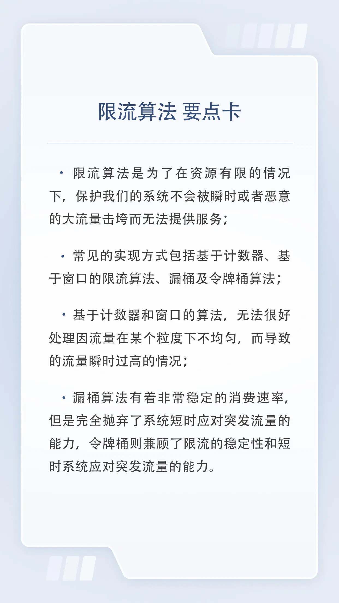

## 23 特别策划｜面试：BAT 面试三关准备方法大揭秘

- 算法、计算机基础知识、领域知识

## 24 22 ｜ PageRank：谷歌是如何计算网页排名的

为了让用户获得更好的搜索体验从而打败竞争对手，谷歌是如何设计自己计算网页排名的算法的呢

- PageRank 算法(Larry Page 发明)不止可以让用户搜索到自己关心的内容，也往往能让质量更高的网页得以排到更前的位置，同时它也是一个典型的 MapReduce 的应用场景。
  idea：论文影响力因子往往是基于`论文被引用次数`来衡量
  **被更多超链接指向的网页，可以推断它往往会有更好的质量**
  这样当然也一定程度上可以反映出网页的排名情况，但`不同网站的链接所代表的权重应该是不同的`；因子是一个加权平均

- `马氏链平稳状态定理`
  **不可约且无周期性的有限马尔可夫链的转移概率矩阵存在唯一的平稳分布**，且从任意初始状态出发，经过足够长的时间后，链的状态分布会收敛到这个平稳分布。

  **只要所有状态之间都是互相可达，且整个转移过程没有周期性。那么无论如何初始化，只要状态转移矩阵是确定的，最终整个马氏链一定会趋于稳定。**

- 处理边界情况

  https://www.cnblogs.com/z-j-n-2015/p/4960319.html

  - Dangling links (悬空链接)：`没有出边`的节点
    `不处理会导致最后权重全部变为 0.`
    解决方法：判断网页节点矩阵 M 中是否有一列全部是 0，如果有，则将这一列的值全部替换成 1/n。
  - Spider Traps (蜘蛛陷阱)：`节点只有一条指向自己的出边`
    `不处理会导致最后权重集中在这些节点上。`
    结局方法：就是添加一个跳转因子 β，让每个网页都雨露均沾，相当于增加到所有其他节点的一个链接，只不过权重很小。**可以平滑整个图上权重的计算。**

  新的计算公式为:

  **R = (1 - β) _ M _ R' + e \* β / N**

  细节见 [PageRank](分布式/PageRank.py)

- 总结
  其中为了解决 Spider Traps，增加跳转因子的思想也很常见。比如，各种广告系统或者推荐系统，`在广告或者内容没有历史数据的时候，我们就会为这些内容提供一些试探流量`。这背后的思想其实和跳转因子也是类似的。相信当类似业务需要出现时，现在你可以想到解决方案了。

## 25 23 ｜ Raft：分布式系统间如何达成共识？

## 26 24 ｜ UUID：如何高效生成全局的唯一 ID？

## 27 25 ｜一致性哈希：如何在集群上合理分配流量？

## 28 26 ｜ B+ Tree：PostgreSQL 的索引是如何建立的？

## 29 27 ｜ LSM Tree：LevelDB 的索引是如何建立的？

## 31 29 ｜位图：如何用更少空间对大量数据进行去重和排序？

## 32 30 ｜布隆过滤器：如何解决 Redis 缓存穿透问题？

## 33 31 ｜跳表：Redis 是如何存储有序集合的？

## 34 32 ｜时间轮：Kafka 是如何实现定时任务的？

## 35 33 ｜限流算法：如何防止系统过载？

## 36 34 ｜前缀树：Web 框架中如何实现路由匹配？

## 37 结束语｜在技术的世界里享受思维的乐趣

## 38 期末测试｜来赴一场满分之约！

## 39 特别策划｜面试：BAT 面试三关准备方法大揭秘

## 40 即学即练｜基础数据结构篇：复习卡 & 算法题特训

动态数组、双向链表、双端队列、栈、HashMap、Treemap、堆

## 41 即学即练｜基础算法思想篇：复习卡 & 算法题特训

外部排序、二分、搜索、字符串匹配、拓扑排序、哈夫曼树

## 42 即学即练｜操作系统篇：复习卡 & 算法题特训

调度算法、页面置换算法、日志文件系统

## 43 即学即练｜计算机网络篇：复习卡 & 算法题特训

链路状态算法 (Dijkstra)、距离矢量算法 (Bellman-Ford)，以及滑动窗口算法

## 44 即学即练｜分布式篇：复习卡一键直达

MapReduce 、PageRank、Raft、UUID、一致性哈希

## 45 即学即练｜工程实战篇：复习卡一键直达

B+ Tree、LSM Tree、MVCC、BitMap、布隆过滤器、跳表、时间轮、限流算法、Trie 树
