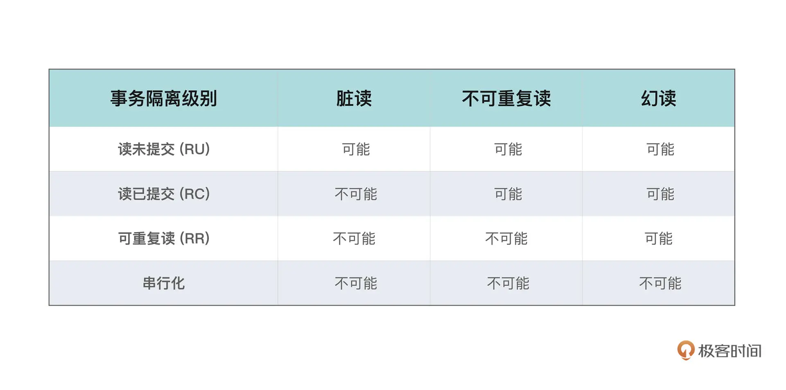
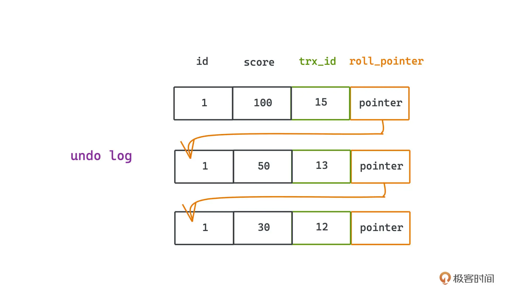

## 23 特别策划｜面试：BAT 面试三关准备方法大揭秘

- 算法、计算机基础知识、领域知识

## 24 22 ｜ PageRank：谷歌是如何计算网页排名的

为了让用户获得更好的搜索体验从而打败竞争对手，谷歌是如何设计自己计算网页排名的算法的呢

- PageRank 算法(Larry Page 发明)不止可以让用户搜索到自己关心的内容，也往往能让质量更高的网页得以排到更前的位置，同时它也是一个典型的 MapReduce 的应用场景。
  idea：论文影响力因子往往是基于`论文被引用次数`来衡量
  **被更多超链接指向的网页，可以推断它往往会有更好的质量**
  这样当然也一定程度上可以反映出网页的排名情况，但`不同网站的链接所代表的权重应该是不同的`；因子是一个加权平均

- `马氏链平稳状态定理`
  **不可约且无周期性的有限马尔可夫链的转移概率矩阵存在唯一的平稳分布**，且从任意初始状态出发，经过足够长的时间后，链的状态分布会收敛到这个平稳分布。

  **只要所有状态之间都是互相可达，且整个转移过程没有周期性。那么无论如何初始化，只要状态转移矩阵是确定的，最终整个马氏链一定会趋于稳定。**

- 处理边界情况

  https://www.cnblogs.com/z-j-n-2015/p/4960319.html

  - Dangling links (悬空链接)：`没有出边`的节点
    `不处理会导致最后权重全部变为 0.`
    解决方法：判断网页节点矩阵 M 中是否有一列全部是 0，如果有，则将这一列的值全部替换成 1/n。
  - Spider Traps (蜘蛛陷阱)：`节点只有一条指向自己的出边`
    `不处理会导致最后权重集中在这些节点上。`
    结局方法：就是添加一个跳转因子 β，让每个网页都雨露均沾，相当于增加到所有其他节点的一个链接，只不过权重很小。**可以平滑整个图上权重的计算。**

  新的计算公式为:

  **R = (1 - β) _ M _ R' + e \* β / N**

  细节见 [PageRank](分布式/PageRank.py)

- 总结
  其中为了解决 Spider Traps，增加跳转因子的思想也很常见。比如，各种广告系统或者推荐系统，`在广告或者内容没有历史数据的时候，我们就会为这些内容提供一些试探流量`。这背后的思想其实和跳转因子也是类似的。相信当类似业务需要出现时，现在你可以想到解决方案了。

## 25 23 ｜ Raft：分布式系统间如何达成共识？

- 状态机复制 (State Machine Replication)
  分布式场景的 redo-log
  让多台服务器存储相同顺序的多条相同指令，也就是“日志”，可以帮助我们实现状态机复制。
  
  **每一个状态的变更记录都会先在日志中存储并 commit，之后才 apply 到状态机中修改对应的状态，这个设计能在分布式系统中解决许多和容错性相关的问题。**
  既然涉及多个节点存储同样的一份东西，`怎样才能保证多个独立的节点所存储的内容是一致的呢？这就是我们常说的“一致性问题”了。`
- 日志一致性问题
- 保证一致性的算法
  Raft 提出之前，在非拜占庭条件下，分布式一致性领域里，Paxos 算法，一直占据着统治性的地位，但 Paxos 是出了名的难理解，工程实践也比较困难。
  和 Paxos 不同的是，一致性问题，`被 Raft 明确拆解成了三个比较独立的、更好理解的子问题`，`并且团队在许多实现细节上做了很多努力和权衡`，也增强了系统里的许多限制，简化了需要考虑的状态，尽量让过程和接口的设计变得清晰易懂。比如，Raft 中就引入了 Leader，由 Leader 进行全局消息的把控，也不允许日志中存在空洞的情况，都是一些比较常见的权衡。
- Raft 拆解出来用于达成分布式共识的三个子问题

  1. Leader 选举

     - 目标：在 Raft 中，Leader 就负责接收客户端的请求，由它统一向其他节点同步消息，等收到半数的节点 Commmit 日志的响应后，就会把状态应用到状态机，并返回。

       > 引入 Leader 的原因：引入一个主节点，由它进行`统一的控制和调度`，这样整个分布式的处理逻辑就会变得比较简单。`控制和计算分离？`

     - 实现：节点状态机制
       Followers、Candidates、Leader
       

       - Follower 追随者：
         所有节点初始化或重启的时候都处于 Follower 状态。
         它不会接受请求，也不会发起请求，只响应由 Leader 发起的 AppendEntries 和 Candidate 发起的 RequestVote 请求。
       - Candidate 候选人：
         Follower 晋升为 Leader 的中间状态，从语义上就能看出来这个阶段是需要投票的。
         Follower 如果在一段时间没有收到领导人的消息，就会变成 Candidate 并发起选举，也就是向集群中所有节点发出 RequestVote 请求，如果收到`半数以上也就是 (n/2+1) 的通过，就可以成功晋升为新的 Leader `(保证最多只有一个合法的 Leader，分区容错性)。
       - Leader 领导人：
         系统大部分时候只有一个节点处于 Leader 状态，如果有两个节点同时处于 Leader 状态，也最多只有一个是真正有效的。
         Leader 会不断的向 Follower 发起请求，告知它们自己还在正常工作。这里的请求就是后面用于复制日志的 AppendEntries 请求。

     - 任期(term)
       
       - 为了**保证 Leader 的唯一性**，Raft 引入了任期的概念，候选人发起选举的时候会把当前的任期加 1，`任期号越大，说明这个 Leader 的权威性越高`。如果一个节点收到的任期号比自己的任期号还要大，那么它就会更新自己的任期号，并且变成 Follower 状态。
     - 细节分析
       1. 一轮选举后没有 Leader 产生，怎么办？
          平局收场，Term 再加 1，重新选举一轮就可以
       2. 多个 Candidate 一起超时，又会触发下一轮票选瓜分，岂不是永远选不出 Leader 了？
          为了避免这种情况，Raft 引入了随机化的超时时间(比如 150-300ms)，每个节点的超时时间都是随机的，这样就可以避免多个节点同时超时的情况。
          当然，这也需要我们保证有良好的网络环境，选取发出 - 被收到的时间一定要比较短才行。

  2. 日志复制

     - Leader 选举完成，它就要扛起接受客户端请求并复制日志的大旗了，主要职责就是发起 AppendEntries 请求
     - 两种 AppendEntries
       - 空的 AppendEntries 用于心跳检测
       - 非空的 AppendEntries 用于日志复制，要求 Follower 在日志中追加记录
     - 当 Leader 接收了客户端的请求，它就会并行地请求其他节点，带上客户端请求的指令，要求其他节点进行复制并返回结果。`当 Leader 觉得日志被安全地复制了之后(已提交的日志 CommittedEntries)，才会将指令应用到状态机中并返回客户端。`
       
       已提交的日志的定义：`如果一个日志被 Leader 复制到大多数节点，日志就算被提交了`
       日志带有索引和任期号，这样就可以保证日志的唯一性，也可以保证日志的顺序性。
     - Log Matching
       Raft 通过引入一些约束，使得所有的日志始终拥有着`“日志匹配”`的特性：
       `不同日志中的两个记录，如果拥有相同的任期和索引，它们的内容以及它们之前的内容相同。`
       这通过数学归纳法保证：AppendEntries 被接收时，会执行一致性检查，Leader 提交请求的时候会带上自己的 prevLogIndex 和 prevLogTerm，表示上一个日志条目的索引和任期。如果 Follower 发现自己的日志里找不到这个任期和索引对应的条目，会拒绝此次 AppendEntries 请求，这个就是 Raft 协议很关键的一个约束；所以当 AppendEntrires 成功时，Leader 能保证 prevLogIndex 之前所有的记录都是相同的。
     - 如果 Leader 和 Follower 由于崩溃，出现日志记录不同的时候，`Rebase`：
       Leader 要求 Follower，按照自己的日志覆写。Leader 为每一个 Follower 都记录了一个 nextIndex 的字段，表示下次应该发给 Follower 的日志，在 Leader 刚刚晋升的时候，Leader 就会将这个值初始化为自己的最后一条日志的索引 +1。如果 Follower 日志和 Leader 日志有所冲突，Leader 会尝试减小 nextIndex 的值，直至两者 nextIndex 所对应的日志相同；此时，LeaderAppend 的记录就包含了从 nextIndex 开始的全部日志，Follower 收到之后就会把不同的部分覆写；如果成功，Leader 也会修正 nextIndex 的值。
       整个覆写的过程一定是单向的，只会发生在 Follower 节点上，Leader 从来不会修改自己的日志。

  3. 安全性

     - "领导人完整性"：日志需要代代相传
       也就是需要保证：
       **如果某个日志条目在某个任期号中已经被提交，该记录必定出现在更大任期号的所有领导人中。**
       Raft 对这个问题作出了另一个简单的限制，相比于一些其他的一致性算法，显得更加清晰。
     - 日志 PK：**限制 Candidate 提交选举请求的时候，必须至少和 Follower 的日志一样新，才可以获得选票。**
       这就意味着，如果 Candidate 获得了超过半数的选票，说明至少有半数的 Follower 节点，日志条目和自己一样新，而所有 commit 了的记录，也一定在半数的节点中出现了。因此被 commit 的日志，一定会被更大任期的领导所包含。
     - 只允许 Leader 提交任期内的日志

     总的来说，**只要我们只允许领导提交任期内的日志，且必须确保被大部分节点所复制，Raft 的数据安全性就是有保证的，被提交的日志一定是不会被覆写的。**

     原论文中还提到了一些简单的优化，比如日志压缩、采用 Chubby 和 Zookeeper 用的快照技术等，减少因为日志增长越来越多空间被占用和对应的同步成本问题等等

- 总结
  1. 引入随机性避免无限循环选举
  2. 将复杂问题拆解成多个明确清晰的子问题，分而治之

## 26 24 ｜ UUID：如何高效生成全局的唯一 ID？

- 全局唯一 ID 生成算法 UUID
  全局唯一 ID 的两个核心需求就是：
  - 全局唯一性
  - 粗略有序性
- 单体环境
  - ID 不能带有明确含义(在票务系统中，如果这样设计，我们能根据电子票 ID 判断出自己买的是第几张票)
  - 产生新 ID 的地方，都是同一个地方，复杂性是很可控的
- 分布式环境
  `为了同时让多台服务器都可以颁发不重复的 ID，我们自然需要一种机制进行多台服务器之间的协调或者分配。`
  这个问题其实历史已久，解决方法也已经有很多了，我们一起来看看主流的解决方案是如何考虑的。

### 方案一：单点服务+数据库自增 ID (引入额外的系统生成 ID)

在多节点中，我们仍然可以尝试自己手动打造一个单点的 ID 生成器，通常可以是一个独立部署的服务，这样的服务，我们一般也称为 `ID generate service`。
因为单点的服务只有一台机器，我们很容易通过本地时钟和计数器来保证 ID 的唯一性和有序性。

- 需要解决的问题：

1. 时钟回拨
   计算机会定期地通过 NTP 服务，来同步更加接近真实时间的时间（仍然有一定的误差），这个时候就可能会产生时钟的一些跳跃
2. 服务器异常重启之后计数器不能重复
   `如果计数器只是在内存中保存，一旦发生机器故障或者断电等情况，我们就无法知道之前的 ID 生成到什么位置了`。因此需要持久化、容灾等机制。

- 实现：
  1. 基于数据库自增 ID 直接实现 ID generate，既可以保证唯一性，也可以保证有序性
  2. 在需要产生新的全局 ID 的时候，每次单点服务都向数据库**批量申请 n 个 ID**，在本地用内存维护这个号段，减少数据库写的次数，把压力变成了原来的 1/n，性能大大提升，往往可以承载 10w 级的 QPS。

### 方案二：Snowflake 算法 (业务侧本地通过规则约束独立生成 ID)

**Snowflake 是一种引入了机器编号和时间信息的分布式 ID 生成算法**
twitter 的 Snowflake，美团的 Leaf 算法


**1bit 保留位 + 41bit 时间戳 + 10bit 机器编号 + 12bit 自增序列号**

## 27 25 ｜一致性哈希：如何在集群上合理分配流量？

多个节点的有状态服务，其他服务或者客户端在访问这个服务的时候，具体应该访问哪一个节点呢。**如何分配流量的问题，也通常被称为负载均衡问题。**
比如最直接的，我们可以`引入一个中间的负载均衡层`，集中记录收到的请求序号；然后按照 `Round-Robin` 的轮询方式，轮流将外界的请求转发给内部的服务集群，或者直接用随机转发的方式也可以。当然你也可以引入权重，让这两种算法对流量的分配不是均匀的，而是按照一定比重分配在不同的机器上。这两种算法也被称为`加权轮询和加权随机。`

### Dubbo 官方中文文档中的 5 种负载均衡策略


1. RandomLoadBalance
   加权随机。
   默认算法，默认权重相同。
2. RoundRobinLoadBalance
   加权轮询。
   借鉴于 Nginx 的平滑加权轮询算法，默认权重相同。
3. LeastActiveLoadBalance
   最少活跃优先+加权随机
   背后是能者多劳的思想。
4. ShortestResponseLoadBalance
   最短响应时间优先+加权随机
   更加关注响应速度。
5. ConsistentHashLoadBalance
   一致性哈希
   确定的入参映射到确定的提供者，适合`有状态请求。`

### 一致性哈希

工业的分布式缓存系统，其实一般不会真的进行数据的搬移，因为需要一直对外提供服务，这个时候一旦大量的请求和存储数据节点失配，会导致**同一时间大部分缓存值失效**，转而请求源数据，这就会导致被缓存的服务比如数据库，请求激增，出现宕机等情况。这也被称为缓存雪崩。

## 28 26 ｜ B+ Tree：PostgreSQL 的索引是如何建立的？

如果我们逐一遍历数据库的每个记录逐个对比，也就是常说的“全表扫描”，查找速度肯定很慢。如何提高查找指定 ID 记录的速度呢？
通常为了提高查找速度，我们都会设计一种特殊的数据结构，在内存中如此，在磁盘中也不例外。**我们需要设计一种适合磁盘场景的数据结构，对业务数据进行某种有序性的维护，在磁盘读写次数不多的情况下，结合内存，就能快速找到需要查询的记录在磁盘中所在的位置。这就是我们常说的“索引”。**

### 可不可以在数据库的索引中采用红黑树呢

`二叉查找树这类型数据结构的问题在于，由于每个节点只能容纳一个数据，导致树的高度很高，逻辑上挨着的节点数据可能离得很远。`
考虑在磁盘中存储数据的情况，与内存相比，读写磁盘有以下不同点：

- 读写磁盘的速度相比内存读写慢很多。
- 每次读写磁盘的单位要比读写内存的最小单位大很多。

对比起一个节点只能存储一个数据的 BST 类数据结构来，`要求这种数据结构在形状上更「胖」、更加「扁平」，即：每个节点能容纳更多的数据，这样就能降低树的高度，同时让逻辑上相邻的数据都能尽量存储在物理上也相邻的硬盘空间上，减少磁盘读写。`

在数据库中，不同于内存的场景，磁盘读写比内存慢的多，所以相比于查询的计算成本，IO 成本可能要显著的多。
我们采用二叉树来存储的话，层数必然不会很少，且层和层之间的数据在物理上基本上是不连续的，即使前几层的元素可以被预加载至内存中，`我们仍然可能需要在树上进行 10 余次的跳转查询，也就对应着 10 余次的磁盘 IO，这是不可接受的`。

### B(-) 树的每个节点中存储的大小设成一个页的大小

自平衡的多路搜索树
https://oi-wiki.org/ds/b-tree/


B-树的思路是通过引入更多的分叉，在节点同样数量级的范围内，显著地降低树状索引的层数。
一个页的大小通常是 4K ～ 16K，能包含的键数可以高达几千条。以 `InnoDB 通常采用的 16K 大小的页为例`，如果我们的索引字段和指针域大小为 8B，B- 树上的每个节点能包含的键数高达 2048 个，这就意味着用 4 层的高度，就可以存储接近 10 亿级别的记录，在索引字段大小更大的时候，我们通常也只需要 5 层以内，就可以构造大部分表的索引。
这就是多叉的 B 树的主要优点了，利用磁盘的预读能力和树状结构，我们通过 3 ～ 5 次磁盘 IO 就可以在 10 亿级的数据表中进行快速检索了。
每个节点中的键是有序存储的，当我们加载到内存中后，通常也会直接采用二分搜索，整个搜索过程仍然是 logN 这样非常低的复杂度。所以主要耗时还是花费在 IO 中。

### B+树更好地支持范围查询

明确分出 leaf/internal , 让 internal 只存 key，leaf 存额外的数据信息
https://oi-wiki.org/ds/bplus-tree/


- B+ 树的所有的叶子节点之间会通过双向指针串联在一起，构成一个双向链表；
- B+ 树的中间节点不会存储数据指针，而只有叶子节点才会存储，中间节点只用于存储到叶子节点的路由信息。
- B+ 树相比于 B 树的优势
  由于索引节点上只有索引而没有数据，所以`索引节点上能存储比 B 树更多的索引，这样树的高度就会更矮`。树的高度越矮，磁盘寻道的次数就会越少。

### SortedList 的本质是一个高度为 2 的 B+树

本质区别在于一个块能存多少个元素。`B+树的结点存不了那么多数据，所以需要更多的层级，而 SortedList 一个块就能存很多数据，所以层级少。`

## 29 27 ｜ LSM Tree：LevelDB 的索引是如何建立的？

https://nimrodshn.medium.com/writing-a-storage-engine-in-rust-writing-a-persistent-btree-part-1-916b6f3e2934

LSM 树实现底层索引结构的 RocksDB，就是 Facebook 用 C++ 对 LevelDB 的实现，RocksDB 本身是一个 KV 存储引擎，现在被很多分布式数据库拿来做单机存储引擎，其中 LSM 树对性能的贡献功不可没。

- 通过`批量`读写提高性能
  多次写入合并成一次写入，从而减少磁盘寻道的开销。
  类似思路的方案：批量生成 uuid

- 利用内存，延迟写入磁盘的时机
  通过内存维护有序的结构，延迟写入磁盘的时机，通过合并多次随机写操作，降低磁盘臂移动的开销

- Immutable Table
  为什么要引入这样一个 memtable 的不可变副本呢？
  拷贝过程是需要时间的，但同时我们的系统很可能仍然在对外工作，所以**创建副本，可以很好的地帮助我们避免`读写冲突竞争`，从而避免阻塞，提高系统性能。**

- Soft Delete
  和 B+ 树直接在本地进行删除的策略不同，LevelDB 其实不会真的把某个数据移除。
  **因为一旦移除，就可能需要去不同的层进行数据的清理，代价比较高昂。**
  在有些 ORM 库中会直接通过 deleteAt 字段，`标记删除时间，来表示这个数据被删除了，想恢复这个数据的时候也很简单，直接将 deleteAt 置空即可。`

- sstable中block大小
  最小要设置成虚拟内存的页的大小(4k)
  设置成**虚拟内存页的大小的整数倍**都可以
  太大会影响内存调度(最大16k)

  > MRR优化的本质 简单说：MRR 通过把「随机磁盘读」，转化为「顺序磁盘读」

## 28｜MVCC：如何突破数据库`并发读写`性能瓶颈？

重点讨论事务的`隔离性`

### 事务隔离等级



因为存在这三种问题，脏读、不可重复读、幻读，业务很可能会产生错误，所以我们就需要根据不同的业务场景，提供不同的事务隔离等级，你可以理解成`某个事务对其他事务修改数据结果的可见性情况。`
InnoDB 为引擎的 MySQL 中，默认采用的就是可重复读的事务隔离级别。
在这个隔离级别下，`不会出现脏读和不可重复读的情况，幻读可能发生`。不过在 InnoDB 中，幻读这个情况有点特殊，不一定会发生，我们稍后讲 MVCC 机制的时候再聊。

### 如何实现不同的隔离等级

1. 读未提交
   `不做任何处理。`
   事务中所有的写都立刻作用到表中，并且对所有其他正在执行中的事务可见。

---

中间的两个等级，读已提交、可重复读，同时兼顾了性能和隔离性，也是许多主流数据库的首选之一，Oracle 的默认隔离等级就是读已提交。

2. 读已提交(Oracle 的默认隔离等级)
   `避免的就是读到尚未提交的数据，也就是脏值。`
   - 一种比较悲观的方式还是加共享锁和排他锁。
   - 乐观的方式是MVCC(Multi-Version Concurrency Control，多版本并发控制)。
3. 可重复读(InnoDB 的默认隔离等级)
   `避免的就是不可重复读，也就是：虽然读到了已经提交的数据，但是在事务结束之前，这个数据被其他事务修改了。`

   - MVCC

     - 事务 ID
       我们想要维护不同事务之间的可见性，首先当然要给事务一个标识，也就是事务 ID，在 InnoDB 中就是 trx_id。它是一个自增的序列号，每个事务开始前就会申请一个这样的 ID。
     - undo log
       和 redo log 的预写（用来在宕机未持久化的时候恢复数据的机制）正好相反，`undo log 记录了事务开始前的状态，用于事务失败时回滚`。
       
     - 隐藏列
       想要维护不同的版本，数据表的每一行中除了我们定义的列之外，还有需要至少包括保存 trx_id、roll_pointer 的隐藏列。
       每一行数据中的 trx_id，代表该行数据是在哪个 trx_id 中被修改的。
       而 roll_pointer，代表这个数据的历史版本在哪里，指向更早的记录值。`我们的 roll_pointer 指向的其实就是 undo log 的记录。`行记录通过roll_pointer链接，就可以构成一个链表，这个链表就是我们的`版本链`。MVCC 就是在这样的版本链上，通过事务 ID 和链上不同版本的对比，找到一个合适的可见版本的。快照读就是 MVCC 发挥作用的方式。
     - 快照读
       在 select 数据的时候，我们会按照一定的规则，而不一定会读出表中最新的数据，有可能`从版本链中选择一个合适的版本读出来`，就像一个快照一样，我们称为快照读。
       ```sql
       select * from student where id < 10
       ```
     - 当前读
       而当前读，读的就是记录的最新值，在 InnoDB 下我们会进行显示的加锁操作，比如for update ：
       ```sql
       select * from student where id < 10 for update
       ```
     - 读视图
       读视图是指在事务执行期间，数据库系统`为该事务创建的一种数据快照，记录了在特定时间点上哪些事务是活跃的（未提交或未回滚的事务）。`基于这个视图，事务在读取数据时只会看到在其开始之前已经提交的事务所做的更改，而忽略之后提交的事务。这种机制确保了事务在其整个生命周期内看到的数据是一致的，不受其他并发事务的影响。
       我的理解：产生一个readonly数据结构拷贝。
       读视图的引入有效地解决了并发事务之间的数据可见性问题。

       过程：

       - 事务开始时，系统会为该事务创建一个读视图，记录当前系统中活跃的事务 ID。
       - 在事务执行过程中，系统会`根据读视图的信息，判断当前事务是否可以读取某个数据项`。
       - 当事务提交或回滚时，系统会更新读视图，将该事务的 ID 从活跃事务列表中移除。

   如果本质上严格遵循 MVCC 的要求，幻读是不会发生的，但是 InnoDB 里的读分为快照度和当前读两种。如果你对 MySQL 中的 for update 原语有印象就会知道，`在 select 的时候如果没有加 for update 的话，就不会发生幻读的现象，反之则会有幻读的现象。`
   更进一步：InnoDB 默认的隔离级别是 **可重复读（Repeatable Read）**，为此引入了**下一键锁(记录锁+间隙锁)** 机制来`防止幻读`。概括：`记录范围加锁，避免同一个事务内行记录的变化。(例如插入删除记录)。记录锁与间隙锁组合，让范围扫描能够锁住下一个索引键之前的空隙`

---

4. 串行化
   既然问题来自于事务的并发，我们就让它们`不要并发。`
   如果涉及同一表的读写，我们就加锁(读写锁)，读的时候用共享锁，写的时候用排他锁。

## 31 29 ｜位图：如何用更少空间对大量数据进行去重和排序？

### 如何对40亿个qq号去重，把结果输出到一个新的文件中？内存限制1GB。

要想在内存有限的情况下去重，就得用`外部存储（硬盘或 SSD）辅助，结合分而治之、外排序、或位图 / 布隆过滤器`等技术来实现。

- **外排序+多路归并**
  这里的外排序可以是比较排序，可以是非比较排序，例如哈希分桶排序、位集排序。
  如果在实际工作中，需要进一步提升效率，可以结合多线程或分布式（MapReduce、Spark 等）来并行处理。

### 数据库中的 Bitmap 索引

采用位图索引，不止可以降低空间成本，在多条件查询中，我们也可以基于位运算提高索引的利用率。
使用位图索引，最大的好处就在于`多查询条件的时候，我们可以直接通过对 Bitmap 的位运算来获得结果集的向量。`

## 32 30 ｜布隆过滤器：如何解决 Redis 缓存穿透(Cache Penetration)问题？

缓存：`用一些访问成本更低的存储，来存一些更加高频的访问数据，提高系统整体的访问速度`

### 但是即使在正常的 workload 下，有时候也会产生大量穿透的请求，有什么办法减少这些不必要的请求呢？

想要通过 Redis 避免数据库的压力太大，就得保证查询的数据很大一部分是在 Redis 中有缓存的。
使用`布隆过滤器在缓存层之前预先过滤掉无效请求`，避免这些请求直接访问后端。

在实际应用中，可以结合多种策略，形成综合性的防护措施。例如：

- **输入校验 → 布隆过滤器预筛 → 缓存查询 → 后端查询**
- 对于未命中的查询结果，缓存空结果并设置短TTL。
- 引入限流策略，防止恶意攻击和过量请求。
- 定期更新布隆过滤器，确保其包含最新的有效数据。

### 布隆过滤器清除状态比较困难，但有些缓存数据是有生命周期的，比如一周或者一个月之后就大概率过期了，你有没有什么好办法可以帮助我们更好地`清理过期数据`呢？

`时间分区、计数布隆过滤器、滑动窗口`等策略，可以有效地管理具有生命周期的数据，并实现过期数据的清理

## 33 31 ｜跳表：Redis 是如何存储有序集合的？

设计关键：

- **随机化**：`通过 50% 的概率决策，决定是否需要继续将这个插入到更高的一层。`
- 支持高效范围查询，只要找到对应的范围节点，然后顺次在链表上遍历就可以了

## 34 32 ｜时间轮：Kafka 是如何实现定时任务的？

## 35 33 ｜限流算法：如何防止系统过载？


## 36 34 ｜前缀树：Web 框架中如何实现路由匹配？

## 37 结束语｜在技术的世界里享受思维的乐趣

## 38 期末测试｜来赴一场满分之约！

## 39 特别策划｜面试：BAT 面试三关准备方法大揭秘

## 40 即学即练｜基础数据结构篇：复习卡 & 算法题特训

动态数组、双向链表、双端队列、栈、HashMap、Treemap、堆

## 41 即学即练｜基础算法思想篇：复习卡 & 算法题特训

外部排序、二分、搜索、字符串匹配、拓扑排序、哈夫曼树

## 42 即学即练｜操作系统篇：复习卡 & 算法题特训

调度算法、页面置换算法、日志文件系统

## 43 即学即练｜计算机网络篇：复习卡 & 算法题特训

链路状态算法 (Dijkstra)、距离矢量算法 (Bellman-Ford)，以及滑动窗口算法

## 44 即学即练｜分布式篇：复习卡一键直达

MapReduce 、PageRank、Raft、UUID、一致性哈希

## 45 即学即练｜工程实战篇：复习卡一键直达

B+ Tree、LSM Tree、MVCC、BitMap、布隆过滤器、跳表、时间轮、限流算法、Trie 树
