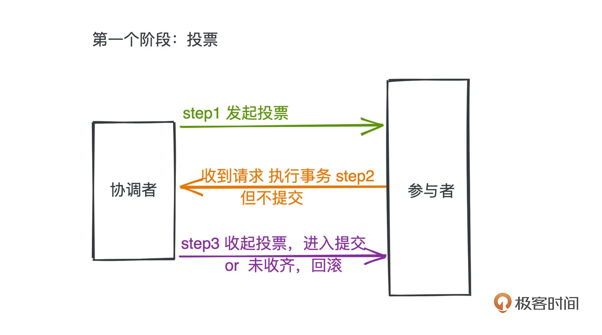
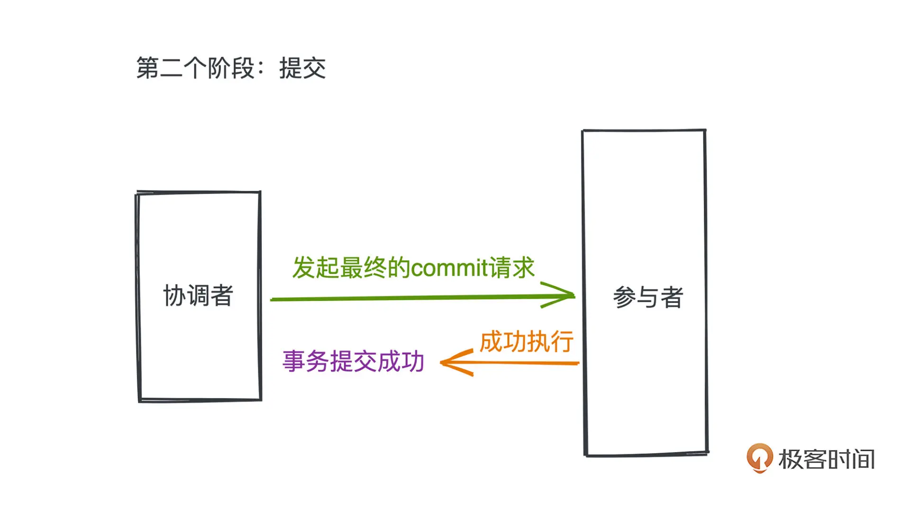

## 35 ｜洗牌算法：随机的哲学，如何用程序来洗一副牌？

-

## 36 ｜分布式事务：如何理解两阶段提交？

现在解决分布式事务的手段有很多种，一种最常见的思路就是两阶段提交（Two-Phase Commit，2PC）。

### 2PC

`首先要明确一点，分布式系统中的每个节点，在没有通信的情况下是没有办法获得全局的信息`，也就是说某个参与事务的节点并没有办法直接知道其他事务的执行情况。因此引入一个掌握全局信息的协调者来进行事务的最终提交。
两阶段提交协议，把整个分布式事务的提交分成了两个阶段：投票、提交。

## 结束语｜在技术的世界里享受思维的乐趣

- 投票
  
- 提交
  

## 37 ｜ Thrift 编码方法：为什么 RPC 往往不采用 JSON 作为网络传输格式？

JSON 序列化采用了文本而非二进制的传输方式，并且在序列化过程中引入了冗长的成员变量名等数据，空间利用率就很差；
加上使用方还需要对 JSON 文本进行解析和转化，很耗费 CPU 资源，因此，即使 JSON 本身非常流行，也并没有成为主流的 RPC 序列化协议。
而 Thrift 或者 Protobuf 的协议，采用二进制编码，并引入了 schema 文件，去掉了许多冗余的成员变量信息，直接采用`字段编号进行成员标识`，效率很高，得到了广泛的应用。

## 38 ｜倒排索引：搜索引擎是如何做全文检索的？

-

## 39 ｜ Geohash：点外卖时我们是如何查找到附近餐厅的？

1. 分块思想
2. Geohash
   Geohash 采用了一种巧妙的编码方式，**把二维信息转化成一维编码的时候，也极大保留了地理信息上的连续性**
   [geohash 在线工具](https://csxgame.top/#/)

## 40 ｜垃圾回收：现代语言是如何自动管理回收内存的？

- 你写过 C 语言的话，一定能深切体会到在堆上分配内存是一件多么麻烦的事情。就我个人来说，只要能在栈上分配的内存，我一定尽量都在栈上分配，`因为一旦在堆上分配了内存，我们就得时刻谨记要在一个合适的时机把内存释放掉。`
- 垃圾回收机制的引入，能让程序自动管理堆上内存分配的生命周期，开发者基本不用考虑繁琐的内存分配细节，可以大大提高业务人员的开发效率，以适应互联网快速迭代的特性
- Golang 相比于 Java 来说确实是一门更现代的语言，在语言实现上采用了更强的内存分配器，而且通过引入更完备的逃逸分析机制等手段一定程度上`避免了大量小对象的产生`，所以 Golang 并不像 Java 那么需要快速的 GC，也就没必要引入分代 GC 这样的复杂设计了。

### java 垃圾回收

### golang 垃圾回收
