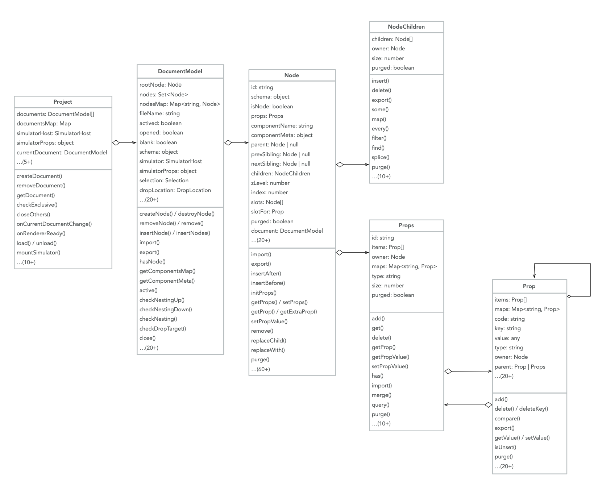

https://lowcode-engine.cn/site/docs/api/

# API 总览

- 引擎提供的公开 API 分为`命名空间`和`模型`两类，其中命名空间用于聚合一大类的 API，模型为各 API 涉及到的对象模型。

- 所有 API 命名空间都按照 variables / functions / events 来组织
- 事件（events）的命名格式 [`on[Will|Did]VerbNoun?`](https://code.visualstudio.com/api/references/vscode-api#events)
- 基于 Disposable 模式，对于事件的绑定、快捷键的绑定函数，返回值则是解绑函数
- 对于属性的导出，统一用 .xxx 的 getter 模式，（尽量）不使用 .getXxx()

## 命名空间

### init 初始化 API

### plugins - 插件 API

### config 配置 API

全局配置

### config options - 配置列表

init 初始化时，传入的 options(IPublicTypeEngineOptions)

### canvas - 画布 API

通过该模块可以触达对画布拖拽相关的一些能力。

### command - 指令 API

与命令系统的交互成为可能，提供了一种全面的方式来处理、执行和管理应用程序中的命令。

### common 通用 API

- executeTransaction
  批处理事务，用于优化特定场景的性能

### commonUI - UI 组件库

专为低代码引擎设计的组件 UI 库，使用它开发的插件，可以保证在不同项目和主题切换中能够保持一致性和兼容性

### event 事件 API

负责事件处理 API，支持自定义监听事件、触发事件。

### hotkey 快捷键 API

### logger 日志 API

引擎日志模块，可以按照 日志级别 和 业务类型 两个维度来定制日志。

### material 物料 API

负责物料相关的 API，包括资产包、设计器辅助层、物料元数据和物料元数据管道函数(MetadataTransducer)。

### project 模型 API

### setters 设置器 API

### simulator-host 模拟器 API

负责模拟器相关的 API，包括画布尺寸、语言等。

### skeleton 面板 API

layoutManager

### workspace - 应用级 API

通过该模块可以开发应用级低代码设计器

## 模型

### document-model 文档

### node 节点

### node-children 节点孩子

### props 属性集

### prop 属性

### setting-field 设置属性

### setting-top-entry 设置属性集

### component-meta 物料元数据

### selection 画布选中

### detecting 画布 hover

### history 操作历史

https://github.com/alibaba/lowcode-engine/blob/main/packages/types/src/shell/model/history.ts

### window 低代码设计器窗口模型

### detecting 画布节点悬停模型

### modal-nodes-manager 模态节点管理器模型

### plugin-instance 插件实例

### drop-location 拖拽放置位置模型
