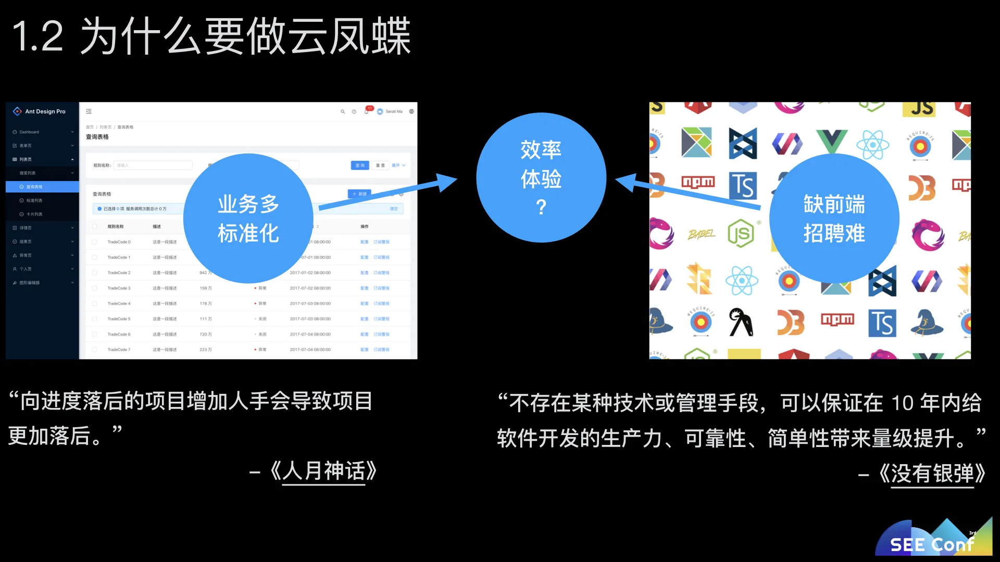
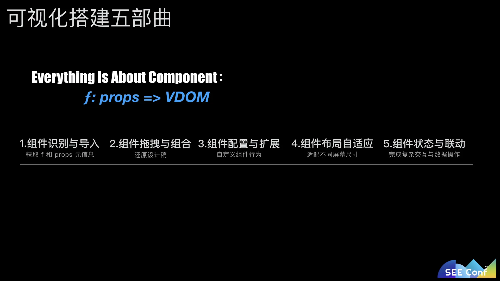

低代码引擎
https://lowcode-engine.cn/index
https://juejin.cn/post/7145010646248063006

https://github.com/alibaba?q=lowcode&type=all&language=&sort=

**utils 是为了解决无法在架构上复用的函数，无脑解决所有复用的**

---

低代码平台文章整理

- 云凤蝶（https://www.yuque.com/seeconf/2020/yunfengdie）
  
  
  [云凤蝶自由画布之道：分层模型](https://zhuanlan.zhihu.com/p/97768853)
  [云凤蝶如何打造媲美 sketch 的自由画布](https://zhuanlan.zhihu.com/p/92469406)
- 从零开始的可视化搭建系统（https://zhuanlan.zhihu.com/p/96180775）

- 「可视化搭建系统」——从设计到架构，探索前端的领域和意义(https://juejin.im/post/6854573220532748302)

- 蚂蚁中后台快速研发平台的领域思考（https://zhuanlan.zhihu.com/p/90238943?utm_source=com.tencent.wework）
  hpaPaaS 是一个对应用研发进行全生命周期管理的平台，这个平台定义了这样一种研发模式：在较强的设计、研发规范下，通过可视化拖拽、模型驱动等技术显著`降低研发门槛`、`提升研发效率`、`保障基本品质`。
- 早早聊搭建分享上(https://juejin.im/post/6844904106767695880)

- 早早聊搭建分享下（https://juejin.im/post/6844904110731296775#heading-6）

- 云凤蝶可视化搭建的推导与实现(https://www.yuque.com/paranoidjk/blog/int10d)

---

## 阿里低代码引擎仓库

https://github.com/alibaba/lowcode-engine
