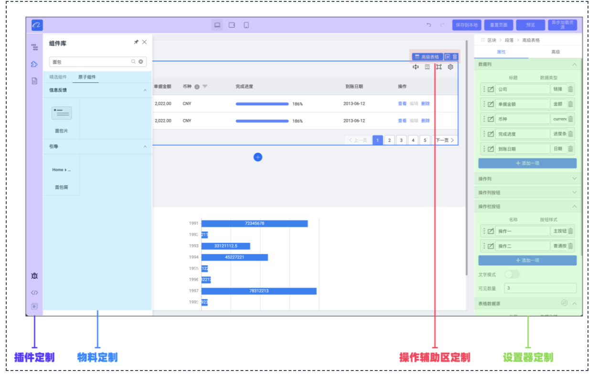
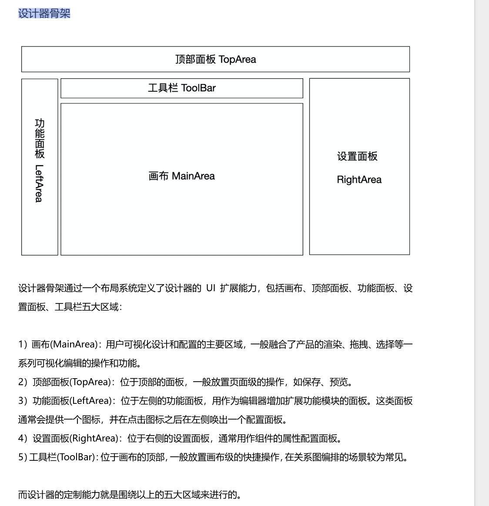

# 低代码引擎技术白皮书

> 参考资料：https://developer.aliyun.com/ebook/7507/read?spm=a2c6h.26392459.ebook-detail.2.5ade47d3slF0R3

## 目录

- [低代码引擎技术白皮书](#低代码引擎技术白皮书)
  - [目录](#目录)
  - [前言](#前言)
  - [第一章 低代码基础](#第一章-低代码基础)
    - [1.1 低代码介绍](#11-低代码介绍)
    - [1.2 低代码产品发展及现状](#12-低代码产品发展及现状)
  - [第二章 低代码引擎介绍](#第二章-低代码引擎介绍)
  - [第三章 低代码引擎之应用篇](#第三章-低代码引擎之应用篇)
    - [3.1 低代码应用开发](#31-低代码应用开发)
      - [3.1.1 初始化低代码项目](#311-初始化低代码项目)
      - [3.1.2 定制设计器](#312-定制设计器)
      - [3.1.3 定制插件](#313-定制插件)
      - [3.1.4 定制设置器](#314-定制设置器)
      - [3.1.5 定制物料](#315-定制物料)
      - [3.1.6 定制出码](#316-定制出码)
    - [3.2 应用实例之宜搭](#32-应用实例之宜搭)
      - [3.2.1 应用介绍](#321-应用介绍)
      - [3.2.2 应用方案](#322-应用方案)
      - [3.2.3 应用实现](#323-应用实现)
  - [第四章 低代码引擎之基础协议](#第四章-低代码引擎之基础协议)
    - [4.1 低代码基础协议介绍](#41-低代码基础协议介绍)
    - [4.2 低代码引擎搭建协议规范](#42-低代码引擎搭建协议规范)
    - [4.3 低代码引擎物料规范](#43-低代码引擎物料规范)
  - [第五章 低代码引擎之原理篇](#第五章-低代码引擎之原理篇)
    - [5.1 低代码引擎技术概览](#51-低代码引擎技术概览)
    - [5.2 低代码引擎技术原理](#52-低代码引擎技术原理)
      - [5.2.1 低代码入料](#521-低代码入料)
      - [5.2.2 低代码编排](#522-低代码编排)
      - [5.2.3 低代码渲染](#523-低代码渲染)
      - [5.2.4 低代码出码](#524-低代码出码)
    - [5.3 低代码引擎生态设计](#53-低代码引擎生态设计)
      - [5.3.1 低代码引擎生态概览](#531-低代码引擎生态概览)
      - [5.3.2 低代码引擎设置器建设](#532-低代码引擎设置器建设)
      - [5.3.3 低代码引擎插件建设](#533-低代码引擎插件建设)
      - [5.3.4 低代码引擎物料建设](#534-低代码引擎物料建设)
  - [第六章 低代码引擎展望](#第六章-低代码引擎展望)
  - [附录](#附录)
    - [名词解释](#名词解释)
    - [快速指引](#快速指引)
    - [物料列表](#物料列表)
    - [设置器列表](#设置器列表)
    - [插件列表](#插件列表)

---

## 前言

- 每条业务线的使用对象、使用场景的差异较大难以统一 => 并没有打算开发一款满足所有需求的`低代码平台`，而是打算另辟蹊径，研发一种能够让业务线能够快速建设低代码平台、减少重复低水平建设的**低代码引擎**
- 阿里巴巴集团对外的商业化产品钉钉宜搭的底层也是低代码引擎

## 第一章 低代码基础

### 1.1 低代码介绍

能够以最少的手写代码和设置快速开发应用、配置和部署业务应用程序。

### 1.2 低代码产品发展及现状

- 低代码概念于 2014 年由 Forrester 首次正式提出

## 第二章 低代码引擎介绍

- 每个场景开发一个场景化的搭建平台，这样搭建就会变得更好用，更易用。而低代码引擎正是为了让开发搭建平台变得更容易更快速。
- 低代码引擎的定义：低代码引擎是一款为低代码平台开发者提供的，具备`强大定制扩展能力`的低代码设计器研发框架。
  一方面我们可以快速拥有`一份标准的低代码设计器`，另外一方面如果业务有独特的功能需要，我们可以不用关心其源码实现，直接`可以使用 API、插件等方式快速完成用户自定义能力的开发。`
  
- 设计器骨架
  
  `低代码设计器 = 低代码引擎 + 设计器插件 * n + 物料 * n + 设置器 * n`

  几种典型的低代码设计器：中后台页面设计器、小程序

## 第三章 低代码引擎之应用篇

### 3.1 低代码应用开发

#### 3.1.1 初始化低代码项目

<!-- 如何创建和初始化一个低代码项目 -->

#### 3.1.2 定制设计器

<!-- 如何定制和配置低代码设计器界面 -->

#### 3.1.3 定制插件

<!-- 如何开发和集成自定义插件 -->

#### 3.1.4 定制设置器

<!-- 如何创建和配置属性设置器 -->

#### 3.1.5 定制物料

<!-- 如何开发和注册自定义组件物料 -->

#### 3.1.6 定制出码

<!-- 如何配置代码生成模板和规则 -->

### 3.2 应用实例之宜搭

#### 3.2.1 应用介绍

<!-- 宜搭平台的功能特点和应用场景 -->

#### 3.2.2 应用方案

<!-- 宜搭的技术架构和解决方案 -->

#### 3.2.3 应用实现

<!-- 宜搭的具体实现细节和技术要点 -->

## 第四章 低代码引擎之基础协议

### 4.1 低代码基础协议介绍

<!-- 低代码标准协议的概述和重要性 -->

### 4.2 低代码引擎搭建协议规范

<!-- 搭建协议的详细规范和使用方法 -->

### 4.3 低代码引擎物料规范

<!-- 物料协议的标准定义和实现要求 -->

## 第五章 低代码引擎之原理篇

### 5.1 低代码引擎技术概览

<!-- 低代码引擎的整体技术架构概览 -->

### 5.2 低代码引擎技术原理

#### 5.2.1 低代码入料

<!-- 物料注册、管理和加载机制 -->

#### 5.2.2 低代码编排

<!-- 可视化编排的实现原理和核心算法 -->

#### 5.2.3 低代码渲染

<!-- 页面渲染引擎的工作原理和性能优化 -->

#### 5.2.4 低代码出码

<!-- 代码生成的原理、模板引擎和优化策略 -->

### 5.3 低代码引擎生态设计

#### 5.3.1 低代码引擎生态概览

<!-- 生态系统的整体架构和组成部分 -->

#### 5.3.2 低代码引擎设置器建设

<!-- 设置器生态的设计理念和开发规范 -->

#### 5.3.3 低代码引擎插件建设

<!-- 插件生态的架构设计和开发指南 -->

#### 5.3.4 低代码引擎物料建设

<!-- 物料生态的建设方案和管理机制 -->

## 第六章 低代码引擎展望

<!-- 低代码技术的未来发展趋势和技术展望 -->

## 附录

### 名词解释

<!-- 技术术语和概念的详细解释 -->

### 快速指引

<!-- 快速上手指南和常用操作说明 -->

### 物料列表

<!-- 可用物料组件的完整清单和说明 -->

### 设置器列表

<!-- 可用设置器的类型和使用说明 -->

### 插件列表

<!-- 官方和社区插件的清单和功能介绍 -->
