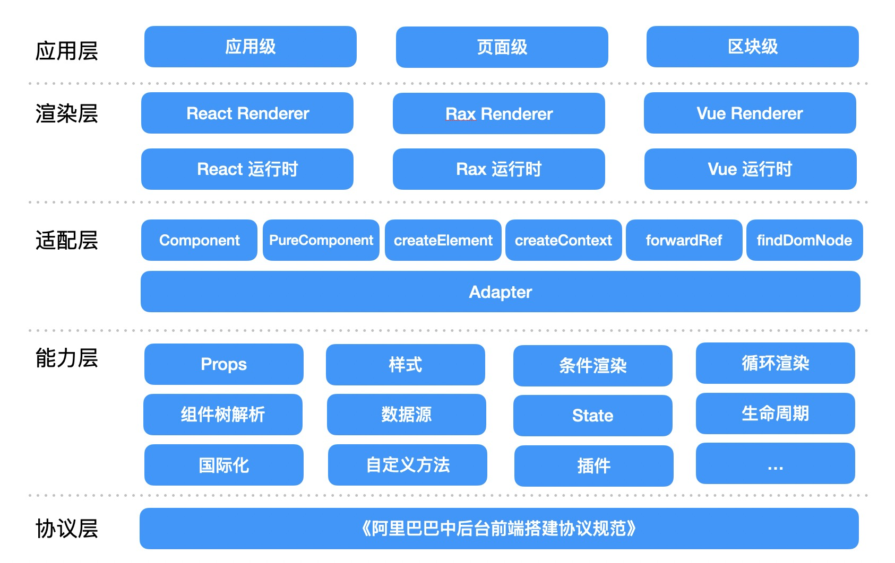
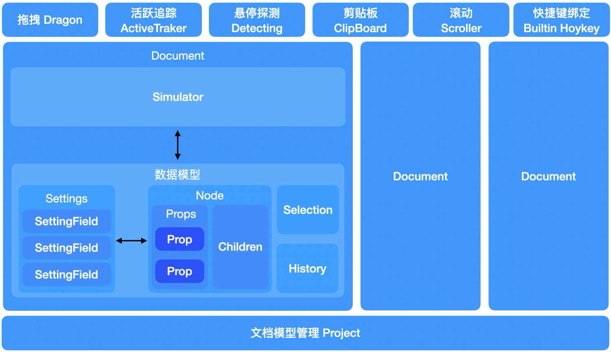

好的，我们来详细讲解一下这份关于阿里巴巴低代码引擎渲染模块设计的文档。

这份文档的核心是解释一个问题：**低代码平台是如何将用户在编辑器里拖拽、配置生成的页面描述（Schema），最终变成一个真实可见、可交互的网页的？**

为了解决这个问题，低-代码引擎设计了一套非常灵活、可扩展的渲染架构。我们一步步来拆解。

### 核心思想：分层解耦

想象一下，如果要把渲染逻辑写死，只支持 React，那么未来要支持 Vue 或 Rax 就会非常痛苦，需要重写大量代码。为了避免这种情况，阿里低代码引擎采用了**分层解耦**的设计思想，将整个渲染过程分成了好几层，每一层只做自己的事，层与层之间通过清晰的接口（协议）来通信。

这就是文档中第一张架构图所展示的：

我们从上到下看这张图：

1.  **协议层 (Schema)**: 这是“蓝图”。它是一个 JSON 对象，用一种标准化的方式描述了页面的结构。比如“这个页面有一个按钮，按钮的文字是‘确定’，颜色是蓝色”。这个 Schema 是与具体前端框架（React/Vue）无关的。

2.  **能力层 (Core)**: 这是“工具箱”。它提供了一系列渲染所必需的通用能力，比如：

    - 如何解析 Schema 中的 `props`？
    - 如何处理条件渲染（`if/else`）？
    - 如何处理循环渲染（`for` 循环）？
    - 如何注入样式？
      这些能力是通用的，不关心最终是用 React 还是 Vue 来画按钮。它只负责逻辑处理。这个“工具箱”对应的就是 `packages/renderer-core` 这个包。

3.  **适配层 (Adapter)**: 这是“转换插头”。这是整个设计的精髓。不同的前端框架有不同的 API，比如 React 用 `React.createElement` 创建元素，Vue 有自己的创建方式。适配层的作用就是抹平这些差异。

    - 它定义了一套标准的接口，比如 `createElement`, `Component`, `findDOMNode` 等。
    - `renderer-core`（能力层）在工作时，不会直接调用 `React.createElement`，而是调用 `adapter.createElement`。
    - 那么 `adapter.createElement` 到底是什么呢？这取决于你用的是哪个渲染器。

4.  **渲染层 (Renderer)**: 这是“施工队”。它负责提供具体的框架实现。

    - 如果你用的是 React，那么 `react-renderer` 就会告诉适配层：“嘿，适配层，我来报道了！以后你要用的 `createElement` 就是 `React.createElement`，你要用的 `Component` 就是 `React.Component`。”
    - 这个“报道”的过程，就是调用 `adapter.setRuntime(...)` 和 `adapter.setRenderers(...)`。
    - 这样一来，当上层的“工具箱”调用 `adapter.createElement` 时，实际上就调用到了 `React.createElement`。
    - 同理，如果有一个 `vue-renderer`，它就会把 Vue 的相应 API 注册给适配层。

5.  **应用层 (Application)**: 这是最终的“产品”。它就是我们开发者在项目中实际使用的部分。我们只需要引入渲染器（比如 `ReactRenderer`），把 `schema` 和物料组件传给它，它就能利用下面各层的能力，把页面渲染出来。

### 适配层和渲染层的关系（重点）

这部分是文档的核心，也是初看时最容易困惑的地方。我们再用一个比喻来解释。

- **能力层 (`renderer-core`)** 就像一个**电器**（比如一个吹风机），它需要插电才能工作。它的插头是一个**标准三孔插头**。
- **适配层 (`adapter`)** 就是这个**标准三孔插座**。它定义了接口标准。
- **前端框架 (React/Vue)** 就像是不同国家的**电网**，有的提供 220V 交流电（比如 React），有的提供 110V 交流电（比如 Rax）。
- **渲染层 (`react-renderer` / `rax-renderer`)** 就像一个**转换器**，它负责把对应国家的电网接到标准三孔插座上。
  - `react-renderer` 做的事情就是：`adapter.setRuntime({ createElement: React.createElement, ... })`，相当于把 React 的“电”接到了插座上。
  - `rax-renderer` 做的事情就是：`adapter.setRuntime({ createElement: Rax.createElement, ... })`，相当于把 Rax 的“电”接到了插座上。

**结果就是**：无论你用的是 React 还是 Rax，对于上层的“电器”（`renderer-core`）来说，它看到的永远是那个标准的三孔插座 (`adapter`)，它只管从这个插座取电，完全不用关心电是怎么来的。

**这就是“依赖倒置原则”的体现：高层模块（能力层）不依赖于低层模块（渲染层），它们都依赖于抽象（适配层）。**

### 两种渲染模式

现在我们知道了渲染的基本原理，那么在低代码平台中，它在什么场景下使用呢？文档提到了两种主要模式。

#### 1. 预览模式渲染 (Preview)

这很简单，就是最终用户看到的页面的样子。

- **输入**: 一个 `schema` (页面蓝图) + `components` (物料组件库，比如 Fusion Design 的 Button 组件)。
- **过程**: `ReactRenderer` 组件接收这两个东西，通过我们上面讲的分层架构，解析 `schema`，找到对应的 `Button` 组件，把 `props` 传给它，然后渲染出来。
- **特点**: 纯粹的渲染，没有编辑功能。

#### 2. 设计模式渲染 (Simulator)

这就是你在低代码编辑器里看到的那个可以拖拽、点击、配置的**画布**。它比预览模式复杂得多。

- **区别**: 画布不仅要渲染出页面，还要和整个设计器进行**双向通信**。

  - 当你在画布上拖动一个按钮时，画布需要通知设计器：“用户正在拖动按钮！”
  - 当你在右侧的属性面板修改按钮的文字时，设计器需要通知画布：“嘿，画布，把那个按钮的文字更新一下！”

- **Simulator (模拟器) 的角色**: 它就是这个**连接器**。

  - 它包裹着预览模式的渲染器。
  - 它负责监听画布上的各种交互事件（点击、拖拽、悬停），并通知设计器的“数据模型”（DocumentModel）。
  - 它也负责接收来自设计器“数据模型”的指令，并调用渲染器来更新画布的 UI。

- **整体架构 (第二张图)**:
  
  - **Project/Document/Node/Props**: 这些是**数据模型层**。它们用面向对象的方式来描述整个页面和组件的状态，并提供了修改这些状态的 API。比如，`node.setPropValue('text', '新文字')`。
  - **Simulator**: 它就是**视图层**，负责渲染和交互。它和数据模型层通过一套协议通信。
  - **通用交互模型**: 提供了拖拽、快捷键等通用交互能力的封装。

**Simulator 的可扩展性**: 文档最后提到，Simulator 本身也是可插拔的。你可以注册一个用于 React 流式布局的 Simulator，也可以注册一个用于 Rax 自由布局的 Simulator，甚至可以注册一个基于 G6（一个图表库）的、用于逻辑编排的 Simulator。这使得低代码引擎的应用场景变得非常广泛。

### 总结

1.  **核心是分层解耦**：通过**协议层、能力层、适配层、渲染层**的划分，实现了渲染逻辑与具体框架的解耦。
2.  **适配层是关键**：它定义了一套标准接口，让上层能力与下层框架实现分离。
3.  **渲染层是插件**：不同的框架（React/Rax/Vue）可以作为插件，通过适配层注册自己的实现，接入到整个体系中。
4.  **两种渲染模式**：
    - **预览模式**：纯粹的、面向最终用户的渲染。
    - **设计模式 (Simulator)**：复杂的、面向开发者的、可交互的画布渲染，是设计器与渲染器之间的桥梁。

希望这个详细的讲解能帮助你理解这份文档。这套架构设计得非常精巧，是大型可扩展前端项目的一个优秀范例。
