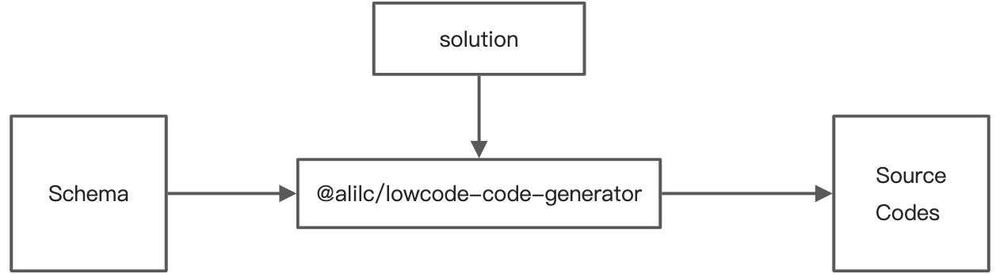

好的，我们来深入讲解这份关于“出码模块”的设计文档。

想象一下，你是一位米其林三星大厨，你的任务是根据一份非常详细的“菜谱”（Schema），制作出一道精美的、可以上桌的“大餐”（可运行的前端项目）。“出码模块”就是你完成这道大餐所使用的**自动化中央厨房系统**。

### 一、出码模块的本质：从“菜谱”到“大餐”

`@alilc/lowcode-code-generator`+`@alilc/lowcode-plugin-code-generator`

文档开篇就指出了出码模块的核心：

- **输入**:

  1.  **Schema**: 详细的“菜谱”，用标准 JSON 描述了这道菜需要哪些食材、如何摆盘、酱汁怎么调。
  2.  **Solution (出码方案)**: 你要做的是哪种菜系？是“法餐”（比如 Ice.js 框架），还是“日料”（比如 Rax 框架）？不同的菜系，对食材的处理方式、烹饪流程、最终的摆盘风格都不同。

- **输出**:
  - **Source Codes**: 一整套可以直接端上桌的“大餐”，也就是一个结构完整、可以立即运行的前端项目源代码。

这个过程就像一个**编译器**，将一种高级的、抽象的语言（Schema），翻译成另一种具体的、可执行的语言（比如 React/JavaScript 代码）。

### 二、出码流程详解：中央厨房的流水线

这个自动化厨房的流水线分为四个主要工序：

#### 1. 协议解析 (Parsing) - “审阅菜谱，准备配料”

这是第一步，也是非常关键的一步。你拿到“菜谱”（Schema），不能直接就开始炒菜。你需要先仔细阅读，把菜谱里的信息转换成你厨房里能理解的、结构化的“备料单”。

- **原始输入**: 一个巨大的、可能很复杂的 JSON Schema。
- **解析过程**:
  - **解析三方组件依赖**: 菜谱里写了需要“法国空运的黑松露”和“意大利的帕玛森芝士”。你需要把这些外部依赖（比如 `antd`, `lodash`）记录下来，最后要写进 package.json。
  - **分析 ref API 的使用情况**: 菜谱里提到“需要用一个特殊的夹子夹住牛排”。你需要分析出哪些组件使用了 `ref`，以便生成正确的代码。
  - **建立容器之间的依赖关系**: 菜谱里说“沙拉要放在前菜盘子里，牛排要放在主菜盘子里”。你需要理清页面中各个容器（Container）和它们内部组件的关系。
  - **分析路由配置**: 如果这是一套包含多个菜品的套餐，你需要分析出“前菜”、“主菜”、“甜点”的上菜顺序，也就是项目的路由配置。
  - **分析 utils 和 NPM 包依赖**: 菜谱里可能还提到了一些自制的“秘制酱汁”（`utils` 目录下的工具函数），也需要一并识别出来。
- **输出**: 一个**中间表达结构 (Intermediate Representation, IR)**。这是一个经过处理的、高度结构化的对象，比原始 Schema 更容易被后续步骤使用。**这步的目的是“让机器更容易理解”**。

#### 2. 前置优化 (Optimization) - “优化菜谱”

在正式烹饪前，你作为大厨，可能会根据经验对菜谱做一些优化。

- **目的**: 让最终的菜品（代码）更优质、性能更好。
- **过程**:
  - **分析 (Analyze)**: 扫描“备料单”（IR），提取特征。比如，“发现这道菜里有 5 处用到了同一种香料”。
  - **规则 (Rule)**: 根据预设的规则判断。比如，规则是“如果同一种香料使用超过 3 次，就应该把它预先混合好”。
  - **优化 (Optimize)**: 执行优化动作。比如，生成一个 `const spiceMix = ...`，然后在 5 个地方都使用 `spiceMix`，而不是重复声明。
- **特点**: 这是一个基于策略的、可配置的优化过程。你可以添加或删除不同的优化策略。

#### 3. 代码生成 (Code Generation) - “烹饪与摆盘”

这是最核心的工序，真正开始“做菜”。如果直接用字符串拼接的方式来生成代码，会非常混乱且难以维护。所以，中央厨房采用了一套更高级、更模块化的方法。

**核心思想：化整为零，分而治之。**

一个复杂的“项目”被拆分成了更小的单元：

- **插槽 (Slot) - “盘子”**

  - **是什么**: 它定义了项目中**文件的位置和名称**。就像一个盘子，规定了什么东西应该放在哪里。
  - **例子**:
    - 一个名为 `pages` 的插槽，路径是 `['src', 'pages']`。所有页面相关的代码文件都会被放进这个目录。
    - 一个名为 `packageJson` 的插槽，路径是 `[]`，文件名是 package.json。
  - **作用**: 它将“生成什么内容”和“内容放在哪里”这两个问题解耦。

- **模块 (Module) / 文件 (File) - “菜品组件”**

  - 一个插槽里可以包含一个或多个模块/文件。比如 `pages` 插槽里可以有 `home.jsx` 和 `about.jsx` 两个文件。

- **代码块 (Code Chunk) - “食材/装饰”**
  - **是什么**: 这是代码生成的**最小单元**，是构成一个文件的基本元素。
  - **例子**: 在一个 `home.jsx` 文件里，可以有以下几个代码块：
    1.  `importReact`: `import React from 'react';`
    2.  `importAntd`: `import { Button } from 'antd';`
    3.  `functionComponentStart`: `export default function Home() {`
    4.  `jsxReturn`: `return (
...
);`
    5.  `functionComponentEnd`: `}`
  - **关键属性**:
    - `name`: 每个代码块都有一个唯一的名字，比如 `importReact`。
    - `linkAfter`: **核心！** 它描述了当前代码块应该跟在哪些代码块的后面。比如，`jsxReturn` 的 `linkAfter` 可能是 `['functionComponentStart']`。
  - **工作流程**: 引擎生成一大堆无序的代码块，然后根据 `linkAfter` 关系，像玩拼图一样，把它们自动组装成一个有序的、完整的代码文件。这提供了极大的灵活性和可复用性。

#### 4. 后置优化 (Post-processing) - “最后的润色”

大餐做好了，端上桌前需要做最后的检查和整理。

- **文件级别**: 每生成一个代码文件，就调用 **Prettier** 这样的工具进行一次**代码格式化**，确保代码风格统一、美观。
- **项目级别**: 所有文件都生成完毕后，可能会执行一些项目级别的操作，比如自动运行 `npm install` 安装依赖。

### 总结

出码模块的设计精髓在于其**高度的抽象和模块化**：

1.  **关注点分离**: 通过**协议解析**，将“理解 Schema”和“生成代码”分离。
2.  **结构化生成**: 放弃了混乱的字符串拼接，通过**插槽 (Slot)** 和 **代码块 (Code Chunk)** 的概念，将复杂的项目生成问题，拆解为一个个独立的、可组合、可排序的微小任务。
3.  **流程化与可扩展**: 整个出码过程被定义为一个清晰的**流水线（解析 -> 优化 -> 生成 -> 后置处理）**，每个环节都可以独立扩展和定制。比如，你可以添加新的前置优化策略，或者为一种新的文件类型编写代码块生成器。

这套设计使得出码模块不仅功能强大，而且结构清晰，易于维护和扩展，能够灵活地支持不同的前端框架（Solution）和复杂的项目结构。
